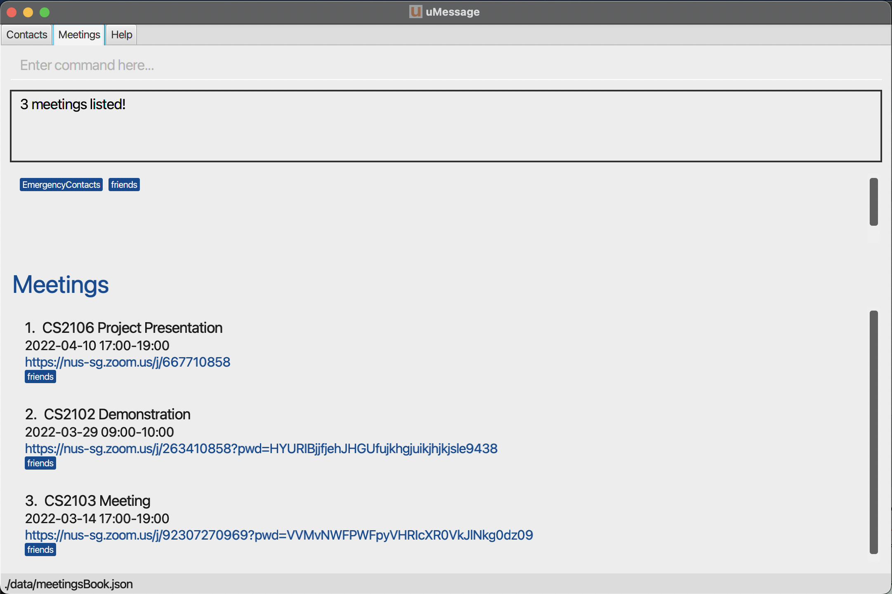
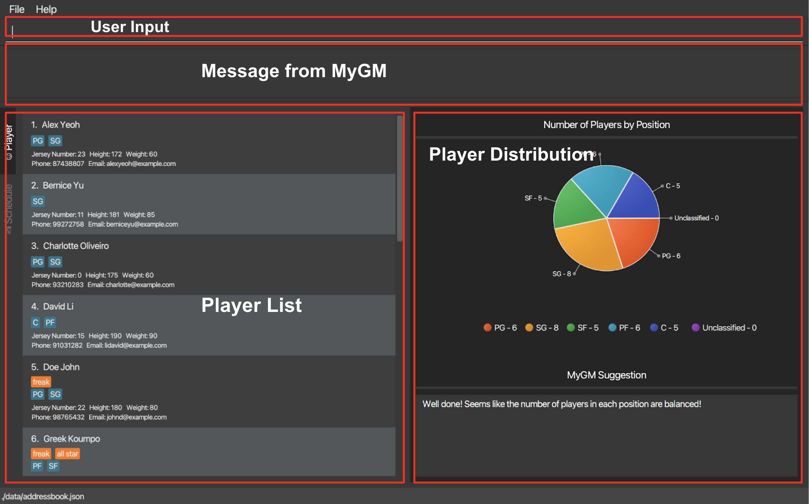
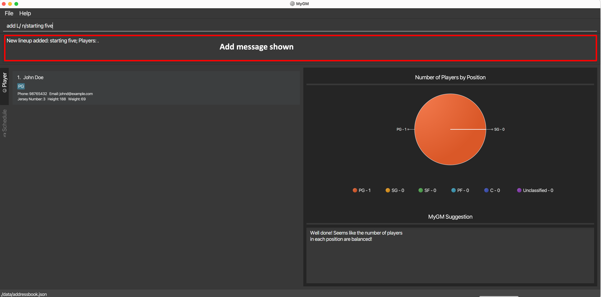
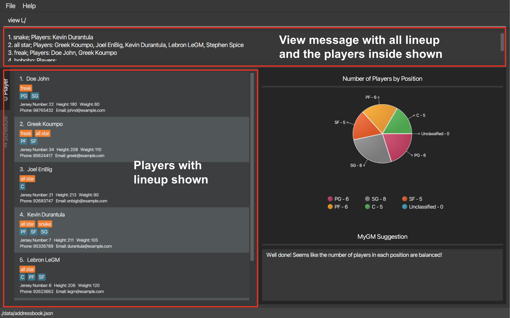
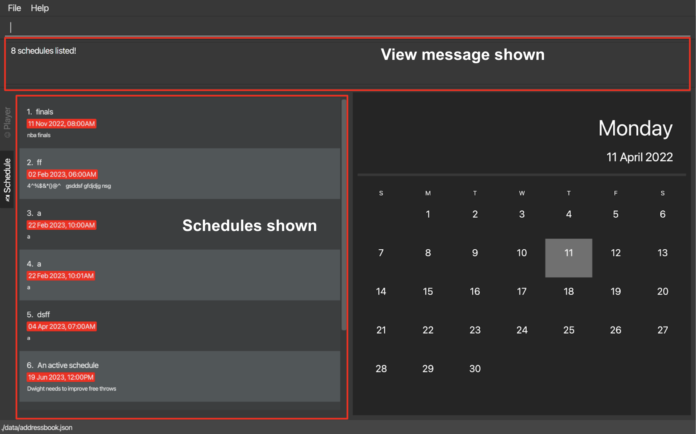

MyGM is a **desktop app for high school basketball team trainers to manage players’ contacts and data, optimized for use
via a Command Line Interface (CLI)** while still having the benefits of a Graphical User Interface (GUI).
If you can type fast, MyGM can get your contact management tasks done faster than traditional GUI apps.

* Table of Contents
{:toc}

--------------------------------------------------------------------------------------------------------------------

## Quick start

1. Ensure you have Java `11` or above installed in your Computer.

2. Download the latest `MyGM.jar` from [here](https://github.com/AY2122S2-CS2103-F09-1/tp/releases).

3. Copy the file to the folder you want to use as the _home folder_ for your MyGM. **Put the JAR file in an empty folder in which the app is allowed to create files (i.e., do not use a write-protected folder). You can copy it to your desktop or just leave it in your Downloads folder.**

4. Double-click the file to start the app. The GUI similar to the below should appear in a few seconds (note that there might be slight difference in different OS). 
The GUI is split into two parts: Players and Schedules.  
      
Details of the GUI are shown below  

5. Type the command in the command box and press Enter to execute it. e.g. typing **`help`** and pressing Enter will open the help window. 
   Some example commands you can try:

   * **`add`**`P/ n/John Doe p/98765432 e/johnd@example.com h/183 w/70 j/24 t/PG` : Adds a player named `John Doe` to MyGM.

   * **`add`**`S/ n/training r/shooting training d/01/01/2023 1800` : Adds a schedule called `training` to MyGM.

   * **`delete`**`P/John Doe` : Deletes John Doe from MyGM.

   * **`clear`** : Deletes all players, lineup and schedule.

   * **`exit`** : Exits the app.

6. Refer to the Features below for details of each command.

--------------------------------------------------------------------------------------------------------------------

## Features

**Notes about the command format:** 

* Words in `UPPER_CASE` are the parameters to be supplied by the user.
  e.g. in `n/NAME`, `NAME` is a parameter which can be used as `n/John Doe`.
* Items in square brackets are optional.
  e.g `n/NAME [t/TAG]` can be used as `n/John Doe t/PG` or as `n/John Doe`.
* Items with …​ after them can be used multiple times including zero times.
  e.g. `[t/TAG]…​` can be used as ` ` (i.e. 0 times), `t/SF`, `t/PF t/C` etc.
* Commands are case sensitive. `Add` is considered as invalid commands, the correct command should be in lower case.
* Parameters are case sensitive. `John Doe` and `joHN dOE` are considered as different person.
* Parameters can be in any order.
  e.g. if the command specifies `n/NAME p/PHONE_NUMBER, p/PHONE_NUMBER n/NAME` is also acceptable.
* If a parameter is expected only once in the command but you have specified it multiple times, only the last occurrence of the parameter will be taken.
  e.g. if you specify `p/12341234 p/56785678`, only `p/56785678` will be taken.
* Extraneous parameters for commands that do not take in parameters (such as `help`, `exit` and `clear`) will be ignored.
  e.g. if the command specifies `help 123`, it will be interpreted as help.

### Getting help : `help`

Shows a message explaining how to access the help page.

Format: `help`

### Adding a player/ lineup/ schedule: `add`

Adds a player/ lineup/ schedule to MyGM.

**To add a player:**
Format: `add P/ n/NAME j/JERSY_NUMBER w/WEIGHT h/HEIGHT p/PHONE_NUMBER e/EMAIL_ADDRESS [t/TAG]…​`

* Adds a player with the specified attributes to the player list in MyGM.
* The first character of every word in `NAME` should be capitalized. For example:`John Doe`

Examples:
* `add P/ n/John Doe j/3 w/69 h/188 p/98765432 e/johnd@example.com t/PG` Adds a player by the name of John Doe, jersey number of 3, position of PG, weight of 69kg, height of 188cm, handphone number of 98765432
and email of johnd@example.com to the player list.`

**To add a lineup:**
Format: `add L/ n/LINEUP_NAME`
* Adds a lineup with the specified `LINEUP_NAME` inside MyGM.

Examples:
* `add L/ n/starting five` adds a lineup by the name of `starting five` inside MyGM.

**To add a schedule:**
Format: `add S/ n/SCHEDULE_NAME r/DESCRIPTION d/DATETIME`
* Adds a schedule with the schedule name `SCHEDULE_NAME` description of `DESCRIPTION` and the date time of `DATETIME` inside MyGM.
* `DATETIME` must be in a dd/mm/yyyy hhmm format.
* The first character of every word in `SCHEDULE_NAME` should be capitalized. For example:`Starting Five`
* Multiple schedules can be added to a same date due to the concern that the user might have different arrangements for different lineups, and such details can be specified in the name and description section.

Examples:
* `add S/ n/Competition r/first game of national competition d/20/04/2024 2200` adds a schedule with name `Competition`, description of `first game of national competition` that is held on `20/04/2024 2200`.

### deleting a player/ lineup/ schedule :  `delete`
deletes a player/ lineup/ schedule from MyGM

**To delete a player:**
Format: `delete P/PLAYER [L/LINEUP]`

* Deletes the player from the player list.
* If `L/LINEUP` is specified, delete the player from the lineup.

Example:
*`delete P/James Soften` will delete player `James Soften` from MyGM.
*`delete P/James Soften` `L/Starting 5` will delete player `James Soften` from the lineup `Starting 5`.

**To delete a lineup:**
Format: `delete L/LINEUP`
* Delete the lineup.

Example:
* `delete L/Starting 5` will delete the lineup `Starting 5` from MyGM.

**To delete a schedule:**
Format: `delete S/INDEX_SCHEDULE`
* Delete the i-th schedule of MyGM.

Example:
*`delete S/1` will delete the first schedule from MyGM.

### Putting a player to a lineup: `put`

Puts a player to a specific lineup.

Format: `put P/PLAYER L/LINEUP`
* Adds a player to a specific lineup.
* Displays error if either the specified PLAYER or LINEUP does not exist.
* Each player can join multiple lineups.
* Each lineup can have up to five players.

* Example:
* `put P/John Doe L/starting five` Puts John Doe into the lineup named starting five.

* 

### Viewing player/schedule/lineup: `view`

This function makes listing, searching filtering of player/schedule/lineup quick and easy.
You can specify criteria to list out the current player and schedule list.

Views the information of lineup/ player/ schedule.

**To view player:** 

Format: `view P/[NAMES_IN_PLAYERNAME] [w/OPWEIGHT] [h/OPHEIGHT] [t/POSITIONS]`
* Filters the existing players to display only the players matching the criteria specified.
* Parameters `[NAMES_IN_PLAYERNAME]` and `[POSITIONS]` will only find players that contain
the specific word that is specified.   e.g. `view P/John` will not display players with the name
"Johnson" in their name. However, it will display players with name such as "John Cena", "Stockton John" if
players with such name exists.
* "OP" in the parameters `[OPWEIGHT]` and `[OPHEIGHT]` must be either `gte`, `lte`, `gt`, `lt`, `eq`. On the other hand,
"WEIGHT" and "HEIGHT" must be integers.   e.g. `gte180`, `lt90` can be a potential `OPWEIGHT` or `OPHEIGHT`
* Words in `NAMES_IN_PLAYERNAME` are case **insensitive** but words in `POSITIONS` are case **sensitive**.

Examples:
* `view P/` Displays all the players
* `view P/Kelvin Darent` Displays all the players that have "Kelvin" **or** "Darent" in their name
* `view P/ h/gt180 w/gte80` Displays all the players who have height that is greater than 180cm **and** weight that is
greater than or equals to 80kg
* `view P/James h/lt213 w/eq100 t/SG SF` Displays all the players that have "James" in their name **and** a height that
is lesser than 213cm **and** weight equals to 100kg **and** plays the position of "SG" or "SF"

* 

**To view lineup:** 

Format: `view L/[NAMES_IN_LINEUPNAME]`
* Filters players who are in the lineup that corresponds to the criteria specified.
* Parameters `[NAMES_IN_LINEUPNAME]` will only find players that are in the lineup which contains the lineup name that
matches the specific word that is specified.   e.g. `view L/super` will not display players in the lineup
with the lineup name of "superstars". However, it will display players in the lineup with the lineup name of "super"
or "super idol" provided that lineup with this lineup name exists and there are players in this lineup as well.
* If no `NAMES_IN_LINEUPNAME` is provided, all the players that are in a lineup will be displayed and all current lineups.
* Words in `NAMES_IN_LINEUPNAME` are case **insensitive**.
* To view players that are **without** a lineup, the `N/` prefix must be specified.

Examples:
* `view L/ N/` Displays all the players without a lineup
* `view L/` Displays all the players that have at least a lineup and all current lineups
* `view L/starting` Displays all the players that are in the lineup that has "starting" in the lineup name
* `view L/Starting five` Displays all the players that are in the lineup that has "Starting" **or** "five" in the lineup name

* 

**To view schedule:** 

Format: `view S/[NAMES_IN_SCHEDULENAME]`
* Filters the existing schedules to display only the schedules matching the criteria specified.
* Parameter `[DATE]` must be in dd/mm/yyyy
* Parameters `[NAMES_IN_SCHEDULENAME]` will only find schedules that contain
the specific word that is specified.   e.g. `view S/training` will not display schedules with the name
"training" in the schedule name. However, it will display schedules with name such as "training", "always training" if
schedules with such name exists.
* Words in the parameter `[NAMES_IN_SCHEDULENAME]` are case **insensitive**.
* If no `NAMES_IN_SCHEDULENAME` is provided, the list of all active schedules which happen at future dates will be displayed.
* To display all the schedules which also includes schedules that happened in the past (i.e. archived schedule), the prefix `a/` together with
`all` must be specified.  
e.g `a/all`
* To display all the schedules which are archived, the prefix `a/` together with `archive` must be specified. 
e.g `a/archive`
* The prefix `a/` can **only** follow with either `all` or `archive` is provided. Any other scenario, error message will be displayed.
* To view all the schedules that has happened or is going to happen on a particular date, the `d/` prefix must be specified
together with a `date` that is in `dd/mm/yyyy`. The parameter `[NAMES_IN_SCHEDULENAME]` must be empty.
  e.g `d/22/02/2023`

Examples:
* `view S/` Displays all the schedules that are upcoming
* `view S/drills` Displays all the upcoming schedules that have the name of "drills"
* `view S/drills shooting` Displays all the upcoming schedules that have the name of "drills" **or** "shooting"
* `view S/ a/all` Displays the all schedules which includes upcoming and archived schedules
* `view S/ a/archive` Displays the all schedules that **only** includes the archived schedules
* `view S/ d/22/02/2023` Displays all the schedules that falls on the date "22/02/2023"

* 

### Sort players by height/ jersey number/ weight: `sort`

The `sort` command allows you to sort the displayed players based on the criteria specified.

Format: `sort PREFIX/ORDER`
* Sorts all the players based on the specified `PREFIX` and `ORDER`.
* The parameter `PREFIX` must be specified only as `h/`, `j/` or `w/` for height, jersey number and weight respectively.
Other `PREFIX` will not be accepted.
* The parameter `ORDER` must be specified only as `asc` or `desc` for ascending and
descending respectively. Other `ORDER` will not be accepted.
* Player names in alphabetical order will be used as tiebreaker when sorting based on height or weight.

Example:
* `sort h/asc` Sort the displayed players in ascending order of height
* `sort h/desc` Sort the displayed players in descending order of height
* `sort j/asc` Sort the displayed players in ascending order of jersey number
* `sort j/desc` Sort the displayed players in descending order of jersey number
* `sort w/asc` Sort the displayed players in ascending order of weight
* `sort w/desc` Sort the displayed players in descending order of weight

* 

### Edit a player/ lineup/ schedule information : `edit`

Update the details of a player, lineup or schedule.

**To edit a player:**

Format: `edit P/NAME [n/NAME] [p/PHONE_NUMBER] [w/WEIGHT] [h/HEIGHT] [j/JERSEY_NUMBER] [t/TAG]…​`

* Edit the details of a player from the player list.
* If any fields are specified, it will change accordingly.
* Multiple fields can be changed at once.

Example:
* `edit P/James Soften p/8888888` will change the phone number of player James Soften to 88888888.

**To edit a lineup:**

Format: `edit L/LINEUP n/NEW_LINEUP_NAME`

* Edit the lineup name of lineup to a new lineup name.
* The new lineup name must not exist in MyGM already.

Example:
* `edit L/Starting5 n/Worst5` will change name of the lineup Starting5 to Worst5

**To edit a schedule:**

Format: `edit S/INDEX_SCHEDULE [n/NEW_NAME] [r/NEW_DESC] [d/NEW_DATE]`

* Edit the details of the i-th schedule
* If any fields are specified, it will be changed accordingly
* Multiple fields can be changed at once
* At least one field must be specified

Example:
* `edit S/1 n/finals r/nba finals d/06/06/2022 2100` will edits the first schedule.

Note: tags can be removed from and assigned to a player using `edit P/PLAYER t/TAG1 t/TAG2`. All previous tags will be removed, and only newly added tags will be assigned to the player.

### Clearing all entries : `clear`

Clears all data from MyGM.

Format: `clear`

### Exiting the program : `exit`

Exits the program.

Format: `exit`

### Changing the theme of the UI: `theme`

Changes to either light mode or dark mode. MyGM is set to dark mode on start up by default.

* Only have the following THEME currently: `light` and `dark`

Format: `theme T/THEME`

Example:
* `theme T/light` Sets the theme of MyGM to light.

### Saving the data `[coming in v2.0]`

MyGM data is saved in the hard disk (in a default file) automatically after any command that changes the data. There is no need to save manually. But users can still call the save function to export the current data.

Format: `save PATH`

* Data will be exported to the specified PATH.
* This does not change the default save file path

Example:
* `save ./Documents/data.txt` will save the data in ./Documents/data.txt

### Loading data from user-specified file: `load`  `[coming in v2.0]`

Loads data from a user-specified file to the system.

Format: `load PATH`

* Load all the data from the path specified by the user.
* Display error if the path given is invalid.

Example:
* `load ./Documents/data.txt`

### Editing the data file `[coming in v2.0]`

MyGM data are saved as a JSON file `[JAR file location]/data/addressbook.json`. Advanced users are welcome to update data directly by editing that data file.

:exclamation: **Caution:**
If your changes to the data file makes its format invalid, MyGM will discard all data and start with an empty data file at the next run.

### Archiving data files `[coming in v2.0]`

_Details coming soon ..._

--------------------------------------------------------------------------------------------------------------------

## FAQ

_Details coming soon ..._

--------------------------------------------------------------------------------------------------------------------

## Command summary

| Action     | Format, Examples                                                                                                                                                                                                                                                                                                                                                               |
|------------|--------------------------------------------------------------------------------------------------------------------------------------------------------------------------------------------------------------------------------------------------------------------------------------------------------------------------------------------------------------------------------|
| **Add**    | `add P/ n/NAME j/JERSY_NUMBER w/WEIGHT h/HEIGHT p/PHONE_NUMBER e/EMAIL_ADDRESS [t/TAG]…​` e.g. `add P/ n/John Doe j/3 w/69 h/188 p/98765432 e/johnd@example.com t/PG` `add L/ n/LINEUP_NAME` e.g. `add L/ n/starting five` `add S/ n/SCHEDULE_NAME r/DESCRIPTION d/DATETIME` e.g. `add S/ n/Competition r/first game of national competition d/20/04/2024 2200` |
| **Delete** | `delete P/PLAYER` e.g.`delete P/John Doe` `delete L/LINEUP` e.g. `delete L/Starting 5` `delete S/ i/INDEX` e.g. `delete S/INDEX`                                                                                                                                                                                                                                |
| **View**   | `view L/[LINEUP]` e.g. `view L/starting five` `view P/[PLAYER]` e.g. `view P/Blue Blue` `view S/ i/[INDEX]` e.g. `view S/1`                                                                                                                                                                                                                                     |
| **Put**    | `put P/PLAYER L/LINEUP`  e.g.`put P/John Doe L/Starting 5`                                                                                                                                                                                                                                                                                                                  |                                                                                                                                                                                                                                                                                                                                                      
| **Sort**   | `sort PREFIX/ORDER`   e.g. `sort h/asc`                                                                                                                                                                                                                                                                                                                                     |
| **Edit**   | `edit P/PLAYER [n/NAME] [p/PHONE_NUMBER] [w/WEIGHT] [h/HEIGHT] [j/JERSY_NUMBER]`  e.g. `edit P/John Doe a/22` `edit L/LINEUP_NAME n/NEW_LINEUP_NAME`  e.g. `edit L/HAHA n/HEIHEI` `edit S/INDEX SCHEDULE [n/SCHEDULE NAME] [r/DESCRIPTION] [d/DATETIME]`  e.g. `edit S/1 n/competition d/22/02/2022 0900`                                                       |
| **Theme**  | `theme T/THEME`  e.g.`theme T/light`                                                                                                                                                                                                                                                                                                                                        |                                                                                                                                                                                                                                                                                                                                                    
| **Clear**  | `clear`                                                                                                                                                                                                                                                                                                                                                                        |
| **Help**   | `help`                                                                                                                                                                                                                                                                                                                                                                         |

