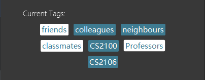

UNite is a **desktop app for managing contacts specifically designed for people in University**. It is optimized for use via a Command Line Interface (CLI) while still having the benefits of a Graphical User Interface (GUI). If you want an easy-to-use app to manage your University contacts, UNIte is the right place to go!

* Table of Contents
{:toc}

--------------------------------------------------------------------------------------------------------------------

## Quick start

1. Ensure you have Java `11` or above installed in your Computer.

1. Download the latest `UNite.jar` from [here](https://github.com/AY2122S2-CS2103T-W12-2/tp/releases).

1. Copy the file to the folder you want to use as the _home folder_ for your AddressBook.

1. Double-click the file to start the app. The GUI similar to the below should appear in a few seconds. Note how the app contains some sample data. 
   

Refer to the [Features](#features) below for details of each command.

--------------------------------------------------------------------------------------------------------------------

## Features (CLI)

Below are the features that can be completed using command line interface (CLI).

**:information_source: Notes about the command format:** 

* Words in `UPPER_CASE` are the parameters to be supplied by the user. 
  e.g. in `add n/NAME`, `NAME` is a parameter which can be used as `add n/John Doe`.

* Items in square brackets are optional. 
  e.g `n/NAME [t/TAG]` can be used as `n/John Doe t/friend` or as `n/John Doe`.

* Items with `…`​ after them can be used multiple times including zero times. 
  e.g. `[t/TAG]…​` can be used as ` ` (i.e. 0 times), `t/friend`, `t/friend t/family` etc.

* Parameters can be in any order. 
  e.g. if the command specifies `n/NAME p/PHONE_NUMBER`, `p/PHONE_NUMBER n/NAME` is also acceptable.

* If a parameter is expected only once in the command but you specified it multiple times, only the last occurrence of the parameter will be taken. 
  e.g. if you specify `p/12341234 p/56785678`, only `p/56785678` will be taken.

* Extraneous parameters for commands that do not take in parameters (such as `help`, `list`, `exit` and `clear`) will be ignored. 
  e.g. if the command specifies `help 123`, it will be interpreted as `help`.

### Add a new tag : `add_tag`

Add a new tag to the addressbook

Format: `add_tag t/TAG_NAME`

### Delete an existing tag : `delete_tag`

Delete an existing tag from the addressbook
* Deletes the tag at the specified `INDEX`.
* The index refers to the index number shown in the displayed tag list.
* The index **must be a positive integer** 1, 2, 3, …​

Format: `delete_tag INDEX`

### Listing all tags : `list_tag`

List out all tags existing in UNite.

Format: `list_tag`

### Attach tag to a profile: `attach`

Add an existing tag to a profile

* Attach to the person at the specified `PROFILE_INDEX`.
* The index refers to the index number shown in the displayed person list.
* The index **must be a positive integer** 1, 2, 3, …​

Format: `attach t/TAG_NAME i/PROFILE_INDEX`

### Detach a tag from a profile : `detach`

Remove the tag from a profile’s tags

* Remove from the person at the specified `PROFILE_INDEX`.
* The index refers to the index number shown in the displayed person list.
* The index **must be a positive integer** 1, 2, 3, …​

Format: `detach t/TAG_NAME i/PROFILE_INDEX`

### View tags of a profile : `showTag`

Show all tags attached to the selected profile. 

Format: `showTag PROFILE_INDEX`

### Filter list by tag: `filter`
Filters the full contact list with an existing tag. List will not get updated if tag does not exist. To clear the
filter, simply input the `list` command.

Format: `filter TAG_NAME`

### Locating persons by name: `find`

Finds persons whose names contain any of the given keywords.

Format: `find KEYWORD [MORE_KEYWORDS]`

* The search is case-insensitive. e.g `hans` will match `Hans`
* The order of the keywords does not matter. e.g. `Hans Bo` will match `Bo Hans`
* Only the name is searched.
* Only full words will be matched e.g. `Han` will not match `Hans`
* Persons matching at least one keyword will be returned (i.e. `OR` search).
  e.g. `Hans Bo` will return `Hans Gruber`, `Bo Yang`

Examples:
* `find John` returns `john` and `John Doe`
* `find alex david` returns `Alex Yeoh`, `David Li` 
  

  

### Deleting a person : `delete`

Deletes the specified person from the address book.

Format: `delete INDEX`

* Deletes the person at the specified `INDEX`.
* The index refers to the index number shown in the displayed person list.
* The index **must be a positive integer** 1, 2, 3, …​

Examples:
* `list` followed by `delete 2` deletes the 2nd person in the address book.
* `filter friends` followed by `delete 1` deletes the 1st person in the filtered list generated by the `filter`command.  
* `find Betsy` followed by `delete 1` deletes the 1st person in the results of the `find` command.

### Clearing all entries : `clear`

Clears all entries from the address book.

Format: `clear`

### Exiting the program : `exit`

Exits the program.

Format: `exit`

### Saving the data

All data in UNIte are saved in the hard disk automatically after any command that changes the data. There is no need to save manually.

### Editing the data file

Data in UNite are saved as a JSON file `[JAR file location]/data/addressbook.json`. Advanced users are welcome to update data directly by editing that data file.

:exclamation: **Caution:**
If your changes to the data file makes its format invalid, UNite will discard all data and start with an empty data file at the next run.

### Archiving data files `[coming soon]`

_Details coming soon ..._

--------------------------------------------------------------------------------------------------------------------
## Features (mouse interaction)

By default, mouse interactions are disabled in UNite. However, users who are not familiar with using CLI can enable 
it. Below are the features that are supported by mouse interactions.

**Note:** Some features included in the CLI section cannot be done using mouse interaction. To execute those features, 
enter the command in the command box following the instructions in the previous section.

### Enable mouse interaction : `enable mouseUX`
Enables mouse interaction in mouseUX. After enabling mouse interactions, 2 new buttons ("Add" and "New tag") will 
appear on the menu bar as shown in the figure below.

Format: `enable mouseUX`

### Disable mouse interaction : `disable mouseUX`
Enables mouse interaction in mouseUX.

Format: `disable mouseUX`

###View profile
To view a profile, click on the profile in the list to view it.

### Adding a new profile
To add a new profile, click the `Add` button on the menu bar, and select `Add profile`. An **add profile pop up 
window** will appear. 

In the window, simply enter all related information into the spaces provided, and click the
`save` button to add a new profile. Click `cancel` to stop adding and close the pop up window.
###Delete profile
To delete a profile, right click on the profile and select `delete`.

###Adding a new tag
To add a new tag, click the `New tag` button on the menu bar, and select `New tag`. A **new tag pop up
window** will appear.

Enter the new tag name into the text field, and click the `Add` button to create a new tag. To cancel adding tags, click
the `Cancel` button to close the pop up window.

### Delete tag
To delete a tag, open the tag pop up window as shown in the 'add tag' section above. Click the `Select` button to enable
selection. Select the tag(s) to delete, and click the `Delete` button to delete all the selected tags. 

Selected tags will appear in black, as shown in the figure below ("friends" and "professors" selected). 

--------------------------------------------------------------------------------------------------------------------

## FAQ

**Q**: How do I transfer my data to another Computer? 
**A**: Install the app in the other computer and overwrite the empty data file it creates with the file that contains the data of your previous UNite home folder.

--------------------------------------------------------------------------------------------------------------------

## Command summary

Action | Command format, Examples | Mouse Interaction
--------|------------------|--------
**Add** | `add n/NAME p/PHONE_NUMBER e/EMAIL a/ADDRESS [t/TAG]…​`  e.g., `add n/James Ho p/22224444 e/jamesho@example.com a/123, Clementi Rd, 1234665 t/friend t/colleague` | (menu bar) `Add ` -> `Add Profile`
**Add_tag**| `add_tag t/TAG_NAME` | (menu bar) `New tag` -> `New tag`; enter tag name in text field and select `Add`.
**Attach** | `attach [t/TAGNAME] [i/PERSON_INDEX]` | -
**Clear** | `clear` | -
**Delete** | `delete INDEX`  e.g., `delete 3` | Right click on profile, select `Delete`
**Delete_tag**| `delete TAG_INDEX`  e.g., `delete_tag 3` | (menu bar) `New tag` -> `New tag`; enable `Select`, select tags and click `Delete`. 
**Detach** | `detach [t/TAGNAME] [i/PERSON_INDEX]` | -
**Filter** | `filter [TAGMAME]` | -
**Edit** | `edit INDEX [n/NAME] [p/PHONE_NUMBER] [e/EMAIL] [a/ADDRESS] [t/TAG]…​`  e.g.,`edit 2 n/James Lee e/jameslee@example.com` | -
**Find** | `find KEYWORD [MORE_KEYWORDS]`  e.g., `find James Jake` | -
**List** | `list` | -
**Help** | `help` | (menu bar) `Help` -> `Help`
**List_tag** | `list_tag` | (menu bar) `New tag` -> `New tag`. All tags are displayed in the 'Current tags' section.
**showTag** | `showTag INDEX` | -

