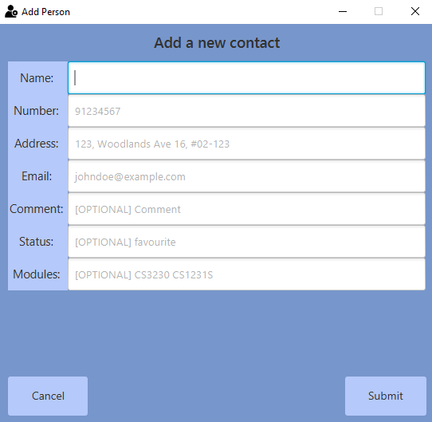

## Introduction

ModuleMateFinder (MMF) is a **desktop application for managing contacts and finding ModuleMates**. You can easily keep track of what modules your friends are/will be taking, so you can contact them to form groups.  
If you can type fast, you can get your contact management tasks done fast, but even if you are not a slow typist -- fret not, you can still use it!

- [Shortcuts](#shortcut-to-specific-features)
- [Quick Start](#quick-start)
- [Features](#features)
- [FAQ](#faq)
- [Command Summary](#command-summary)

--------------------------------------------------------------------------------------------------------------------
## Shortcut to Specific Features

This section lists down all the features available in MMF. You can click on any of them to jump to the features.

- [Help](#viewing-help--help)
- [List](#listing-all-contacts--list)
- [Add Contact](#adding-a-contact--add)
- [Add Module(s) to Contact](#adding-modules-to-a-contact--addmodules)
- [Comment on a Contact](#adding-a-comment-for-a-contact--comment)
- [Status of a Contact](#adding-a-status-for-a-contact--status)
- [Copy](#copy-contacts-in-list--copy)
- [Clear All Data](#clearing-all-entries--clear)
- [Clear all Modules from Contact](#clearing-all-modules-for-a-contact--clearmodules)
- [Delete Contact](#deleting-a-contact--delete)
- [Delete Module(s) from Contact](#deleting-a-module--deletemodules)
- [Edit](#editing-a-contact--edit)
- [Find](#locating-a-contact-find)
- [Filter](#locating-a-contact-by-their-module-filter)
- [Sort](#sorting-contacts-in-list-sort)
- [Archive a Contact](#archiving-contacts-archive)
- [Unarchive a Contact](#unarchiving-contacts-unarchive)
- [Switch between default and archived contact list](#switching-between-the-default-and-archived-contact-list-switch)
- [Undo](#undo-a-command--undo)
- [Redo](#redo-a-command--redo)
- [Exit](#exiting-the-program--exit)

-----------------------------------------------
## Quick start

1. Ensure you have Java `11` or above installed in your Computer.

1. Download the latest `ModuleMateFinder.jar` from [here](https://github.com/AY2122S2-CS2103T-T13-4/tp/releases).

1. Copy the file to the folder you want to use as the _home folder_ for your ModuleMateFinder.

1. Double-click the file to start the app. The GUI similar to the below should appear in a few seconds. Note how the app contains some sample data. 
   

1. Type the command in the command box and press Enter to execute it. e.g. typing **`help`** and pressing Enter will open the help window. 
   Some example commands you can try:

   * **`list`** : Lists all contacts.

   * **`add`**`n/John Doe p/98765432 e/johnd@example.com a/John street, block 123, #01-01` : Adds a contact named `John Doe` to ModuleMateFinder.

   * **`delete`**`3` : Deletes the 3rd contact shown in the current list.

   * **`clear`** : Deletes all contacts. (You are recommended to clear all placeholder contacts before you start using ModuleMateFinder)

   * **`exit`** : Exits the app.

1. Refer to the [Features](#features) below for details of each command.

--------------------------------------------------------------------------------------------------------------------

## Features

ModuleMateFinder is a desktop app that allows contacts to find people taking the same modules as them, easily and efficiently

**:information_source: Notes about the command format:** 

* Words in `UPPER_CASE` are the parameters to be supplied by the user. 
  e.g. in `add n/NAME p/PHONE_NUMBER e/EMAIL a/ADDRESS`, `NAME`, `PHONE_NUMBER`, `EMAIL` and `ADDRESS`  are parameters which cannot be left empty. 

* Items in square brackets are optional. 
  e.g. `n/NAME [m/MODULE]` can be used as `n/John Doe m/CS2103` or as `n/John Doe`.

* Items with `…`​ after them can be used multiple times including zero times. 
  e.g. `[m/MODULE]…​` can be used as ` ` (i.e. 0 times), `m/CS2103`, `m/CS2103 m/CS2100` etc.

* Parameters do not have to be in order. 
  e.g. if the command specifies `add n/NAME p/PHONE_NUMBER e/EMAIL a/ADDRESS`, you can do it in any order.

* If a parameter is expected only once in the command but you specified it multiple times, only the last occurrence of the parameter will be taken. 
  e.g. if you specify `p/12341234 p/56785678`, only `p/56785678` will be taken.

* Extraneous parameters for commands that do not take in parameters (such as `help`, `list`, `exit` and `clear`) will be ignored. 
  e.g. if the command specifies `help 123`, it will be interpreted as `help`.

* Below is a table depicting the parameters used in ModuleMateFinder and their respective constraints

| Parameter | Constraint                                                                                 | Example             |
|-----------|--------------------------------------------------------------------------------------------|---------------------|
| Index     | Index must be a positive integer and be less than 2,147,483,647                            | 1, 2, 3             |
| Name      | Names should only contain alphanumeric characters and spaces                               | Jerry Lee           |
| Phone     | Phone number must be at least 3 digits short, and at most 25 digits long                   | 82309 1234          |    
| Address   | Addresses must be within 60 characters long                                                | 57 Kent Ridge Drive | 
| Email     | Emails must be of the format `local-part@domain`                                           | berniceYu@email.com |
| Module    | Module names have 2-3 letters prefix followed by 4 digits and at most two optional letters | CS1101S             |
| Status    | Status must either be `favourite`, `blacklist` or blank                                    | favourite           |
| Comment   | Comments must be within 60 characters long                                                 | Good at teamwork    |
| Format    | Format must either be `default`, `csv` or `json`                                           | csv                 |

### Viewing help : `help`

Shows a message explaining how to access the help page.

Format: `help`

### Listing all contacts : `list`

Shows a list of all contacts in ModuleMateFinder.

Format: `list`

### Adding a Contact : `add`

Adds a contact to ModuleMateFinder.
 
Format: `add n/NAME p/PHONE_NUMBER e/EMAIL a/ADDRESS​`

Examples:
* `add n/Bob p/87654321 e/bob@u.nus.edu a/123, Clementi Ave 16, #01-321`

Additionally, if you were to simply use `add`, it would open up a new window to allow you to systematically add a new contact, with multiple additional fields that would normally require the use of other commands.  
  
Then, simply fill up the fields as guided in the window. You can then press the `ENTER` key to submit the fields when complete, or press the `Submit` button.

**:information_source: Extra information about this command:** 
* Adding duplicate names is not allowed as most people will not have the exact same name.
* Addresses must be within 60 characters long
* Phone number must be at least 3 digits short, and at most 25 digits long.
* Emails must be of the format `local-part@domain`. For example, a valid email you is `e@e.sg`, invalid email is `e@e.s`
* When in `archives`, the `add` functionality is disabled.
* Using the popup window `add`, you have the benefit of executing multiple commands (i.e. `comment`, `status`, and `addmodules`) at once.

### Adding Module(s) to a Contact : `addmodules`

Adds module(s) to an existing contact

Format: `addmodules INDEX m/MODULE [m/MODULE]...`

* Adds modules represented by each module code `m/MODULE` to a contact at Index `INDEX`
* The `INDEX` refers to the Index number shown in the displayed contact list.
* The `INDEX` **must be a positive integer** 1, 2, 3, …​ and must exist in the displayed contact list.

Examples:
* `addmodules 2 m/CS1231` Adds a module, `CS1231` to the 2nd contact
* `addmodules 2 m/CS1231 m/CS2103T` Adds two modules, `CS1231` and `CS2103T` to the 2nd contact

**:information_source: Accepted Module Formats:** 
* Module names have 2-3 letters prefix followed by 4 digits and at most two optional letters.
* Examples of valid Modules: `CS1231`, `CS2103T`, `NUR1107B`, `MUT2022`

[_**See below for an example image of a person with modules**_](#annotated-image-of-what-a-contact-with-status-module-and-comment)

### Adding a comment for a contact : `comment`

Adds a comment for the specified contact in ModuleMateFinder.

Format: `comment INDEX c/COMMENT`

* Adds a comment for the contact at the specified `INDEX`.
* A comment must be **within 60 characters long**
* The `INDEX` refers to the Index number shown in the displayed contact list.
* The `INDEX` **must be a positive integer** 1, 2, 3, …​ and must exist in the displayed contact list.
* Any existing comments for a contact will be overwritten by the new input.
* If used with an **empty comment** (i.e. `comment 1 c/`), the command will be treated as a **delete
  command** and removes the comment of the specified contact.

Examples:
* `comment 2 c/Good at math.` will add the comment `Good at math` to the 2nd contact.
* `comment 3 c/` will delete the comment for the 3rd contact.

[_**See below for an example image of a person with a comment**_](#annotated-image-of-what-a-contact-with-status-module-and-comment)

### Adding a status for a contact : `status`

Sets a contact's status as favourite or blacklisted.

Format: `status INDEX s/STATUS`
- Gives a status to the contact at specified `INDEX`
- Status can either be a `blacklist` or `favourite`, a contact can have no status tagged.
* The `INDEX` refers to the Index number shown in the displayed contact list.
* The `INDEX` **must be a positive integer** 1, 2, 3, …​ and must exist in the displayed contact list.
- If used with an **empty status field** (i.e. `status 1 s/`), the command will be treated as a **delete
  command** and removes the status of the specified contact.

Examples:
- `status 1 s/blacklist` tags the 1st contact in ModuleMateFinder as blacklisted.
- `status 2 s/favourite` tags the 2nd contact in ModuleMateFinder as favourite.
- `status 2 s/` will untag the 2nd contact in ModuleMateFinder, leaving them with no `Status`

##### Annotated image of what a `contact` with `Status`, `Module`, and `Comment`  

### Copy contacts in list : `copy`

Easily copy a contact's information into your clipboard, for easy pasting into a communication app of your choice.
For example, you can copy a contact's email and then paste it into your email client.

Format: `copy [INDEX] [n/] [p/] [e/] [a/] [s/] [m/] [c/] [f/]​`

* Copy contacts using specified field names.​
* If no fields are specified, **all fields will be copied**.
* Choose `INDEX` to copy a specific contact.
* The `INDEX` refers to the Index number shown in the displayed contact list.
* The `INDEX` **must be a positive integer** 1, 2, 3, …​ and must exist in the displayed contact list.
* If no `INDEX` is specified, **all contacts will be copied**.
* Order of field names determines the order of attributes in the output.
* Choice of format is **default**, **csv** and **json**.
* If no format is specified, **default format will be used**.
  
| Format  | Description                                               | Example                                                                                                           |
|---------|-----------------------------------------------------------|-------------------------------------------------------------------------------------------------------------------|
| default | Displays attributes separated by a newline                | mary 91282770 coast residences                                                                            |
| csv     | Displays attributes separated by a delimiter <code>&#124; | mary  &#124; 91282770 &#124; coast residences                                                                     |    
| json    | Displays information in JSON format                       | {   &nbsp;"name" : "mary",   &nbsp;"phone" : "91282270",   &nbsp;"address" : "coast residences" } | 

Examples:
* `copy 1 n/ p/ e/ f/json`  will copy name, phone and email of first contact in JSON format.
* `copy f/csv` will copy the entire list in csv format.
* `copy 1 e/` will copy the email of the first contact. You may then go to your mailing app and email the contact!

### Clearing all entries : `clear`

**Clears all entries** from the contact list.

Format: `clear`

Examples:
- `clear` wipes all data from ModuleMateFinder.

:exclamation: **Caution:**
Typing this command will cause you to lose all data. Use with caution!

### Clearing all modules for a contact : `clearmodules`

**Clears all modules** based on the given Index from ModuleMateFinder.

Format: `clearmodules INDEX`

* Deletes all modules from the contact at the specified `INDEX`.
* The `INDEX` refers to the Index number shown in the displayed contact list.
* The `INDEX` **must be a positive integer** 1, 2, 3, …​ and must exist in the displayed contact list.

Examples:
- `clearmodules 5` wipes all modules for contact in Index 5.

### Deleting a contact : `delete`

Deletes the specified contact from ModuleMateFinder.

Format: `delete INDEX`

* Deletes the contact at the specified `INDEX`.
* The `INDEX` refers to the Index number shown in the displayed contact list.
* The `INDEX` **must be a positive integer** 1, 2, 3, …​ and must exist in the displayed contact list.

Examples:
* `list` followed by `delete 2` deletes the 2nd contact in ModuleMateFinder.
* `find Betsy` followed by `delete 1` deletes the 1st contact in the results of the `find` command.

### Deleting a module : `deletemodules`

Deletes the specified module from contact in ModuleMateFinder.

Format: `deletemodules INDEX m/MODULE [m/MODULE]...`

* Deletes modules for the contact at the specified `INDEX`.
* The Index refers to the Index number shown in the displayed contact list.
* The Index **must be a positive integer** 1, 2, 3, …​
* The modules will be deleted only if the contact has the **all** the specified modules.
* **One or more** modules must be specified.

Examples:
* `list` followed by `deletemodules 2 m/CS3230` deletes the module CS3230 for the 2nd contact in ModuleMateFinder.
* `find Betsy` followed by `deletemodules 1 m/CS2102 m/CS2040S` deletes the specified modules for the 1st contact in the results of the `find` command.
* `deletemodules 1 m/CS2102 m/CS2040S` will fail when user has CS2102 but does not have CS2040S.
* `filter cs2103t` followed by `deletemodules 1 m/cs2103t` will cause the person to not be displayed in filtered list.

### Editing a contact : `edit`

Edits an existing contact in ModuleMateFinder.

Format: `edit INDEX [n/NAME] [p/PHONE] [e/EMAIL] [a/ADDRESS]…​`

* Edits the contact at the specified `INDEX`. The Index refers to the Index number shown in the displayed contact list.
* The `INDEX` refers to the Index number shown in the displayed contact list.
* The `INDEX` **must be a positive integer** 1, 2, 3, …​ and must exist in the displayed contact list.
* **At least one** of the optional fields must be provided.
* Existing values will be updated to the input values.
* **Modules cannot be edited** through the `edit` command.
  * Instead, use `deletemodules` to remove the modules first, then `addmodules` to add the modules to a contact.

Additionally, if one were to simply use `edit`, it would open up a new window to allow you to systematically edit a chosen contact  
  
Then, simply fill up the fields as guided in the window.

Examples:
* `edit 1 p/91234567 e/johndoe@example.com` Edits the phone number and email address of the 1st contact to be `91234567` and `johndoe@example.com` respectively.
* `edit 5 n/Bob a/Kent Ridge Drive` Edits the name and address of the 5th contact to be `Bob` and `Kent Ridge Drive` 
  respectively.

:exclamation: **Important:**
When in the `archives`, you will not be able to edit a person's name. In general, a person who is archived is assumed have correct details except for details that may change over time (e.g. phone number, email, address)

### Locating a contact: `find`

Finds a contact by the given keyword.

Format: `find KEYWORD [MORE_KEYWORDS]`

- The search is case-insensitive. e.g. `hans` will match `Hans`
- Only the given **keyword** is searched
- Words not matching the given keyword is ignored
- Only **full keywords will be matched** e.g. `Pol` will not match `Police`
- contacts matching at least one keyword will be returned (i.e. `OR` search).
  e.g. `Hans Bo` will return `Hans Gruber`, `Bo Yang`

Examples:
* `find John` returns `john` and `John Doe`
* `find alex david` returns `Alex Yeoh`, `David Li`

### Locating a contact by their module: `filter`

Finds a contact by the given module code. 

Format: `filter MODULE`

- The search is key insensitive
- Only the **given keyword** is searched
- Words not matching the given keyword is ignored
- Valid module code have 2-3 prefix letters followed by 4 digits and one optional letter.

Examples:
* `filter CS3230`  will find all contacts with the module CS3230

### Sorting contacts in list: `sort`

Sort all people within contact list.

Format: `sort [n/ASC|DESC] [p/ASC|DESC] [e/ASC|DESC] [a/ASC|DESC] [s/ASC|DESC] [m/ASC|DESC] [c/ASC|DESC]​`

* Sorts list with specified field(s). For any two contacts, latter fields will only be considered if preceding fields are equal.​
* Order of fields is important and there must be **at least one field**.
* Parameters determine whether field is sorted on ascending or descending order.
* Parameters are optional. If included, it must be either `asc`, `desc` or an empty string `""`. 
* Empty string `""` is ascending by default.
* Parameters are case-insensitive. 

| Field   | Prefix | Specification of sort                   | Example (Ascending)                                            |                                         
|---------|--------|-----------------------------------------|----------------------------------------------------------------|
| Name    | `n/`   | Sorted lexicographically                | `Alice` is followed by 'Bob'                                   |
| Phone   | `p/`   | Sorted numerically                      | `1` is followed by `9`                                         |
| Email   | `e/`   | Sorted lexicographically                | `alice@gmail.com` is followed by `bob@gmail.com`               |
| Address | `a/`   | Sorted lexicographically                | `apple residences` is followed by `banana residences`          |
| Status  | `s/`   | Sorted lexicographically                | `""` is followed by `blacklist` is followed by `favourite `    |                
| Module  | `m/`   | Sorted numerically by number of modules | A contact with 1 modules is followed by contact with 5 modules |
| Comment | `c/`   | Sorted numerically by length of comment | `a` is followed by `aaaaaaaaaaaaaaaaaa`                        |

Examples:
* `sort n/asc p/desc`  will sort the list by name in ascending order first. If two contacts have the same name, then sort by phone number in descending order.
* `sort n/` will sort the list by name in ascending order by default.

### Archiving contacts: `archive`

You can archive contacts into a separate contact list. Archiving a contact can keep ModuleMateFinder more organised by hiding individuals (such as those whom have graduated) away from your contact list.

format: `archive INDEX`
* Archives the contact at the specified `INDEX`.
* The `INDEX` refers to the Index number shown in the displayed contact list.
* The `INDEX` **must be a positive integer** 1, 2, 3, …​ and must exist in the displayed contact list.

Examples:
* `list` followed by `archive 2` archives the 2nd contact in ModuleMateFinder.
* `find Betsy` followed by `archive 1` archives the 1st contact in the results of the `find` command.

:exclamation: **Alert:**
You can only use this command when in the **default contact list**. Otherwise, you will get an error that tells you to use the correct command

### Unarchiving contacts: `unarchive`

You can also bring contacts back from the archives if necessary.

format: `unarchive INDEX`
* _Unarchives_ the contact at the specified `INDEX`.
* The `INDEX` refers to the Index number shown in the displayed contact list.
* The `INDEX` **must be a positive integer** 1, 2, 3, …​ and must exist in the displayed contact list.

Examples:
* `list` followed by `unarchive 5` _unarchives_ the 5th contact in ModuleMateFinder.
* `find Lizzy` followed by `unarchive 1` _unarchives_ the 1st contact in the results of the `find` command.

:exclamation: **Alert:**
You can only use this command when in the **archives contact list**. Otherwise, you will get an error that tells you to use the correct command

### Switching between the default and archived contact list: `switch`

Switch between the default contact list or the archived contact list in ModuleMateFinder.

format: `switch`
* Alternatively, you may use <kbd>F10</kbd> or `File -> Switch...` in the menu to perform the switch

Examples:
* `switch` changes the view to the other contact list. If you are in `Default` mode, then it changes to `Archives`, and vice-versa.
* Pressing <kbd>F10</kbd> on your keyboard or `File -> Switch...` in the menu also does the same as the above.

### Undo a command : `undo`

Undoes the previously executed command.

Format: `undo`

Examples:

- `delete 5`  
`undo`

After deleting a contact at Index 5, `undo` will reverse the delete command and bring the contact back at Index 5.

_See below for a list of commands that `undo` applies to_

### Redo a command : `redo`

Restores most recent command that was undone using `undo`. If you use a command that is not undo or redo, 
while in the midst of undoing, there will no longer be commands to redo.

Format: `redo`

Examples:

- `edit 3 n/Adam`  
`undo`  
`redo`

 After editing a contact's name at Index 3 from `George` to `Adam` and using `undo` to reverse the contact's name back to `George`, using `redo` will restore the contact's name back to `Adam`.

**:information_source: Commands that you can undo/redo:** 
* `add` after successfully adding a contact
* `addmodules`
* `comment`
* `status`
* `clear`
* `clearmodules`
* `delete`
* `deletemodules`
* `sort`
* `switch`
* `archive`
* `unarchive`
* `undo`/`redo` i.e. you can `undo` a `redo`, and you can `redo` an `undo`

### Exiting the program : `exit`

Exits the program.

Format: `exit`

### Saving the data

ModuleMateFinder data are saved in the hard disk automatically after any command that changes the data. There is no need to save manually.

### Editing the data file

ModuleMateFinder data are saved as JSON files `[JAR file location]/data/addressbook.json` and `[JAR file location]/data/archivedAddressBook.json`. If you are an advanced user, you are welcome to update data directly by editing the respective data files.

:exclamation: **Caution:**
If your changes to the data file makes its format invalid, ModuleMateFinder will discard all data and start with an empty data file at the next run.

--------------------------------------------------------------------------------------------------------------------

## FAQ

Q: Are all modules offered by NUS available in ModuleMateFinder?

A: As long as the module offered can be found in NUSMods, it will be available on ModuleMateFinder as well.  

Q: What is the point of archiving?

A: You may have seniors who have graduated, but you would like to seek advise from for certain modules. Archiving helps you to organise your contacts as well!

--------------------------------------------------------------------------------------------------------------------

## Command summary

| Action                                               | Format                                                         | Examples                               |
|------------------------------------------------------|----------------------------------------------------------------|----------------------------------------|
| **Help**                                             | `help`                                                         | `help`                                 |
| **List**                                             | `list`                                                         | `list`                                 |
| **Add Contact**                                      | `add n/NAME p/PHONE_NUMBER e/EMAIL a/ADDRESS`                  | `add n/Bob p/87654321 e/bob@u.nus.edu` |
| **Add Module(s)**                                    | `addmodules INDEX m/MODULE`                                    | `addmodules 4 m/CS2100`                |
| **Comment on a Contact**                             | `comment INDEX c/COMMENT`                                      | `comment 1 c/Good at math`             |
| **Status of a Contact**                              | `status INDEX s/STATUS`                                        | `status 2 s/favourite`                 |
| **Copy**                                             | `copy [INDEX] [n/] [p/] [e/] [a/] [s/] [m/] [c/] [f/]​`        | `copy 3 n/ e/ f/csv`                   |
| **Clear All Data**                                   | `clear`                                                        | `clear`                                |
| **Clear Module(s) From Contact**                     | `clearmodules INDEX`                                           | `clearmodules 3`                       |
| **Delete Contact**                                   | `delete INDEX`                                                 | `delete 3`                             |
| **Delete Module(s) from Contact**                    | `deletemodules INDEX m/MODULE [m/MODULE]...`                   | `deletemodules 1 m/CS1231 m/CS2102`    |
| **Edit**                                             | `edit INDEX [n/NAME] [p/PHONE] [e/EMAIL] [a/ADDRESS]`          | `edit 1 n/Alice`                       |
| **Find**                                             | `find KEYWORD [MORE_KEYWORDS]`                                 | `find James Jake`                      |
| **Filter**                                           | `filter MODULE`                                                | `filter CS3230`                        |
| **Sort**                                             | `sort [n/ASC] [p/ASC] [e/ASC] [a/ASC] [s/ASC] [m/ASC] [c/ASC]` | `sort n/asc p/desc a/`                 |
| **Archive a Contact**                                | `archive INDEX`                                                | `archive 1`                            |
| **Unarchive Contact**                                | `unarchive INDEX`                                              | `unarchive 1`                          |
| **Switch between default and archived contact list** | `switch`                                                       | `switch`                               |
| **Undo**                                             | `undo`                                                         | `undo`                                 |
| **Redo**                                             | `redo`                                                         | `redo`                                 |
| **Exit**                                             | `exit`                                                         | `exit`                                 |

