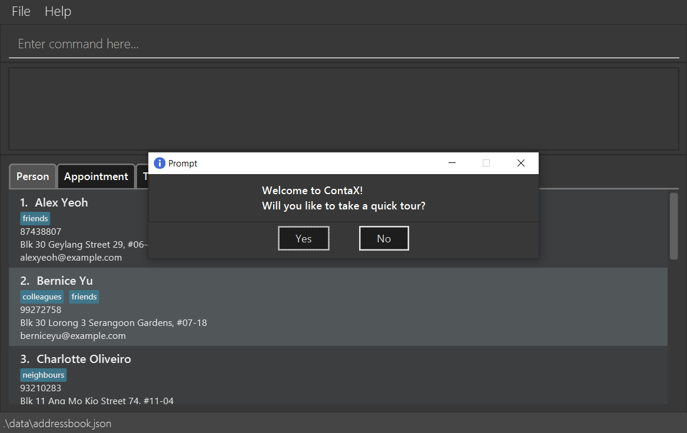
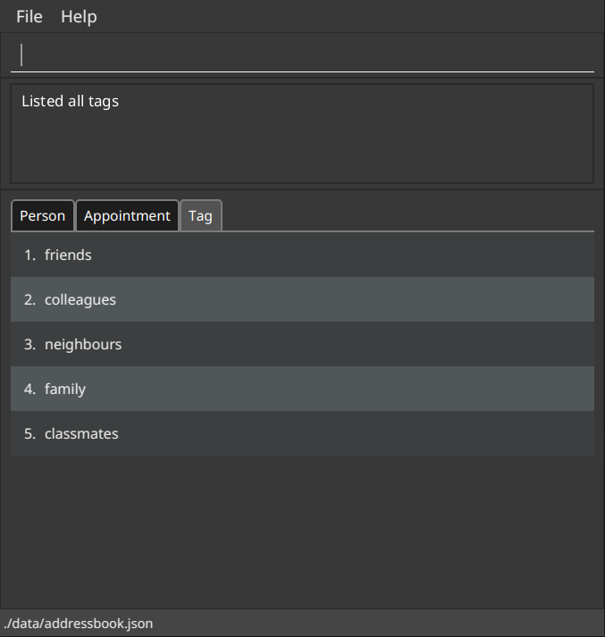
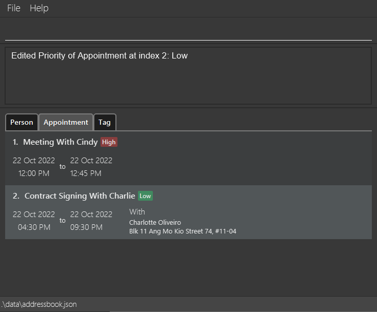

ContaX is a **desktop application for managing your Contacts and Schedule**. It is a powerful tool *optimized for use via a Command Line Interface* (CLI), while incorporating Graphical User Interface (GUI) elements to make it user-friendly. If you are able to type fast, ContaX is capable of helping you manage your contacts and schedule more efficiently than traditional GUI applications, enabling you to shift your focus to other more important things.

Broadly speaking, ContaX consists of an *Address Book* for managing Contacts, and a *Schedule* for managing Appointments.

ContaX is designed with versatility in mind, so it does not place unnecessarily strict constraints on your inputs. It accepts all inputs, even those that remotely have a chance of being valid. For more details, see the [Global Input Constraints](#global-input-constraints) section.

* Table of Contents
{:toc}

--------------------------------------------------------------------------------------------------------------------

## Quick start

1. Ensure you have Java `11` or above installed in your Computer.

2. Download the latest `ContaX.jar` from [here](https://github.com/AY2122S2-CS2103-W17-1/tp/releases).

3. Copy the file to the folder you want to use as the _home folder_ for ContaX.

4. Double-click the file to start the app. 
   
:rotating_light: **For Users on Mac OSX:**
     The security policy of OSX might prevent the creation of data files in the same folder. For users on OSX, it is recommended that you  

     - Navigate to your _home folder_ on Terminal  
     - Launch the application using the command `java -jar ContaX.jar`.  
   

5. The GUI similar to the below should appear in a few seconds. Note how the app contains some sample data. 
   

6. If this is your first time running ContaX, you will be prompted to go through an [Interactive Onboarding Guide](#onboarding-guide) to learn the basics, or you can choose to explore the application by yourself.

7. Type the command in the command box and press Enter to execute it. e.g. typing **`help`** and pressing Enter will open the help window. 
   Some example commands you can try:

   * **`listpersons`** : Lists all contacts.

   * **`addperson`**`n/John Doe p/98765432 e/johnd@example.com a/John street, block 123, #01-01` : Adds a contact named `John Doe` to the Address Book.

   * **`deleteperson`**`3` : Deletes the 3rd contact shown in the current list.

   * **`clear`** : Deletes all contacts and appointments.

   * **`exit`** : Exits the app.

8. Refer to the [Features](#features) below for details of each command.

--------------------------------------------------------------------------------------------------------------------

## Global Input Constraints

ContaX is generally designed to impose as little constraints on inputs as possible. However, there still exists certain limitations that apply throughout all features.

* **INTEGER** inputs are limited to a maximum value of `2,147,483,647`. 
  Any value above this limit will not be considered an integer.
* Leading and Trailing **Whitespaces** are ignored for ***ALL*** user inputs. 
  e.g. "&nbsp;&nbsp;&nbsp;&nbsp;&nbsp;&nbsp;&nbsp;My Tag&nbsp;&nbsp;&nbsp;&nbsp;&nbsp;&nbsp;&nbsp;&nbsp;" is treated simply as "My Tag".

### Displayed Indexes

The displayed index of a `Person`, `Appointment` or `Tag` refers to the number displayed beside the record in the GUI.
Only positive [integers](#global-input-constraints) are recognised as a **displayed index**.

:rotating_light: **Warning:** The displayed index for a record may change after commands are executed. Always check the displayed index before using it in a command.

### Common Date and Time Syntax

**:information_source: Only these format(s) for date and time inputs are allowed.** 

* All date inputs must conform to one of the following formats:
  * `dd-mm-yyyy` or `dd/mm/yyyy`, or any combination of `-` and `/` separators
  * `dd MMM yyyy` with the date components appearing in any order. 
    If a component appears more than once, the date is considered invalid.

| Field | Description |
| - | - |
| `dd` | Day of the month. |
| `mm` | Numerical representation of the month, from `1` to `12`. |
| `MMM` | Textual representation of the month, such as `oct` or `october`. |
| `yyyy` | Year in the full 4-digit format. |

* All time inputs must conform to one of the following formats:
  * The 24-hour format `hh:mm` or `hh-mm`
  * The 12-hour format `HH:mm aa` or `HH-mm aa`. The whitespace between the numeric fields and `am/pm` field can be omitted.

| Field | Description |
| - | - |
| `hh` | Hour of the day, in 24-hour format. |
| `HH` | Hour of the day, in 12-hour format. |
| `mm` | Minute of the hour, from `00` to `59`. |
| `aa` | Either `am` or `pm`, case-insensitive. |

--------------------------------------------------------------------------------------------------------------------

## Features

**:information_source: Notes about the command format:** 

* Words in `UPPER_CASE` are the parameters to be supplied by the user. 
  e.g. in `add n/NAME`, `NAME` is a parameter which can be used as `add n/John Doe`. 
  See the [Global Input Constraints](#global-input-constraints) section for restrictions on the parameter supplied.

* Items in square brackets are optional. 
  e.g `n/NAME [t/TAG]` can be used as `n/John Doe t/friend` or as `n/John Doe`.

* Items with `…`​ after them can be used multiple times including zero times. 
  e.g. `[t/TAG]…​` can be used as ` ` (i.e. 0 times), `t/friend`, `t/friend t/family` etc.

* Parameters can be in any order. 
  e.g. if the command specifies `n/NAME p/PHONE_NUMBER`, `p/PHONE_NUMBER n/NAME` is also acceptable.

* If a parameter is expected only once in the command but you specified it multiple times, only the last occurrence of the parameter will be taken. 
  e.g. if you specify `p/12341234 p/56785678`, only `p/56785678` will be taken.

* Extraneous parameters for commands that do not take in parameters (such as `help`, `list`, `exit` and `clear`) will be ignored. 
  e.g. if the command specifies `help 123`, it will be interpreted as `help`.

### Onboarding guide

**Prompt on first run**

When you run the program for the first time, you will be prompted to take a quick tour of the ContaX's basic functions guided through a series of step-by-step instructions. You will be taken to the onboarding guide window if you select yes. If you choose no, the prompt will just close.

 
When going through the onboarding guide, instructions such as the one shown below will be displayed, and important areas will be highlighted.

**Basic features covered**
The onboarding guide will cover the following:
- Add person
- Find person
- Delete person
- List persons

:rotating_light: **Important Note:** The order and case-sensitivity of keywords for `findperson` is only fixed for the Onboarding Guide.

### Viewing help : `help`

Shows the commands available and the syntax for all of them. It also includes a link to this user guide for further reading.

Format: `help`

### Clearing all entries : `clear`

Clears all contacts and tags from the address book and all appointments from the schedule.

Format: `clear`

### Adding a person: `addperson`

Adds a person to the address book.

Format: `addperson n/NAME p/PHONE_NUMBER e/EMAIL a/ADDRESS [t/TAG]…​`

:bulb: **Tip:**
A person can have any number of tags (including 0)

| Parameter      | Constraints                                                                                                                                                                                                                                                                                                                |
|----------------|----------------------------------------------------------------------------------------------------------------------------------------------------------------------------------------------------------------------------------------------------------------------------------------------------------------------------|
| `NAME`         | Must **not be blank**, and contain only alphanumeric characters and spaces                                                                                                                                                                                                                                                 |
| `PHONE_NUMBER` | Must be **at least 3 digits long**. May optionally start with a country code E.g. `1234` and `+6512345678` are both valid                                                                                                                                                                                               |
| `EMAIL`        | Must follow the format `local-part@domain`.  `local-part` must only contain **alphanumeric characters** and the symbols `+_.-`.  `domain` is made up of 1 or more parts separated by periods, and must end with a part that is at least 2 characters long.  E.g. `john@piserver` and `john2@email.com` are valid. |
| `ADDRESS`      | No constraints                                                                                                                                                                                                                                                                                                             |
| `TAG`          | Must contain only **alphanumeric characters** and spaces                                                                                                                                                                                                                                                                   |

Examples:
* `addperson n/John Doe p/98765432 e/johnd@example.com a/John street, block 123, #01-01`
* `addperson n/Betsy Crowe t/friend e/betsycrowe@example.com a/Newgate Prison p/1234567 t/criminal`

### Listing all persons : `listpersons`

Shows a list of all persons in the address book.

Format: `listpersons`

### Editing a person : `editperson`

Edits an existing person in the address book.

Format: `editperson INDEX [n/NAME] [p/PHONE] [e/EMAIL] [a/ADDRESS] [t/TAG]…​`

* Edits the person at the specified `INDEX`. The index refers to the [index number](#displayed-indexes) shown in the **displayed person list**. The index **must be a positive integer** 1, 2, 3, …​
* At least one of the optional fields must be provided.
* Existing values will be updated to the input values.
* When editing tags, the existing tags of the person will be removed i.e adding of tags is not cumulative.
* You can remove all the person’s tags by typing `t/` without
    specifying any tags after it.
* If the parameters are specified, they must conform to the following constraints:

| Parameter      | Constraints                                                                                                                                                                                                                                                                                                                |
|----------------|----------------------------------------------------------------------------------------------------------------------------------------------------------------------------------------------------------------------------------------------------------------------------------------------------------------------------|
| `NAME`         | Must **not be blank**, and contain only alphanumeric characters and spaces                                                                                                                                                                                                                                                 |
| `PHONE_NUMBER` | Must be **at least 3 digits long**. May optionally start with a country code E.g. `1234` and `+6512345678` are both valid                                                                                                                                                                                               |
| `EMAIL`        | Must follow the format `local-part@domain`.  `local-part` must only contain **alphanumeric characters** and the symbols `+_.-`.  `domain` is made up of 1 or more parts separated by periods, and must end with a part that is at least 2 characters long.  E.g. `john@piserver` and `john2@email.com` are valid. |
| `ADDRESS`      | No constraints                                                                                                                                                                                                                                                                                                             |
| `TAG`          | Must contain only **alphanumeric characters** and spaces                                                                                                                                                                                                                                                                   |

Examples:
*  `editperson 1 p/91234567 e/johndoe@example.com` Edits the phone number and email address of the 1st person to be `91234567` and `johndoe@example.com` respectively.
*  `editperson 2 n/Betsy Crower t/` Edits the name of the 2nd person to be `Betsy Crower` and clears all existing tags.

### Locating persons by attribute: `findperson`

Finds persons whose names contain any of the given keywords.

Format: `findperson KEYWORD [MORE_KEYWORDS] [by/SEARCH_TYPE]`

* The search is case-insensitive. e.g `hans` will match `Hans`
* The order of the keywords does not matter. e.g. `Hans Bo` will match `Bo Hans`
* Only full words will be matched e.g. `Han` will not match `Hans`
* Persons matching at least one keyword will be returned (i.e. `OR` search).
  e.g. `Hans Bo` will return `Hans Gruber`, `Bo Yang`
* The `SEARCH_TYPE` determines the attribute being searched, and must match one of the following:
  * `Name`
  * `Address`
  * `Phone`
  * `Email`
* If `SEARCH_TYPE` is not specified, default search type is by `Name`.

Examples:
* `findperson John` returns `john` and `John Doe`
* `findperson Garden by/address` lists all persons whose address contain the keyword "Garden"
* `findperson 87438807 by/phone` lists all persons whose phone number matches "87438807"
* `findperson alex david` returns `Alex Yeoh`, `David Li` 
  

### Deleting a person : `deleteperson`

Deletes the specified person from the address book.

Format: `deleteperson INDEX`

* Deletes the person at the specified `INDEX`.
* The index refers to the [index number](#displayed-indexes) shown in the **displayed person list**.
* The index **must be a positive integer** 1, 2, 3, …​

Examples:
* `listpersons` followed by `deleteperson 2` deletes the 2nd person in the address book.
* `findperson Betsy` followed by `deleteperson 1` deletes the 1st person in the results of the `findperson` command.

### Creating a Tag : `addtag`

Creates a new tag in ContaX.

Format: `addtag n/TAGNAME`

* The `TAGNAME` parameter **must** be specified, and can only contain alphanumeric characters and whitespaces.
* If the `TAGNAME` already exists (case-insensitive), the tag will not be created.
* All tag names will be converted to lowercase characters.

Examples:
* `addtag n/Potential Clients` Creates a tag named *potential clients* in the address book (if it does not exist).

### Editing a Tag : `edittag`

Edits an existing tag in ContaX.

Format: `edittag INDEX t/NEW_TAGNAME`

* All parameters **must** be specified.
* The `INDEX` parameter **must be a positive integer**, and refers to the [index number](#displayed-indexes) shown in the **displayed tag list**.
* Changes the name of a tag at `INDEX` to `NEW_TAGNAME`.
* An error will be thrown if either `INDEX` is invalid or `NEW_TAGNAME` already exists in ContaX.
* An error will be thrown if the tag at `INDEX` has the same name as `NEW_TAGNAME`

Examples:
* `edittag 1 t/Prospective Clients` Changes the name of first tag in the list to *Prospective Clients*.

### Listing All Tags : `listtags`

Shows a list of all tags in ContaX.

Format: `listtags`

**Example output**

### Deleting a Tag : `deletetag`

Deletes the specified tag in ContaX.

Format: `deletetag INDEX`

* The `INDEX` parameter **must be a positive integer**, and refers to the [index number](#displayed-indexes) shown in the **displayed tag list**.
* When the tag is deleted, contacts that contain this tag will have the tag removed.

Examples:
* `deletetag 1` Deletes the first tag in the tag list and disassociates any contacts that contain the specified tag.

### Finding Contacts by Tag : `findbytag`

Finds persons whose tags match the given keyword.

Format: `findbytag t/TAGNAME`

* The `TAGNAME` parameter **must** be specified.
* Search is case-insensitive e.g. `clients` is the same as `Clients`.
* If there are no tags that contain that keyword, an empty list will be displayed.

Examples:
* `findbytag t/friends` Displays the contact information of contacts who have the *friends* tag.

### Creating an Appointment : `addappt`

Creates an Appointment in the Schedule with the specified parameters.

Format: `addappt n/NAME d/DATE t/TIME l/DURATION [p/PERSON]`

* All parameters except `PERSON` **must** be specified.

| Parameter  | Description                              | Constraints                                                                                                                               |
|------------|------------------------------------------|-------------------------------------------------------------------------------------------------------------------------------------------|
| `NAME`     | The appointment's name                   | Must be **non-empty**, and can only contain alphanumeric characters, spaces and the symbols `.,!@#$%&*()-_=+`                             |
| `DATE`     | The appointment's starting date          | Must conform to the **[Common Date Formats](#common-date-and-time-syntax)**                                                               |
| `TIME`     | The appointment's starting time          | Must conform to the **[Common Time Formats](#common-date-and-time-syntax)**                                                               |
| `DURATION` | The appointment's duration in *minutes*  | Must be a **positive [integer](#global-input-constraints)**                                                                               |
| `PERSON`   | A person associated with the appointment | If specified, **must be a positive integer**, and refers to the [index number](#displayed-indexes) shown in the **displayed person list** |

:rotating_light: **Important Note:**
The operation will fail if the appointment **overlaps** with another appointment.

Examples:
* `addappt n/Bi-Weekly Meeting d/14-02-2022 t/11:00 l/60` Creates a *one-hour* appointment named *"Bi-Weekly Meeting"* on *14th Feb 2022* at *11:00 AM*, associated with nobody in the contact list.
* `addappt n/Contract Signing With Charlie d/22-10-2022 t/16:30 p/1 l/300` Creates a *5-hour* appointment named *"Contract Signing With Charlie"* on *22nd Oct 2022* at *4:30 PM*, associated with the *first* person in the contact list.

### Listing All Appointments : `listappt`

Shows a list of all Appointments in the Schedule.

Format: `listappt`

**Example output**

### Deleting an Appointment : `deleteappt`

Deletes an Appointment previously created in the Schedule.

Format: `deleteappt INDEX`

* Deletes the appointment that is at `INDEX` in the displayed appointment list.
* `INDEX` **must be a positive integer**, and refers to the [index number](#displayed-indexes) shown in the **displayed appointment list**.

Examples:
* `deleteappt 2` Deletes the *second* appointment in the list of appointments.

### Editing an Appointment : `editappt`

Edits an Appointment previously created in the Schedule.

Format: `editappt INDEX [n/NAME] [d/DATE] [t/TIME] [l/DURATION] [p/PERSON]`

* Edits the appointment that is at `INDEX` in the displayed appointment list, setting the supplied parameter(s) to the supplied value(s).
* The `INDEX` parameter **must be a positive integer**, and refers to the [index number](#displayed-indexes) shown in the **displayed appointment list**.
* At least one of the optional parameters must be supplied, otherwise the command will be ignored.
* If supplied, the optional parameters must conform to the following rules:

| Parameter  | Description                              | Constraints                                                                                                                                                                                                                                                                                                     |
|------------|------------------------------------------|-----------------------------------------------------------------------------------------------------------------------------------------------------------------------------------------------------------------------------------------------------------------------------------------------------------------|
| `NAME`     | The appointment's name                   | Must be **non-empty**, and can only contain alphanumeric characters, spaces and the symbols `.,!@#$%&*()-_=+`                                                                                                                                                                                                   |
| `DATE`     | The appointment's starting date          | Must conform to the **[Common Date Formats](#common-date-and-time-syntax)**                                                                                                                                                                                                                                     |
| `TIME`     | The appointment's starting time          | Must conform to the **[Common Time Formats](#common-date-and-time-syntax)**                                                                                                                                                                                                                                     |
| `DURATION` | The appointment's duration in *minutes*  | Must be a **positive [integer](#global-input-constraints)**                                                                                                                                                                                                                                                     |
| `PERSON`   | A person associated with the appointment | Must be a **positive [integer](#global-input-constraints)** or the String `none`.  If a **positive integer** is provided, it refers to the [index number](#displayed-indexes) shown in the **displayed person list**.   The String `none` is used to dissociate the person associated to the appointment. | 

:rotating_light: **Important Note:**
The operation will fail if the modified appointment **overlaps** with another appointment.

Examples:
* `editappt 6 l/300 p/none` Edits the *6th* appointment in the list of appointments to have a duration of *5 hours*, and removes the person associated with the appointment. No other properties are changed.
* `editappt 2 n/Call Juliet t/13:45 p/1` Edits the *second* appointment in the list of appointments to have the name *"Call Juliet"*, changes the time to *1:45 PM* and associates the appointment to the first person in the displayed persons list. No other properties are changed.

### Listing Appointments Within A Period : `apptbetween`

Lists all appointments from a starting time to an ending time inclusive of both ends of the range.
It will list all appointments that contain any sub-range of the provided period.

Format: `apptbetween [sd/STARTDATE] [st/STARTTIME] [ed/ENDDATE [et/ENDTIME]]`

:information_source: If `ENDTIME` is specified, then `ENDDATE` must be specified.

| Parameter   | Description                                             | Default Value    |
|-------------|---------------------------------------------------------|------------------|
| `STARTDATE` | The *starting date* of the period                       | *Today*          |
| `STARTTIME` | The *starting time* on the starting date for the period | `00:00`          |
| `ENDDATE`   | The *ending date* of the period                         | *No upper limit* |
| `ENDTIME`   | The *ending time* on the ending date for the period     | `23:59`          |

* The start of the period **must be before or equals to** the end of the period.
* All specified parameters **must conform to the [Common Date and Time Formats](#common-date-and-time-syntax)**.

Example:
* `apptbetween sd/21-10-2022 st/12:00 ed/23-10-2022 et/17:00` Lists all appointments from *21 October 2022, 12 PM* to *23 October 2022, 5PM*.
* `apptbetween st/08:00` Lists all appointments from *8AM Today*.

**Example Output:**

### Listing Empty Slots in Schedule Within A Period : `freebetween`

Lists all empty slots in the schedule of a certain minimum duration, within the specified starting time to ending time.
An appointment of the specified minimum duration can be inserted into each of the listed slots without causing any overlapping appointments in the schedule.

Format: `freebetween l/DURATION [sd/STARTDATE] [st/STARTTIME] [ed/ENDDATE [et/ENDTIME]]`

:information_source: If `ENDTIME` is specified, then `ENDDATE` must be specified.

| Parameter   | Description                                                                                                               | Default Value      |
|-------------|---------------------------------------------------------------------------------------------------------------------------|--------------------|
| `STARTDATE` | The *starting date* of the period                                                                                         | *Today*            |
| `STARTTIME` | The *starting time* on the starting date for the period                                                                   | `00:00`            |
| `ENDDATE`   | The *ending date* of the period                                                                                           | *No upper limit*   |
| `ENDTIME`   | The *ending time* on the ending date for the period                                                                       | `23:59`            |
| `DURATION`  | the minimum duration of the slots listed in *minutes*.  It **must be a positive [integer](#global-input-constraints)** | **Required Field** |

* The start of the period **must be before or equals to** the end of the period.
* If any of `STARTDATE`, `STARTTIME`, `ENDDATE` or `ENDTIME` are specified, they **must conform to the [Common Date and Time Formats](#common-date-and-time-syntax)**.

Example:
* `freebetween sd/21-10-2022 st/12:00 ed/23-10-2022 et/17:00 l/60` Lists all empty slots in the schedule that are at least *60 minutes (1 hour)* long between *21 October 2022, 12 PM* and *23 October 2022, 5PM*.
* `freebetween st/09:30 l/20` Lists all empty slots in the schedule that are at least *20 minutes* long from *9:30AM* today.

**Example Output:**

### Edit Priority Level of an Appointment : `prioritizeappt`

Edits priority level of an Appointment previously created in the Schedule.

Format: `prioritizeappt INDEX pri/PRIORITY`

* Edits the priority of appointment that is at `INDEX` in the displayed appointment list, setting the priority to the supplied value.
* The `INDEX` parameter **must be a positive integer**, and refers to the index number shown in the **displayed appointment list**.
* The `PRIORITY` parameter **must not be same as existing priority level** for appointment at `INDEX` in the **displayed appointment list**.
* The `PRIORITY` parameter must be non-empty, and can only contain below values (case-insensitive):
  * High
  * Medium
  * Low
  * None

Examples:
* `prioritizeappt 6 pri/high` Edits the *6th* appointment priority level in the list of appointments to have a status of *high*.
* `prioritizeappt 2 pri/none` Removes the *second* appointment priority and set status to *none*.

**Example Output:**

### Finding Appointment by Name or Person Name : `findappt`

Finds appointments with name or Person name that contains the given keyword.

Format: `findappt KEYWORD [MORE_KEYWORDS] [by/(person OR name)]`

* The search is case-insensitive. e.g `Meeting` will match `meeting`
* The order of the keywords does not matter. e.g. `Meeting Here` will match `Here Meeting`
* Only full words will be matched e.g. `Meeting` will not match `Meetings`
* Appointments matching at least one keyword will be returned (i.e. `OR` search).
  e.g. `Meeting Here` will return `Meeting There`, `Meeting Now`
* If `by/person` is included, the appointments will be matched based on the person name.
* If `by/name` is included, the appointments will be matched based on the appointment name.
* If neither `by/name` nor `by/person` are specified, the appointments will to default to match based on the appointment name.

Example:
* `findappt Meeting` Lists all appointments with name that contains `Meeting`.
* `findappt Johnny by/person` Lists all appointments with person name that contains `Johnny`.

### Saving the data

ContaX contact data are saved in the hard disk automatically after any command that changes contact data in JSON format at `[JAR file location]/data/addressbook.json`.
Appointment data are saved in the hard disk automatically after any command that changes appointment data in JSON format at `[JAR file location]/data/schedule.json`.

### Exporting the data: `exportcsv`

Exports the current list of contacts as a CSV file that can be imported through ContaX or viewed separately via Microsoft Excel

ContaX formatted CSV files are as follows:
* First row contains headers delimited by commas. Headers used are `Name`, `Phone`, `Email`, `Address`, `Tagged`
* Second row onwards will contain contact information corresponding to the column headers.

An example exported CSV file is as follows. This can be opened by text editors or spreadsheet management applications like Microsoft Excel.

Format: `exportcsv`
* Exports CSV as per ContaX format. This file can be imported by other instances of ContaX.
* File will be saved on the directory `[JAR file location]/data/addressbook.csv`

Examples:
* `exportcsv`: Exports the current address book as a CSV file at `[JAR file location]/data/addressbook.csv`

### Editing the data file

ContaX contacts and appointments data are saved in the hard disk automatically after any command that changes contact data in JSON format at `[JAR file location]/data/addressbook.json` and `[JAR file location]/data/schedule.json`. Advanced users are welcome to update data directly by editing that data file.

:exclamation: **Caution:**
If your changes to the data file makes the format invalid, ContaX wil try to read valid objects and import, and will skip objects with attributes that have invalid formats (e.g. having alphabets in a Phone number), and any duplicate Persons.

However, if the JSON formatting is broken, a blank AddressBook/Schedule will be loaded instead.

Refer to the [FAQ](#faq) for more details

### Importing data

In order to import data from external sources into ContaX, there are the following options:

* Replacing `addressbook.json` or `schedule.json` file with a valid ContaX formatted generated by another system with ContaX
* [Importing CSV Files](#importing-csv-files-importcsv)

### Importing CSV Files: `importcsv`

Format: `importcsv f/FILEPATH [n/COLUMN_NAME] [p/COLUMN_PHONE] [e/COLUMN_EMAIL] [a/COLUMN_ADDRESS] [t/COLUMN_TAGS]`

* Imported contacts will be appended to the current address book.
* Each argument represents the corresponding attribute for a person.
  * `COLUMN_NAME` - specifies column number for Name
  * `COLUMN_PHONE` - specifies column number for Phone
  * `COLUMN_EMAIL` - specifies column number for Email
  * `COLUMN_ADDRESS` - specifies column number for Address
  * `COLUMN_TAGS` - specifies column number for Tags
* If any argument is omitted, it will follow the next available column based on the default sequence of
  Name - Phone - Email - Address - Tags
* Fields should comply with existing field restrictions, e.g. no alphabets in Phone.
* Tags should be in the delimited by `;` e.g. `tag1;tag2;tag3;`, in the imported CSV file.
* If the specified rows clash, the command will fail.
* If there are lines with illegal characters or invalid formatting, ContaX will skip importing the affected line
* This is designed with flexibility in mind, such that users will be able to export CSV files from any other format and do minimal data organisation before importing into ContaX

Examples:
* `importcsv f/file.csv n/2 p/3 e/5 a/6 t/4`
  * Reads from a CSV file treating the 2nd column as names, 3rd column as phone numbers, 5th column as email addresses, 4th column as tags.
* `importcsv f/file.csv n/2`
  * Reads from CSV treating the 2nd column as names, 3rd column as phone numbers, 4th column as email addresses, 5th column as tags.
* `importcsv f/file.csv`
  * Reads from CSV with default ContaX format positions

### Operate on Contacts by Conditional Clause : `batch`

Performs operations on contacts in the address book that match the given condition.

Format: `batch COMMAND by/FIELD [=/EQUALS_VALUE] [start/START_WITH] [end/END_WITH]`

* `COMMAND` must be a valid command without `INDEX`. The allowed operations in `COMMAND` are:
  * editperson
  * deleteperson
* The `FIELD` provided must be provided, and must match one of the following:
  * `Name`
  * `Address`
  * `Phone`
  * `Email`
* Exactly one parameter of `EQUALS_VALUE`, `START_WITH`, or `END_WITH` must be provided.
* A `EQUALS_VALUE` is value matching the exact value in the target field.
  * Only full words will be matched e.g. `Han` will not match `Hans`.
* A `START_WITH` is value matching the value in the target field with specific starting value.
* A `END_WITH` is value matching the value in the target field with specific ending value.

Examples:
* `batch deleteperson by/name start/A`
  * Deletes all persons whose name start with A (case-sensitive)
* `batch editperson p/87438806 by/phone =/87438807 `
  * Edit contact with phone number matching keyword 87438807 and changes them to 87438806

:rotating_light: **Important Note:**
The `batch` operation is transactional, either all changes succeed or all changes fail (should an operation within `batch` fails). Any error message shown is from the failing operation.

### Operate on Contacts within Range : `range`

Perform actions on a group of contacts.

Format: `range COMMAND from/INDEX_FROM to/INDEX_TO`

* Performs the specified `COMMAND` on all contacts between the specified range of `INDEX_FROM` to `INDEX_TO` inclusive.
* `COMMAND` must be a valid command without `INDEX`. The allowed operations in `COMMAND` are:
  * editperson
  * deleteperson
* The `INDEX_FROM` and `INDEX_TO` parameters must be **positive integers**, and refer to the [index number](#displayed-indexes) shown in the **displayed person list**.
* `INDEX_FROM` must be less than `INDEX_TO` supplied, otherwise the command will fail.
* The resultant effect of the command is dependent on the performed action.

Examples:
* `range editperson e/johndoe@example.com from/6 to/10`
  * Sets the email address of the 6th to 10th contacts in the address book to `johndoe@example.com`.
* `range deleteperson from/2 to/3`
  * Deletes the 2nd and 3rd contacts in the address book.

:rotating_light: **Important Note:**
The `range` operation is transactional, either all changes succeed or all changes fail (should an operation within `range` fails). Any error message shown is from the failing operation.

### Chaining Commands: `chain`

Perform multiple actions in a single command.

Format: `chain COMMAND_A && COMMAND_B [&& COMMAND_C ...]`

:rotating_light: **Important Note:**

The commands cannot contain the special character `&&`.

* Calls multiple specified commands.
* A valid command (i.e. The syntax of `COMMAND` must be correct) must be supplied before and after the `&&` operator, otherwise the command will fail

Examples:
* `chain editappt 6 l/360 && listappt`
    * Edits the 6th appointment in the list of appointments to have a duration of 6 hours. Then list all appointments in the Schedule
* `chain deleteappt 2 && addappt n/Contract Signing With Charlie d/22-10-2022 t/16:30 p/1 l/300`
    * Deletes the 2nd appointment in the list of appointments.
    * Then, create a 5-hour appointment named "Contract Signing With Charlie" on 22nd Oct 2022 at 4:30 PM, associated with the first person in the contact list

:rotating_light: **Important Note:**
The `chain` operation is executed sequentially, it will execute the commands from left to right until a given command fails. Any error message shown is from the failing operation, and all preceding operations will be saved.

### Exiting the program : `exit`

Exits the program.

Format: `exit`

--------------------------------------------------------------------------------------------------------------------

## FAQ

**Q**: How do I transfer my data to another Computer? 
**A**: Install the app in the other computer and overwrite the empty data file it creates with the file that contains the data of your previous AddressBook home folder.

:information_source: **Note the Data Files to be Copied:**

There are 2 data files in the data folder, `addressbook.json` and `schedule.json`, both of which need to be copied for a complete transfer of all saved data.

**Q**: Can I edit the data manually?  
**A**: Yes, simply open `addressbook.json` to edit Contacts and `schedule.json` to edit Appointments. Note that if you change a Contact's name in `addressbook.json`, you will also need to change it in `schedule.json`.

:rotating_light: **Recommended Practice:**

It is recommended that you create a backup of the entire data folder before you perform any manual edits, as you risk losing information if your edits are incorrect.

**Q**: Why is **ALL** my data missing? 
**A**: Your data file is probably corrupted (likely in the JSON structure). Do not enter any command, close the application, and fix your data file!

**Q**: Why is **some** of my data missing? 
**A**: There is probably some invalid information in your data file. Invalid records are discarded during loading, and those records you do not see might be invalid. Do not enter any command, close the application, and fix your data file!

--------------------------------------------------------------------------------------------------------------------

## Command summary

Action | Format, Examples
--------|------------------
**Add Person** | `addperson n/NAME p/PHONE_NUMBER e/EMAIL a/ADDRESS [t/TAG]…​`   e.g., `addperson n/James Ho p/22224444 e/jamesho@example.com a/123, Clementi Rd, 1234665 t/friend t/colleague`
**Clear** | `clear`
**Delete Person** | `deleteperson INDEX`  e.g., `deleteperson 3`
**Edit Person** | `editperson INDEX [n/NAME] [p/PHONE_NUMBER] [e/EMAIL] [a/ADDRESS] [t/TAG]…​`  e.g.,`editperson 2 n/James Lee e/jameslee@example.com`
**Find Person** | `findperson KEYWORD [MORE_KEYWORDS] [by/SEARCH_TYPE]`  e.g., `findperson James Jake by/name`
**List Persons** | `listpersons`
**Add Tag** | `addtag n/TAGNAME`   e.g., `addtag n/Potential Clients`
**Edit Tag** | `edittag INDEX t/NEW_TAGNAME`   e.g., `edittag 1 t/Prospective Clients`
**List Tags** | `listtags`
**Delete Tag** | `deletetag INDEX`   e.g., `deletetag 1`
**Find Contacts By Tag** | `findbytag t/TAGNAME`   e.g., `findbytag t/friends`
**Add Appointment** | `addappt n/NAME d/DATE t/TIME l/DURATION p/PERSON`  e.g., `addappt n/Call Bob d/14-02-2022 t/11:00 p/2 l/60`
**List Appointments** | `listappt`
**Delete Appointment** | `deleteappt INDEX`  e.g., `deleteappt 2`
**Edit Appointment** | `editappt INDEX [n/NAME] [d/DATE] [t/TIME] [p/PERSON] [l/DURATION]`  e.g., `editappt 2 n/Call Juliet t/13:45`
**List Appointments Within Period** | `apptbetween [sd/STARTDATE] [st/STARTTIME] [ed/ENDDATE [et/ENDTIME]]`   e.g. `apptbetween sd/21-10-2022 st/12:00 ed/23-10-2022 et/17:00`
**List Available Slots Within Period** | `freebetween l/DURATION [sd/STARTDATE] [st/STARTTIME] [ed/ENDDATE [et/ENDTIME]]`   e.g. `freebetween sd/21-10-2022 st/12:00 ed/23-10-2022 et/17:00 l/60`
**Find Appointment** | `findappt KEYWORD [MORE_KEYWORDS] [by/(person OR name)]`   e.g `findappt Meeting`
**Help** | `help`
**Export CSV** | `exportcsv`
**Import CSV** | `importcsv f/FILEPATH [n/COLUMNNUM] [p/COLUMN_PERSON] [e/COLUMN_EMAIL] [a/COLUMN_ADDRESS] [t/COLUMN_TAGS]`   e.g., `importcsv f/input.csv n/2 p/3 e/5 a/6 t/4`
**Operate on Contacts by Conditional Clause** | `batch COMMAND where/CONDITION`   e.g., `batch editperson p/87438806 by/phone =/87438807`
**Operate on Contacts within Range** | `range COMMAND from/INDEX to/INDEX`   e.g., `range editperson e/johndoe@example.com from/6 to/10`
**Chaining Commands** | `chain COMMAND_A && COMMAND_B`   e.g., `chain editappt 6 l/360 && listappt`
