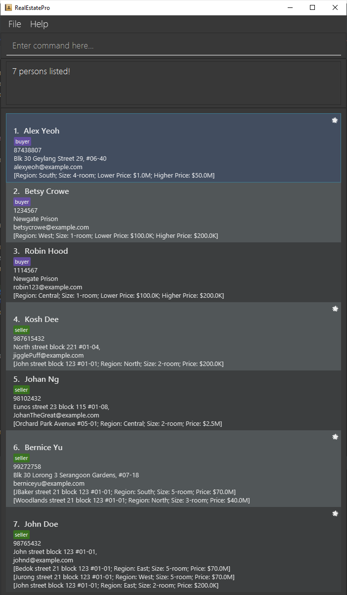
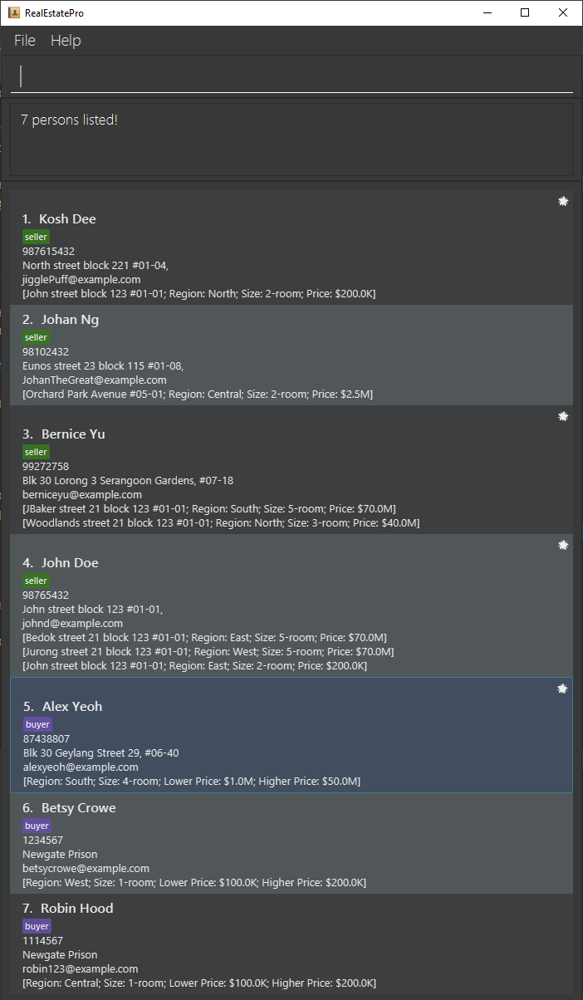
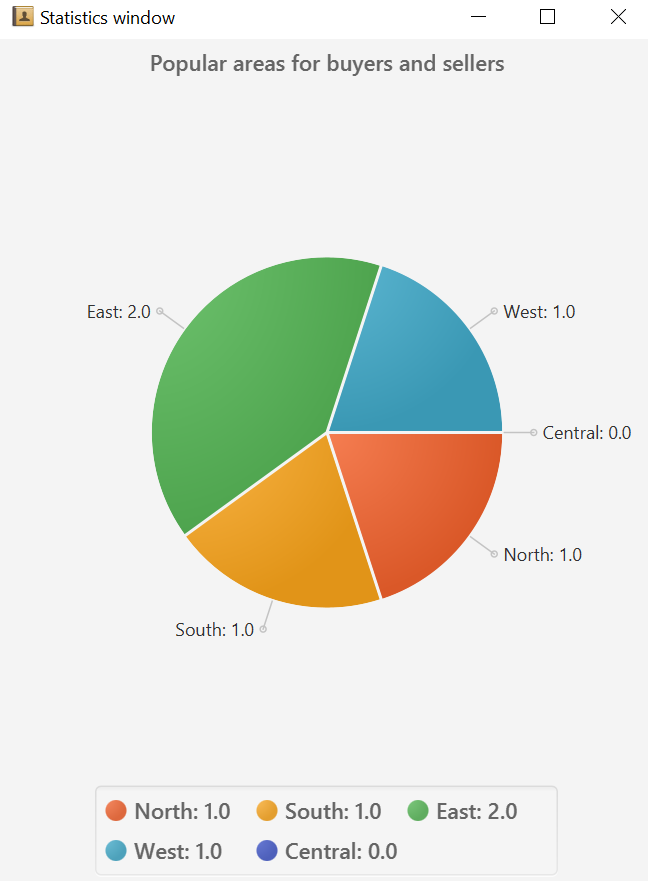

RealEstatePro is a desktop app for managing contacts, optimized for real estate agents to manage their client's contacts and sales of HDB/Condominium properties.
The app also includes various tools which aims to help agents in their work.

# Reference

Original AB3 User Guide: [link](https://se-education.org/addressbook-level3/UserGuide.html)

# Table of contents
- [Quick Start](#quick-start)
- [Features](#features)
- [General Commands](#general-commands)
  - [Open Help Window: `help`](#open-help-window-help)
  - [Listing all clients: `list`](#listing-all-clients--list)
  - [Clearing all entries: `clear`](#clearing-all-entries--clear)
  - [Exiting the program: `exit`](#exiting-the-program--exit)
- [Client Management](#client-management)
  - [Adding a client: `add`](#adding-a-client-add)
  - [Editing a client: `edit`](#editing-a-client-edit)
  - [Deleting a client: `delete`](#deleting-a-client-delete)
  - [Favourite a client: `favourite`](#favourite-or-unfavourite-a-client-favourite)
  - [Open Favourites window: `fw`](#open-favourites-window-fw)
  - [Finding clients by keyword: `find`](#finding-clients-by-keyword-find)
  - [Sorting clients: `sort`](#sorting-clients-sort)
- [Tools](#tools)
  - [Matching properties and preferences: `match`](#matching-properties-and-preferences-match)
  - [Upload an image: `upload`](#upload-an-image--upload)
  - [View image of client: `viewimage`](#view-image-of-client-viewimage)
  - [Setting a reminder for a client: `remind`](#setting-a-reminder-for-a-client-remind)
  - [Open Reminder window: `rm`](#open-reminders-window-rm)
  - [Displaying statistics: `stats`](#displaying-statistics-stats)
- [Future Features](#future-features-coming-soon)
- [Storage](#storage)
  - [Saving the data](#saving-the-data)
  - [Editing the data file](#editing-the-data-file)
- [FAQ](#faq)
- [Command Summary](#command-summary)
- [Keyboard Shortcuts](#keyboard-shortcuts)
- [Glossary](#glossary)

## Quick start

1. Ensure you have Java `11` or above installed on your computer.
2. Download the latest `realestatepro.jar` from [here](https://github.com/AY2122S2-CS2103-W16-4/tp/releases).
3. Copy the file to the folder you want to use as the *home folder* for your RealEstatePro.
4. Double-click the file to start the app. The GUI should appear in a few seconds.
5. Type the command in the command box and press Enter to execute it. e.g. typing **`help`** and pressing Enter will open the help window.
Some example commands you can try:
    - `list` : Lists all client information.
    - `add n/John Doe p/98765432 e/johnd@example.com a/John street, block 123, #01-01 pr/north,123 Street,1-room,$300000` : Adds a client named `John Doe` , contact number `98765432`, email `johnd@example.com`, address `street, block 123, #01-01`, who owns the property `north,123 Street,1-room,$300000`and is a seller in the RealEstatePro app.
    - `delete 3` : Deletes the 3rd client shown in the current list.
    - `clear` : Deletes all client information.
    - `exit` : Exits the app.
6. Refer to the Features below for details of each command.

## Features

**:information_source: Notes about the command format:** 

- Words in `UPPER_CASE` are the parameters to be supplied by the user. 
  e.g. in `add n/NAME`, `NAME` is a parameter which can be used as `add n/John Doe`.

- Items in square brackets are optional. 
  e.g. `n/NAME [pr/PROPERTY]` can be used as `n/John Doe pr/north,123 Street,1-room,$300000` or as `n/John Doe`.

- Items with `…` after them can be used multiple times including zero times. 
  e.g. `[p/PHONE_NUMBER]…` can be used as ` ` (i.e. 0 times), `p/12345`, `p/12345 p/54321` etc.

- Inputting information after `pr/` & `pf/` indicates the type of property a client is selling or the property preference that a client is looking to buy. 
  e.g. `pr/PROPERTY` can be used as `pr/East, Block 123, 2-room, $550000` which means that this client is a seller looking to sell a 2-room property at Block 123 located in the East, with a price of $550000. More information about the required format of properties/preferences can be found in the next section.

- client parameters can be in any order. 
  e.g. if the command specifies `n/NAME p/PHONE_NUMBER pr/PROPERTY`, `p/PHONE_NUMBER pr/PROPERTY n/NAME` is also acceptable.

- If a parameter is expected only once in the command, but you specified it multiple times, only the last occurrence of the parameter will be taken. 
  e.g. if you specify `p/12341234 p/56785678`, only `p/56785678` will be taken.

- Extraneous parameters for commands that do not take in parameters (such as `help`, `list`, `exit` and `clear`) will be ignored. 
  e.g. if the command specifies `help 123`, it will be interpreted as `help`.

**:information_source: Notes about the property and preference format:** 

- Properties must be specified in the following format: `pr/REGION,ADDRESS,SIZE,PRICE`. Whitespace between parameters is ignored. 
  e.g. Both `pr/East,Pasir Ris Drive 1 Block 123,2-room,$550000` and `pr/East, Pasir Ris Drive 1 Block 123, 2-room, $550000` are acceptable. `pr/Pasir Ris Drive 1 Block 123, East, 2-room, $550000` is not acceptable.

- Preference must be specified in the following format: `pf/REGION,SIZE,LOWPRICE,HIGHPRICE`. Whitespace between parameters is ignored. 

- Parameter formats:
  - REGION: One of [`North`, `South`, `East`, `West`, `Central`] (Non case-sensitive).
  - ADDRESS: Any non-empty string that does not contain `,`. e.g. `Pasir Ris Drive 1 Block 123`
  - SIZE: One of [`1-room`,`2-room`, `3-room`, `4-room`, `5-room`] (Non case-sensitive).
  - PRICE: `$` followed by a positive integer with at most 9 digits. e.g. `$150000` is acceptable but `$1234567890` is not acceptable.

**:information_source: Notes about the image format:** 

- Image must be specified in the following format `i/FILEPATH:DESCRIPTION`. Make sure your file path is from the directory the jar file is run. Description is optional and can be omitted. e.g. `add n/John Doe p/98765432 e/johnd@example.com a/John street, block 123, #01-01 pf/north,1-room,$300000,$400000 i/Livingroom(blk123).jpg:Living room of Block 123 #01-01`]

## General Commands

### Open Help Window: `help`

Opens a new window that displays information on how to use the app and a URL to the user guide of the app.

Format: `help`

#### Navigating the help window

1. Link to the full user guide.
2. Buttons to access the different help sections.
3. Help contents.

### Listing all clients : `list`

Shows a list of all clients in the address book.

Format: `list`

### Clearing all entries : `clear`

Deletes all clients from the address book.

Format: `clear`

:exclamation: **Caution:**
All clients will be deleted! Use with caution.

### Exiting the program : `exit`

Exits the program.

Format: `exit`

## Client Management

### Adding a client: `add`

Adds a client to RealEstatePro.

Format: `add n/NAME p/PHONE_NUMBER e/EMAIL a/ADDRESS [pr/PROPERTY]… [pf/PREFERENCE] [i/FILEPATH:DESCRIPTION]`

:exclamation: **Caution:**
Either a property or preference must be provided when adding a new client and only one of either type can be provided.

:information_source: **Note:**
A client is either a `buyer`, or `seller` based on whether he has a property or a preference.

Examples:

- `add n/Betsy Crowe e/betsycrowe@example.com a/Newgate Prison p/1234567 pf/West, 1-room, $100000, $200000 i/Betsy Crowe.png:Profile Picture of Betsy Crowe`
- `add n/John Doe p/98765432 e/johnd@example.com a/John street block 123 #01-01, pr/East, John street block 123 #01-01, 2-room, $200000`

    

### Editing a client: `edit`

Edits an existing client's information in RealEstatePro.

Format: `edit INDEX [n/NAME] [p/PHONE] [e/EMAIL] [a/ADDRESS] [pr/PROPERTY]… [i/FILEPATH:DESCRIPTION]…`

- Edits the client at the specified `INDEX`. The index refers to the index number shown in the displayed client list. The index **must be a positive integer** 1, 2, 3, …
- At least one of the optional fields must be provided.
- Existing values will be updated to the input values.
- Type of the client can be changed from `buyer` to `seller` & vice versa by adding a `Property` or a `Preference` which removes the client's current `Property` or `Preference`.
- If all the properties of a `seller` have been sold, you can remove all the properties by typing `pr/` without specifying any properties after it. In this case, the `seller` will be temporarily marked as a `buyer`.

Examples:

- `edit 1 p/91234567 e/johndoe@example.com` Edits the phone number and email address of the 1st client to be `91234567` and `johndoe@example.com` respectively.
- `edit 2 n/Betsy Crower p/1234567 pf/West, 1-room, $100000, $200000` Edits the name of the 2nd client to be `Betsy Crower` and with a `preference`, turning this
client into a `buyer`.
- `edit 2 n/Betsy Crower pr/` Edits the name of the 2nd client to be `Betsy Crower` and clears all existing properties/preferences.
- `edit 2 i/Living.png:living room` Edits 2nd client to only have `Living.png` and removes all other images.

### Deleting a client: `delete`

Deletes the specified client from the address book.

Format: `delete INDEX`

- Deletes the client at the specified `INDEX`.
- The index refers to the index number shown in the displayed client list.
- The index **must be a positive integer** 1, 2, 3, …

Examples:

- `list` followed by `delete 2` deletes the 2nd client in the address book.
- `find name Betsy` followed by `delete 1` deletes the 1st client in the results of the `find` command.

**Note**:
- Images associated with the client are not deleted and remains in the OS file system.

### Favourite or Unfavourite a client: `favourite`

 Favourites the specified client in the RealEstatePro represented by a star as shown below.

💡 **Note**: 
 * If the client was favourited before, calling `favourite` command on this particular client will unfavourite him/her. This command will remove "🌟" from the client.   Additionally, the client information will not show up on the Favourites window anymore.

The user (real estate agent) will be able to view a more compact list of favourited clients in a new window called Favourites window.

Format: `favourite INDEX`

- Favourites/unfavourites the client at the specified `INDEX`.
- The index refers to the index number shown in the displayed client list.
- The index **must be a positive integer** 1, 2, 3, …

### Open Favourites window: `fw`

Opens a new window that displays the compacted list of clients that have been favourited.

Format:  `fw`

#### By Ui:

1) Navigate to the `File` menu and click on it.

2) Under it, click on `Favourites`.

3) The system will pop up the Favourites window.

#### By Key: `F3`

1) Press `F3`. 
2) The system will pop up the Favourites window.

### Finding clients by keyword: `find`

Finds clients whose specified attribute contain any of the given keywords.

Format: `find ATTRIBUTE KEYWORD [MORE_KEYWORDS]`

- `ATTRIBUTE` can be one of: `all` `name` `phone` `email` `address` `properties` `preference` `usertype`.
- If the specified attribute is `all`, search for the keywords in all attributes.
- The search is case-insensitive. e.g `hans` will match `Hans`.
- The order of the keywords does not matter. e.g. `Hans Bo` will match `Bo Hans`.
- Only full words will be matched e.g. `Han` will not match `Hans`.
- clients matching at least one keyword will be returned (i.e. `OR` search). e.g. `Hans Bo` will return `Hans Gruber`, `Bo Yang`.

Examples:

- `find name robin johan` returns `Robin Hood`, `Johan Ng`
- `find phone 99272758` returns `Bernice Yu`
- `find email charlotte@example.com` return `Charlotte Oliveiro`
- `find address 436` return `David Li`
- `find properties jurong` return `Albus Dumbledore`
- `find properties north` return `Bellatrix Lestrange`
- `find properties 2-room` return `Cornelius Fudge`
- `find properties $300` return `Draco Malfoy`
- `find properties jurong north 2-room $300` return `Albus Dumbledore`, `Bellatrix Lestrange`, `Cornelius Fudge`, `Draco Malfoy`
- `find preference east` return `Ernie Mcmillan`
- `find preference 4-room` return `Fred Weasley`
- `find preference $100` return `George Weasley`
- `find preference $200` return `Harry Potter`
- `find preference east 4-room $100 $200` return `Ernie Mcmillan`, `Fred Weasley`, `George Weasley`, `Harry Potter`
- `find all alex 99272758 charlotte@example.com 436 jurong $200` return `Alex Yeoh`, `Bernice Yu`, `Charlotte Oliveiro`, `David Li`, `Albus Dumbledore`, `Harry Potter`
- `find usertype seller` return `Bernice Yu`, `David Li`, `Albus Dumbledore`, `Bellatrix Lestrange`, `Cornelius Fudge`, `Draco Malfoy`
- `find usertype buyer` return `Alex Yeoh`, `Charlotte Oliveiro`, `Ernie Mcmillan`, `Fred Weasley`, `George Weasley`, `Harry Potter`

    

### Sorting clients: `sort`

Sorts the list of clients displayed according to one or more keywords.

Format: `sort [!]KEYWORD [[!]MORE_KEYWORDS]…`

- `KEYWORD` can be one of `name` `phone` `email` `address` `favourite` `usertype` `num_property` (case-insensitive).
- Prefixing a keyword with `!` will reverse the sorting order for that keyword.
- If multiple keywords are specified, the list is sorted according to the order in which the keywords are specified, i.e., subsequent keywords are used to break ties after sorting by the previous keyword.

The following table shows the keywords and the default sorting behaviours:

| Keyword        | Default Behaviour                   |
|----------------|-------------------------------------|
| `name`         | Sort by `Name` alphabetically       |
| `phone`        | Sort by `Phone` numerically         |
| `email`        | Sort by `Email` lexicographically   |
| `address`      | Sort by `Address` lexicographically |
| `favourite`    | Show favourites first               |
| `usertype`     | Show buyers first                   |
| `num_property` | Sort by number of `Property`        |

Examples:
- `sort address name phone` will sort the list by `Address` first. If there are entries with equal `Address`, the entries will be sorted by `Name`. If there are entries with equal `Address` and `Name`, they will be sorted by `Phone`.
- `sort !name` will sort the list according to `Name` in reverse alphabetical order, i.e., `Sam Yeo` will be listed before `Elon Musk`.
- `sort favourite !name` will sort the list according to `Favourite`, with favourites being listed first, followed by non-favourites. Within each group, entries are sorted according to `Name` in reverse alphabetical order.
- `sort num_property` will sort the list according to the number of properties a client has. Buyers will be listed first since they have no properties.

**:information_source: Notes about sorting:** 

- Sorting is integrated with the find feature, i.e., sorting clients after using the `find` command will sort the filtered list. To sort the unfiltered list, reset the filter using the `list` command before using the `sort` command.
- Capitalization of alphabets is ignored, i.e., `Aiken` and `aiken` have the same priority when sorting alphabetically.

:bulb: <b>Tip:</b>
To sort by number of properties in the default order, but with buyers shifted to the bottom of the list, sort by user type in reverse order, followed by number of properties in default order, i.e., `sort !usertype num_property`.

## Tools
### Matching properties and preferences: `match`

Opens a new window and shows all sellers and buyers with matching property and preference.

A preference matches with a property if
- they have the same `region`, and
- they have the same `size`, and
- the `price` of the property is between `lowPrice` and `highPrice` (inclusive) of the preference.

Format: `match`

### Upload an Image : `upload`

Uploads an image and description to be associated with a client.

Format `upload INDEX [i/FilePath:description]`
- Adds an image to the client at the specified `INDEX`.
- The index refers to the index number shown in the displayed client list.
- File path is from the directory the JAR file is ran from. e.g. `upload 1 i/example.png:living room`
  
- Description is optional and can be left blank e.g. `upload 1 i/example.png`.
- multiple images can be uploaded at once by starting each file with a new flag e.g. `upload 1 i/example.png:living room i/example2.png:Bed Room`.

### View image of client: `viewimage`

Opens a new window that displays the images associated to a client.

Format `viewimage INDEX`

### Setting a Reminder for a client: `remind`

Sets a reminder for the specific client from the application. The user (real estate agent) will be able to view a more compact list of clients with reminders set, via a new window called the [Reminder window](#open-reminders-window-rm).

**:information_source: Notes about Reminders:** 

- The user will only be able to create 1 Reminder for each client. The user will be able to create a new Reminder, edit a current Reminder or remove a Reminder for a client.
- Reminders are meant to serve as temporary notes for the user & thus will not persist beyond the lifecycle of a RealEstatePro application. This means any reminders created will be removed once the RealEstatePro application is closed.

Format: `remind INDEX r/ReminderDetails`
- Sets a Reminder for the client at the specified `INDEX`.
- The index refers to the index number shown in the displayed client list.
- The index **must be a postive integer** 1, 2, 3, ...
- The `ReminderDetails` must be a non-empty String, e.g. `arrange home viewing`.

Example of usage:
- Creating a Reminder
  - `remind 1 r/meet client for home viewing` to create a Reminder titled "meet client for home viewing" for the client at index 1.
- Editing a Reminder
  - `remind 1 r/liaise with client for leasing details` to edit the existing Reminder for the client at index 1 to be "liaise with client for leasing details".
- Deleting a Reminder
  - `remind 1` to remove the current Reminder for the client at index 1.

### Open Reminders window: `rm`

  
  

Opens a new window that displays compacted list of clients that have Reminders set. Upon execution of the `rm` command, the Reminders window will persist & continuously appear every 1 minute, until the RealEstatePro app is closed. The Reminders window is meant to serve as a pinboard showing existing Reminders.

The Reminders window can exist in the above 2 states: a list of clients with their reminders or a label "No Reminders set!". These 2 states exist when there are existing reminders or there are no reminders respectively. If the user has reminders set for their clients, the Reminders window will resemble the first picture, else the second picture.

Format: `rm`

#### By Ui:

1) Navigate to the `File` menu and click on it.
2) Under it, click on `Reminders`.
3) The system will launch the `Reminders` window that contains a list of clients the user has set Reminders for.

### Displaying statistics: `stats`

Opens up a new window that shows a pie chart of the number of buyers & sellers with preference or properties respectively in a particular region namely { North, South, East, West, Central }.

Format: `stats`

#### By Ui:

1) Navigate to the `File` menu and click on it.

2) Under it, click on `Stats`.

3) The system will pop up the Statistics window.

#### By Key: `F2`

1) Press `F2`.

2) The system will pop up the Statistics window.

## Future Features **[Coming soon]**
1. More types of sizes and increased details such as floor size, landed properties.
2. Display statistics of the number of properties being sold/bought categorized by their room size to provide insight on the most popular number of rooms in a property.
3. Display statistics of the prices of properties sold/bought to provide insight on the average property price sold/bought.
4. Display statistics of lower price and higher price of preferences of clients to provide insight on the average asking price of a property.
5. Allow images to be associated with properties or preferences to allow for better organization.
6. Reminders set for clients can be saved to disk.

## Storage
### Saving the data

RealEstatePro data are saved in the hard disk automatically after any command that changes the data. There is no need to save manually.

### Editing the data file

RealEstatePro data are saved as a JSON file `[JAR file location]/data/realestatepro.json`. Advanced users are welcome to update data directly by editing that data file.

:exclamation: <b>Caution:</b>
If your changes to the data file makes its format invalid, RealEstatePro will discard all data and start with an empty data file at the next run.

# Command Summary

| Action            | Format                                                                                                 | Examples                                                                                                                                                         |
|-------------------|--------------------------------------------------------------------------------------------------------|------------------------------------------------------------------------------------------------------------------------------------------------------------------|
| Add               | add n/NAME p/PHONE_NUMBER e/EMAIL a/ADDRESS [pr/PROPERTY]... [pf/PREFERENCE] i/FILEPATH[:DESCRIPTION]… | e.g. add n/James Ho p/22224444 e/jamesho@example.com a/123, Clementi Rd, 1234665 pr/East, John street block 123 #01-01, 2-room, $200000 i/living.png:Living room |
| Clear             | clear                                                                                                  | -                                                                                                                                                                |
| Delete            | delete INDEX                                                                                           | e.g. delete 3                                                                                                                                                    |
| Edit              | edit INDEX [n/NAME] [p/PHONE] [e/EMAIL] [a/ADDRESS] [pr/PROPERTY]… [i/FILEPATH[:DESCRIPTION]]…         | e.g. edit 2 n/James Lee e/jameslee@example.com                                                                                                                   |
| Find              | find ATTRIBUTE KEYWORD [MORE KEYWORDS...]                                                              | e.g. find name James Jake                                                                                                                                        |
| Sort              | sort [!]KEYWORD [[!]MORE_KEYWORDS]…                                                                    | e.g. sort name !phone email                                                                                                                                      |
| Remind            | remind INDEX r/reminderDetails                                                                         | e.g. remind 1 r/home viewing                                                                                                                                     |
| Upload            | upload INDEX i/FilePath[:Description]…                                                                 | e.g. upload 1 i/livingroom.png:Living room of 4-room flat                                                                                                        |
| viewimage         | viewimage INDEX                                                                                        | e.g. viewimage 1                                                                                                                                                 |
| List              | list                                                                                                   | -                                                                                                                                                                |
| Help              | help                                                                                                   | -                                                                                                                                                                |
| Match             | match                                                                                                  | -                                                                                                                                                                |
| Favourite         | favourite INDEX                                                                                        | e.g. favourite 3                                                                                                                                                 |
| Favourites window | fw                                                                                                     | -                                                                                                                                                                |
| Statistics window | stats                                                                                                  | -                                                                                                                                                                |
| Reminder window   | rm                                                                                                     | -                                                                                                                                                                |

# Keyboard Shortcuts

| Key | Function                |
|-----|-------------------------|
| F1  | Opens Help Window       |
| F2  | Opens Statistics Window |
| F3  | Opens Favourites Window |
| F4  | Opens Reminders Window  |

## Glossary
- **Users**: Real estate agents.
- **Clients**: Customers of the real estate agents looking to buy or sell property.
- **Buyers**: Clients that have engaged the real estate agent to help them buy a property.
- **Sellers**: Clients that have engaged the real estate agent to help them sell their property.
