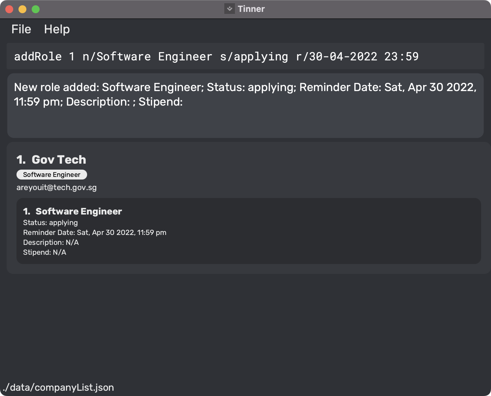

Tinner (Anagram of Intern) is a desktop app for managing internship applications for students, optimized for use via a Command Line Interface (CLI) 
while still having the benefits of a Graphical User Interface (GUI). 
If you can type fast, Tinner allows you to easily sort through and retrieve relevant information faster than traditional GUI apps.

Tinner aims to solve the hassle of managing internship applications though 3 aspects.
1. **Tracks** essential information such as statuses and deadlines at a glance.
2. **Reminds** important deadlines so that you will not miss anything about your application.
3. **Reviews** the process and take down notes so that you can ace your next application.

# Table of Contents

  * [Quick start](#quick-start)
  * [About](#about)  
    * [Outline of this Guide](#outline)
    * [Navigating within Tinner](#navigation)
    * [Technical Terminologies](#technical-terminologies)
    * [General Symbols](#general-symbols)
    * [Command Format](#command-format)
  * [Features](#features)
    * [Modifying Companies](#c-modifying-companies)
      * [Adding a company: `addCompany`](#c-add-c)
      * [Editing a company: `editCompany`](#c-edit-c)
      * [Deleting a company: `deleteCompany`](#c-delete-c)
      * [Favouriting a specific company: `favourite`](#c-favourite-c) 
      * [Unfavouriting a specific company: `unfavourite`](#c-unfavourite-c)
    * [Modifying Roles](#c-modifying-roles)
      * [Adding a role: `addRole`](#c-add-c-r)
      * [Editing a role: `editRole`](#c-edit-r)
      * [Deleting a role: `deleteRole`](#c-delete-c-r)
    * [Retrieving Companies](#c-retrieving-companies)
      * [Viewing all companies and roles: `list`](#c-list)
      * [Viewing all favourited companies: `listFavourite`](#c-listfavourite)
      * [Finding a specific company or role: `find`](#c-find-c-r)
    * [General](#c-general)
      * [Changing the reminder window: `setWindow`](#c-setWindow-c)
      * [Clearing the company list: `clear`](#c-clear)
      * [Viewing help: `help`](#c-help)
      * [Exiting Tinner: `exit`](#c-exit)
  * [Frequently Asked Questions (FAQs)](#faq) 
  * [Command Summary](#command-summary)

--------------------------------------------------------------------------------------------------------------------

# Quick start 

1. Ensure you have Java 11 or above installed in your computer.
2. Download the latest tinner.jar.
3. Copy the file to the folder you want to use as the home folder for your Tinner.
4. Double-click the file to start the app. The GUI like below should appear in a few seconds. Note how the app contains some sample data.

5. Type the command in the command box and press Enter to execute it. e.g. typing help and pressing Enter will open the help window.

   Some example commands you can try:
   * **`list`** : Lists all companies and internship roles.
   * **`addCompany`**`n/Google p/98765432 e/hr_google@gmail.com a/70 Pasir Panjang Rd, #03-71 Mapletree Business City II, Singapore 117371` :
    Adds a company named `Google` to Tinner.
   * **`addRole`**`1 n/Software Engineering Intern s/applying r/31-03-2022 23:59 d/Write mobile applications $/5000` :
    Adds a software engineering intern role to the company at index 1.
   * **`deleteCompany`**`1` : Deletes the 1st company shown in the current list.
   * **`deleteRole`**`1 1` : Deletes the 1st role of the 1st company shown in the current list.
   * **`exit`** : Exits the app.

6. Refer to the [Features](#features) below for details of each command.

--------------------------------------------------------------------------------------------------------------------
# About 

This section helps you to understand the Graphical User Interface (GUI), commonly used technical terminologies, general symbols and information about the command format. 

## Outline of this Guide 

## Navigating within Tinner 

## Technical Terminologies 

| Term |  What it means |
|:----------:|-------------|
| Command word| Commands are invoked based on the command word, which is the first word in every user command. The command word is indicated by `COMMAND_WORD` in the guide.|
|Parameter|User input supplied to a command|

## General Symbols 

| Symbol |  What it means |
|:----------:|-------------|
| `list` |  Words that have a grey highlighted background are either commands or parameters. |
|:bulb:|Useful tip|
|:warning:|Warning|
|:information_source:|Important piece of information |

## Command Format 

The following points explain the format of a command.

* Words in `UPPER_CASE` are the parameters to be supplied by the user. 
  e.g. in `add n/COMPANY`, `COMPANY` is a parameter* which can be used as `add n/Google`.

* Items in square brackets are optional. 
  e.g `n/COMPANY [p/PHONE_NUMBER]` can be used as `n/Google P/65427981` or as `n/Google`.

* Parameters can be in any order. 
  e.g. if the command specifies `n/COMPANY [p/PHONE_NUMBER]`, `[p/PHONE_NUMBER] n/COMPANY` is also acceptable.

* If a parameter is expected only once in the command but you specified it multiple times, only the last occurrence of the parameter will be taken. 
  e.g. if you specify `p/12341234 p/56785678`, only `p/56785678` will be taken.

* Extraneous parameters for commands that do not take in parameters (such as `help`, `list`, `exit`) will be ignored. 
  e.g. if the command specifies `help 123`, it will be interpreted as `help`.

* Duplicate company names are not allowed. 
  e.g. if there exists a company named `meta`, adding another company with the name `meta` is not allowed. 
  
--------------------------------------------------------------------------------------------------------------------
# Demo Use Cases 

## Use Case #1: Applying to a role in a company 

Say you found a company with an opening that you are interested in. You did your research and found relevant information pertaining to the company and the role. Here's how you can input this data in the application:

1. [Add the company](#c-add-c) to the company list.

:information_source: Note the successful command execution message in the system feedback box upon successful adding of the company.

2. [Add the role](#c-add-c-r) under the added company.

:information_source: Note the successful command execution message in the system feedback box upon successful adding of the role.

## Use Case #2: Deleting a company or a role 

Perhaps for some reason, you decide not to go through with an application. Maybe you realised the company's mission and vision were  not in line with your values or maybe you realised the role isn't for you. Here's how you can delete these entries from the application:

1. [Delete the role](#c-delete-c-r) from a given company.

:information_source: Note the successful command execution message in the system feedback box upon successful deletion of the role.

2. [Delete the company](#c-delete-c) from the company list.

:information_source: Note the successful command execution message in the system feedback box upon successful deletion of the company.

--------------------------------------------------------------------------------------------------------------------
# Features 

## Modifying Companies 

### Adding a company: `addCompany` 

Adds a company that does not exist in the list.

Format: `addCompany n/COMPANY_NAME [p/PHONE_NUMBER] [e/EMAIL] [a/ADDRESS]`

Examples:

* `addCompany n/Google p/98765432 e/hr_google@gmail.com a/70 Pasir Panjang Rd, #03-71 Mapletree Business City II, Singapore 117371 `
* `addCompany n/Meta p/91234567 e/hr_meta@meta.com a/9 Straits View, Marina One, Singapore 018937`
* Refer to [Demo Use Case #1](#usecase1) for an example use case.

### Editing an existing company in the company list : `editCompany` 

Edits the specified company within the displayed company list.

Format: `editCompany COMPANY_INDEX [n/COMPANY_NAME] [p/PHONE_NUMBER] [e/EMAIL] [a/ADDRESS]`

* Edits the company at the specified INDEX. The index refers to the index number shown in the displayed company list. The index must be a positive integer 1, 2, 3, …​
* At least one of the optional fields must be provided.
* Existing values will be updated to the input values.

Examples:

* `list` followed by `editCompany 1 p/91234567 e/johndoe@example.com`edits the 1st company in the displayed company list.

### Deleting a Company : `deleteCompany` 

Deletes the specified company within the displayed company list.

Format: `deleteCompany COMPANY_INDEX`

* Deletes the company at the specified `COMPANY_INDEX`.
* The index refers to the index number shown in the displayed company list.
* The index must be a positive integer like 1, 2, 3, …
* Refer to [Demo Use Case #2](#usecase2) for an example use case.

### Favouriting a specific company: `favourite` 

Favourite a specific company from the list of companies.

Format: `favourite COMPANY_INDEX`

* Favourites the company at the specified `COMPANY_INDEX`.
* The index refers to the index number shown in the displayed company list.
* The indexes must be a positive integer like 1, 2, 3, …

Examples:

* `list` followed by, `favourite 1` favourites the 1st
  company in Tinner.

### Unfavouriting a specific company: `unfavourite` 

Unfavourite a specific company from the list of companies.

Format: `unfavourite COMPANY_INDEX`

* Unfavourites the company at the specified `COMPANY_INDEX`.
* The index refer to the index number shown in the displayed company list.
* The indexes must be a positive integer like 1, 2, 3, …

Examples:

* `list` followed by, `unfavourite 1` unfavourites the 1st
  company in Tinner.

## Modifying Roles 

### Adding an internship role to an existing company: `addRole` 

Adds an internship role to a company that already exists in the list.

Format: `addRole COMPANY_INDEX n/ROLE_NAME [(TYPE)] s/STATUS r/REMINDER_DATE [d/DESCRIPTION] [$/STIPEND]`
* Add internship role at the specified `COMPANY_INDEX`.
* The `COMPANY_INDEX` must be a positive integer like 1, 2, 3, ...
* The `ROLE_NAME` should only contain alphanumeric characters, spaces and an optional pair of round brackets.
* The `STATUS` accepted are as follows: applying, pending, interview and assessments, offered, rejected, complete.
* The `REMINDER_DATE` should be in format dd-MM-yyyy HH:mm.
* The `DESCRIPTION` and `STIPEND` fields are optional during the initial role creation.
    * The `DESCRIPTION` can contain alphanumeric characters, spaces and special characters.
    * The `STIPEND` must be a positive integer going up to 10 digits long.

Note: Integer is a number which is not a fraction; a whole number.

Examples:

* `addRole 1 n/Data Analyst s/applying r/31-03-2022 23:59 d/Analyse data $/4800 `
* `addRole 3 n/Software Engineer (Front end) s/applying r/30-04-2022 01:20 d/web deveploment with react js $/2400 `
* `list` followed by `deleteCompany 2` deletes the 2nd company in the displayed company list.
* Refer to [Demo Use Case #1](#usecase1) for an example use case.

### Editing an existing role from company : `editRole` 

Edits the specified role in the specified company within the displayed company list.

Format: `editRole COMPANY_INDEX ROLE_INDEX [n/ROLE_NAME [(TYPE)]] [s/STATUS] [r/REMINDER_DATE] [d/DESCRIPTION] [$/STIPEND]`

* Edits the role at the specified `ROLE_INDEX` of the company at the specified `COMPANY_INDEX`. The indexes refers to the index number shown in the displayed company list. The indexes must be a positive integer 1, 2, 3, …​
* At least one of the optional fields must be provided.
* Existing values will be updated to the input values.

Examples:

* `list` followed by `editRole 1 1 [s/offered] [$/3000]` edits the 1st role from the 1st company in the displayed company list.

### Deleting an internship role from company : `deleteRole` 

Deletes the specified role in the specified company within the displayed company list.

Format: `deleteRole COMPANY_INDEX ROLE_INDEX`

* Deletes the role at the specified `ROLE_INDEX` of the company at the specified `COMPANY_INDEX`. The indexes refer to the index numbers shown in the displayed company list.
* The indexes must be a positive integer like 1, 2, 3, …

Examples:

* `list` followed by, `deleteRole 1 1` deletes the 1st role from the 1st
  company in the displayed company list.
* Refer to [Demo Use Case #2](#usecase2) for an example use case.

## Retrieving Companies 

### Listing all companies : `list` 

Shows a list of all companies and internship roles in Tinner.

Format: `list`

### Listing all favourited companies : `listFavourite` 

Shows a list of all favourited companies and internship roles within these companies in Tinner.

Format: `listFavourite`

### Finding companies or internship roles by name: `find` 

Find companies or/and roles depending on the format given.
* If only company keywords are entered, companies whose names match any of the given keywords will be displayed with all their roles.
* If only role keywords are entered, roles across all companies whose role names match any of the given keywords will be displayed.
* If both keywords are entered, only companies whose names match any of the company keywords, while containing one or more roles whose names match any of the role keywords, are displayed.

Format: `find c/COMPANY_KEYWORD [MORE_COMPANY_KEYWORDS] r/ROLE_KEYWORD [MORE_ROLE_KEYWORDS]`

* The search is case-insensitive. e.g. `meta` will match `Meta`.
* The order of the keywords does not matter. e.g. `software engineer` will match `engineer software`.
* Only the company name, and the role name are searched.
* Only full words would be matched e.g. `mobile` will not match `mobiles`
* Companies and roles matching at least one keyword will be returned e.g. `software engineer` will match `mobile engineer` and `software developer`
* At least one role keyword or one company keyword must be provided in the user input.
* The prefixes `c/` and `r/` can be omitted or included if no corresponding keywords are meant to be entered

Examples:

* `find c/meta amazon r/engineer`

## General 

### Clearing the company list: `clear` 

Clears the entire company list, including roles within each company.

Format: `clear`

### Viewing help : `help` 

Shows a message explaining how to access the User Guide.

Format: `help`

### Changing the reminder window: `setWindow` 

* The parameter `REMINDER_WINDOW` specifies the period (in days) in which you will receive reminders before a role's reminder date.
* Sets the reminder window to the specified `REMINDER_WINDOW`.
* All roles with reminder dates that are within the specified `REMINDER_WINDOW` days away from today will show up in the reminders window.

Format: `setWindow REMINDER_WINDOW`

Examples:

* `setWindow 14` would make Tinner remind you of all upcoming reminders from up to two weeks prior to the associated role's reminder date.

### Exiting the program : `exit` 

Exits the Tinner application.

Format: `exit`

### Colour code of role tags
Colour coding of roles allows users to quickly obtain information about their application statuses at a glance.

* "applying" : white
* "pending": orange
* "interview and assessments": purple
* "rejected": red
* "offered": green
* "complete": black

### Saving the data

Tinner data are saved in the hard disk automatically after any command that changes the data. There is no need to save manually.

### Archiving data files `[coming in v2.0]`

_Details coming soon ..._

--------------------------------------------------------------------------------------------------------------------

# Frequently Asked Questions (FAQs) 

--------------------------------------------------------------------------------------------------------------------

# Command Summary 

| Action                        | Format, Examples                                                                                                                                                                                                   |
|-------------------------------|--------------------------------------------------------------------------------------------------------------------------------------------------------------------------------------------------------------------|
| **Add company**               | `addCompany n/COMPANY_NAME [p/PHONE_NUMBER] [e/EMAIL] [a/ADDRESS]`    e.g.,`addCompany n/Google p/98765432 e/hr_google@gmail.com a/70 Pasir Panjang Rd, #03-71 Mapletree Business City II, Singapore 117371` |
| **Edit company**              | `editCompany COMPANY_INDEX [p/PHONE_NUMBER] [e/EMAIL] [a/ADDRESS]`    e.g.,`editCompany 1 n/Google p/98765432 e/hr_google@gmail.com`                                                                         |
| **Delete company**            | `deleteCompany COMPANY_INDEX `   e.g.,`deleteCompany 3 `                                                                                                                                                     |
| **Favourite company**         | `favourite COMPANY_INDEX`    e.g., `favourite 1`                                                                                                                                                             |
| **Unfavourite company**       | `unfavourite COMPANY_INDEX`    e.g., `unfavourite 1`                                                                                                                                                         |
| **Add role**                  | `addRole COMPANY_INDEX n/ROLE_NAME [(TYPE)] s/STATUS b/DEADLINE [d/DESCRIPTION] [$/STIPEND]`    e.g.,` addRole 1 n/Data Analyst s/applying b/31-03-2022 23:59 d/Analyse marketing data $/5000`               |
| **Edit role**                 | `editRole COMPANY_INDEX ROLE_INDEX [n/ROLE_NAME [(TYPE)]] [s/STATUS] [b/DEADLINE] [d/DESCRIPTION] [$/STIPEND]`    e.g.,` editRole 1 1 s/pending b/31-03-2022 23:59 $/5000`                                   |
| **Delete role**               | `deleteRole COMPANY_INDEX ROLE_INDEX`    e.g.,`deleteRole 3 1 `                                                                                                                                              |
| **List companies**            | `list`                                                                                                                                                                                                             |
| **List favourited companies** | `listFavourite`                                                                                                                                                                                                    |
| **Find company or role**      | `find c/COMPANY_KEYWORD [MORE_COMPANY_KEYWORDS] r/ROLE_KEYWORD [MORE_ROLE_KEYWORDS]`    e.g., `find c/google r/mobile software`                                                                              |
| **Set reminder window**       | `setWindow REMINDER_WINDOW`    e.g., `setWindow 14`                                                                                                                                                          |
| **Clear**                     | `clear`                                                                                                                                                                                                             |
| **Help**                      | `help`                                                                                                                                                                                                             |
| **Exit Tinner**               | `exit`                                                                                                                                                                                                             |

