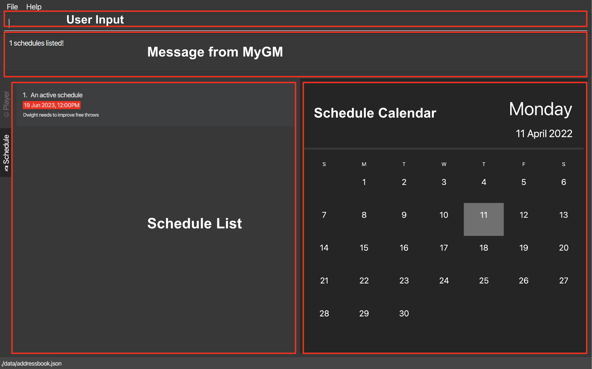

MyGM is a **desktop app for high school basketball team trainers to manage players’ data and schedules, optimized for use
via a Command Line Interface (CLI)** while still having the benefits of a Graphical User Interface (GUI).
If you can type fast, MyGM can get your contact management tasks done faster than traditional GUI apps.

* Table of Contents
{:toc}

--------------------------------------------------------------------------------------------------------------------

## 1. Quick start

1. Ensure you have Java `11` or above installed on your Computer.

2. Download the latest `MyGM.jar` from [here](https://github.com/AY2122S2-CS2103-F09-1/tp/releases).

3. Copy the file to the folder you want to use as the _home folder_ for `MyGM.jar`. You should put it in an **empty folder** in which the app is **allowed to create files** (i.e. do not use a write-protected folder). Alternatively, You can copy it to your desktop.

4. Double-click the file to start the app (**Mac users** are recommended to type `java -jar MyGM.jar` in the terminal). The GUI similar to the below should appear in a few seconds (note that there might be slight differences in different OS). 
The GUI is split into two parts: Players and Schedules respectively. Details of the GUI are shown below

 

6. Type the command in the command box and press Enter to execute it. e.g. typing **`help`** and pressing Enter will open the help window. 
   Some example commands you can try:

   * **`add`**`P/ n/John Doe p/98765432 e/johnd@example.com h/183 w/70 j/24 t/PG` : Adds a player named `John Doe` to MyGM.

   * **`add`**`S/ n/training r/shooting training d/01/01/2023 1800` : Adds a schedule called `training` to MyGM.

   * **`delete`**`P/John Doe` : Deletes the player John Doe from MyGM.

   * **`clear`** : Deletes all players, lineup and schedule.

   * **`exit`** : Exits the app.

7. Refer to the Features below for details of each command.

--------------------------------------------------------------------------------------------------------------------

## 2. Features

**:information_source: Notes about the command format:** 

* Words in `UPPER_CASE` are the parameters to be supplied by the user.  e.g. in `add L/ n/LINEUP_NAME`, `LINEUP_NAME` is a parameter which can be used as `add L/ n/allstars`.
* Items in square brackets are optional.   e.g `n/NAME [t/TAG]` can be used as `n/John Doe t/PG` or as `n/John Doe`.
* Items with …​ after them can be used multiple times including zero times.   e.g. `[t/TAG]…​` can be used as ` ` (i.e. 0 times), `t/SF`, `t/PF t/C` etc.
* Commands are case-sensitive. `Add` is considered as an invalid command, the correct command should be `add` which is in lower case.
* Leading and trailing white spaces for parameters are trimmed.   e.g. `delete P/     John Doe` will be treated as `delete P/John Doe`
* Parameters can be in any order.   e.g. if the command specifies `n/NAME p/PHONE_NUMBER, p/PHONE_NUMBER n/NAME` is also acceptable.
* If a parameter is expected only once in the command, but you have specified it multiple times, only the last occurrence of the parameter will be taken.  e.g. if you specify `p/12341234 p/56785678`, only `p/56785678` will be taken.
* Extraneous parameters for commands that do not take in parameters (such as `help`, `exit` and `clear`) will be ignored.   e.g. if the command specifies `help 123`, it will be interpreted as help.

### 2.1. Viewing insights

Views some insights about players in the club and upcoming schedules.

* The right half of the application is used to display aggregated information about the club.
* Under the **Player** section, a pie chart showing the distribution of players by position in the club and a recruitment suggestion based on the distribution are given. Specifically, if one or more position contains noticeably fewer players than the average, or any position contains less than 2 players (1 starting and 1 reserved player), MyGM will remind the user to recruit more players. Moreover, MyGM will remind the user to tag those untagged players to have a better understanding of the club.
* Under the **Schedule** section, a calendar representing the current month is shown. The date representing today and the dates containing schedules will be marked out.

  

### 2.2. Getting help : `help`

Shows a message explaining how to access the help page.

Format: `help`

### 2.3. Adding a player/ lineup/ schedule: `add`

Adds a player/ lineup/ schedule with the specified attributes to MyGM.

#### 2.3.1. Add a player

Adds a player with the specified attributes to the player list in MyGM.

Format: `add P/ n/NAME j/JERSEY_NUMBER w/WEIGHT h/HEIGHT p/PHONE_NUMBER e/EMAIL_ADDRESS [t/TAG]…​`

:information_source: Notes about the `add` Command for player.

* `NAME` must be **alphanumeric** and should not be blank.
* `NAME` is case-sensitive. `John Doe` and `joHN dOE` are considered different players.
* The first character of every word in `NAME` is **recommended to be capitalized**. For example:`John Doe` instead of `john doe`
* `NAME` must not exist in MyGM already.
* `JERSEY_NUMBER` should be an integer between 0 and 99, inclusive of both 0 and 99.
* `JERSEY_NUMBER` must not exist in MyGM already.
* `WEIGHT` should be an integer between 1 and 200, inclusive of 1 and 200.
* `HEIGHT` should be an integer between 1 and 300, inclusive of 1 and 300.
* `PHONE_NUMBER` should only contain numbers, and it should be at least 3 digits long.
* `EMAIL_ADDRESS` should be of the format local-part@domain and adhere to the following constraints:
    * The local part should only contain alphanumeric characters and these special characters, excluding the parentheses, (+_.-). The local part may not start or end with any special characters.
    * This is followed by a '@' and then a domain name. The domain name is made up of domain labels separated by periods.
      The domain name must:
        - End with a domain label at least 2 characters long
        - Have each domain label start and end with alphanumeric characters
        - Have each domain label consist of alphanumeric characters, separated only by hyphens, if any.
* `TAG` must only be either `PG`, `SG`, `SF`, `PF` or `C`.
* If the same tag is specified twice, it will only be captured only once.   e.g. `t/PG t/PG t/PG` will be treated as `t/PG`.

Examples:
* `add P/ n/Josh Doe j/9 w/70 h/190 p/98760000 e/joshd@example.com`   Adds a player by the name of `Josh Doe`, with a jersey number of `9`, weight of `70`kg, height of `190`cm, handphone number of `98760000`, email of `joshd@example.com` to MyGM.
* `add P/ n/John Doe j/3 w/69 h/188 p/98765432 e/johnd@example.com t/PG`   Adds a player by the name of `John Doe`, with a jersey number of `3`, weight of `69`kg, height of `188`cm, handphone number of `98765432`, email of `johnd@example.com` with the position of `PG` to MyGM.
* `add P/ n/James Doe j/6 w/100 h/206 p/98761234 e/jamesd@example.com t/PG t/SF`   Adds a player by the name of James Doe, with a jersey number of `6`, weight of `100`kg, height of `206`cm, handphone number of `98761234`, email of `jamesd@example.com` with the position of `PG` and `SF` to MyGM.

#### 2.3.2. Add a lineup

Adds a lineup with the specified attribute inside MyGM.

Format: `add L/ n/LINEUP_NAME`

:information_source: Notes about the `add` Command for lineup.

* `LINEUP_NAME` must be **alphanumeric** and should not be blank.
* `LINEUP_NAME` is case-sensitive. `allstar` and `AllStar` are considered different lineups.
* The new `LINEUP_NAME` must not exist in MyGM already.
* After being created, empty lineups will not be displayed on the GUI. To find all the lineups you have created, you can leverage the `view L/` command. To know more about `view` related commands, please go to [view](#26-viewing-playerschedulelineup-view) section.

Example:
* `add L/ n/starting five` adds a lineup by the name of `starting five` inside MyGM.

#### 2.3.3. Add a schedule

Adds a schedule with the specified attributes inside MyGM.

Format: `add S/ n/SCHEDULE_NAME r/DESCRIPTION d/DATETIME`

:information_source: Notes about the `add` Command for schedule.

* `DATETIME` must be in a dd/mm/yyyy HHmm format, where HHmm is in 24-hour clock.   e.g. `04/04/2024 1400`
* `SCHEDULE_NAME` must be **alphanumeric** and should not be blank.
* `DESCRIPTION` should not be blank.
* Multiple schedules can be added to the same `DATETIME` due to the concern that the user might have different arrangements for different lineups, and such details can be specified in the `SCHEDULE_NAME` and `DESCRIPTION` sections.

Examples:
* `add S/ n/Competition r/first game of national competition d/20/04/2024 2200` adds a schedule with name `Competition`, description `first game of national competition` that is held on `20/04/2024 2200`.

### 2.4. Deleting a player/ lineup/ schedule :  `delete`

Deletes a player/ lineup/ schedule from MyGM.

#### 2.4.1. Delete a player

Deletes the specified player from MyGM.

Format: `delete P/PLAYER [L/LINEUP]`

:information_source: Notes about the `delete` Command for player.

* `PLAYER` is the player name to be specified and is **case-sensitive**.
* `PLAYER` must exist in MyGM already.
* If `L/LINEUP` is specified, the player will only be deleted from this lineup.

Example:  
* `delete P/James Soften` will delete player `James Soften` from MyGM.
* `delete P/James Soften` `L/Starting 5` will only delete player `James Soften` from the lineup `Starting 5`.

#### 2.4.2. Delete a lineup

Deletes the specified lineup.

Format: `delete L/LINEUP`

:information_source: Notes about the `delete` Command for lineup.

* `LINEUP` is the lineup name to be specified and is **case-sensitive**.
* This command **does not** delete the players that are in this lineup from MyGM.  e.g. If players `John Doe` and `Josh Doe` are in the lineup `Duo`, deleting the lineup `Duo` **does not** delete `John Doe` and `Josh Doe` from MyGM.

Example:
* `delete L/Starting 5` will only delete the lineup `Starting 5` from MyGM.

#### 2.4.3. Delete a schedule

Deletes the i-th schedule from MyGM.

Format: `delete S/INDEX_SCHEDULE`

:information_source: Notes about the `delete` Command for schedule.

* Deletes the schedule at the specified `INDEX_SCHEDULE`.
* The index refers to the index number shown in the displayed schedule list.
* The index **must be a positive integer** 1, 2, 3, …​

Example:

* `view S/` followed by `delete S/2` deletes the 2nd schedule in the **displayed** schedule.
* `view S/game` followed by `delete S/1` deletes the 1st schedule in the **displayed** schedule as a result of the `view S/game` command.

### 2.5 Putting a player into a lineup: `put`

Puts the specified player to a specified lineup.

Format: `put P/PLAYER L/LINEUP`

:information_source: Notes about the `put` Command

* Adds a specified existing player to a specific existing lineup.
* Each player can join multiple lineups.
* Each lineup can have only up to five players.
* Each player cannot join the same lineup again.

Example:
* `put P/John Doe L/starting five` Puts `John Doe` into the lineup named `starting five`.

### 2.6. Viewing player/schedule/lineup: `view`

This function makes listing, searching and filtering of player/ schedule/ lineup quick and easy.
You can specify criteria to list out the current player and schedule list.

#### 2.6.1. View player

Filters the existing players to display only the players matching the criteria specified.

Format: `view P/[NAMES_IN_PLAYERNAME] [w/OPWEIGHT] [h/OPHEIGHT] [t/TAG]`

:information_source: Notes about the `view` Command for player

* Parameters `NAMES_IN_PLAYERNAME` and `TAG` will only find players that contain
the specific word that is specified.   e.g. `view P/John` will not display players with the name
"Johnson" in their name. However, it will display players with names such as "John Cena", "Stockton John" if
players with such names exist.
* "OP" in the parameters `OPWEIGHT` and `OPHEIGHT` must be either `gte`, `lte`, `gt`, `lt`, `eq`. On the other hand,
"WEIGHT" and "HEIGHT" must be integers.   e.g. `gte180`, `lt90` can be a potential `OPWEIGHT` or `OPHEIGHT`
* Words in `NAMES_IN_PLAYERNAME` are case **insensitive** but words in `POSITIONS` are case **sensitive**.
* `view P/` without specifying any field will display all players in lexicographical order by default.

Examples:
* `view P/` Displays all the players
* `view P/Kelvin Darent` Displays all the players that have `Kelvin` **or** `Darent` in their name
* `view P/ h/gt180 w/gte80` Displays all the players who have heights greater than `180`cm **and** weights
greater than or equal to `80`kg
* `view P/James h/lt213 w/eq100 t/SG SF` Displays all the players that have "James" in their name **and** a height that
is lesser than `213`cm **and** weight equals to `100`kg **and** plays the position of `SG` or `SF`

#### 2.6.2. View lineup

Filters players who are in the lineup that corresponds to the criteria specified.

Format: `view L/[NAMES_IN_LINEUPNAME]`

:information_source: Notes about the `view` Command for lineup

* Parameter `NAMES_IN_LINEUPNAME` will only find players that are in the lineup which contains the lineup name that
matches the specific word that is specified.   e.g. `view L/super` will not display players in the lineup
with the lineup name "superstars". However, it will display players in the lineup with the lineup name "super"
or "super idol" provided that lineup with this lineup name exists and there are players in this lineup as well.
* If no `NAMES_IN_LINEUPNAME` is provided, all the players that are in a lineup will be displayed and all current lineups will also be displayed
* Words in `NAMES_IN_LINEUPNAME` are case **insensitive**.
* To view players that are **without** a lineup, the `N/` prefix must be specified.

Examples:
* `view L/ N/` Displays all the players without a lineup
* `view L/` Displays all the players that have at least a lineup and all current lineups
* `view L/starting` Displays all the players that are in the lineup that has "starting" in the lineup name
* `view L/Starting five` Displays all the players that are in the lineup that has "Starting" **or** "five" in the lineup name

#### 2.6.3. View schedule

Filters the existing schedules to display only the schedules matching the criteria specified.

Format: `view S/[NAMES_IN_SCHEDULENAME] [d/DATE]`

:information_source: Notes about the `view` Command for schedule

* Parameter `DATE` must be in dd/mm/yyyy e.g. 04/12/2022
* Parameter `NAMES_IN_SCHEDULENAME` will only find schedules that contain
the specific word that is specified.   e.g. `view S/training` will not only display schedules with the name
"training" in the schedule name. However, it will display schedules with names such as "training", "always training" if
schedules with such names exist.
* Words in the parameter `NAMES_IN_SCHEDULENAME` are case **insensitive**.
* If no `NAMES_IN_SCHEDULENAME` is provided, the list of all active schedules which happen at future dates will be displayed.
* To display all the schedules including the ones that happened in the past (i.e. archived schedule), the prefix `a/` together with
`all` must be specified.  
e.g `a/all`
* To display all the schedules which are archived, the prefix `a/` together with `archive` must be specified. 
e.g `a/archive`
* The prefix `a/` can **only** follow with either `all` or `archive` is provided. In any other scenario, an error message will be displayed.
* To view all the schedules that have happened or are going to happen on a particular date, the `d/` prefix must be specified
together with a `date` that is in `dd/mm/yyyy`. The parameter `[NAMES_IN_SCHEDULENAME]` must be empty.
  e.g `d/22/02/2023`

Examples:
* `view S/` Displays all upcoming schedules
* `view S/drills` Displays all the upcoming schedules that have the name of "drills"
* `view S/drills shooting` Displays all the upcoming schedules that have the name of "drills" **or** "shooting"
* `view S/ a/all` Displays all the schedules including both upcoming and archived schedules
* `view S/ a/archive` Displays all the schedules including **only** the archived schedules
* `view S/ d/22/02/2023` Displays all the schedules that fall on the date "22/02/2023"

### 2.7. Sort players by height/ jersey number/ weight: `sort`

The `sort` command allows you to sort the displayed players based on the criteria specified.

Format: `sort PREFIX/ORDER`

:information_source: Notes about the `sort` Command

* Sorts all the players based on the specified `PREFIX` and `ORDER`.
* The parameter `PREFIX` must be specified only as `h/`, `j/` or `w/` for height, jersey number and weight respectively.
Other `PREFIX` **will not** be accepted.
* The parameter `ORDER` must be specified only as `asc` or `desc` for ascending and
descending respectively. Other `ORDER` **will not** be accepted.
* Player names in alphabetical order will be used as a tiebreaker when sorting based on height or weight.
* The default display of players by lexicographical order can be restored by using `view P/` command.

Example:
* `sort h/asc` Sort the displayed players in ascending order of height
* `sort h/desc` Sort the displayed players in descending order of height
* `sort j/asc` Sort the displayed players in ascending order of jersey number
* `sort j/desc` Sort the displayed players in descending order of jersey number
* `sort w/asc` Sort the displayed players in ascending order of weight
* `sort w/desc` Sort the displayed players in descending order of weight

* 

### 2.8. Edit a player/ lineup/ schedule information : `edit`

Updates the details of a player, lineup or schedule.

#### 2.8.1 Edit a player

Format: `edit P/PLAYER [n/NAME] [p/PHONE_NUMBER] [w/WEIGHT] [h/HEIGHT] [j/JERSEY_NUMBER] [t/TAG]…​`

Edit the details of an existing player in MyGM.

:information_source: Notes about the `view` Command for lineup

* If any fields are specified, they will change accordingly.
* The player `PLAYER` must exist in MyGM.
* Multiple fields can be changed at once.
* Restrictions for `NAME`, `JERSEY_NUMBER`, `WEIGHT`, `HEIGHT`, `PHONE`, `EMAIL_ADDRESS` and `TAG` in [add](#231-add-a-player) Command section for players apply here as well.
* When editing tags, the existing tags of the player will be removed i.e adding of tags is not cumulative.

Example:
* `edit P/James Soften p/8888888` will change the phone number of player `James Soften` to `88888888`.

:bulb: Tip with regard to editing a player

* You can remove all the tags of the specified player by typing `t/` without specifying any tags after it.  e.g `edit P/Anthony Glass t/`
* Cannot find your player after edit? Players in the GUI are arranged in lexicographical order (i.e in the order of A to Z followed by a to z), use this property to your advantage!

#### 2.8.2. Edit a lineup

Edit the lineup name of the specified lineup to a new lineup name.

Format: `edit L/LINEUP n/NEW_LINEUP_NAME`

:information_source: Notes about the `view` Command for lineup

* The case-sensitive `NEW_LINEUP_NAME` must not exist in MyGM already.
* Restrictions for `NEW_LINEUP_NAME` in [add](#232-add-a-lineup) Command section for lineups apply here as well.

Example:
* `edit L/Starting5 n/Worst5` will change the name of the lineup `Starting5` to `Worst5`

#### 2.8.3. Edit a schedule

Edit the details of the i-th schedule

Format: `edit S/INDEX SCHEDULE [n/NEW_NAME] [r/NEW_DESCRIPTION] [d/NEW_DATETIME]`

:information_source: Notes about the `edit` Command for schedule

* If any fields are specified, they will be changed accordingly
* Multiple fields can be changed at once
* At least one field must be specified
* Restrictions for `NEW_NAME`, `NEW_DESCRIPTION`, `NEW_DATETIME` in [add](#233-add-a-schedule) Command section for schedules apply here as well.
* Multiple schedules can be edited to the same `DATETIME` due to the concern that the user might have different arrangements for different lineups, and such details can be specified in the `SCHEDULE_NAME` and `DESCRIPTION` sections.

Example:
* `edit S/1 n/finals r/nba finals d/06/06/2022 2100` will edit the first schedule.

### 2.9. Clearing all entries : `clear`

Clears all data from MyGM.

Format: `clear`

:exclamation:**Caution:**
This command is irreversible. Please think twice before using this command.

### 2.10. Exiting the program : `exit`

Exits the program.

Format: `exit`

### 2.11. Changing the theme of the UI: `theme`

Changes to either light mode or dark mode. MyGM is set to dark mode on startup by default.

Format: `theme T/THEME`

:information_source: Notes about the `view` Command for lineup

* Only have the following THEME currently: `light` and `dark`

Example:
* `theme T/light` Sets the theme of MyGM to `light`.

### 2.12. Saving the data

MyGM data is saved in the hard disk (in a default file) automatically after any command that changes the data. There is no need to save manually.

### 2.13. Editing the data file

MyGM data are saved as a JSON file `[JAR file location]/data/addressbook.json`. Advanced users are welcome to update data directly by editing that data file.

:exclamation: **Caution:**
If your changes to the data file make its format invalid, MyGM will discard all data and start with an empty data file at the next run.

--------------------------------------------------------------------------------------------------------------------

## FAQ

**Q1:** How do I transfer my data to another Computer?
**A1:** Install the app in the other computer and overwrite the empty data file it creates with the file that contains the data of your previous AddressBook home folder.

**Q2**: Why does the `delete` and `edit` command for players require a case-sensitive full name? 
**A2**: Considering that these commands have side effects on the existing player data and are irreversible, we have decided that a case-sensitive full name for these commands is necessary. This is useful as it can serve as a reminder to the user which player he/she is editing or deleting. Furthermore, it may not necessarily slow down the user as generally, human beings tend to remember names easily as opposed to the index of the player in the application.

--------------------------------------------------------------------------------------------------------------------

## Command summary

| Action     | Format, Examples                                                                                                                                                                                                                                                                                                                                                               |
|------------|--------------------------------------------------------------------------------------------------------------------------------------------------------------------------------------------------------------------------------------------------------------------------------------------------------------------------------------------------------------------------------|
| **Add**    | `add P/ n/NAME j/JERSY_NUMBER w/WEIGHT h/HEIGHT p/PHONE_NUMBER e/EMAIL_ADDRESS [t/TAG]…​` e.g. `add P/ n/John Doe j/3 w/69 h/188 p/98765432 e/johnd@example.com t/PG` `add L/ n/LINEUP_NAME` e.g. `add L/ n/starting five` `add S/ n/SCHEDULE_NAME r/DESCRIPTION d/DATETIME` e.g. `add S/ n/Competition r/first game of national competition d/20/04/2024 2200` |
| **Delete** | `delete P/PLAYER [L/LINEUP]` e.g.`delete P/John Doe` `delete L/LINEUP` e.g. `delete L/Starting 5` `delete S/INDEX_SCHEDULE` e.g. `delete S/2`                                                                                                                                                                                                                   |
| **View**   | `view P/[NAMES_IN_PLAYERNAME] [w/OPWEIGHT] [h/OPHEIGHT] [t/TAG]` e.g. `view P/Kelvin Darent` `view L/[NAMES_IN_LINEUPNAME]` e.g. `view L/starting` `view S/[NAMES_IN_SCHEDULENAME] [d/DATE]` e.g. `view S/drills`                                                                                                                                               |
| **Put**    | `put P/PLAYER L/LINEUP`  e.g.`put P/John Doe L/Starting 5`                                                                                                                                                                                                                                                                                                                  |
| **Sort**   | `sort PREFIX/ORDER`   e.g. `sort h/asc`                                                                                                                                                                                                                                                                                                                                     |
| **Edit**   | `edit P/PLAYER [n/NAME] [p/PHONE_NUMBER] [w/WEIGHT] [h/HEIGHT] [j/JERSY_NUMBER] [t/TAG]…​`  e.g. `edit P/James Soften p/8888888` `edit L/LINEUP_NAME n/NEW_LINEUP_NAME`  e.g. `edit L/HAHA n/HEIHEI` `edit S/INDEX SCHEDULE [n/NEW_NAME] [r/NEW_DESCRIPTION] [d/NEW_DATETIME]`  e.g. `edit S/1 n/competition d/22/02/2022 0900`                                 |
| **Theme**  | `theme T/THEME`  e.g.`theme T/light`                                                                                                                                                                                                                                                                                                                                        |
| **Clear**  | `clear`                                                                                                                                                                                                                                                                                                                                                                        |
| **Help**   | `help`                                                                                                                                                                                                                                                                                                                                                                         |

