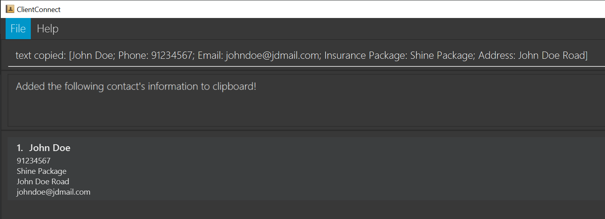

# User Guide
ClientConnect is a **desktop app for managing clients’ contact details, optimized for use via a Command Line Interface** (CLI) while still having the benefits of a Graphical User Interface (GUI). Are you a fast typer? ClientConnect can get your client management tasks done faster than traditional GUI apps with the ability to `find` specific clients based on keywords provided.

--------------------------------------------------------------------------------------------------------------------

## Quick start

1. Ensure you have Java `11` or above installed in your Computer.

2. Download the latest `ClientConnect.jar`

3. Copy the file to the folder you want to use as the _home folder_ for your ClientConnect.

4. Double-click the file to start the app. The GUI similar to the below should appear in a few seconds. Note how the app contains some sample data.

5. Type the command in the command box and press Enter to execute it. e.g. typing **`help`** and pressing Enter will open the help window. 

   Some example commands you can try:

   * **`list`** : Lists all contacts.

   * **`add`**`n/John Doe p/98765432 e/johnd@example.com a/John street, block 123, #01-01, i/package1`: Adds a client named John Doe who is under the insurance package1 to the Address Book.

   * **`delete`**`3` : Deletes the 3rd client shown in the current list.

   * **`clear`** : Deletes all clients.

   * **`exit`** : Exits the app.

6. Refer to the Features below for details of each command.

--------------------------------------------------------------------------------------------------------------------

## Features

**Notes about the command format:** 

* Words in `UPPER_CASE` are the parameters **to be supplied** by the user. 
  e.g. in `add n/NAME`, `NAME` is a parameter which can be used as `add n/John Doe`.

* Items in square brackets are **optional**. 
  e.g `n/NAME [t/TAG]` can be used as `n/John Doe t/important` or as `n/John Doe`.

* Items with `…`​ after them can be used multiple times including zero times. 
  e.g. `[t/TAG]…​` can be used as ` ` (i.e. 0 times), `t/important`, `t/important t/discounted` etc.

* Parameters can be in any order. 
  e.g. if the command specifies `n/NAME p/PHONE_NUMBER`, `p/PHONE_NUMBER n/NAME` is also acceptable.

* If a parameter is expected only once in the command but you specified it multiple times, only the last occurrence of the parameter will be taken. 
  e.g. if you specify `p/12341234 p/56785678`, only `p/56785678` will be taken.

* Extraneous parameters for commands that do not take in parameters (such as `help`, `list`, `exit` and `clear`) will be ignored. 
  e.g. if the command specifies `help 123`, it will be interpreted as `help`.

### Viewing help : `help`

Shows a message explaining how to access the ClientConnect help page.

Format: `help`

Alternatively, click the Help button on the toolbar to view a dropdown window displaying a "Help ... F1" button.

This also shows that you can press F1 on your keyboard to open the help message.

On clicking Help, you will see this as a result:

### Adding a person: `add`

Adds a person, as well as any details, to ClientConnect.

Format: `add n/NAME p/PHONE_NUMBER e/EMAIL a/ADDRESS [i/INSURANCE_PACKAGE] [t/TAG]…​`

Examples:
* `add n/Damith p/99998888 e/damith@damith.com a/Blk 123 i/package 1`
* `add n/Jackson p/92341888 e/jackson5@example.com a/laney street, block 123, #01-01, i/package1 t/important`

Before adding:

After adding:

Notes:
* Any tags are optional.

### Listing all persons : `list`

Displays all your clients in ClientConnect.

Format: `list`

### Editing a person : `edit`

Edits an existing client in ClientConnect, similar to adding a new client.

Format: `edit INDEX [n/NAME] [p/PHONE] [e/EMAIL] [a/ADDRESS] [i/INSURANCE_PACKAGE] [t/TAG]…​`

Examples:
* `edit 1 p/123456 will edit the phone number of the client listed as #1 to 123456`

Before editing:

After editing:

Notes:
* Edits the person at the specified `INDEX`.
* You can look for a client’s index by using the `list` command.
* At least one of the fields must be provided.
* Existing values will be updated to the input values.

### Locating persons by field: `find`

Finds clients whose field contains any of the given keywords.

Format: `find FIELD KEYWORD [MORE_KEYWORDS] [MORE_FIELD] [MORE_KEYWORDS]`

Fields:
* `n/`: name
* `p/`: phone number
* `e/`: email
* `a/`: address
* `i/`: insurance package
* `t/`: tags

Notes:
* The search is case-insensitive. e.g `hans` will match `Hans`
* The order of the keywords does not matter. e.g. `Hans Bo` will match `Bo Hans`
* The fields described above can be searched
* It is possible to search for multiple fields, and the order of the fields does not matter.

Examples:
* `find n/John` returns `john` and `John Doe`
* `find p/91234567` returns the client that is associated to the number
* `find a/street` returns the client associated with the address
* `find i/undecided n/david` returns the client with the Undecided insurance package and with name containing David

After a `find` command:
* `find n/ alex david` returns `Alex Yeoh`, `David Li`

* `find i/undecided n/david` returns `David Li`

### Deleting a person : `delete`

Deletes an existing client from ClientConnect.

Format: `delete INDEX`

* Deletes the person at the specified INDEX.
* You can look for a client’s index by using the `list` command.
* You can also delete a client after doing a search and using the index in the search (refer to example 2)

Examples:
1. `delete 1`
2. `find n/John` followed by `delete 1` deletes the 1st person in the results provided by ClientConnect after finding by the `John` keyword

Before a delete command:

After `delete 2`:

### Clearing all entries : `clear`

Clears all entries from the address book.

Format: `clear`

### Clipping a client's information to clipboard : `clip`

Copies a client's information onto the system's clipboard.

Format: `clip n/NAME`

* Copies the information of the client with the specified NAME.
* You can look for a client’s name by using the `list` command.

Examples:
1. `clip n/John Doe`

Information copied using `clip n/John Doe`:

### Exiting the program : `exit`

Exits the program.

Format: `exit`

--------------------------------------------------------------------------------------------------------------------

## Command summary

| Action     | Format, Examples|
|------------|------------------|
| **Add**    | `add n/NAME p/PHONE_NUMBER e/EMAIL a/ADDRESS i/INSURANCE_PACKAGE [t/TAG]…​`   e.g., `add n/James Ho p/22224444 e/jamesho@example.com a/123, Clementi Rd, 1234665 i/package1 t/friend t/colleague`|
 | **Delete** | `delete INDEX`  e.g., `delete 3`|
| **Edit**   | `edit INDEX [n/NAME] [p/PHONE_NUMBER] [e/EMAIL] [a/ADDRESS] [i/INSURANCE_PACKAGE] [t/TAG]…​`  e.g.,`edit 2 n/James Lee e/jameslee@example.com`|
 | **Find**   | `find FIELD KEYWORD [MORE_KEYWORDS]`  e.g., `find n/James Jake`|
 | **Clip**    | `clip n/NAME`  e.g., `find n/John Doe`|
| **List**   | `list`|
 | **Help**   | `help`|
 | **Exit**   | `exit`|

Fields:
* `n/`: name
* `p/`: phone number
* `e/`: email
* `a/`: address
* `i/`: insurance package
* `t/`: tags
