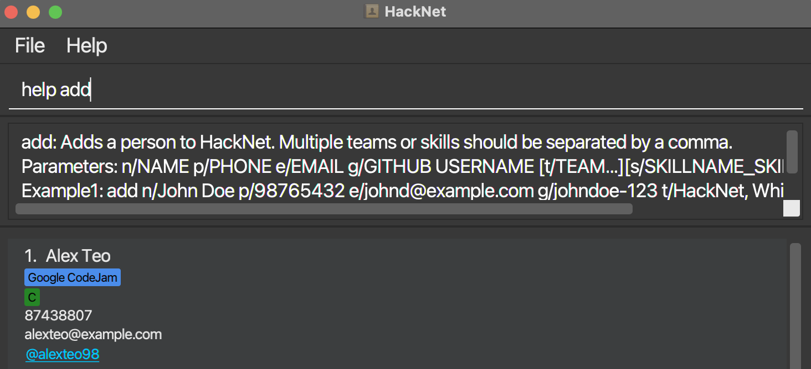
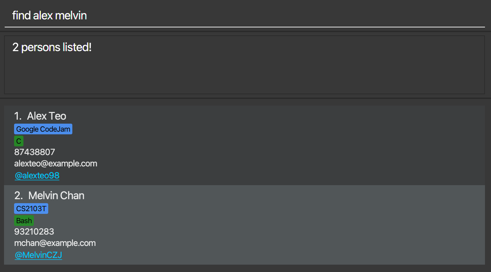
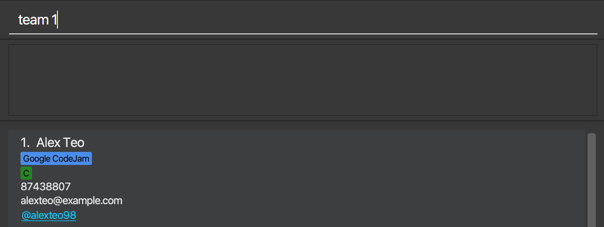
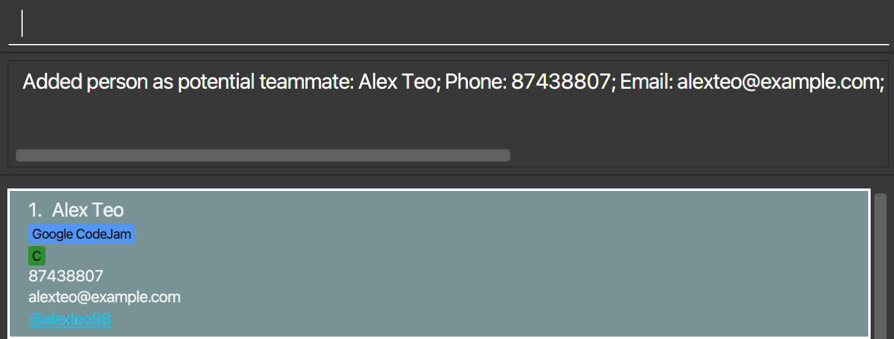

Welcome to the User Guide for **HackNet**, where we will guide you through all you need to know to get started!

**HackNet** is a desktop application that can help you manage contact details of potential team members to work on a technical project or participate in a Hackathon with. It has a simple Graphical User Interface (GUI) which displays details of your potential teammates, and works mainly via a Command Line Interface (CLI) through text commands.

## Table of Contents
* [Quick Start](#quick-start)
* [Features](#features)
    * [Viewing help: help](#viewing-help-help)
    * [Contact Management](#contact-management)
      * [Adding a person: add](#adding-a-person-add)
      * [Editing details for existing contact: edit](#editing-any-number-of-persons-edit)
      * [Add/remove person as potential teammate: team/unteam](#markunmark-contact-as-potential-teammates-teamunteam)
      * [Deleting a person: delete](#deleting-a-person-delete)
      * [Remove all contacts: clear](#clearing-all-entries-clear)
    * [Team Forming](#team-forming)
      * [List all contacts: list](#listing-all-persons-list)
      * [Find person by name: find](#locating-persons-by-name-find)
      * [Filter person by technical skills: filter](#filter-for-past-teammates-filterteam)
      * [Sort person by technical skill: sort](#sorting-persons-by-skill-proficiency-sort)
      * [Show past teammates: filterteam](#filter-for-past-teammates-filterteam)
      * [Show potential teammates: show](#show-all-potential-teammates-show)
    * [Utility](#utility)
      * [Undo](#undo-last-command-undo)
      * [Redo](#redo-last-command-redo)
      * [Navigating User Input History](#navigating-user-input-history--)
    * [Exiting HackNet](#exiting-the-program-exit)
* [Data](#data)
* [FAQ](#faq)
* [Command Summary](#command-summary)

--------------------------------------------------------------------------------------------------------------------

## Quick start

1. Ensure you have Java `11` or above installed in your Computer.

1. Download the latest `HackNet.jar` from [here](https://github.com/AY2122S2-CS2103T-W13-3/tp/releases).

1. Copy the file to the folder you want to use as the _home folder_ for HackNet.

1. Double-click the file to start the app. The GUI similar to the below should appear in a few seconds. Note how the app contains some sample data. 
   

**:information_source: If double-clicking doesn't work:** 

This could be a problem with Windows. You can alternatively start **HackNet** by:
1. Starting a terminal session on your computer
2. Change the directory to the folder containing the file using `cd path/to/HackNet_home_folder`
3. Start HackNet using `java -jar HackNet.jar`

1. Type the command in the command box and press Enter to execute it. e.g. typing **`help`** and pressing Enter will open the help window. 
   Some example commands you can try:

   * **`list`** : Lists all contacts.

   * **`add`**`n/John Doe p/98765432 e/johnd@example.com g/johndoe123` : Adds a contact named `John Doe` to HackNet.

   * **`delete`**` 3` : Deletes the 3rd contact shown in the current list.

   * **`clear`** : Deletes all contacts.

   * **`exit`** : Exits the app.

1. Refer to the [Features](#features) below for details of each command.

--------------------------------------------------------------------------------------------------------------------

## Features

**:information_source: Notes about the command format:** 

* Words in `UPPER_CASE` are the parameters to be supplied by the user. 
    * e.g. in `add n/NAME`, `NAME` is a parameter which can be used as `add n/John Doe`.

* Items in square brackets are optional. 
    * e.g `n/NAME [t/TEAM]` can be used as `n/John Doe t/friend` or as `n/John Doe`.

* Items with `…`​ after them can have multiple values including 0. 
    * e.g. `[t/TEAM…]​` can be used as ` ` (i.e. 0 times), `t/`, `t/friend, family` etc.

* Parameters can be in any order. 
    * e.g. if the command specifies `n/NAME p/PHONE_NUMBER`, `p/PHONE_NUMBER n/NAME` is also acceptable.

* If a parameter is expected only once in the command but you specified it multiple times, only the last occurrence of the parameter will be taken. 
    * e.g. if you specify `p/12341234 p/56785678`, only `p/56785678` will be taken.

* Extraneous parameters for commands that do not take in parameters (such as `list`, `undo`, `redo`, `exit` and `clear`) will be ignored. 
    * e.g. if the command specifies `list 123`, it will be interpreted as `list`.

* For skill field, Skill name have to be followed by a underscore `_` and Skill proficiency level that ranges from 0 to 100 with 0 being the lowest proficiency level.
    * e.g. `[s/SKILLNAME_SKILLPROFICENCY…]​` as `s/Java_90`
    

### Viewing help: `help`

Shows a message explaining how to access the help page.

Format: `help [TOPIC]`

Simply calling `help` will bring up a prompt linking to the user guide.

Passing in a relevant keyword as the `TOPIC` parameter such as `add` will bring up a brief description and usage
of the topic.

## Contact Management

This section contains commands that can help you manage the details of your contacts within **HackNet**.

### Adding a person: `add`

Adds a person to HackNet.

Format: `add n/NAME p/PHONE_NUMBER e/EMAIL g/GITHUB_USERNAME [t/TEAM…]​ [s/SKILLNAME_SKILLPROFICENCY…]​`

:bulb: **Tip:**

* A person can have any number of teams or skills(including 0)
* teams and skills in `[t/TEAM…]` and `[s/SKILLNAME_SKILLPROFICENCY…]` must be separated by a comma. The comma can be preceded or followed by any number of whitespaces, which will be ignored. Any excess commas after the last valid value will be ignored.

Examples:
* `add n/John Doe p/98765432 e/johnd@example.com g/johndoe123`
* `add n/Betsy Crowe e/betsycrowe@example.com g/betsycoder p/1234567 t/gmail plugin, Sublime Text dev s/`

### Editing any number of person(s): `edit`

Edits any number of existing person(s) in HackNet.

Format: `edit INDEX [INDEX…] [-r] [n/NAME] [p/PHONE] [e/EMAIL] [g/GITHUB_USERNAME] [t/TEAM…]​ [s/SKILLNAME_SKILLPROFICENCY…]​`

* Edits the person(s) at the specified `INDEX [INDEX…]`. The index refers to the index number shown in the displayed person list. Indices must be separated by a whitespace as opposed to teams and skills. All index **must be a positive integer** 1, 2, 3, …​
* At least one of the optional fields must be provided besides `[-r]`.
* team and skill values in `[t/TEAM…]` and `[s/SKILLNAME_SKILLPROFICENCY…]` must be separated by a comma. The comma can be preceded or followed by any number of whitespaces, which will be ignored. Any excess commas after the last valid value will be ignored.
* `t/      ` and `s/        ` is treated as `t/` and `s/` as HackNet ignores whitespaces. Therefore, a name of a team cannot be consisting solely of whitespaces.
* Existing values will be updated to the input values.
* In default mode, editing teams appends the new team to the person.
* `-r` option activates reset mode.
* In reset mode, editing teams edits the teams of a person from scratch. i.e adding of teams is not cumulative. You can remove all the person’s teams by typing `t/` without
  specifying any teams after it.
* The concept of default and reset mode applies with skills as well.
* when editing multiple persons, only `[t/TEAM…]` and `[s/SKILLNAME_SKILLPROFICENCY…]` will take effect. Other arguments such as `Name` and `Phone` will be silently ignored.

Examples:
* `edit 1 p/91234567 e/johndoe@example.com` Edits the phone number and email address of the 1st person to be `91234567` and `johndoe@example.com` respectively.
* `edit 2 -r n/Betsy Crower t/` Edits the name of the 2nd person to be `Betsy Crower` and clears all existing teams.
* `edit 2 t/HackNet s/` Appends the team `Hacknet` to the 2nd person and keep the current skills.
* `edit 2 3 s/ t/GoogleProject, Hackathon2022` Does not change the skills of 2nd and 3rd person in the list, and appends`GoogleProject` and `Hackathon2022` to the list of teams they belong to.
* `edit 1 2 3 -r s/Java_100, Python_80, t/` Edits the skills of the 1st, 2nd and 3rd person to be `java` and `python` only with proficiency of 100 and 80. The exiting teams are cleared as well.

### Deleting a person: `delete`

Deletes the specified person from HackNet.

Format: `delete INDEX`

* Deletes the person at the specified `INDEX`.
* The index refers to the index number shown in the displayed person list.
* The index **must be a positive integer** 1, 2, 3, …​

Examples:
* `list` followed by `delete 2` deletes the 2nd person in the address book.
* `find Betsy` followed by `delete 1` deletes the 1st person in the results of the `find` command.

### Clearing all entries: `clear`

Clears all existing contacts from HackNet.

Format: `clear`

## Team Forming

This section contains commands that will aid you to find people with the technical skills you need to form your dream team.

### Listing all persons: `list`

Shows a list of all persons in HackNet.

Format: `list`

### Locating persons by name: `find`

Finds persons whose *names* contain any of the given keywords.

Format: `find KEYWORD [MORE_KEYWORDS]`

* The search is case-insensitive. e.g `hans` will match `Hans`
* The order of the keywords does not matter. e.g. `Hans Bo` will match `Bo Hans`
* Only the name is searched.
* Only full words will be matched e.g. `Han` will not match `Hans`
* Persons matching at least one keyword will be returned (i.e. `OR` search).
  e.g. `Hans Bo` will return `Hans Gruber`, `Bo Yang`

Examples:
* `find John` returns `john` and `John Doe`
* `find alex melvin` returns `Alex Teo`, `Melvin Chan` 
  

### Locating persons by skills: `filter`

Finds persons that have the specified skills.

Format: `filter KEYWORD`

* The search is case-insensitive. e.g `java` will match `Java`
* Only full words will be matched e.g. `C` will not match `C#`
* This command accepts multiple skills to be filtered,
e.g. `filter c java` will filter all those with `C` <b><u>AND</u></b> `Java`.

Examples:
* `filter C` returns `Alex Teo`, `Lye Jia Yang` and `Toh Zhan Qing`
* `filter java` returns `Junha Park` 
  

### Sorting persons by skill proficiency: `sort`

Sort persons in descending level of proficiency of specified skill.

Format: `sort SKILL`

* Only persons with the specified `SKILL` will be listed
* The search is case-insensitive. e.g `java` will match `Java`
* Only full words will be matched e.g. `C` will not match `C#`
* The list will be shown in descending level of skill proficiency
* This command only accepts <b><u>ONE</u></b> skill as the sorting criteria.

Examples:
* `sort Python` shows persons with `Python` as a skill in descending order of proficiency

### Mark/unmark contact as potential teammates: `team/unteam`

Format:
* `team INDEX`
* `unteam INDEX`
    * Marks/unmarks the person at `INDEX`as potential teammate
    * The index refers to the index number shown in the displayed person list
    * The index **must be a positive integer** 1, 2, 3, …​

Examples:
* `team 1` marks the first person as a potential teammate

### Filter for past teammates: `filterteam`

Shows a list of past teammates in HackNet.

Format: `filterteam`

### Show all potential teammates: `show`

Shows the list of all persons marked as potential teammates

Format: `show`

## Utility

This section contains some commands/shortcuts that can improve your work efficiency in using **HackNet**.

### Undo last command: `undo`

Undo the last command that changes HackNet.  
Only these commands that changed HackNet can be undone:
* Add
* Delete
* Edit
* Team
* Unteam
* Clear

**:information_source: Notes about the undo command:** 

* The commands executed will be stored in history, please use the `undo` command to restore them.
* Only the commands as listed above can be undone.
* If a different command is executed after a command is undone,
the undone command will be removed from history and can no longer be redone.
* e.g `Add person 1 -> Add person 2 -> undo -> Add person 3` will have the same persons and history as
  `Add person 1 ->  Add person 3`
* <b>IMPORTANT!</b> All commands in history will be removed when the application exits.

### Redo last command: `redo`

Redo the command that was previously undone.
Only these commands that changes HackNet can be redone:
* Add
* Delete
* Edit
* Team
* Unteam
* Clear

**:information_source: Notes about the redo command:** 

* This command will revert HackNet back to the state before the last command is executed.
* Only the commands specified above can be redone.
* If a command is executed and there are commands in the history,
those commands that are not redone will be removed from history.
* <b>IMPORTANT!</b> All commands in history will be removed when the application exits.

### Navigating User Input History: `↑`, `↓`

Allows user to quickly retrieve their previous inputs from current session by using the up and down arrow keys.

Format: `↑`, `↓`

### Exiting the program: `exit`

Exits the program.

Format: `exit`

## Data

This section contains information about how we save your data across sessions.

### Saving the data

HackNet data are saved in the hard disk automatically after any command that changes the data. There is no need to save manually.

### Editing the data file

HackNet data are saved as a JSON file `[JAR file location]/data/addressbook.json`. Advanced users are welcome to update data directly by editing that data file.

:exclamation: **Caution:**
If your changes to the data file makes its format invalid, HackNet will discard all data and start with an empty data file at the next run.

### Archiving data files `[coming in v2.0]`

_Details coming soon ..._

--------------------------------------------------------------------------------------------------------------------

## FAQ

**Q**: How do I transfer my data to another Computer? 
**A**: Install the app in the other computer and overwrite the empty data file it creates with the file that contains the data of your previous HackNet home folder.

--------------------------------------------------------------------------------------------------------------------

## Command summary

Action | Format, Examples
--------|------------------
**Help** | `help [TOPIC]`
**Add** | `add n/NAME p/PHONE_NUMBER e/EMAIL g/GITHUB_USERNAME [t/TEAM…]​ [s/SKILLNAME_SKILLPROFICENCY…]​`   e.g., `add n/James Ho p/22224444 e/jamesho@example.com g/jameshooo t/friend t/colleague s/java_70`
**Edit** | `edit INDEX [INDEX…] [-r] [n/NAME] [p/PHONE] [e/EMAIL] [g/GITHUB_USERNAME] [t/TEAM…]​ [s/SKILLNAME_SKILLPROFICENCY…]​`  e.g.,`edit 2 n/James Lee e/jameslee@example.com`
**Mark/unmark contacts** | `team`, `unteam`   e.g., `team 1`
**Delete** | `delete INDEX`  e.g., `delete 3`
**Clear** | `clear`
**List** | `list`
**Find** | `find KEYWORD [MORE_KEYWORDS]`  e.g., `find James Jake`
**Filter** | `filter SKILL`  e.g. `filter c`
**Sort** | `sort SKILL`  e.g., `sort Python`
**Filter Past Teammates** | `filterteam` 
**Show potential teammates** | `show`
**Exit HackNet** | `exit`
**Navigate User Input History** | `↑`, `↓`
