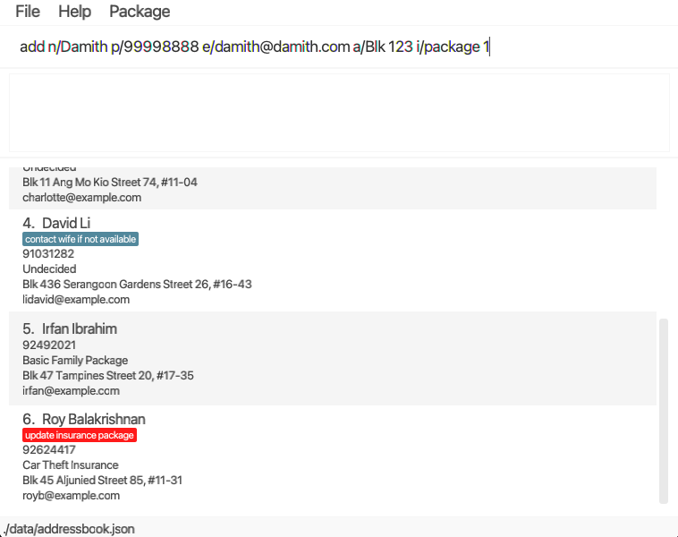
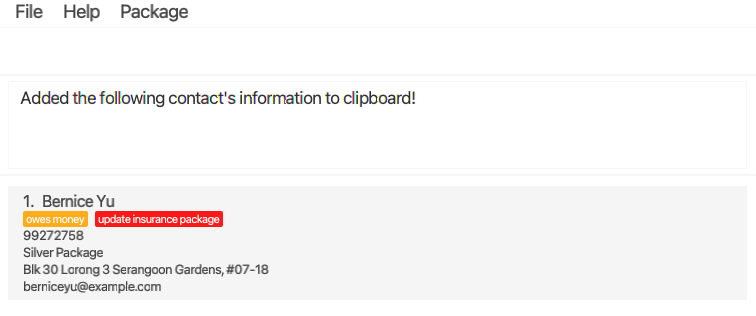
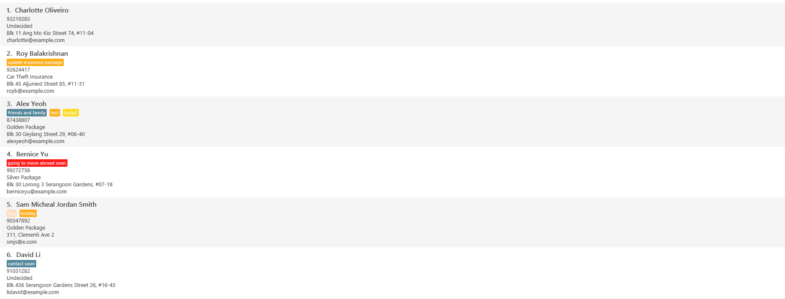
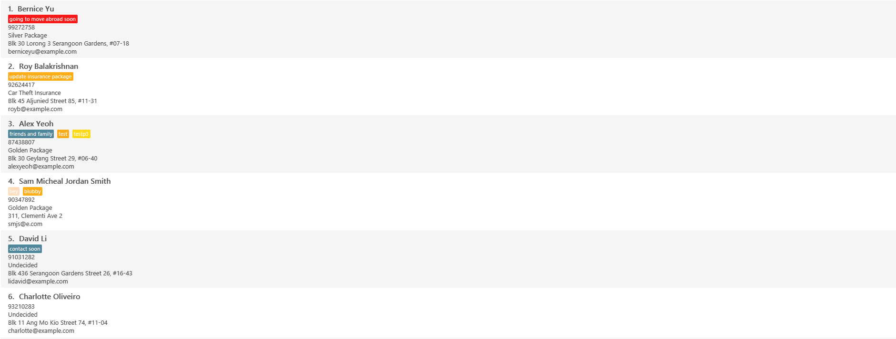

* Table of Contents
{:toc}

ClientConnect is a client-management app for tech-savvy insurance agents to **manage clients’ in the midst of 
massive lists of clients that have various needs and priorities**. 

Are you a fast typer? ClientConnect can get your client management tasks done faster than traditional GUI apps. 
Add Tags with varying levels of priorities to keep track of utmost important tasks to utilize your time efficiently, 
sort your clients by priority so you won't miss out urgent tasks to be done, conveniently import and export your client contacts, and easily find the client details you want through our `find` command.

The package tab allows for quick reference of package details in the event that a client has to be contacted 
regarding their package. It contains a list of all packages that have been added before, not necessarily 
only packages that existing people in ClientConnect have.

## Quick start

1. Ensure you have Java `11` or above installed in your Computer.

2. Download the latest `ClientConnect.jar`

3. Copy the file to the folder you want to use as the _home folder_ for your ClientConnect.

4. Double-click the file to start the app. The GUI similar to the below should appear in a few seconds. Note how the app contains some sample data.

5. Type the command in the command box and press Enter to execute it. e.g. typing **`help`** and pressing Enter will open the help window. 

   Some example commands you can try:

   * **`list`** : Lists all contacts.

   * **`add`**`n/John Doe p/98765432 e/johnd@example.com a/John street, block 123, #01-01, i/package1`: Adds a client named John Doe who is under the insurance package1 to the Address Book.

   * **`delete`**`3` : Deletes the 3rd client shown in the current list.

   * **`clear`** : Deletes all clients.

   * **`exit`** : Exits the app.

6. Refer to the Features below for details of each command.

## Features

**Notes about the command format:** 

* Words in `UPPER_CASE` are the parameters **to be supplied** by the user. 
  e.g. in `add n/NAME`, `NAME` is a parameter which can be used as `add n/John Doe`.

* Items in square brackets are **optional**. 
  e.g `n/NAME [t/TAG]` can be used as `n/John Doe t/important` or as `n/John Doe`.

* Items with `…`​ after them can be used multiple times including zero times. 
  e.g. `[t/TAG]…​` can be used as ` ` (i.e. 0 times), `t/important`, `t/important :p2 t/needs help :p1` etc.

* Parameters can be in any order. 
  e.g. if the command specifies `n/NAME p/PHONE_NUMBER`, `p/PHONE_NUMBER n/NAME` is also acceptable.

* If a parameter is expected only once in the command but you specified it multiple times, only the last occurrence of the parameter will be taken. 
  e.g. if you specify `p/12341234 p/56785678`, only `p/56785678` will be taken.

* Extraneous parameters for commands that do not take in parameters (such as `help`, `list`, `exit` and `clear`) will be ignored. 
  e.g. if the command specifies `help 123`, it will be interpreted as `help`.

**Notes about the tags:** 
* Each tag has two components- a tag name, and a priority level.
* There are 4 priority levels, with 1 being the highest and 4 being the lowest. However, a tag doesn't necessarily have to have a priority level.
* The tag's colour depends on the priority level.
* The priority level of a tag is indicated along with the tag name when you input the `TAG` parameter in commands. To indicate the priority level, simply follow the tag name by typing ` :p[1/2/3/4]` after the tag name
* For example, `owes money` would create a tag with tag name "owes money", and no priority level.
* However, `owes money :p3` would create a tag with tag name "owes money", and priority level 3.

**Notes about the insurance packages:** 

### Viewing help : `help`

Shows a message explaining how to access the ClientConnect help page

Format: `help`

Alternatively, click the Help button on the toolbar to view a dropdown window displaying a "Help ... F1" button.

This also shows that you can press F1 on your keyboard to open the help message.

On clicking Help, you will see this as a result:

------------------------------------------------------------------------------------
### Viewing Packages : `listp`

Opens a new window that shows the various insurance packages and their description

Click on the Package button to view a dropdown window displaying a "Package" button. Alternatively, you could type in `listp`.

Format: `listp`

On clicking Package or typing `listp`, you will see this as a result:

------------------------------------------------------------------------------------
### Adding a person: `add`

Adds a person, as well as any details, to ClientConnect

Format: `add n/NAME p/PHONE_NUMBER e/EMAIL a/ADDRESS [i/INSURANCE_PACKAGE] [t/TAG]…​`

Examples:
* `add n/Damith p/99998888 e/damith@damith.com a/Blk 123 i/package 1`
* `add n/Jackson p/92341888 e/jackson5@example.com a/laney street, block 123, #01-01, i/package1 t/important`

After adding:

Notes:
* Any tags are optional.
* Email domain must contain only **one period** and minimally ends with 2 letters: 
  e.g jackson5@example.com is acceptable, jackson5@example.com.sg and jackson5@example is not acceptable
* For the insurance package indicated in the `i/` field, if an existing package with the same name does not 
  exist, a new one will be automatically created for you.

------------------------------------------------------------------------------------
### Adding a tag to a person: `addTag`

Adds a tag to the specified person in ClientConnect

Format: `addTag INDEX TAG`

Examples:
* `addTag 3 friend of the family`
* `addTag 2 owes money :p2`

After adding:

Notes:
* Adds tag to the person at the specified `INDEX`.
* Only one tag can be added at a time.
* Duplicate tags (same tagname and priority level) cannot be added

------------------------------------------------------------------------------------
### Listing all persons : `list`

Displays all your clients in ClientConnect

Format: `list`

------------------------------------------------------------------------------------
### Editing a person : `edit`

Edits an existing client in ClientConnect, similar to adding a new client

Format: `edit INDEX [n/NAME] [p/PHONE] [e/EMAIL] [a/ADDRESS] [i/INSURANCE_PACKAGE] [t/TAG]…​`

Examples:
* `edit 1 p/123456 will edit the phone number of the client listed as #1 to 123456`

After editing:

Notes:
* Edits the person at the specified `INDEX`.
* You can look for a client’s index by using the `list` command.
* At least one of the fields must be provided.
* Existing values will be updated to the input values.

------------------------------------------------------------------------------------
### Editing a tag of a person: `editTag`

Edits the specified tag of the specified person by replacing it with the new tag given in ClientConnect

Format: `editTag INDEX TAG_NUMBER TAG`

Examples:
* `editTag 3 1 friend of the family`
* `editTag 2 1 owes money :p3`

After editTag:

Notes:
* Edits person at the specified `INDEX`.
* Edits person's tag at the specified `TAG_NUMBER`.
* Only one tag can be edited at a time.
* The edited tag cannot have a duplicate tag (same tagname and priority level) in the existing tag list.

------------------------------------------------------------------------------------
### Locating persons by field: `find`

Finds clients whose field contains any of the given keywords

Format: `find FIELD KEYWORD [MORE_KEYWORDS] [MORE_FIELD] [MORE_KEYWORDS]`

Fields:
* `n/`: name
* `p/`: phone number
* `e/`: email
* `a/`: address
* `i/`: insurance package
* `t/`: tags

Notes:
* The search is case-insensitive. e.g `hans` will match `Hans`
* The order of the keywords does not matter. e.g. `Hans Bo` will match `Bo Hans`
* The fields described above can be searched
* It is possible to search for multiple fields, and the order of the fields does not matter.

Examples:
* `find n/John` returns `john` and `John Doe`
* `find p/91234567` returns the client that is associated to the number
* `find a/street` returns the client associated with the address
* `find i/undecided n/david` returns the client with the Undecided insurance package and with name containing David

After a `find` command:
* `find n/ alex david` returns `Alex Yeoh`, `David Li`

* `find i/undecided n/david` returns `David Li`

------------------------------------------------------------------------------------
### Deleting a person : `delete`
Deletes an existing client from ClientConnect

Format: `delete INDEX`

* Deletes the person at the specified INDEX.
* You can look for a client’s index by using the `list` command.
* You can also delete a client after doing a search and using the index in the search (refer to example 2)

Examples:
1. `delete 1`
2. `find n/John` followed by `delete 1` deletes the 1st person in the results provided by ClientConnect after finding by the `John` keyword

Before a delete command:

After `delete 2`:

------------------------------------------------------------------------------------
### Deleting a tag of a person: `deleteTag`
Deletes the specified tag of the specified person in ClientConnect

Format: `deleteTag INDEX TAG_NUMBER`

Examples:
* `deleteTag 3 1`
* `deleteTag 2 3`

Before deleteTag command:

After `deleteTag 3 1`:

Notes:
* Deletes person at the specified `INDEX`.
* Deletes person's tag at the specified `TAG_NUMBER`.
* Only one tag can be deleted at a time.

------------------------------------------------------------------------------------
### Adding an insurance package: `addp`
Adds an insurance package to ClientConnect

Format: `addp i/PACKAGE_NAME d/PACKAGE_DESC`

Examples:
* `addp i/Classic Package d/Classic coverages for your needs`

Before addp:

After `addp i/Classic Package d/Classic coverages for your needs`:

Notes:
* The description `d/` parameter is compulsory, but you can leave the description blank, and add it in the future.
  
------------------------------------------------------------------------------------
### Editing an insurance package: `editp`
Edits an existing insurance package in ClientConnect

Format: `editp i/PACKAGE_NAME d/PACKAGE_DESC`

Examples:
* `editp i/Golden Package d/Lifetime insurance`

Before editp:

After `editp i/Golden Package d/Lifetime insurance`:

------------------------------------------------------------------------------------
### Deleting an insurance package: `deletep`
Deletes an existing insurance package in ClientConnect

Format: `deletep i/PACKAGE_NAME`

Examples:
* `deletep i/Golden Package`

Before deletep:

After `deletep i/Golden Package`:

Notes: 
* If the packages window was open before a package is deleted, you will have to close and reopen the window 
to view the change.
* If you try to delete a package that is used by at least one person, it will not be deleted.

------------------------------------------------------------------------------------
### Importing ClientConnect CSV data: `import`
Opens a window to choose a CSV file to load

Format: `import`

------------------------------------------------------------------------------------
### Exporting ClientConnect data to CSV: `export`
Opens a window to choose a CSV file to export to

Format: `export`

------------------------------------------------------------------------------------
### Undo previous command: `undo`
Undoes previous command executed

Format: `undo`

Before undo (after we `delete 1`):

After undo (where we undo command `delete 1`):

Note:
* Undo only works on add, delete, edit, clear, addTag, deleteTag, editTag commands and
will not work for addp, deletep, editp and prioList commands.

------------------------------------------------------------------------------------
### Redo previous command: `redo`
Redoes undone command

Format: `redo`

Before redo (we undo `delete 1`):

After redo (where we redo `delete 1`):

Note:
* Redo only works on commands that are undo-able, which are: add, delete, edit, clear, addTag, 
deleteTag, editTag commands.

------------------------------------------------------------------------------------
### Clearing all entries : `clear`

Clears all entries from the address book

Format: `clear`

------------------------------------------------------------------------------------
### Clipping a client's information to clipboard : `clip`
Copies a client's information onto the system's clipboard

Format: `clip n/NAME` or `clip INDEX`

* Copies the information of the client with the specified NAME, or at the specified INDEX.
* You can look for a client’s name or his number by using the `list` command.

Examples:
1. `clip n/Bernice Yu`
2. `clip 1`

Before `clip 1`:

Information copied using `clip 1`:

------------------------------------------------------------------------------------
### Listing client list by priority level of their tags: `prioList`
In order of decreasing priority, priorities have the following color scheme:
- Priority 1: Red
- Priority 2: Orange
- Priority 3: Yellow
- Priority 4: Peach
- No Priority: Blue 

Before `prioList`:

After `prioList`:

Note that:
- Clients with multiple tags have the priority level of the highest priority out of all of their tags.
- Clients without any tags are filtered below all other clients, even those with only 'No Priority' tags.

Format: `prioList`

Examples:
1. `clip n/John Doe`
2. `clip 1`

------------------------------------------------------------------------------------
### Exiting the program : `exit`
Exits the program

Format: `exit`

--------------------------------------------------------------------------------------------------------------------

## Command summary

| Action               | Format, Examples                                                                                                                                                                                     |
|----------------------|------------------------------------------------------------------------------------------------------------------------------------------------------------------------------------------------------|
| **Add Person**       | `add n/NAME p/PHONE_NUMBER e/EMAIL a/ADDRESS i/INSURANCE_PACKAGE [t/TAG]…​`   e.g., `add n/James Ho p/22224444 e/jamesho@example.com a/123, Clementi Rd, 1234665 i/package1 t/friend t/colleague` |
| **Edit Person**      | `edit INDEX [n/NAME] [p/PHONE_NUMBER] [e/EMAIL] [a/ADDRESS] [i/INSURANCE_PACKAGE] [t/TAG]…​`  e.g.,`edit 2 n/James Lee e/jameslee@example.com`                                                    |
| **Delete Person**    | `delete INDEX`  e.g., `delete 3`                                                                                                                                                                  |
| **Add Tag**          | `addTag INDEX TAG`  e.g., `addTag 3 owes money :p2`                                                                                                                                               |
| **Edit Tag**         | `editTag INDEX TAG_NUMBER TAG`  e.g.,`edit 2 3 friend of family`                                                                                                                                  |
| **Delete Tag**       | `deleteTag INDEX TAG_NUMBER`   e.g.,`deleteTag 3 2`                                                                                                                                               |
| **Add Package**      | `addp i/PACKAGE_NAME d/PACKAGE_DESC`  e.g., `addp i/Golden Package d/Covers everything!`                                                                                                          |
| **Edit Package**     | `editp i/PACKAGE_NAME d/NEW_PACKAGE_DESC`  e.g., `editp i/Golden Package d/Covers everything but death.`                                                                                          |
| **Delete Package**   | `deletep i/PACKAGE_NAME`   e.g.,`deletep i/Golden Package`                                                                                                                                        |
| **Find**             | `find FIELD KEYWORD [MORE_KEYWORDS]`  e.g., `find n/James Jake`                                                                                                                                   |
| **Clip**             | `clip n/NAME`or `clip INDEX`   e.g., `clip n/John Doe` or `clip 1`                                                                                                                                |
| **List**             | `list`                                                                                                                                                                                               |
| **List Packages**    | `listp`                                                                                                                                                                                              |
| **Help**             | `help`                                                                                                                                                                                               |
| **Import from CSV**  | `import`                                                                                                                                                                                             |
| **Export to CSV**    | `export`                                                                                                                                                                                             |
| **Clear**            | `clear`                                                                                                                                                                                              |
| **Undo**             | `undo`                                                                                                                                                                                               |
| **Redo**             | `redo`                                                                                                                                                                                               |
| **Sort by priority** | `prioList`                                                                                                                                                                                           |
| **Exit**             | `exit`                                                                                                                                                                                               |

Fields:
* `n/`: name
* `p/`: phone number
* `e/`: email
* `a/`: address
* `i/`: insurance package
* `t/`: tags
* `d/`: insurance package description
