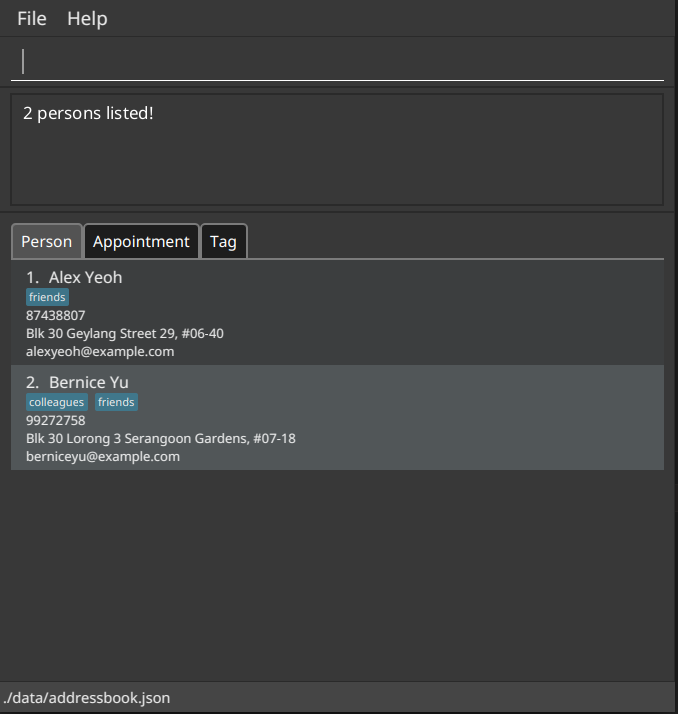

ContaX is a **desktop application for managing your Contacts and Schedule**. It is a powerful tool *optimized for use via a Command Line Interface* (CLI), while incorporating Graphical User Interface (GUI) elements to make it user-friendly. If you are able to type fast, ContaX is capable of helping you manage your contacts and schedule more efficiently than traditional GUI applications, allowing you to shift your focus to other things.

Broadly speaking, ContaX consists of an *Address Book* for managing Contacts, and a *Schedule* for managing Appointments.

* Table of Contents
{:toc}

--------------------------------------------------------------------------------------------------------------------

## Quick start

1. Ensure you have Java `11` or above installed in your Computer.

1. Download the latest `ContaX.jar` from [here](https://github.com/AY2122S2-CS2103-W17-1/tp/releases).

1. Copy the file to the folder you want to use as the _home folder_ for ContaX.

1. Double-click the file to start the app. The GUI similar to the below should appear in a few seconds. Note how the app contains some sample data. 
   

1. Type the command in the command box and press Enter to execute it. e.g. typing **`help`** and pressing Enter will open the help window. 
   Some example commands you can try:

   * **`list`** : Lists all contacts.

   * **`add`**`n/John Doe p/98765432 e/johnd@example.com a/John street, block 123, #01-01` : Adds a contact named `John Doe` to the Address Book.

   * **`delete`**`3` : Deletes the 3rd contact shown in the current list.

   * **`clear`** : Deletes all contacts.

   * **`exit`** : Exits the app.

1. Refer to the [Features](#features) below for details of each command.

--------------------------------------------------------------------------------------------------------------------

## Features

**:information_source: Notes about the command format:** 

* Words in `UPPER_CASE` are the parameters to be supplied by the user. 
  e.g. in `add n/NAME`, `NAME` is a parameter which can be used as `add n/John Doe`.

* Items in square brackets are optional. 
  e.g `n/NAME [t/TAG]` can be used as `n/John Doe t/friend` or as `n/John Doe`.

* Items with `…`​ after them can be used multiple times including zero times. 
  e.g. `[t/TAG]…​` can be used as ` ` (i.e. 0 times), `t/friend`, `t/friend t/family` etc.

* Parameters can be in any order. 
  e.g. if the command specifies `n/NAME p/PHONE_NUMBER`, `p/PHONE_NUMBER n/NAME` is also acceptable.

* If a parameter is expected only once in the command but you specified it multiple times, only the last occurrence of the parameter will be taken. 
  e.g. if you specify `p/12341234 p/56785678`, only `p/56785678` will be taken.

* Extraneous parameters for commands that do not take in parameters (such as `help`, `list`, `exit` and `clear`) will be ignored. 
  e.g. if the command specifies `help 123`, it will be interpreted as `help`.

### Common Date and Time Syntax

**:information_source: This section details the format(s) that date and time inputs are expected to be in.** 

* All date inputs must conform to one of the following formats:
  * `dd-mm-yyyy`
  * `dd/mm/yyyy`
  * `dd MMM yyyy` with the date components appearing in any order

| Field | Description |
| - | - |
| `dd` | Day of the month. |
| `mm` | Numerical representation of the month, from `1` to `12`. |
| `MMM` | Textual representation of the month, such as `oct` or `october`. |
| `yyyy` | Year in the full 4-digit format. |

* All time inputs must conform to one of the following formats:
  * The 24-hour format `hh:mm` or `hh-mm`
  * The 12-hour format `HH:mm aa` or `HH-mm aa`. The whitespace between the numeric fields and `am/pm` field can be omitted.

| Field | Description |
| - | - |
| `hh` | Hour of the day, in 24-hour format. |
| `HH` | Hour of the day, in 12-hour format. |
| `mm` | Minute of the hour, from `00` to `59`. |
| `aa` | Either `am` or `pm`, case-insensitive. |

### Viewing help : `help`

Shows a message explaning how to access the help page.

Format: `help`

### Onboarding guide

#### Prompt on first run

When you run the program for the first time, you will be prompted to take a quick tour of the ContaX's basic functions guided through a series of step-by-step instructions. You will be taken to the onboarding guide window if you select yes. If you choose no, the prompt will just close.

 
When going through the onboarding guide, instructions such as the one shown below will be displayed, and important areas will be highlighted.

#### Basic features covered
The onboarding guide will cover the following:
- Add person
- List person

### Adding a person: `addperson`

Adds a person to the address book.

Format: `addperson n/NAME p/PHONE_NUMBER e/EMAIL a/ADDRESS [t/TAG]…​`

:bulb: **Tip:**
A person can have any number of tags (including 0)

Examples:
* `addperson n/John Doe p/98765432 e/johnd@example.com a/John street, block 123, #01-01`
* `addperson n/Betsy Crowe t/friend e/betsycrowe@example.com a/Newgate Prison p/1234567 t/criminal`

### Listing all persons : `listpersons`

Shows a list of all persons in the address book.

Format: `listpersons`

### Editing a person : `editperson`

Edits an existing person in the address book.

Format: `editperson INDEX [n/NAME] [p/PHONE] [e/EMAIL] [a/ADDRESS] [t/TAG]…​`

* Edits the person at the specified `INDEX`. The index refers to the index number shown in the displayed person list. The index **must be a positive integer** 1, 2, 3, …​
* At least one of the optional fields must be provided.
* Existing values will be updated to the input values.
* When editing tags, the existing tags of the person will be removed i.e adding of tags is not cumulative.
* You can remove all the person’s tags by typing `t/` without
    specifying any tags after it.

Examples:
*  `editperson 1 p/91234567 e/johndoe@example.com` Edits the phone number and email address of the 1st person to be `91234567` and `johndoe@example.com` respectively.
*  `editperson 2 n/Betsy Crower t/` Edits the name of the 2nd person to be `Betsy Crower` and clears all existing tags.

### Locating persons by attribute: `findperson`

Finds persons whose names contain any of the given keywords.

Format: `findperson KEYWORD [MORE_KEYWORDS] [by/SEARCH_TYPE]`

* The search is case-insensitive. e.g `hans` will match `Hans`
* The order of the keywords does not matter. e.g. `Hans Bo` will match `Bo Hans`
* Only the name is searched.
* Only full words will be matched e.g. `Han` will not match `Hans`
* Persons matching at least one keyword will be returned (i.e. `OR` search).
  e.g. `Hans Bo` will return `Hans Gruber`, `Bo Yang`
* `SEARCH_TYPE` must match one of the following:
  * Name
  * Address
  * Phone
  * Email
* If `SEARCH_TYPE` is not specified, default search type is by `Name`.

Examples:
* `findperson John` returns `john` and `John Doe`
* `findperson Garden by/address` lists all persons whose address contain the keyword "Garden"
* `findperson 87438807 by/phone` lists all persons whose phone number matches "87438807"
* `findperson alex david` returns `Alex Yeoh`, `David Li` 
  

### Deleting a person : `deleteperson`

Deletes the specified person from the address book.

Format: `deleteperson INDEX`

* Deletes the person at the specified `INDEX`.
* The index refers to the index number shown in the displayed person list.
* The index **must be a positive integer** 1, 2, 3, …​

Examples:
* `listpersons` followed by `deleteperson 2` deletes the 2nd person in the address book.
* `findperson Betsy` followed by `deleteperson 1` deletes the 1st person in the results of the `findperson` command.

### Clearing all entries : `clear`

Clears all entries from the address book.

Format: `clear`

### Creating a Tag : `addtag`

Creates a new tag in ContaX.

Format: `addtag n/TAGNAME`

* The `TAGNAME` parameter **must** be specified, and can only contain alphanumeric characters and whitespaces.
* If the `TAGNAME` already exists (case-insensitive), the tag will not be created.
* All tag names will be converted to lowercase characters.

Examples:
* `addtag n/Potential Clients` Creates a tag named *potential clients* in the address book (if it does not exist).

### Editing a Tag : `edittag`

Edits an existing tag in ContaX.

Format: `edittag INDEX t/NEW_TAGNAME`

* All parameters **must** be specified.
* The `INDEX` parameter **must be a positive integer**, and refers to the index number shown in the **displayed tag list**.
* Changes the name of a tag at `INDEX` to `NEW_TAGNAME`.
* An error will be thrown if either `INDEX` is invalid or `NEW_TAGNAME` already exists in ContaX.
* An error will be thrown if the tag at `INDEX` has the same name as `NEW_TAGNAME`

Examples:
* `edittag 1 t/Prospective Clients` Changes the name of first tag in the list to *Prospective Clients*.

### Listing All Tags : `listtags`

Shows a list of all tags in ContaX.

Format: `listtags`

**Example output**

### Deleting a Tag : `deletetag`

Deletes the specified tag in ContaX.

Format: `deletetag INDEX`

* The `INDEX` parameter **must be a positive integer**, and refers to the index number shown in the **displayed tag list**.
* When the tag is deleted, contacts that contain this tag will have the tag removed.

Examples:
* `deletetag 1` Deletes the first tag in the tag list and disassociates any contacts that contain the specified tag.

### Finding Contacts by Tag : `findbytag`

Finds persons whose tags match the given keyword.

Format: `findbytag t/TAGNAME`

* The `TAGNAME` parameter **must** be specified.
* Search is case-insensitive e.g. `clients` is the same as `Clients`.
* If there are no tags that contain that keyword, an empty list will be displayed.

Examples:
* `findbytag t/friends` Displays the contact information of contacts who have the *friends* tag.

### Creating an Appointment : `addappointment`

Creates an appointment in the schedule.

Format: `addappointment n/NAME d/DATE t/TIME l/DURATION [p/PERSON]`

* Creates a new appointment with the specified parameters.
* All parameters except `PERSON` **must** be specified.
* The `NAME` parameter must be **non-empty**, and can only contain alphanumeric characters and the symbols `.,!@#$%&*()-_=+`.
* The `DATE` parameter denotes the starting date, and **must conform to the [Common Date Formats](#common-date-and-time-syntax)**.
* The `TIME` parameter denotes the starting time, and **must conform to the [Common Time Formats](#common-date-and-time-syntax)**.
* The `DURATION` parameter is the duration of the appointment in *minutes*, and **must be a positive number**.
* The `PERSON` parameter, if specified, **must be a positive integer**, and refers to the index number shown in the displayed person list.

:rotating_light: **Important Note:**
The operation will fail if the appointment **overlaps** with another appointment.

Examples:
* `addappointment n/Bi-Weekly Meeting d/14-02-2022 t/11:00 l/60` Creates a *one-hour* appointment named *"Bi-Weekly Meeting"* on *14th Feb 2022* at *11:00 AM*, associated with nobody in the contact list.
* `addappointment n/Contract Signing With Charlie d/22-10-2022 t/16:30 p/1 l/300` Creates a *5-hour* appointment named *"Contract Signing With Charlie"* on *22nd Oct 2022* at *4:30 PM*, associated with the *first* person in the contact list.

### Listing All Appointments : `listappointments`

Shows a list of all appointments in the schedule.

Format: `listappointments`

**Example output**

### Deleting an Appointment : `deleteappointment`

Deletes an appointment previously created in the schedule.

Format: `deleteappointment INDEX`

* Deletes the appointment that is at `INDEX` in the appointment list.
* The `INDEX` parameter **must be a positive integer**, and refers to the index number shown in the **displayed appointment list**.

Examples:
* `deleteappointment 2` Deletes the *second* appointment in the list of appointments.

### Editing an Appointment : `editappointment`

Edits an appointment previously created in the schedule.

Format: `editappointment INDEX [n/NAME] [d/DATE] [t/TIME] [p/PERSON] [l/DURATION]`

* Edits the appointment that is at `INDEX` in the appointment list, setting the supplied parameter(s) to the supplied value(s).
* The `INDEX` parameter **must be a positive integer**, and refers to the index number shown in the **displayed appointment list**.
* At least one of the optional parameters must be supplied, otherwise the command will be ignored.
* If supplied, the optional parameters must conform to the following rules:
    * The `NAME` parameter must be non-empty, and can only contain alphanumeric characters and the symbols `.,!@#$%&*()-_=+`..
    * The `DATE` parameter denotes the starting date, and **must conform to the [Common Date Formats](#common-date-and-time-syntax)**.
    * The `TIME` parameter denotes the starting time, and **must conform to the [Common Time Formats](#common-date-and-time-syntax)**.
    * The `PERSON` parameter must be a positive integer or the String `none`. If a positive integer is provided, it refers to the index number shown in the displayed person list. The string `none` is used to dissociate the person associated to the appointment.
    * The `DURATION` parameter is the duration of the appointment in *minutes*, and **must be a positive number**.

:rotating_light: **Important Note:**
The operation will fail if the modified appointment **overlaps** with another appointment.

Examples:
* `editappointment 6 l/300 p/none` Edits the *6th* appointment in the list of appointments to have a duration of *5 hours*, and removes the person associated with the appointment. No other properties are changed.
* `editappointment 2 n/Call Juliet t/13:45 p/1` Edits the *second* appointment in the list of appointments to have the name *"Call Juliet"*, changes the time to *1:45 PM* and associates the appointment to the first person in the displayed persons list. No other properties are changed.

### Listing Appointments Within A Period : `appointmentsbetween`

Lists all appointments from a starting time to an ending time inclusive of both ends of the range.
It will list all appointments that contain any sub-range of the provided period.

Format: `appointmentsbetween [sd/STARTDATE] [st/STARTTIME] [ed/ENDDATE [et/ENDTIME]]`

* The starting time **must be before** the ending time.
* The `STARTDATE` parameter denotes the *starting date* of the period.
* The `STARTTIME` parameter denotes the *starting time* on the starting date for the period.
* The `ENDDATE` parameter denotes the *ending date* of the period.
* The `ENDTIME` parameter denotes the *ending time* on the ending date for the period.
* Both `STARTDATE` and `ENDDATE` **must conform to the [Common Date Formats](#common-date-and-time-syntax)**.
* Both `STARTTIME` and `ENDTIME` **must conform to the [Common Time Formats](#common-date-and-time-syntax)**.
* If `STARTTIME` is unspecified, it defaults to `00:00`.
* If `STARTDATE` is unspecified, it defaults to today.
* If `ENDDATE` is unspecified, there will be no upper limit to the appointments listed.
* If `ENDTIME` is unspecified, it defaults to `23:59`.
* If `ENDTIME` is specified, then `ENDDATE` must be specified.

Example:
* `appointmentsbetween sd/21-10-2022 st/12:00 ed/23-10-2022 et/17:00` Lists all appointments from *21 October 2022, 12 PM* to *23 October 2022, 5PM*.

**Example Output:**

### Listing Empty Slots in Schedule Within A Period : `freebetween`

Lists all empty slots in the schedule of a certain minimum duration, within the specified starting time to ending time.
An appointment of the specified minimum duration can be inserted into each of the listed slots without causing any overlapping appointments in the schedule.

Format: `freebetween l/DURATION [sd/STARTDATE] [st/STARTTIME] [ed/ENDDATE [et/ENDTIME]]`

* The starting time **must be before** the ending time.
* The `STARTDATE` parameter denotes the *starting date* of the period.
* The `STARTTIME` parameter denotes the *starting time* on the starting date for the period.
* The `ENDDATE` parameter denotes the *ending date* of the period.
* The `ENDTIME` parameter denotes the *ending time* on the ending date for the period.
* Both `STARTDATE` and `ENDDATE` **must conform to the [Common Date Formats](#common-date-and-time-syntax)**.
* Both `STARTTIME` and `ENDTIME` **must conform to the [Common Time Formats](#common-date-and-time-syntax)**.
* If `STARTTIME` is unspecified, it defaults to `00:00`.
* If `STARTDATE` is unspecified, it defaults to today.
* If `ENDDATE` is unspecified, there will be no upper limit to the appointments listed.
* If `ENDTIME` is unspecified, it defaults to `23:59`.
* If `ENDTIME` is specified, then `ENDDATE` must be specified.
* The `DURATION` parameter is the minimum duration of the slots listed in *minutes*, and **must be a positive number**.

Example:
* `freebetween sd/21-10-2022 st/12:00 ed/23-10-2022 et/17:00 l/60` Lists all empty slots in the schedule that are at least *60 minutes (1 hour)* long between *21 October 2022, 12 PM* and *23 October 2022, 5PM*.

**Example Output:**

### Exiting the program : `exit`

Exits the program.

Format: `exit`

### Saving the data

ContaX contact data are saved in the hard disk automatically after any command that changes contact data in JSON format at `[JAR file location]/data/addressbook.json`.
Appointment data are saved in the hard disk automatically after any command that changes appointment data in JSON format at `[JAR file location]/data/schedule.json`.

### Exporting the data: `exportcsv`

Exports the current list of contacts as a CSV file that can be imported through ContaX or viewed separately via Microsoft Excel

Format: `exportcsv`
* Exports CSV as per ContaX format. This file can be imported by other instances of ContaX
* File will be saved on the directory `[JAR file location]/data/addressbook.csv`

Examples:
* `exportcsv`: Exports the current address book as a CSV file at `[JAR file location]/data/addressbook.csv`
### Editing the data file

ContaX contacts and appointments data are saved in the hard disk automatically after any command that changes contact data in JSON format at `[JAR file location]/data/addressbook.json` and `[JAR file location]/data/schedule.json`. Advanced users are welcome to update data directly by editing that data file.

:exclamation: **Caution:**
If your changes to the data file makes its format invalid, ContaX will discard all data and start with an empty data file at the next run.

### Importing data

In order to import data from external sources into ContaX, there are the following options:

* Replacing `addressbook.json` or `schedule.json` file with a valid ContaX formatted generated by another system with ContaX
* [Simple CSV import (GUI-based option)](#simple-csv-import)
* [Advanced CSV import (Command based)](#advanced-csv-import--importcsv)

### Importing CSV Files: `importcsv`

Format: `importcsv f/FILEPATH [n/COLUMNNUM] [p/COLUMN_PERSON] [e/COLUMN_EMAIL] [a/COLUMN_ADDRESS] [t/COLUMN_TAGS]`

* Imported contacts will be appended to the current address book.
* Each argument represents the corresponding attribute for a person.
  * n = Name
  * p = Phone
  * e = Email
  * a = Address
  * t = Tagged
* If any argument is omitted, it will follow the next available column based on the default sequence of
  Name - Phone - Email - Address - Tagged
* This user guide will be updated later on with templates for importing for the following contact csv formats:
  * Google Contacts
  * Outlook Contacts

Examples:
* `importcsv f/file.csv n/2 p/3 e/5 a/6 t/4`
  * Reads from a CSV file treating the 2nd column as names, 3rd column as phone numbers, 5th column as email addresses, 4th column as tags.
* `importcsv f/file.csv n/2`
  * Reads from CSV treating the 2nd column as names, 3rd column as phone numbers, 4th column as email addresses, 5th column as tags.
* `importcsv f/file.csv`
  * Reads from CSV with default ContaX format positions

### Archiving data files `[coming in v2.0]`

_Details coming soon ..._

### Operate on Contacts by Conditional Clause : `batch`

Performs operations on contacts in the address book that match the given condition.

Format: `batch COMMAND where/CONDITION`

* The allowed operations in `COMMAND` are
  * list
  * edit
  * delete
* The `CONDITION` field must conform to the following syntax: `TERM OP TERM`
  * Valid operators for the `OP` field are `>`, `<`, `=`, `!=`, `LIKE`
  * A `TERM` may be an attribute of a person or a constant value

Examples:
* `batch delete where/name LIKE A%`
  * Deletes all persons whose name start with A (case-sensitive)
* `batch edit p/87438806 where/phone = 87438807 `
  * Edit contact with phone matches keyword 87438807 change to 87438806

### Operate on Contacts within Range : `range`

Perform actions on a group of contacts.

Format: `range COMMAND from/INDEX_FROM to/INDEX_TO`

* Performs the specified `COMMAND` on all contacts between the specified range of `INDEX_FROM` to `INDEX_TO` inclusive
* `COMMAND` must be a valid command. The allowed operations in `COMMAND` are
  * list
  * edit
  * delete
* The `INDEX_FROM` and `INDEX_TO` parameters must be **positive integers**, and refer to the index number shown in the **displayed contact list**
* `INDEX_FROM` must be less than `INDEX_TO` must be supplied, otherwise the command will perform no operation
* The resultant effect of the command is dependent on the performed action

Examples:
* `range edit e/johndoe@example.com from/6 to/10`
  * Sets the email address of the 6th to 10th contacts in the address book to `johndoe@example.com`
* `range delete from/2 to/3`
  * Deletes the 2nd and 3rd contacts in the address book

### Chaining Commands: `&&`

Perform multiple actions in a single command.

Format: `COMMAND_A && COMMAND_B`

* Calls multiple specified commands
* The syntax of `COMMAND_A` and `COMMAND_B` must be correct
* A valid command must be supplied before and after the `&&` operator, otherwise the command will fail

Examples:
* `editappointment 6 l/360 && listappointments`
    * Edits the 6th appointment in the list of appointments to have a duration of 6 hours. Then list all appointments in the Schedule
* `deleteappointment 2 && addappointment n/Contract Signing With Charlie d/22-10-2022 t/16:30 p/1 l/300`
    * Deletes the 2nd appointment in the list of appointments.
    * Then, create a 5-hour appointment named "Contract Signing With Charlie" on 22nd Oct 2022 at 4:30 PM, associated with the first person in the contact list

--------------------------------------------------------------------------------------------------------------------

## FAQ

**Q**: How do I transfer my data to another Computer? 
**A**: Install the app in the other computer and overwrite the empty data file it creates with the file that contains the data of your previous AddressBook home folder.

--------------------------------------------------------------------------------------------------------------------

## Command summary

Action | Format, Examples
--------|------------------
**Add Person** | `addperson n/NAME p/PHONE_NUMBER e/EMAIL a/ADDRESS [t/TAG]…​`   e.g., `addperson n/James Ho p/22224444 e/jamesho@example.com a/123, Clementi Rd, 1234665 t/friend t/colleague`
**Clear** | `clear`
**Delete Person** | `deleteperson INDEX`  e.g., `delete 3`
**Edit Person** | `editperson INDEX [n/NAME] [p/PHONE_NUMBER] [e/EMAIL] [a/ADDRESS] [t/TAG]…​`  e.g.,`editperson 2 n/James Lee e/jameslee@example.com`
**Find Person** | `findperson KEYWORD [MORE_KEYWORDS] [by/SEARCH_TYPE]`  e.g., `findperson James Jake by/name`
**List Persons** | `listpersons`
**Add Tag** | `addtag n/TAGNAME`   e.g., `addtag n/Potential Clients`
**Edit Tag** | `edittag INDEX t/NEW_TAGNAME`   e.g., `edittag 1 t/Prospective Clients`
**List Tags** | `listtags`
**Delete Tag** | `deletetag INDEX`   e.g., `deletetag 1`
**Find Contacts By Tag** | `findbytag t/TAGNAME`   e.g., `findbytag t/friends`
**Add Appointment** | `addappointment n/NAME d/DATE t/TIME l/DURATION p/PERSON`  e.g., `addappointment n/Call Bob d/14-02-2022 t/11:00 p/2 l/60`
**List Appointments** | `listappointments`
**Delete Appointment** | `deleteappointment INDEX`  e.g., `deleteappointment 2`
**Edit Appointment** | `editappointment INDEX [n/NAME] [d/DATE] [t/TIME] [p/PERSON] [l/DURATION]`  e.g., `editappointment 2 n/Call Juliet t/13:45`
**List Appointments Within Period** | `appointmentsbetween [sd/STARTDATE] [st/STARTTIME] [ed/ENDDATE [et/ENDTIME]]`   e.g. `appointmentsbetween sd/21-10-2022 st/12:00 ed/23-10-2022 et/17:00`
**List Available Slots Within Period*** | `freebetween l/DURATION [sd/STARTDATE] [st/STARTTIME] [ed/ENDDATE [et/ENDTIME]]`   e.g. `freebetween sd/21-10-2022 st/12:00 ed/23-10-2022 et/17:00 l/60`
**Help** | `help`
**Export CSV** | `exportcsv`
**Import CSV** | `importcsv f/FILEPATH [n/COLUMNNUM] [p/COLUMN_PERSON] [e/COLUMN_EMAIL] [a/COLUMN_ADDRESS] [t/COLUMN_TAGS]`   e.g., `importCSV n/2 p/3 e/5 a/6 t/4`
**Operate on Contacts by Conditional Clause** | `batch COMMAND where/CONDITION`   e.g., `batch Edit p/87438806 where/ p/Phone = 87438807`
**Operate on Contacts within Range** | `range COMMAND from/INDEX to/INDEX`   e.g., `range editperson e/johndoe@example.com from/6 to/10`
**Chaining Commands** | `chain COMMAND_A && COMMAND_B`   e.g., `chain editappointment 6 l/360 && listappointments`
