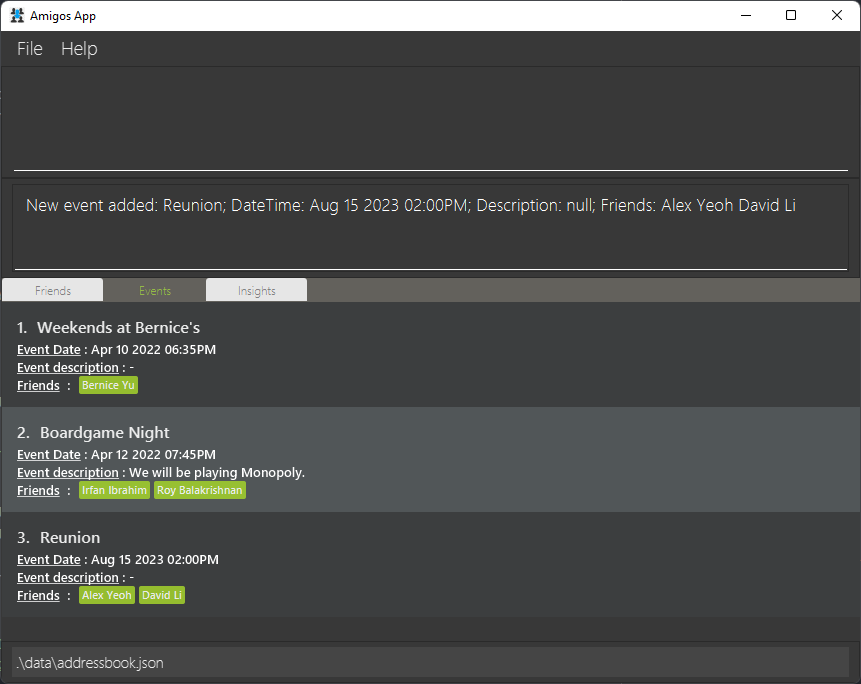

Amigos is a desktop application to help tech-savvy university students manage their friendships by helping them to keep track of important details. It is optimized for use via a Command Line interface while still having the benefits of a Graphical User Interface (GUI).
* Table of Contents
{:toc}

--------------------------------------------------------------------------------------------------------------------

# Quick start

1. Ensure you have Java `11` or above installed in your Computer.

2. Download the latest `amigos.jar` from [here](https://github.com/AY2122S2-CS2103-F09-2/tp/releases/tag/v1.1).

3. Copy the file to the folder you want to use as the _home folder_ for your application.

4. Double-click the file to start the app. The GUI similar to the below should appear in a few seconds. Note how the app contains some sample data. 
   

5. Type the command in the command box and press Enter to execute it. e.g:

   * **`showfriends`** : Lists all friends.
   
6. Refer to the [Features](#features) below for details of each command.

--------------------------------------------------------------------------------------------------------------------

# Features

**:information_source: Notes about the command format:** 

* Words in `UPPER_CASE` are the parameters to be supplied by the user. 
  e.g. in `addfriend n/NAME`, `NAME` is a parameter which can be used as `addfriend n/John Doe`.

* Items in square brackets are optional. 
  e.g `n/NAME [t/TAG]` can be used as `n/John Doe t/friend` or as `n/John Doe`.

* Items with `…`​ after them can be used multiple times including zero times. 
  e.g. `[t/TAG]…​` can be used as ` ` (i.e. 0 times), `t/friend`, `t/friend t/family` etc.

* Parameters can be in any order. 
  e.g. if the command specifies `n/NAME p/PHONE_NUMBER`, `p/PHONE_NUMBER n/NAME` is also acceptable.

* If a parameter is expected only once in the command but you specified it multiple times, only the last occurrence of the parameter will be taken. 
  e.g. if you specify `p/12341234 p/56785678`, only `p/56785678` will be taken.

* Extraneous parameters for commands that do not take in parameters (such as `showfriends`, `showevents` and `exit`) will be ignored. 
  e.g. if the command specifies `showfriends 123`, it will be interpreted as `showfriends`.

## Friend Management
Amigos is designed to help you keep track of the friends in your life.

### Adding a friend: `addfriend`

Adds a new friend to Amigos. A friend has:
* ***(compulsory)*** name
* *(optional)* phone number
* *(optional)* email
* *(optional)* address
* *(optional)* description

Format: `addfriend n/[NAME]  p/[PHONE_NUMBER] e/[EMAIL]  a/[ADDRESS] d/[DESCRIPTION]`

* Note that `NAME` field is minimally compulsory. `p/`, `em/`, `a/` and `d/` flags and their arguments are optional.
* Note that there can be no duplicate friends having the same name.

Examples:
* `addfriend n/John Doe p/98765432 e/johnd@example.com a/John street, block 123, #01-01 d/Physics Major, Sarah’s friend. Met at Freshman Dinner.`
* `addfriend n/John Doe`

### Editing a friend : `editfriend`

Edits an existing friend in Amigos.

Format: `editfriend cn/[CURRENT_NAME] nn/[NEW_NAME]  np/[NEW_PHONE_NUMBER] ne/[NEW_EMAIL] na/[NEW_ADDRESS] nd/[NEW_DESCRIPTION]`

* Edits an existing friend in Amigos. Field `CURRENT_NAME` is compulsory to identify the existing friend.
* At least one of the optional fields must be provided.
* Existing values will be overwritten to the input values.

Examples:
* `editfriend cn/John Doe na/John street, block 456, #01-01 ne/johndoe@example.com` edits the address
  and email of John Doe to be `John street, block 456, #01-01` and `johndoe@example.com` respectively.

### Deleting a friend : `deletefriend`

Deletes a friend in Amigos.

Format: `deletefriend n/[NAME]`

* `NAME` field must be provided unless all friends are being deleted then just the -a flag is needed.

Examples:
* `deletefriend n/John Doe`
* `deletefriend -a`

### Show a specific friend: `showfriend`

Shows page containing the full details related to an existing friend in Amigos. By default, only the latest 10 logs are displayed in this page.

Format: `showfriend n/NAME -alllogs`

* NAME field **must** be provided.
* If the `-alllogs` flag is provided all the logs contained in that person will be displayed instead of the default 10 logs.

Examples:
* `showfriend n/John Doe` Will open up the page containing full details related to John Doe - his name, address, phone number, email, description, logs, and upcoming events with him.
* `showfriend n/John Doe -alllogs` Will do the same as above except every single log will be displayed

### Show all friends : `showfriends`

Shows all friends in Amigos. Switches GUI to the friends tab.

Format: `showfriends`

## Logs management
Amigos provides functionality to manage logs, which are essentially detailed notes about a specific friend.

### Adding a log: `addlog`

Adds a log to an existing friend at the specified `INDEX` in Amigos.
The `INDEX` refers to the index number shown in the displayed person's list.
Format: `addlog INDEX t/[TITLE] d/[DESCRIPTION]`

* The `INDEX` field is compulsory.
* If the `TITLE` argument is provided, then the `DESCRIPTON` argument is optional.
* If neither `TITLE` nor `DESCRIPTION` arguments are provided, then a GUI
  pop up will prompt the user to key in the title and longer-form text as the description.

Examples:
* `addlog 1 t/has a pet named poki`
* `addlog 2 t/recommended movies d/the martian, interstellar, three idiots`

### Editing a log: `editlog`

Edits an existing log of an existing friend in Amigos.

Format: `editlog n/[NAME] id/[LOG_INDEX] nt/[NEW_TITLE] nd/[NEW_DESCRIPTION]`

* The `NAME` field is compulsory.
* If `LOG_INDEX` is not provided, then all logs, each with an accompanying index, will allow a user to
  choose which log to apply the changes to.
* At least one of the `NEW_TITLE` or `NEW_DESCRIPTION` arguments must be provided.
  Both will directly overwrite the current values.
* If neither `NEW_TITLE` nor `NEW_DESCRIPTION` arguments are provided, then a GUI
  pop up will prompt the user to key in the title and longer-form text as the description.

Examples:
* `editlog n/John Doe id/1 nt/has a pet named Poki`
* `editlog n/Andrew Tan id/1 nt/recommended movies and shows nd/the martian, interstellar, three idiots, peaky blinders`

### Deleting a log: `deletelog`

Deletes an existing log of an existing friend in Amigos.

Format: `deletelog n/[NAME] id/[LOG_INDEX] -a`

* The `NAME` field is compulsory.
* If `NAME` is provided as well as a `-a` flag, then all logs of tht person will
  be deleted.
* If `LOG_INDEX` is not provided and there is no `-a` flat, then all logs, each with an
  accompanying index, will allow a user to choose one log to delete.
* If no `NAME` or `LOG_INDEX` is provided, but `-a` is provided, then all possible logs
  of all friends will be deleted.

## Event Management [Coming Soon!]
Amigos also allows you to keep track of your social events!

### Creating an event: `addevent`
Adds a new event, which can be optionally linked to existing friends.

**Format**: `addevent n/[EVENT_NAME] dt/[DATE_TIME] dd/[DESCRIPTION] f/[FRIEND_NAME1, FRIEND_NAME2…]`

* The `EVENT_NAME` and `DATE_TIME` fields are **compulsory**, while the remaining fields are **optional**.
* There **cannot** be any duplicate events with the same name and date.

**Examples**:
* `addevent n/John’s Birthday dt/15-08-2021 1700 dd/Remember to get a present! f/John, Abe, Bob`
* `addevent n/Christmas Party dt/25-12-2022`

### Editing an event: `editevent`
Edits an existing event.

**Format**: `editevent n/[EVENT_NAME] dt/[DATE] nn/[NEW_EVENT_NAME] ndt/[NEW_DATE_TIME] ndd/[NEW_DESCRIPTION]  af/[ADD_FRIEND_NAME1, ADD_FRIEND_NAME2…] rf/[REMOVE_FRIEND_NAME1, REMOVE_FRIEND_NAME2…]`

* The `EVENT_NAME` and `DATE` fields are **compulsory** and uniquely identify the event to be edited.
* The `NEW_EVENT_NAME`, `NEW_DATE_TIME` and `NEW_DESCRIPTION` arguments are **optional**. If provided, they directly overwrite the existing details.
* The `ADD_FRIEND_NAME` and `REMOVE_FRIEND_NAME` arguments are also **optional** and add/remove friends tied to the event respectively.

**Examples**:
* `editevent n/John’s Birthday dt/15-08-2021 ndt/16-08-2021 1600 af/Bob rf/Sarah, Edison`

### Deleting events: `deleteevent`
Delete existing event(s).

**Format**: `deleteevent n/[EVENT_NAME] dt/[DATE] -a`

* When at least one of `EVENT_NAME` and `DATE` are provided:
  * If only a single event matches the argument(s), it will be deleted.
  * If multiple events match the argument(s), the `-a` flag is required for all to be deleted.
* If only the `-a` flag is given, all events will be cleared.

**Examples**:
* `deleteevent n/John’s Birthday dt/15-08-2021`
* `deleteevent n/Weekly Boardgames -a`
* `deleteevent -a`

### Show all events : `showevents`

Shows all events stored in Amigos. Switches GUI to the events tab.

Format: `showevents`

Examples:
* `deletelog n/John Doe id/1`
* `deletelog n/John Doe -a `
* `deletelog -a`

## Miscellaneous
### Viewing help : `help`

Shows a message explaning how to access the help page.

Format: `help`

### Exiting the program : `exit`

Exits the program.

Format: `exit`

### Saving the data

Amigos data is saved in the hard disk automatically after any command that changes the data. There is no need to save manually.

### Editing the data file

Amigos data is saved as a JSON file `[JAR file location]/data/amigos.json`. Advanced users are welcome to update data directly by editing that data file.

:exclamation: **Caution:**
If your changes to the data file makes its format invalid, Amigos will discard all data and start with an empty data file at the next run.

--------------------------------------------------------------------------------------------------------------------

## FAQ

**Q**: How do I transfer my data to another Computer? 
**A**: Install the app in the other computer and overwrite the empty data file it creates with the file that contains the data of your previous Amigos home folder.

--------------------------------------------------------------------------------------------------------------------

## Command summary

| Action                     | Format, Examples                                                                                                                                                                                                                                                                               |
|----------------------------|------------------------------------------------------------------------------------------------------------------------------------------------------------------------------------------------------------------------------------------------------------------------------------------------|
| **Add Friend**             | `addfriend n/[NAME] p/[PHONE_NUMBER] e/[EMAIL]  a/[ADDRESS] d/[DESCRIPTION]`   e.g., `addfriend n/John Doe p/98765432 e/johnd@example.com a/John street, block 123, #01-01 d/Physics Major, Sarah’s friend. Met at Freshman Dinner`                                                         |
| **Edit friend**            | `editfriend cn[CURRENT_NAME] nn/[NEW_NAME]  np/[NEW_PHONE_NUMBER] ne/[NEW_EMAIL] na/[NEW_ADDRESS] nd/[NEW_DESCRIPTION]`  e.g., `editfriend cn/John Doe na/John street, block 456, #01-01 ne/johndoe@example.com`                                                                            |
| **Delete Friend**          | `deletefriend n/[NAME]`   `deletefriend -a`   e.g., `deletefriend n/John Doe`                                                                                                                                                                                                            |
| **Show a specific friend** | `showfriend n/NAME -alllogs`                                                                                                                                                                                                                                                                   |
| **Show all friends**       | `showfriends`                                                                                                                                                                                                                                                                                  |
| **Add log**                | `addlog n/[NAME] t/[TITLE] d/[DESCRIPTION]`                                                                                                                                                                                                                                                    |
| **Edit log**               | `editlog n/[NAME] id/[LOG_INDEX] nt/[NEW_TITLE] nd/[NEW_DESCRIPTION]`                                                                                                                                                                                                                          |
| **Delete log**             | `deletelog n/[NAME] id/[LOG_INDEX] -a`                                                                                                                                                                                                                                                         |
| **Add Event**              | `addevent n/[EVENT_NAME] dt/[DATE_TIME] dd/[DESCRIPTION] f/[FRIEND_NAME1, FRIEND_NAME2…]`   e.g.,`addevent n/John’s Birthday dt/15-08-2021 1700 dd/Remember to get a present! f/John, Abe, Bob`                                                                                             |
| **Edit Event**             | `editevent n/[EVENT_NAME] dt/[DATE] nn/[NEW_EVENT_NAME] ndt/[NEW_DATE_TIME] ndd/[NEW_DESCRIPTION]  af/[ADD_FRIEND_NAME1, ADD_FRIEND_NAME2…] rf/[REMOVE_FRIEND_NAME1, REMOVE_FRIEND_NAME2…]`   e.g., `editevent n/John’s Birthday dt/15-08-2021 ndt/16-08-2021 1600 af/Bob rf/Sarah, Edison` |
| **Delete Event**           | `deleteevent n/[EVENT_NAME] dt/[DATE] -a`   e.g., `deleteevent n/John’s Birthday dt/15-08-2021`   e.g., `deleteevent n/Weekly Boardgames -a`                                                                                                                                             |
| **Show all events**        | `showevents`                                                                                                                                                                                                                                                                                   |
