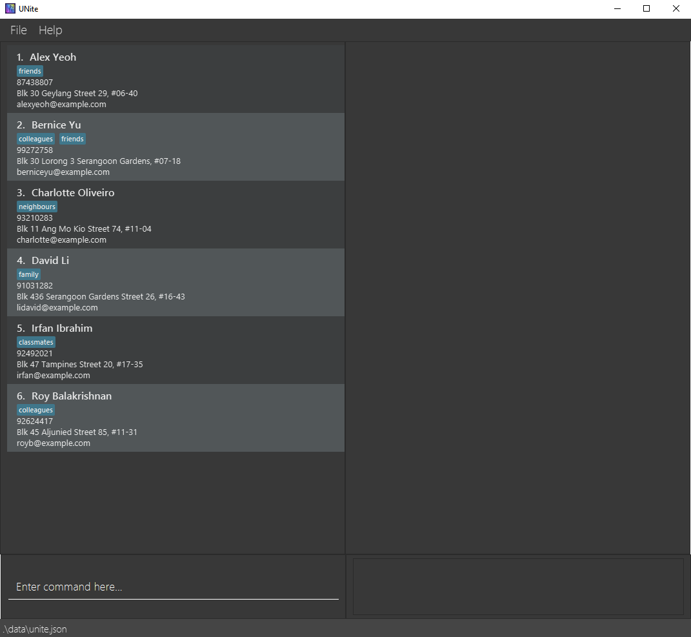
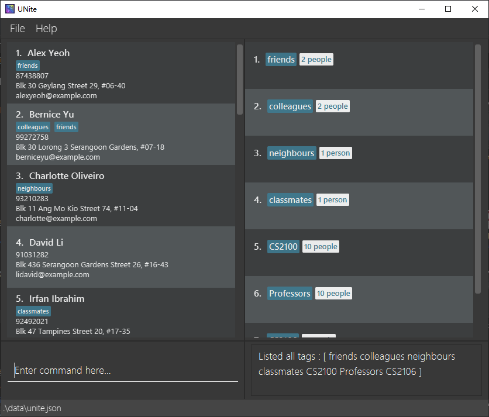
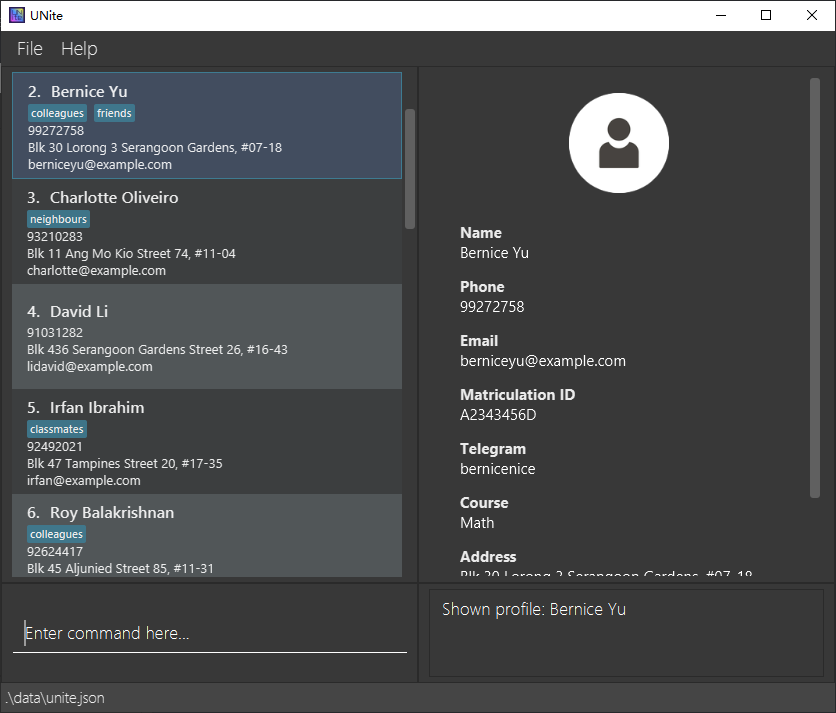
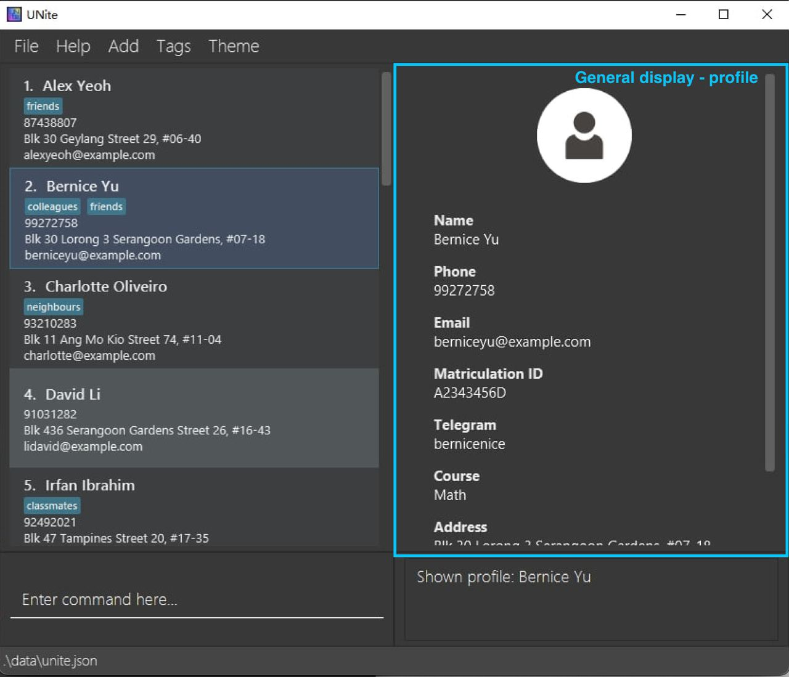
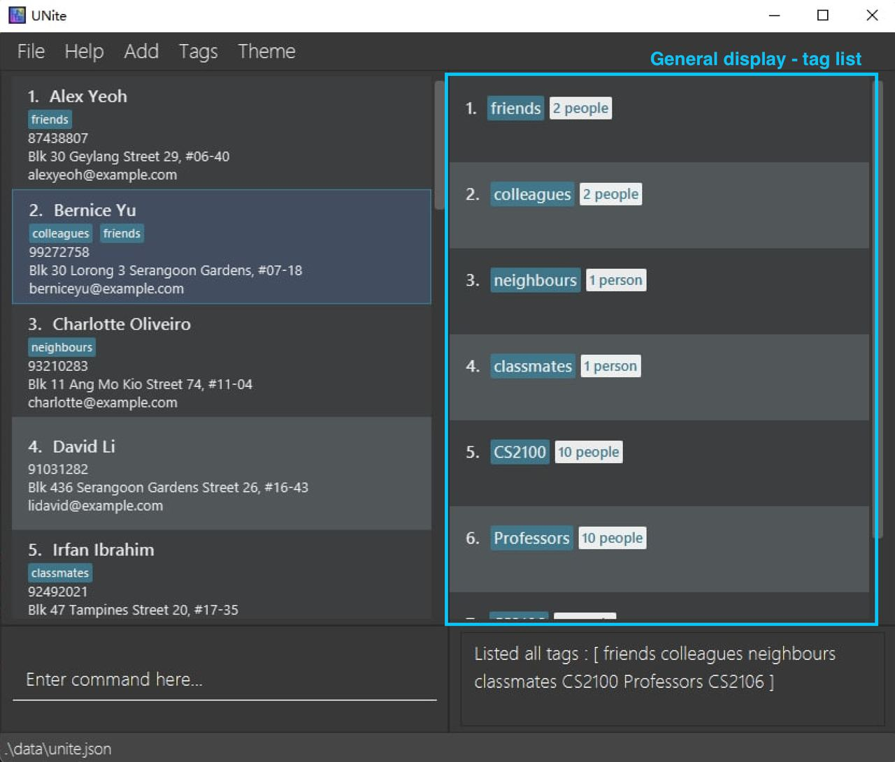
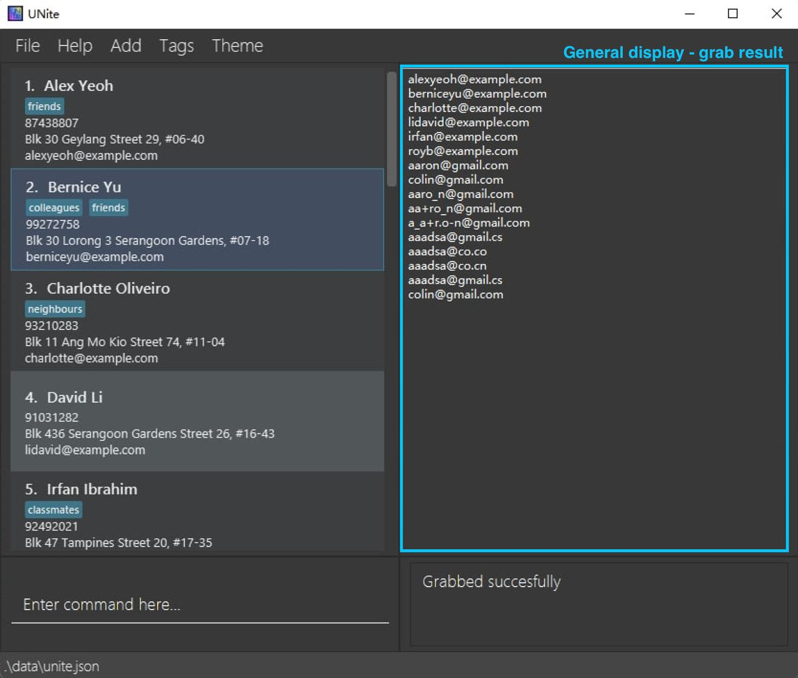
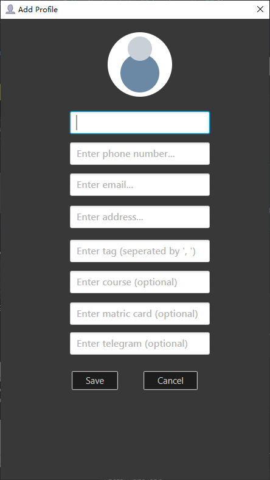
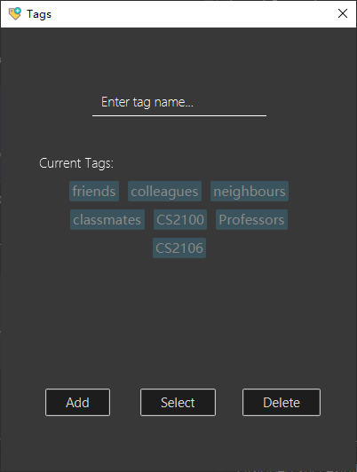
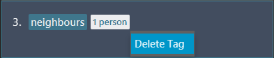
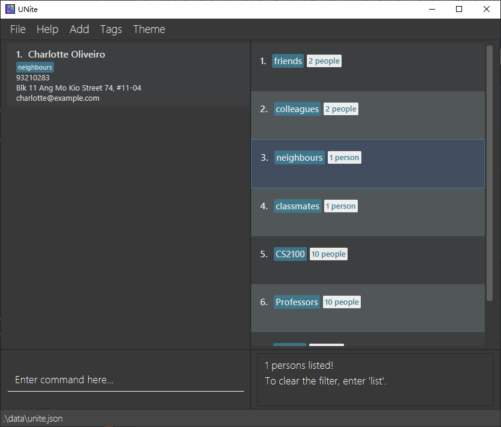

UNite is a **desktop app for managing contacts specifically designed for people in University**. It is optimized for use via a Command Line Interface (CLI) while still having the benefits of a Graphical User Interface (GUI). If you want an easy-to-use app to manage your University contacts, UNIte is the right place to go!

* **Table of Contents**
{:toc}

--------------------------------------------------------------------------------------------------------------------

## Quick start

1. Ensure you have Java `11` or above installed in your Computer.

1. Download the latest `UNite.jar` from [here](https://github.com/AY2122S2-CS2103T-W12-2/tp/releases).

1. Copy the file to the folder you want to use as the _home folder_ for your UNite.

1. Double-click the file to start the app. The GUI similar to the below should appear in a few seconds. Note how the app contains some sample data. 
   

Refer to the [Features (CLI)](#features-cli) below for details of each command.

Some features are able to be operated via mouse interactions, most of these are disabled by default while some are not, refer to [Features (Mouse interaction)](#features-mouse-interaction) below for more details.

## Features (CLI)

Below are the features that can be completed using command line interface (CLI).

**Notes about the command format:** 

* Words in `UPPER_CASE` are the parameters to be supplied by the user. 
  e.g. in `add n/NAME`, `NAME` is a parameter which can be used as `add n/John Doe`.

* Items in square brackets are optional. 
  e.g `n/NAME [t/TAG]` can be used as `n/John Doe t/friend` or as `n/John Doe`.

* Items with `…`​ after them can be used multiple times including zero times. 
  e.g. `[t/TAG]…​` can be used as ` ` (i.e. 0 times), `t/friend`, `t/friend t/family` etc.

* Parameters can be in any order. 
  e.g. if the command specifies `n/NAME p/PHONE_NUMBER`, `p/PHONE_NUMBER n/NAME` is also acceptable.

* If a parameter is expected only once in the command but you specified it multiple times, only the last occurrence of the parameter will be taken. 
  e.g. if you specify `p/12341234 p/56785678`, only `p/56785678` will be taken.

* Extraneous parameters for commands that do not take in parameters (such as `help`, `list`, `exit`, `clear` and `clear_emptytag`) will be ignored. 
  e.g. if the command specifies `help 123`, it will be interpreted as `help`.

### Add a new person: `add`

Add a new person to UNite.

Format: `add n/NAME p/PHONE e/EMAIL a/ADDRESS [c/COURSE] [tele/TELEGRAM] [m/MATRICCARD] [t/TAG]`

* The order of input does not matter.
* `n/NAME p/PHONE e/EMAIL a/ADDRESS` are the 4 required information that must be present.
* Can attach multiple tags to the person at the same time, each tag must follow the format `t/TAG`
* Two `Person` are considered the same `Person` if 
  * They have the same `Name` (case-insensitive).
  * At least one of following fields: `Email`, `Phone`, `Address`, `MatricCard`) is the same (case-insensitive) between these two `Person`.

Examples:
* `add n/Peter p/12345678 e/peter@gmail.com a/1 Computing Drive t/classmates t/friends
c/computer science tele/peterrocks m/A0123456X`  
This command will add a new person whose name is `Peter`, with phone number
`12345678`, email address `peter@gmail.com` and telegram `peterrocks`. Peter's address is `1 Computing Drive`, he is
taking `computer science` as his course, his matriculation card number is `A0123456X`. The user categorize
Peter with tags `classmates` and `friends`.
* `add n/Aaron p/2345678 e/aaron@gmail.com`  
This command will not get executed successfully, because of the missing required field `a/ADDRESS`.

**Notes about Input Validation Rules**

There are certain rules that users should follow for input to be considered valid (applies to all commands). Please refer to the following.

 * **NAME** 
    NAME is case-insensitive and it should only contain alphanumeric characters and spaces (maximum 50 characters including spaces), and it should not be blank.
     * Valid Examples - `Alice Tan`, `Alice3tan`
     * Invalid Examples - `peter*`

 * **EMAIL**   
    Emails should be of the format `local-part@domain` and adhere to the following constraints:
     1. The local-part should only contain alphanumeric characters and these special characters, excluding the parentheses, (+_.-). The local-part may not start or end with any special characters, and two or more special characters cannot appear consecutively.
     2. This is followed by a '@' and then a domain name. The domain name is made up of domain labels separated by compulsory periods. The domain name must:
         * end with a domain label at least 2 characters long
         * have each domain label start and end with alphanumeric characters
         * have each domain label consist of alphanumeric characters, separated only by hyphens, if any
    * Valid Examples - `aliceTan@gmail.com`, `123@co.cn` 
    * Invalid Examples - `peterjack@@example.com`, `peterjack@-`, `peterjack@gmail`

 * **PHONE** 
    Phone numbers should only contain numbers, and it should be at least 3 digits long
     * Valid Examples - `12341234`, `123`
     * Invalid Examples - `@123123`, `dasd123 123`

 * **ADDRESS** 
    Addresses can take any values (including non-english characters), and it should not be blank
     * Valid Examples - `Blk 456, Den Road, #01-355`, `-`
     * Invalid Examples - ``

 * **TELEGRAM**  
     Telegram ID should only contain alphanumeric characters and underscore. It should be one word and must not start with an underscore.
      * Valid Examples - `alice_test_1234`, `alice123`
      * Invalid Examples - `_alice`, `@alice`

 * **COURSE** 
     Course should only contain alphabet characters and spaces.
      * Valid Examples - `Computer Science and Mathematics`, `Math`
      * Invalid Examples - `123`, `Computer_Science`

 * **MATRIC CARD** 
     Matric Card should only contain alphanumeric characters, and it should be one word
      * Valid Examples - `A1231234E`
      * Invalid Examples - `alice test`, `@A1231234E`

 * **TAG** 
     Tag should only contain alphanumeric characters, and it should be one word
      * Valid Examples - `CS2100`
      * Invalid Examples - `CS_2100`, `C S 2 1 0 0`

### Edit a person : `edit`

Edit a person in the UNite.

Format: `edit INDEX [n/NAME] [p/PHONE] [e/EMAIL] [a/ADDRESS] [t/TAG]…​ [c/COURSE] [m/MATRICCARD] [tele/TELEGRAM]`

* Edit the person at the specified `INDEX`. The index refers to the index number shown in the displayed person list. The index **must be a positive integer** 1, 2, 3, …​
* At least one of the optional fields must be provided.
* Existing values will be updated to the input values.
* When editing tags, the existing tags of the person will be removed i.e adding of tags is not cumulative.
* When editing tags, duplicate tags are considering as one tag.
* You can remove all the person’s tags by typing `t/` without
  specifying any tags after it.

Examples:
* `edit 1 p/91234567 e/johndoe@example.com`   Edits the phone number and email address of the 1st person to be `91234567` and `johndoe@example.com` respectively.
* `edit 2 n/Betsy Crower t/`   Edits the name of the 2nd person to be `Betsy Crower` and clears all existing tags.
* `edit 2 n/Betsy Crower t/tag1 t/tag1 t/tag1`   Edits the name of the 2nd person to be `Betsy Crower` and creates only one tag `tag1`.

### Add a new tag : `add_tag`

Add a new tag to UNite.

Format: `add_tag t/TAG_NAME`

Examples:
* `add_tag t/Students`  Adds a new tag called "Students" if it does not yet exist.
* `add_tag t/Professors`  Adds a new tag called "Professors" if it does not yet exist.

### Delete a tag : `delete_tag`

Delete an existing tag from UNite.

Format: `delete_tag INDEX`

* Deletes the tag at the specified `INDEX`. 
* The index refers to the index number shown in the displayed tag list.
* The index **must be a positive integer** 1, 2, 3, …​

Examples:
* `delete_tag 1`  Deletes the tag at index number 1 if there is any.
* `delete_tag 10`  Deletes the tag at index number 10 if there is any.

### List all tags : `list_tag`

List out all tags current exist in UNite.

    

Format: `list_tag`

### Attach tag to a profile: `attach`

Add an existing tag to a profile.

Format: `attach t/TAG_NAME i/PROFILE_INDEX`

* Attach the tag of `TAG_NAME` to the person at the specified `PROFILE_INDEX`.
* The index refers to the index number shown in the displayed person list.
* The index **must be a positive integer** 1, 2, 3, …​

Examples:
* `attach t/Students i/1`  Attaches the tag "Students" to the person at index 1, if both the tag and the person exist.
* `attach t/Professors i/10`  Attaches the tag "Professors" to the person at index 10, if both the tag and the person exist.

### Detach a tag from a profile : `detach`

Remove the tag from a profile’s tags.

Format: `detach t/TAG_NAME i/PROFILE_INDEX`

* Remove the tag of `TAG_NAME` from the person at the specified `PROFILE_INDEX`.
* The index refers to the index number shown in the displayed person list.
* The index **must be a positive integer** 1, 2, 3, …​

Examples:
* `detach t/Students i/1`  Detaches the tag "Students" from the person at index 1, if the person exists and the person has a tag called "Students".
* `detach t/Professors i/10`  Detaches the tag "Professors" from the person at index 10, if the person exists and the person has a tag called "Professors".

### Filter list by tag: `filter`
Filters the full contact list with an existing tag. List will not get updated if tag does not exist. To clear the
filter, simply input the `list` command.

Format: `filter TAG_NAME`

### Add remark to a tag: `remark_tag`
Modifies the remark of an existing tag. The existing remark will be replaced by the new remark entered. 

Format: `remark_tag t/TAG_NAME r/REMARK` 

Examples: 
* `remark_tag t/labGroup1 r/report due 1st May` changes the remark for tag `labGroup1` to 'report due 1st May'.
* `remark_tag t/labGroup1 r/` clears the remark for tag `labGroup1`.

### Remove all empty tags: `clear_emptytag`
Removes all tags that are not attached to any person.

Format: `clear_emptytag`

### Locate person by name: `find`

Finds persons whose names contain the keyword exactly.

Format: `find KEYWORD [MORE_KEYWORDS]`

* The search is case-insensitive. e.g `hans` will match `Hans`
* The order of the keywords does not matter. e.g. `Hans Bo` will match `Bo Hans`
* Only the name is searched.
* Only full words will be matched e.g. `Han` will not match `Hans`
* Persons matching at least one keyword will be returned (i.e. `OR` search).
  e.g. `Hans Bo` will return `Hans Gruber`, `Bo Yang`

Examples:
* `find John` returns `john` and `John Doe`
* `find alex david` returns `Alex Yeoh`, `David Li` 

    

### Grab person's attribute : `grab`

Grabs person's (single or multiple) attribute and display out, allow the user to copy directly.

Format: `grab ATTRIBUTE_PREFIX/[INDEX] [t/TAG]`

* `INDEX` is optional. If an index is provided, it will grab the attribute of the person with this `INDEX`. If it
is left blank, it will grab this attribute of all the persons in UNite.
* The available `ATTRIBUTE_PREFIX` that you can grab are `n/` for name, `p/` for phone number, `e/` for email,
`a/` for address, `c/` for course, `m/` for matric card, `tele/` for telegram.
* `TAG` are optional too. If no tags are provided, it will by default grab the attribute of the person
  with the `INDEX` or grab from all person if `INDEX` was not present.
* When `TAG` is provided, you cannot have `INDEX` present. You will grab the 
attributes from all person with the `TAG`. You can only provide 1 tag.

Examples:
* `grab e/1`   Grabs the email address of person with index 1.
* `grab tele/`   Grabs the telegram id of everyone inside UNite.
* `grab tele/ t/friends`   Grabs the telegram id of everyone tagged as "friends" inside UNite.

    

### Delete a person : `delete`

Deletes the specified person from the UNite.

Format: `delete INDEX`

* Deletes the person at the specified `INDEX`.
* The index refers to the index number shown in the displayed person list.
* The index **must be a positive integer** 1, 2, 3, …​

Examples:
* `list` followed by `delete 2` deletes the 2nd person in UNite.
* `filter friends` followed by `delete 1` deletes the 1st person in the filtered list generated by the `filter`command.
* `find Betsy` followed by `delete 1` deletes the 1st person in the results of the `find` command.

### Change the theme: `theme`
Change the appearance of UNite to the specified theme, either `dark` or `light`.

Format: `theme THEME`
* `THEME` can only be either `dark` or `light`, nothing else.

Examples:
* `theme dark` changes UNite to dark theme, which is also the default theme.

 
    

* `theme light` changes UNite to light theme.

 
    

### View detailed profile: `profile`
View detailed information about the specified person in the form of profile, displayed at
the right-hand side of the screen.

Format: `profile INDEX`

* View the profile of a person at the specified `INDEX`.
* The index refers to the index number shown in the displayed person list.
* The index **must be a positive integer** 1, 2, 3, …​

Examples:
* `list` followed by `profile 2` displays the 2nd person's profile at the right-hand side.

    

* `filter friends` followed by `profile 3` displays the 3rd person's profile in the filtered list generated
by the `filter`command.
* `find Betsy` followed by `profile 1` displays the 1st person's profile in the results of the `find` command.

### Clear all entries : `clear`

Clears all entries from UNite. 
* If extra spaces or characters are entered before or after the `clear` keyword, an error message will popup. This is
to prevent users from accidentally emptying UNite.

Format: `clear`

### Exit the program : `exit`

Exits the program.

Format: `exit`

### Save the data

All data in UNIte are saved in the hard disk automatically after any command that changes the data. There is no need to save manually.

### Edit the data file

Data in UNite are saved as a JSON file `[JAR file location]/data/unite.json`. Advanced users are welcome to update data directly by editing that data file.

:exclamation: **Caution:**
If your changes to the data file makes its format invalid, UNite will discard all data and start with an empty data file at the next run.

--------------------------------------------------------------------------------------------------------------------

## Features (Mouse interaction)

By default, features that allow mouse interactions are disabled in UNite unless otherwise stated. However, users who are not familiar with using CLI can enable
it. Below are the features that are supported by mouse interactions.

**Note:** Some features included in the [Features (CLI)](#features-cli) section cannot be done using mouse interaction. To execute those features,
enter the command in the command box and follow the instructions in the previous section.

Shown below are the annotated screenshots of UNite for reference to UI components:

        
  

### Enable mouse interaction : `enable_mouseUX`
Enables mouse interaction in mouseUX. After enabling mouse interactions, 3 new buttons ("Add", "Tags" and "Theme") will
appear on the menu bar as shown in the figure below.

    

Right-click operation is also enabled for both person list panel and tag list.

Format: `enable_mouseUX`

### Disable mouse interaction : `disable_mouseUX`
Disables mouse interaction in mouseUX. After disabling, buttons in menu bar that help users access pop up windows will disappear, right-click operation for both person list panel and tag list are disabled.
The 2 mouse interactions below are still maintained (these 2 features are enabled by default and cannot be disabled):
* View a profile by left-clicking on a person in person list panel.
* Filter contact list by left-clicking on the tag list.

Format: `disable_mouseUX`

### View detailed profile
To view a profile, left-click on the person in the person list panel. As mentioned, this feature is enabled by default and cannot be disabled.

### Add a new profile

To add a new profile, click the `Add` button in menu bar, and select `Add Profile`. An **Add Profile pop-up
window** will appear.

    

In the window, simply enter all related information into the spaces provided, and click the
`Save` button to add a new profile. Click `Cancel` to stop adding and close the pop-up window.

### Delete person

To delete a person, right-click on the profile and select `Delete`.

    

### Add a new tag

To add a new tag, click the `Tags` button on the menu bar, and select `Tags`. A **Tags pop-up window** will appear.

    

Enter the new tag name into the text field, and click the `Add` button to create a new tag. To cancel adding tags, click
the `Cancel` button to close the pop-up window.

### Delete tag
To delete a tag, open the tag pop-up window as explained in [Add a new tag](#add-a-new-tag-click). Click the `Select` button to enable
selection. Select the tag(s) to delete, and click the `Delete` button to delete all the selected tags.

Selected tags will appear in white, as shown in the figure below ("friends", "classmates" and "Professors" selected).

    

Another approach to delete a tag one at a time is to right-click on a tag in tag list, and click on `Delete Tag` as shown below.

    

### Filter list by tag
To filter the list of person by tag directly, first display all the tags by input the command `list_tag`, then simply left-click on the tag to filter the list. As mentioned, this feature is enabled by default and cannot be disabled.

    

--------------------------------------------------------------------------------------------------------------------

## FAQ

**Q**: How do I transfer my data to another Computer? 
**A**: Install the app in the other computer and overwrite the empty data file it creates with the file that contains the data of your previous UNite home folder. 
**Q**: How do I clear the "tag filter" after I typed the `filter` command? 
**A**: Use `list` command to clear the filter. 
**Q**: How do I clear the general display if I just want it to be empty? 
**A**: Unfortunately, this is not the intentioned and cannot be done explicitly. The only times general display can be empty are when you first launch the app and use commands that do not change the general display, and when you delete a person who is currently being displayed as profile.

  --------------------------------------------------------------------------------------------------------------------

## Command summary

Action | Command format, Examples                                                                                                                                          | Mouse Interaction
--------|-------------------------------------------------------------------------------------------------------------------------------------------------------------------|--------
**add** | `add n/NAME p/PHONE_NUMBER e/EMAIL a/ADDRESS [t/TAG]…​`  e.g., `add n/James Ho p/22224444 e/jamesho@example.com a/123, Clementi Rd, 1234665 t/friend t/colleague` | (Menu bar) `Add ` -> `Add Profile`
**add_tag**| `add_tag t/TAG_NAME`                                                                                                                                              | (Menu bar) `Tags` -> `Tags`, enter tag name in text field -> select `Add`
**attach** | `attach t/TAGNAME i/PERSON_INDEX`                                                                                                                             | -
**clear** | `clear`                                                                                                                                                       | -
**clear_emptytag** | `clear_emptytag`                                                                                                                                                  | -
**delete** | `delete INDEX`  e.g., `delete 3`                                                                                                                               | (Person list panel) right-click on a person -> select `Delete`
**delete_tag**| `delete TAG_INDEX`  e.g., `delete_tag 3`                                                                                                                       | (Menu bar) `Tags` -> `Tags`, enable `Select` -> select tags and choose `Delete`   Or, (Command box) type command `list_tag` -> (Tag list) right-click on a tag -> select `Delete Tag`
**detach** | `detach t/TAGNAME i/PERSON_INDEX`                                                                                                                             | -
**disable_mouseUX** | `disable_mouseUX`                                                                                                                                                 | -
**edit** | `edit INDEX [n/NAME] [p/PHONE] [e/EMAIL] [a/ADDRESS] [t/TAG]…​ [c/COURSE] [m/MATRICCARD] [tele/TELEGRAM]`  e.g.,`edit 2 n/James Lee e/jameslee@example.com`                                               | -
**enable_mouseUX** | `enable_mouseUX`                                                                                                                                                  | -
**exit** | `exit`                                                                                                                                                            | -
**filter** | `filter TAGMAME`                                                                                                                                                | (Command box) type command `list_tag` -> (Tag list) left-click on a tag
**find** | `find KEYWORD [MORE_KEYWORDS]`  e.g., `find James Jake`                                                                                                                     | -
**grab** | `grab ATTRIBUTE_PREFIX/[INDEX] [t/TAGS]`  e.g., `grab e/ t/classmates`                                                                                         | -
**help** | `help`                                                                                                                                                            | (Menu bar) `Help` -> `Help`
**list** | `list`                                                                                                                                                            | -
**list_tag** | `list_tag`                                                                                                                                                        | (Menu bar) `Tags` -> `Tags`. All tags are displayed in the "Current tags" section.
**profile** | `profile INDEX`  e.g., `profile 3`                                                                                                                             | (Person list panel) left-click on a person
**remark_tag** | `remark_tag t/TAG_NAME r/REMARK`  e.g., `remark t/classmates r/My classmates for CS2103T` | -
**theme** | `theme THEME`  e.g., `theme light`                                                                                                                             | -

