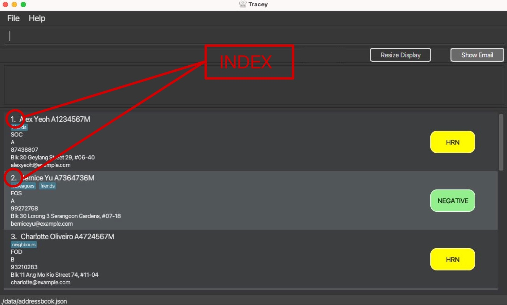

# Tracey

Tracey is a **desktop app for managing health statuses of NUS Hall Residents, optimized for use via a Command Line
Interface** (CLI) while still having the benefits of a Graphical User Interface (GUI). If you can type fast,
Tracey can get your student health status management tasks done faster than traditional GUI apps.

--------------------------------------------------------------------------------------------------------------------

* [Quick Start](#quick-start)
* [Features](#features)
    * [Finding a contact](#finding-a-contact-find)
    * [Adding a contact](#adding-a-contact-add)
    * [Deleting a contact](#deleting-a-contact-delete)
    * [Editing an exisiting contact](#editing-an-existing-contact-edit)
    * [Clearing all records](#clearing-all-records-clear)
    * [Summarising the records](#summarising-the-records-summarise)
    * [Listing the records](#listing-the-records-list)
    * [Viewing help](#viewing-help-help)
    * [Filtering contacts](#filtering-contacts-filter)
    * [Archiving address book](#archiving-address-book-archive)
    * [Saving](#saving)
    * [Copying Emails](#copying-emails)
* [FAQ](#faq)
* [Command Summary](#command-summary)

--------------------------------------------------------------------------------------------------------------------

## Quick Start
1. Ensure you have Java 11 or above installed in your Computer.
2. Download the latest `Tracey.jar` from [here](https://github.com/se-edu/addressbook-level3/releases).
3. Copy the file to the folder you want to use as the home folder for your Tracey application.
4. Double-click the file to start the app. The GUI similar to the below should appear in a few seconds.
   Note how the app contains some sample data.  
   
5. Type the command in the command box and press Enter to execute it. e.g. typing **`help`** and pressing Enter will open the help window. 
   Some example commands you can try:

* **`list`** : Lists all contacts.

* **`summarise`** : summarise all contacts into their respective faculty and informs the reader percentage of student from that faculty is Covid positive.

* **`add`**`n/John Doe p/98765432 e/johnd@example.com a/John street, block 123, #01-01` : Adds a contact named `John Doe` to the Address Book.

* **`delete`**`3` : Deletes the 3rd contact shown in the current list.

* **`clear`** : Deletes all contacts.

* **`exit`** : Exits the app.

6. Refer to the [Features](#features) below for details of each command.

--------------------------------------------------------------------------------------------------------------------

## Features
### Finding a contact: `find`
Find a particular contact in Tracey.

Format: `find NAME`
* Returns the student(s) with the given details: `covid-positive`, `covid-negative`, `close-contact`
* The search is case-insensitive. e.g `johnDoe` will match `Johndoe`
* The search does not require full name. e.g. `jo` will match `Joe` and `John`

Examples of usages:

* `find John` returns `john` and `John Doe`
* `find alex david` returns `Alex Yeoh` and`David Li`
* `find J` returns `john` and`jay`

### Adding a contact: `add`
Add a student with relevant details into Tracey.

Format: `add n/NAME p/PHONENUMBER e/EMAIL ...`
* Add a student with the specific tags
* The student name is case sensitive e.g. `add n/johnDoe` will logged as `johnDoe` and not `JohnDoe` in Tracey
* Phone Number, email and matriculation number must be **unique** to each student
* Order of the tags does not matter e.g. `add n/NAME p/PHONENUMBER` is the same as `add p/PHONENUMBER n/NAME`
* Tracey will acknowledge that the student has been added
* Tags such as faculty and covid status must be a valid pre-defined constant in its respective enumeration class

Examples of usage:
* `add n/Melvin f/SOC cs/ Negative`
* `add e/student69@u.nus.edu n/ Martin`

Possible tags:
| **Tag** | **Meaning** | **Pre-defined constants** |
| - | - | - |
| `n/`  | Name | - |
| `p/` | Phone Number | - |
| `e/` | Email | - |
| `a/` | Address | - |
| `f/` | Faculty |  `FASS` `BIZ` `SOC` `SCALE` `FOD` `CDE` `DUKE` `FOL` `YLLSOM` `YSTCOM` `SOPP` `LKYSPP` `SPH` `TEST` `FOS` |
| `mc/` | Matriculation Number | - |
| `cs`/ | Covid Status | Positive, Negative, HRN |

### Deleting a contact: `delete`
Delete a contact at a specific index

Format: `delete NAME`
* Delete the student from the database
* Deletes one student at a time
* Can only delete at an index where a student exist

Examples of usage:
* `delete 2` removes the 2nd student on the list
* `delete 10` removes the 10th student on the list

### Editing an existing contact: `edit`
* Edits the person at the specified INDEX. The index refers to the index number shown in the displayed person list.
  The index **must be a positive integer** 1, 2, 3, …
* At least one of the optional fields must be provided.
* Existing values will be updated to the input values.
* When editing tags, the existing tags of the person will be removed i.e adding of tags is not cumulative.
* You can remove all the person’s tags by typing t/ without specifying any tags after it.

Format: `edit INDEX n/NAME ...`

Examples of usage:
* `edit 1 p/91234567 e/johndoe@example.com` edits the phone number and email address of the 1st person to be `91234567`
  and `johndoe@example.com` respectively.
* `edit 2 n/David Limpeh t/` edits the entry to become `David Limpeh` and clears all existing tags.

### Clearing all records: `clear`
Clear all the data inside `Tracey`

Format:`clear`

:warning: `Save a copy of the data file if you intend to keep it as the deleted files cannot be recovered.`

### Summarising the records: `summarise`
Summarises the record inside `Tracey` that an overview of the data, such as number of students who are `covid-positive`. It will return an unfiltered list of the addressboook
to show everyone in the address book while providing a valid response by the application.

Format:`summarise`

Example of usage:
*  `summarise` summarises the contacts of everyone in the Tracey application such that she responses with how many Covid positive students in faculty A, how many on HRN and negative.

Future Enhancements:
*  For future versions, summarise command can display a visual pie chart for different faculties to visualise the percentage of Covid positive students.
This can aid understanding of raw data easier.

### Listing the records: `list`
List the full record, which displays all the student's data that are logged into Tracey.

Format: `list`

This is a sample screenshot of what you can expect from the `help` command.

### Viewing help: `help`
Help users to search for all the commands that Tracey offers by opening a pop-up window.
It includes a summary to briefly explain all the commands.

The pop-up window also offers a button to copy the URL of the User Guide for easy access to the User Guide.

This is a sample screenshot of what you can expect from the `list` command.

Format: `help`

### Filtering contacts: `filter`
Filter student based on health statuses and/or faculties

Format:`filter cs/HEALTH_STATUS f/FACULTY`

* Returns a list of students with the given health status: `positive`, `negative`, `hrn`
* The search is case-insensitive. e.g `Positive` will match `positive`

Examples of usage:
* `filter cs/positive` returns all students that are tagged as covid-positive
* `filter f/soc` returns all students that are enrolled in the faculty SOC (School of Computing)
* `filter cs/negative f/soc` returns all students that are tagged as covid-negative and enrolled in the faculty SOC (School of Computing)

### Archiving address book: `archive`
Archives the current address book file

Format: `archive`

* The archived file will be saved in `[ROOT]/data/archive/[DATE]/[ARCHIVED_FILE]` where
  * `[ROOT]`: Root directory of Tracey
  * `[DATE]`: Archived file directory named using your local PC's date in the format of DDMMYY
  * `[ARCHIVED_FILE]`: Archived file name named using your local PC's date and time in the format of DDMMYY_hhmmss

Example:
* Current date and time in which archive command is used: 27/03/2022 (DD/MM/YYYY) 15:28:33 (hh:mm:ss in 24-hour notation)
* The archived file will be saved **in** `[ROOT]/data/archive/270322`
* The archived file will be saved **as** `270322_152833`
* The file path will be `[ROOT]/data/archive/270322/270322_152833`

Tips:
* You can rename the archived file in the file path manually for easier reference
* To restore the address book to a previous version, just replace the address book file in `[ROOT]/data` with the archived file

### Saving
Saving in the application is automatic. The data in the file will be saved accordingly whenever
there are changes to `Tracey`.

### Copying emails
The `Show Email` button opens up a separate window that consists of all the emails of the current displayed individuals.
`Copy Email` copies the list of emails to the user's clipboard to allow the user to efficiently send out mass emails.

---------------------------------------------------------------------------------------------------------------

### FAQ
1. **Q**: How do I transfer my data to another computer?  
   **A**: Copy the file from [ROOT]/data/tracey.txt over to your other computer.  

2. **Q**: What is the difference between the `list` command and `summarise` command?  
   **A**: The main differences of `list` and `summarise` are:

        a. The `list` command will provide an unfiltered list of students `summarise` command will tabulate the studnets into pie charts according to the block they stay in and faculty they belong to.  

        b. `list` is helpful to get a bird eye view of the details of all the students whereas `summarise` is great to analyse how certain areas in the hall compound is doing.  

        c. `list` is optimal to find a particular student out of everyone while `summarise` is optimal to find which block is dealing not-so-well with the covid outbreak.  

3. **Q**: Can I use filter using keywords to find certain people in the list of students?  
   **A**: Unfortunately `filter` command only allows you to search via the tags such as `positive`, `soc` and block `A`. Please use the `find` command instead which will allow you to search via keywords.  
   
4. **Q**: Where can I find the `INDEX` of a student?  
   **A**: They can be found in the numbers located beside each individual student.  
   

5. **Q**: The `delete` feature only allow us to delete via the `INDEX` assigned to each particular person. How do I know the `INDEX` of the student i want to use `delete` on?  
   **A**: The `INDEX` used for `delete` is not fixed. It relies on the number in which the displayed list of students will assign.
   You can use `find` `STUDENT` to get his/her `INDEX` and then apply `delete`. This can save you time scrolling down an entire list to get his/her `INDEX`!  
   
6. **Q**: The `edit` feature only allow us to edit via the `INDEX` assigned to each particular person. How do I know the `INDEX` of the student i want to use `edit` on?  
   **A**: The `INDEX` used for `edit` is not fixed. It relies on the number in which the displayed list of students will assign.
   You can use `find` `STUDENT` to get his/her `INDEX` and then apply `edit`. This can save you time scrolling down an entire list to get his/her `INDEX`!  

7. **Q**: Can I create new tags not mentioned by the app?  
   **A**: As the vision of the app is to monitor Covid Status of students in school accomodation, we have accounted for the tags needed by Hall Admins to maximise efficiency. There are no need for more tags!   
--------------------------------------------------------------------------------------------------------------------

### Command Summary
| No. | Command | Description | Example |
| - | - | - | - |
| 1. | `find` | Find a particular student | `find alex` \n `find j`|
| 2. | `add` | Let Tracey keep track of this new student | `add n/Melvin f/SOC cs/ Negative b/a`|
| 3. | `delete` | Remove a student from Tracey | `delete 2` |
| 4. | `edit` | Change particulars of a student | `edit 1 p/91234567 e/johndoe@example.com`|
| 5. | `clear` | Delete everything inside Tracey | `clear` |
| 6. | `summarise` | Summarise data into a list for an overview | `summarise`|
| 7. | `list` | Get a list of everyone in Tracey | `list` |
| 8. | `help` | In-app support to understand how commands work in Tracey | `help` |
| 9. | `filter` | Retrieve list of people based on tags | `filter cs/HEALTH_STATUS f/FACULTY` |
--------------------------------------------------------------------------------------------------------------------

### Glossary
{to be added}
