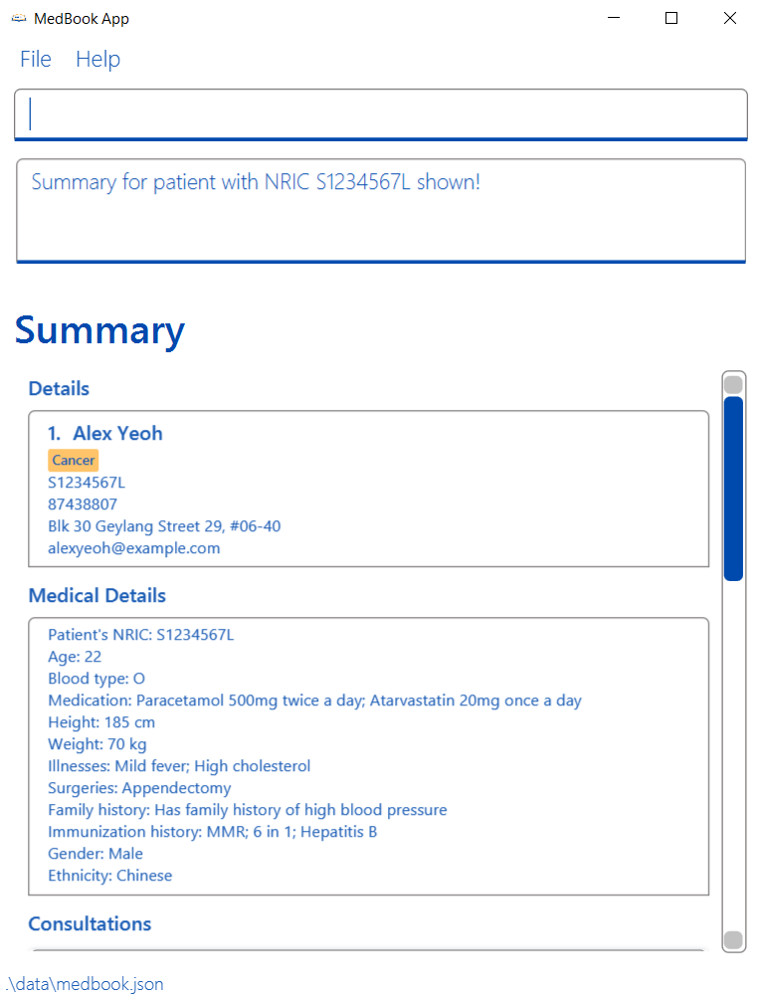

Welcome to MedBook's user guide. This guide serves to equip users with the necessary knowledge to fully utilise all the
features implemented in MedBook.
## Navigation Links

Click any links below to navigate into that section.

  <h7 markdown="span">[**Introduction**](#introduction)</h7>
  

  This section contains information that serves to introduce you to MedBook.
  

  <h7 markdown="span">[**Quick start**](#quick-start)</h7>
  

  This section serves as a quick start guide that includes information on how to install, a tour of the graphical user interface and a getting started tutorial.
  

  <h7 markdown="span">[**Commands**](#commands)</h7>
  

  This section contains all the available commands in MedBook.
  

  <h7 markdown="span">[**FAQ**](#faq)</h7>
  

  This section contains all the frequently asked questions about MedBook.
  

---

## Introduction

<figure class="figure">
  
</figure>

MedBook is a health monitoring system for healthcare professionals that simplifies tracking patients' medical
information and hospital records. MedBook delivers a seamless workflow for doctors and healthcare professionals to
search for or update patients' emergency contacts, medical information, medical test results, consultations and
prescriptions through a simple and easy-to-use platform.

---

## Quick start

This section contains all the necessary information you will need to get started with using MedBook.

### Requirement

- Ensure you have Java 11 or above installed on your computer.
- Download the latest `MedBook.jar` from [here](https://github.com/AY2122S2-CS2103T-T11-1/tp/releases).

### Setup

1. Copy the file to the folder you want to use as the home folder for MedBook.
2. Double-click the `MedBook.jar` to start the app.

### Graphical User Interface

MedBook has an intuitive graphical user interface built for you to enjoy easy interaction with the application.
This section describes each part of the graphical user interface in detail.

<figure class="figure">
   
</figure>

| Label | Description                                                                                                  |
| ----- | ------------------------------------------------------------------------------------------------------------ |
| 1     | **Toolbar**. This is where the settings that allow you to exit the application and open the help window are. |
| 2     | **Command Input**. This is where you type the commands to be executed by the application.                    |
| 3     | **Command Result**. This text box displays MedBook's response to the command entered.                        |
| 4     | **List of Patients**. This is the list of patients that are stored in the application.                       |
| 5     | **Scroll Bar**. This scroll bar allows you to scroll for more information.                                   |

### Controls

In order to improve your experience when using the app, we have included the following feature:

- Use the `↑` and `↓` arrow keys to navigate between previously entered commands in the command box.

### Getting Started
Follow this tutorial to get started with using MedBook:
1. Open MedBook by double clicking `MedBook.jar` located in your MedBook home folder.
2. If this is your first time using MedBook, you will see a prompt window requesting you to set up a new password.
3. Type in a password which fits the requirements and press `enter` to continue.

    <figure class="figure">
      
      <figcaption class="figure-caption text-right">Figure 1: Password Prompt Display</figcaption>
    </figure>

    

    

    **:information_source: Notes about password:** 

    This password should only be known to you as it will be used to encrypt your MedBook data.
    See [FAQ](#faq) on how to reset your password.
    

4. Once you have set up a password, you will be prompted to enter the same password every time you login.

   <figure class="figure">
       
       <figcaption class="figure-caption">Figure 2: Login Prompt Display</figcaption>
   </figure>

5. After you have successfully logged in, the GUI will be loaded up with sample data and MedBook should look like the 
   picture below.

   <figure class="figure">
       
       <figcaption class="figure-caption">Figure 3: Main Display</figcaption>
   </figure>
6. You may refer to the command list below for the details of each available command.

---

## Commands

This section provides an overview of all the available commands in MedBook. Click on any command below to see the complete details of the command.

**:information_source: Notes about the command format:** 

- Words in `UPPER_CASE` are the parameters to be supplied by the user. 
  e.g. in `add n/NAME`, `NAME` is a parameter which can be used as `add n/John Doe`.

- Items in square brackets are optional. 
  e.g `n/NAME [tg/TAG]` can be used as `n/John Doe tg/diabetic` or as `n/John Doe`.

- Items with `…` after them can be used multiple times including zero times. 
  e.g. `[tg/TAG]… ` can be used as ` ` (i.e. 0 times), `tg/diabetic`, `tg/diabetic tg/hypertension` etc.

- Parameters can be in any order. 
  e.g. if the command specifies `n/NAME p/PHONE_NUMBER`, `p/PHONE_NUMBER n/NAME` is also acceptable.

- If a parameter is expected only once in the command but you specified it multiple times, only the last occurrence of
  the parameter will be taken. 
  e.g. if you specify `p/12341234 p/56785678`, only `p/56785678` will be taken.

- Extraneous parameters for commands that do not take in parameters (such as `help`, `view`, and `exit`) will be ignored. 
  e.g. if the command specifies `help 123`, it will be interpreted as `help`.

#### Patient Specific Commands
This section provides all the available commands to control patient's personal details.

| Commands                                               | Usage                     |
| :----------------------------------------------------- | :------------------------ |
| [`add i/NRIC`](#adding-a-patient-add)                  | Add a Patient             |
| [`view`](#viewing-all-patients-view)                   | View all Patients         |
| [`view i/NRIC`](#view-summary-of-a-patient-view-inric) | View Summary of a Patient |
| [`edit`](#editing-patient-information-edit)            | Edit a Patient            |

#### Contact Specific Commands
This section provides all the available commands to control patient's emergency contact list.

| Commands                                                       | Usage                    |
| :------------------------------------------------------------- | :----------------------- |
| [`add t/contact`](#adding-contact-information-add-tcontact)    | Add Contact Information  |
| [`view t/contact`](#viewing-contact-information-view-tcontact) | View Contact Information |
| [`edit`](#editing-contact-information-edit)                    | Edit Contact Information |

#### Medical Information Specific Commands
This section provides all the available commands to control patient's medical information.

| Commands                                                       | Usage                    |
| :------------------------------------------------------------- | :----------------------- |
| [`add t/medical`](#adding-medical-information-add-tmedical)    | View Medical Information |
| [`view t/medical`](#viewing-medical-information-view-tmedical) | View Contact Information |
| [`edit`](#editing-medical-information-edit)                    | Edit Medical Information |

#### Consultation Specific Commands
This section provides all the available commands to control patient's consultation records.

| Commands                                                                   | Usage                         |
| :------------------------------------------------------------------------- | :---------------------------- |
| [`add t/consultation`](#adding-consultation-information-add-tconsultation) | Add Consultation Information  |
| [`view t/consultation`](#viewing-past-consultations-view-tconsultation)    | View Past Consultations       |
| [`edit`](#editing-consultation-information-edit)                           | Edit Consultation Information |

#### Prescription Specific Commands
This section provides all the available commands to control patient's prescription records.

| Commands                                                          | Usage             |
| :---------------------------------------------------------------- | :---------------- |
| [`add t/prescription`](#adding-prescription-add-tprescription)    | Add Prescription  |
| [`view t/prescription`](#viewing-prescription-view-tprescription) | View Prescription |
| [`edit`](#editing-prescription-edit)                              | Edit Prescription |

#### Test Result Specific Commands
This section provides all the available commands to control patient's emergency contact.

| Commands                                         | Usage            |
| :----------------------------------------------- | :--------------- |
| [`add t/test`](#adding-test-result-add-ttest)    | Add Test Result  |
| [`view t/test`](#viewing-test-result-view-ttest) | View Test Result |
| [`edit`](#editing-test-result-edit)              | Edit Test Result |

#### Non-specific Commands
This section provides all the available commands to control all patient's attributes mentioned above.

| Commands                               | Usage             |
| :------------------------------------- | :---------------- |
| [`help`](#viewing-help-help)           | View Help         |
| [`delete`](#deleting-any-entry-delete) | Delete any Entry  |
| [`find`](#finding-any-entry-find)      | Finding any Entry |

### Adding a Patient: `add`

Adds a patient to MedBook.

Format: `add i/NRIC n/NAME p/PHONE_NUMBER e/EMAIL a/ADDRESS [tg/TAG]...`

**:information_source: Info:** 

Patient's NRIC must be a valid Singapore-issued NRIC. MedBook will only accept the following NRIC format:

1. NRIC consists alphanumeric characters only.
2. NRIC starts with either S, T, F, G, or M character.
3. NRIC consists 7 digits after the first character.
4. NRIC ends with any character.

Note: Since the checksum algorithm to validate the last character is not open-source, we only validate the formatting
of the NRIC.

See [here](https://en.wikipedia.org/wiki/National_Registration_Identity_Card) /for more information about valid
Singapore NRIC.

NRIC **cannot be edited** in the future. Please ensure you keyed in the correct NRIC before proceeding.

Examples:

- `add i/S1234567L n/John Doe p/98765432 e/johnd@example.com a/John street, block 123, #01-01`
- `add i/S1234568L n/Jane Doe p/98763488 e/janed@example.com a/311, Clementi Ave 2, #02-25 tg/diabetic tg/hypertension`

Below is the list of parameters that can be used with the `add i/S1234567L` command. 

| Parameters | Description                                                |
| ---------- | :--------------------------------------------------------- |
| `i/`       | _Required_. The NRIC associated with the patient.          |
| `n/`       | _Required_. The name associated with the patient.          |
| `p/`       | _Required_. The phone number of the patient.               |
| `e/`       | _Required_. The email address of the patient.              |
| `a/`       | _Required_. The address of the patient.                    |
| `tg/`      | _Optional_. The tags that are associated with the patient. |

### Viewing all Patients: `view`

Shows a list of patients in MedBook.

Format: `view`

### View Summary of a Patient: `view i/NRIC`

Shows a summary of a patient's information in MedBook, including their personal details, medical information,
consultation records, prescription records, results of medical tests taken and emergency contact information.

Format: `view i/NRIC`

Examples:

- `view i/S1234567L`

<figure class="figure">
  
  <figcaption class="figure-caption text-right">Example of Summary Screen</figcaption>
</figure>

### Editing Patient Information: `edit`

Edits an existing patient information entry in MedBook when a list of patient's information entries are being displayed.
This is except for the NRIC field, which cannot be modified after the creation of the Patient Information.
At least one field must be filled for the edit command to be valid.

Format: `edit INDEX [n/NAME] [p/PHONE_NUMBER] [e/EMAIL] [a/ADDRESS] [tg/TAG]...`

- Edits the patient at the specified INDEX. The index refers to the index number shown in the displayed patient list.
  The index must be a positive integer 1, 2, 3, …​
- At least one of the optional fields must be provided.
- Existing values will be updated to the input values.
- When editing tags, the existing tags of the patient will be removed i.e adding of tags is not cumulative.
- You can remove all the patient's tags by typing tg/ without specifying any tags after it.

Examples:

- `view` followed by `edit 1 n/John` updates the name of the first patient information entry displayed on the screen
  to John.

:exclamation: **Caution:**
Editing a patient will overwrite the old data.

### Adding Contact Information: `add t/contact`

Adds a patient's emergency contact to MedBook.

Format: `add t/contact i/NRIC n/NAME p/PHONE_NUMBER e/EMAIL a/ADDRESS [tg/TAG]...`

- The NRIC specified here is the NRIC of the patient who has this emergency contact.

:information_source: **Info:**
The NRIC specified here cannot be edited in the future.

**:bulb: Tips:**

1. A contact can have any number of tags (including 0).
2. If you typed the wrong NRIC, `delete INDEX` the contact and `add` the contact again with the correct patient NRIC.

Examples:

- `add t/contact i/S1234567L n/Rihanna p/80008000 e/rihanna@gmail.com a/COM1 tg/primary tg/mother` adds an emergency
  contact to patient with NRIC, S1234567L.

Below is the list of parameters that can be used with the `add t/contact` command. 

| Parameters | Description                                                |
| ---------- | :--------------------------------------------------------- |
| `i/`       | _Required_. The NRIC associated with the patient.          |
| `n/`       | _Required_. The name associated with the contact.          |
| `p/`       | _Required_. The phone number of the contact.               |
| `e/`       | _Required_. The email address of the contact.              |
| `a/`       | _Required_. The address of the contact.                    |
| `tg/`      | _Optional_. The tags that are associated with the contact. |

### Viewing Contact Information: `view t/contact`

Views a patient’s emergency contacts from MedBook.

Format: `view t/contact i/NRIC`

Examples:

- `view t/contact i/S1234567L`

### Editing Contact Information: `edit`

Edits an existing contact information entry in MedBook when a patient's list of contact information entries is being
displayed.
This is except for the NRIC field, which cannot be modified after the creation of the Contact Information.
At least one field must be filled for the edit command to be valid.

Format: `edit INDEX [n/NAME] [p/PHONE_NUMBER] [e/EMAIL] [a/ADDRESS] [tg/TAG]...`

- Edits the contact at the specified INDEX. The index refers to the index number shown in the displayed patient list.
  The index must be a positive integer 1, 2, 3, …​
- At least one of the optional fields must be provided.
- Existing values will be updated to the input values.
- When editing tags, the existing tags of the patient will be removed i.e adding of tags is not cumulative.
- You can remove all the contact's tags by typing tg/ without specifying any tags after it.

Examples:

- `view t/contact` followed by `edit 1 n/John` updates the name of the first contact information entry displayed
  on the screen to John.

:exclamation: **Caution:**
Editing a contact will overwrite the old data.

### Adding Medical Information: `add t/medical`

Adds a patient's medical information to MedBook.

Format: `add t/medical i/NRIC [a/AGE] [bt/BLOOD_TYPE] [md/MEDICATION] [ht/HEIGHT] [wt/WEIGHT] [il/ILLNESSES] [su/SURGERIES] [fh/FAMILY_HISTORY] [ih/IMMUNIZATION_HISTORY] [gd/GENDER] [et/ETHNICITY]`

- We recommend inputting blood type using ABO blood group system (eg. AB), height using centimeters (eg. 185 cm), weight
  using kilograms (eg. 70 kg), gender as either Male, Female or Non-binary, but allow any other system or special values.

Examples:

- `add t/medical i/S1234567L bt/AB ht/175 cm`
- `add t/medical i/S1234567L a/22 bt/O md/Paracetamol 500mg twice a day; Atarvastatin 20mg once a day ht/185 cm wt/70 kg il/Mild fever; High cholesterol su/Appendectomy fh/Has family history of high blood pressure ih/MMR; 6 in 1; Hepatitis B gd/Male et/Chinese`

### Viewing Medical Information: `view t/medical`

Displays medical information of a patient from MedBook. If no NRIC is specified, MedBook will display all medical
information belonging to all patients.

Format: `view t/medical [i/NRIC]`

Examples:

- `view t/medical`
- `view t/medical i/S1234567L`

### Editing Medical Information: `edit`

Edits an existing medical information entry in MedBook when a list of medical information entries are being displayed.
This is except for the NRIC field, which cannot be modified after the creation of the Medical Information.
At least one field must be filled for the edit command to be valid.

Format: `edit INDEX [a/AGE] [bt/BLOOD_TYPE] [md/MEDICATION] [ht/HEIGHT] [wt/WEIGHT] [il/ILLNESSES] [su/SURGERIES] [fh/FAMILY_HISTORY] [ih/IMMUNIZATION_HISTORY] [gd/GENDER] [et/ETHNICITY]`

Examples:

- `view t/medical` followed by `edit 1 bt/B` updates the blood type of the first medical information entry displayed on the screen.

### Adding Consultation Information: `add t/consultation`

Adds a consultation report of a patient to MedBook.

Format: `add t/consultation i/NRIC dt/DATE tm/TIME dg/DIAGNOSIS fe/FEE [nt/NOTES]`

Examples:

- `add t/consultation i/S1234567L dt/2021-09-15 tm/18-00 dg/Inflammation in the throat and windpipe, short and shallow breath, laboured breathing. Most likely has Upper Respiratory Infection. fe/54.00 nt/Patient is having fever.`

### Viewing Past Consultations: `view t/consultation`

Views all past consultations of a patient in MedBook.

Format: `view t/consultation i/NRIC`

Examples:

- `view t/consultation i/S1234567L`

### Editing Consultation Information: `edit`

Edits an existing consultation entry in MedBook when a list of consultation entries are being displayed.
This is except for the NRIC field, which cannot be modified after the creation of the Consultation record.
At least one field must be filled for the edit command to be valid.

Format: `edit INDEX [dt/DATE] [tm/TIME] [dg/DIAGNOSIS] [fe/FEE] [nt/NOTES]`

Examples:

- `view t/consultation i/S1234567L` followed by `edit 1 dt/2019-08-10 tm/19-00` updates the date and time of the first
  consultation entry displayed on the screen.

### Adding Prescription: `add t/prescription`

Adds a medical prescription of a patient to MedBook.

Format: `add t/prescription i/NRIC n/DRUG_NAME dt/DATE s/INSTRUCTION`

- Adding prescription with the same DRUG_NAME is allowed
- DATE should be in the format of YYYY-MM-DD

Examples:

- `add t/prescription i/S1234567L n/Amoxicillin dt/2021-09-15 s/2 tablets after meal everyday.`

### Viewing Prescription: `view t/prescription`

Views a medical prescription of a patient in MedBook.

Format: `view t/prescription i/NRIC`

Examples:

- `view t/prescription i/S1234567L`

### Editing Prescription: `edit`

Edits an existing prescription entry in MedBook when a list of prescription entries are being displayed.
This is except for the NRIC field, which cannot be modified after the creation of the Prescription record.
At least one field must be filled for the edit command to be valid.

Format: `edit INDEX [n/DRUG_NAME] [dt/DATE] [s/INSTRUCTION]`

Examples:

- `view t/prescription i/S1234567L` followed by `edit 1 s/1 tablet everyday` updates the instruction of the first
  prescription entry displayed on the screen.

### Adding Test Result: `add t/test`

Adds a test result taken by a patient in MedBook.

Format: `add t/test i/NRIC dt/DATE mt/MEDICAL_TEST r/RESULT`

- DATE should be in the format of YYYY-MM-DD

Examples:

- `add t/test i/S1234567L td/2019-09-15 mt/CT Scan r/Brain Cancer`

### Viewing Test Result: `view t/test`

Views all the test results taken by a patient in MedBook.

Format: `view t/test i/NRIC`

Examples:

- `view t/test i/S1234567L`

### Editing Test Result: `edit`

Edits an existing test result entry in MedBook when a list of test result entries are being displayed.
This is except for the NRIC field, which cannot be modified after the creation of the Test Result record.
At least one field must be filled for the edit command to be valid.

Format: `edit INDEX [td/TEST_DATE] [mt/MEDICAL_TEST] [r/TEST_RESULT]`

Examples:

- `view t/test i/S1234567L` followed by `edit 1 r/Brain damage` updates the result of the first test result entry
  displayed on the screen.

### Viewing Help: `help`

Shows a message explaining how to access the help page.

Format: `help`

### Deleting any Entry: `delete`

Deletes a specified entry (patient, contact, medical information, ...) on the current screen from MedBook.

Format: `delete INDEX`

- You can delete the entry only if the entry is being shown on the display panel.
- For all screens apart from Summary, the index refers to the index number shown in the displayed list.
- The index must be a positive integer 1, 2, 3, …​
- For Summary screen, `delete 1` deletes the patient being viewed; other indices are invalid.

Examples:

- `view t/prescription i/S1234567L` followed by `delete 2` deletes the second prescription of the patient displayed on
  the screen.
- `view` followed by `delete 1` deletes the first patient displayed on the screen.

:exclamation: **Caution:**
Deleting a patient will remove all the associated information (e.g medical info, prescriptions, consultations etc.)

### Finding any Entry: `find`

Finds a specified entry (patient, contact, medical information, ...) on the current screen from MedBook containing the
keywords you have specified.

Format: `find KEYWORD`

- You can find the entry only if the entry is being shown on the display panel.
- Finding a Patient's information is done through specifying their name as the keyword.
- Finding all other records matches your keyword with any of the fields in that record.

Examples:

- `view` followed by `find John` shows only patients whose name is John.
- `view t/test i/S1234567L` followed by `find x-ray` will filter the test results belonging to the patient with NRIC
  S1234567L to only show those which contains the keyword `x-ray`.

**:information_source: Info:** 

Although `NIL` is an empty placeholder for the optional fields, `find NIL` will still filter the records in
the current display to show those which contains the keyword `NIL` to accommodate for cases where the user intentionally
types `NIL` in any field.

## FAQ

<h6 markdown="1">How do I transfer my data to another computer?</h6>

**Option 1:**
By default, MedBook will always read `medbook.json` located in `[HOME_DIRECTORY of MedBook.jar]/data/`. Just move your
data to `HOME_DIRECTORY of MedBook.jar/data/` in your new device if you wish to import them.

**Option 2 (with encryption):**
By default, MedBook will always encrypt your data to `password.enc` in `[HOME_DIRECTORY of MedBook.jar]/data/` for
security reason. You can move `password.enc` to `HOME_DIRECTORY of MedBook.jar/data/` in your new device and MedBook
will ask for your password upon launching.

<h6 markdown="1">What happens if I forget my password?</h6>
Due to security reason, there is no way to reset to password. To continue using the application you need to delete the 
encrypted data file (located at `[HOME_DIRECTORY of MedBook.jar]/data/password.enc`) or move it to another location. 
MedBook will start with a fresh data for you to start over. See the next FAQ for restoring data.

<h6 markdown="1">What happens if I accidentally remove `password.enc`?</h6>
Unfortunately, the encrypted data will be lost along with your password. However, you can restore your data if you have 
`medbook.json` with you. Make sure you place them in `[HOME_DIRECTORY of MedBook.jar]/data/` before launching the app. 
When you start MedBook again, you will be asked to set up a new password.

We highly discourage users to tamper with `password.enc` for security reason as any encryption can be broken given
sufficient amount of time.

<h6 markdown="1">Can I modify `medbook.json` locally?</h6>
We highly discourage users from modifying `medbook.json` directly as any invalid input will cause MedBook to launch with
empty data and `medbook.json` will be overwritten.

If you understand what you are dealing with, you may proceed with caution. We recommend you to back up a copy of
`medbook.json` in case you accidentally corrupt the file at any point in time.

