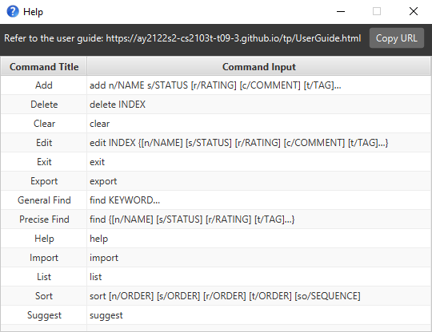
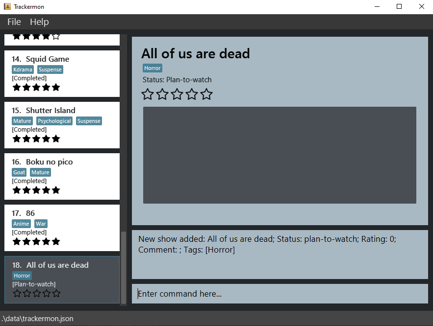
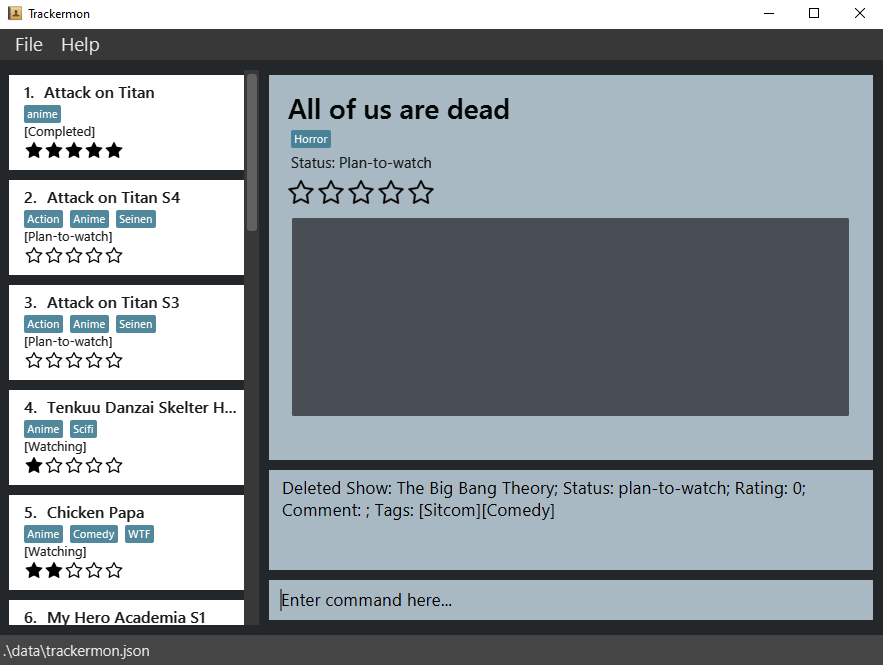
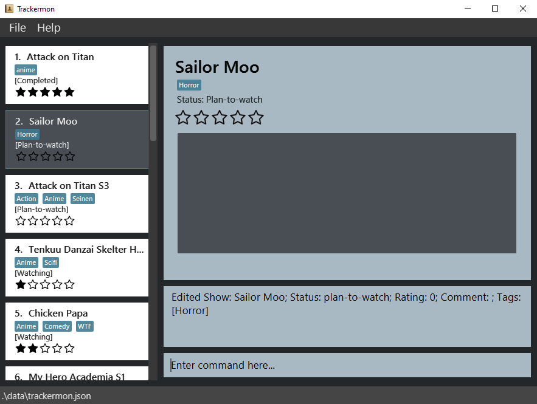
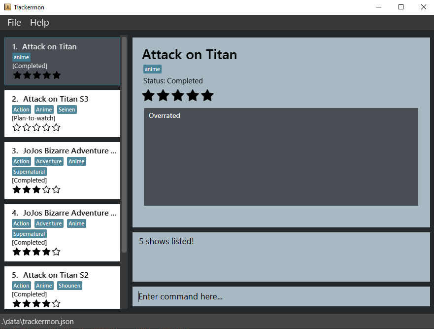
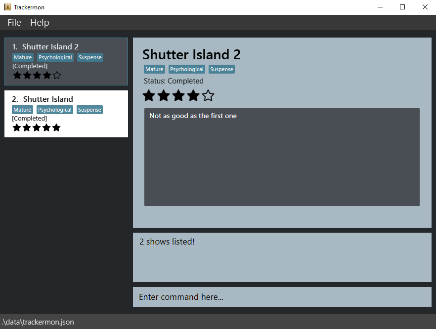
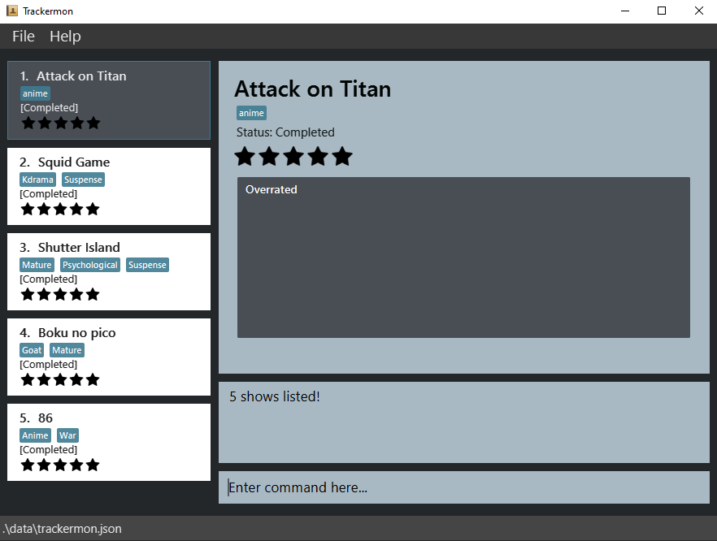
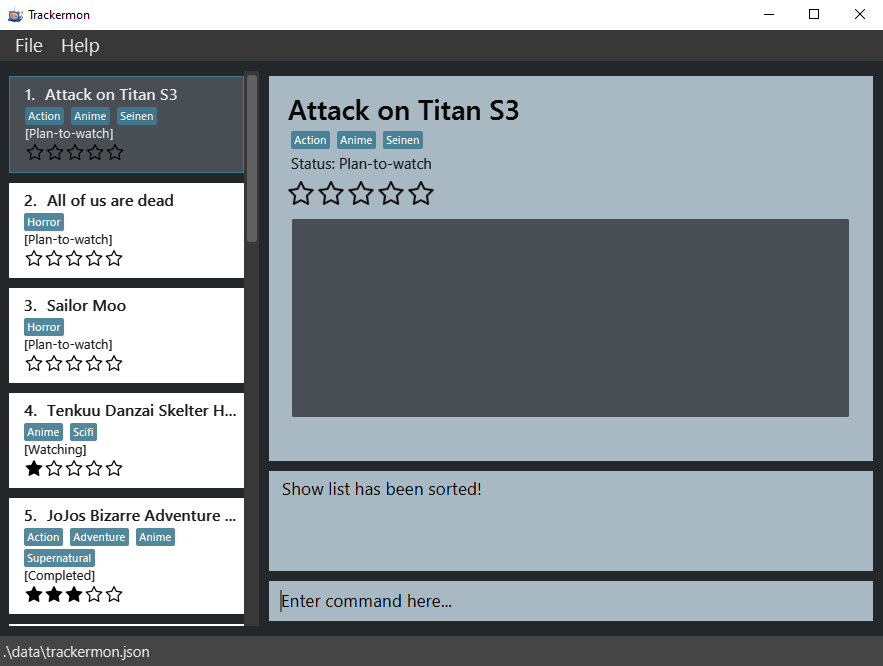
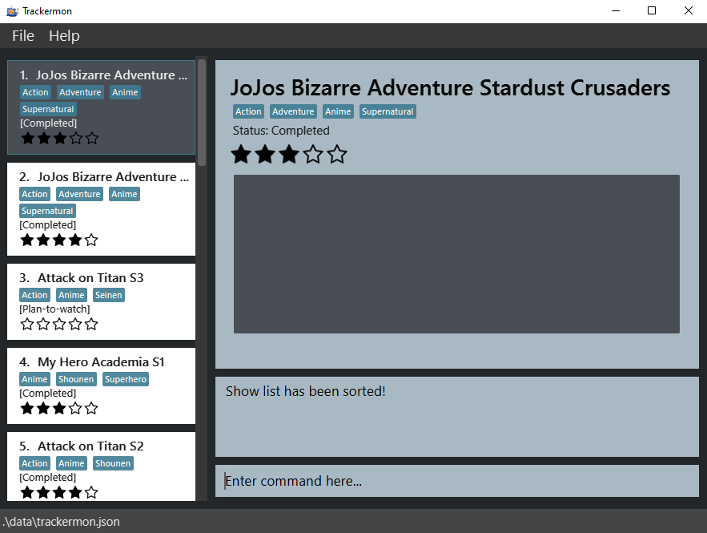
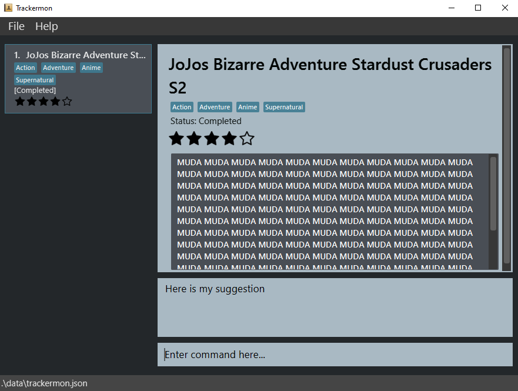

## Table of Contents
* [**Introduction**](#introduction)
* [**User guide navigation**](#user-guide-navigation)
* [**Quick start**](#quick-start)
* [**User interface**](#user-interface)
* [**Command structure**](#command-structure)
  * [Parameter conditions](#parameter-conditions)
* [**Features**](#features)
  * [Viewing help: `help`](#viewing-help-help)
  * [Adding a show: `add`](#adding-a-show-add)
  * [Deleting a show: `delete`](#deleting-a-show-delete)
  * [Editing a show: `edit`](#editing-a-show-edit)
  * [Listing all shows: `list`](#listing-all-shows-list)
  * [Clearing all shows: `clear`](#clearing-all-shows-clear)
  * [Finding a show: `find`](#finding-a-show-find)
    * [General find](#general-find)
    * [Precise find](#precise-find)
  * [Sorting the shows `sort`](#sorting-the-shows-sort)
  * [Suggesting a show `suggest`](#suggest-a-show-suggest)
  * [Import a show: `import`](#importing-a-show-import)
  * [Exporting a show: `export`](#exporting-a-show-export)
  * [Exiting the program: `exit`](#exiting-the-program-exit)
* [**FAQ**](#faq)
* [**Command Summary**](#command-summary)
* [**Glossary**](#glossary)

## Introduction

Always accessing MyAnimeList or IMDB to record down the shows you watched? Or finding it difficult to search the different websites that stored your show information? Fret not because **Trackermon** is the app just for you! But hold on, you may be wondering what is Trackermon?

Trackermon is a **desktop application** for **tracking and managing shows, optimized for use via a Command Line Interface ([CLI](#glossary))** while still having the **benefits of a Graphical User Interface ([GUI](#glossary))**. Trackermon allows you to track and remember what shows you have watched, are currently watching, or plan to watch. You can even review these shows!

[return to top ](#table-of-contents)

## User guide navigation

Before you continue reading the rest of our user guide, the table below displays some important syntax to facilitate your reading.

| Syntax                                                                    | Description                                             |
|---------------------------------------------------------------------------|---------------------------------------------------------|
| **Bold**                                                                  | Important words to note                                 |
| `Git Flavoured Markdown`                                                  | Command word/prefix/parameter                           |
| 
:bulb: 
            | A small but useful piece of information                 |
| 
:information_source: 
 | Additional information                                  |
| 
:exclamation: 
      | Important information to watch out for                  |
| [Optional Parameters]                                                     | Indicates the parameters that may be optional  |
| \<Instructions for Parameters\>                                           | Represents certain requirements you will need to follow |
| {Multiple Optional Parameters}                                            | At least one parameter must be provided                 |

[return to top ](#table-of-contents)

## Quick start

1. Ensure you have `Java 11` or above installed in your Computer.
   * For Windows, open Command Prompt and input `java -version`
   * For MacOS, open Terminal and input `javac -version`
   * For Linux, open Terminal and input `java -version`
2. Download the latest version of **Trackermon** [here](https://github.com/AY2122S2-CS2103T-T09-3/tp/releases).

3. Move the file to the folder you want to use as the _home folder_ for **Trackermon**.

4. Double-click the file to start the app. The layout of **Trackermon**'s [GUI](#glossary) is shown in the [section below](#user-interface).
   * Do note that for Linux, you may have to [enable double-click to run JAR files](https://askubuntu.com/a/270175) first! 
   * Do note that if double-clicking fails to start **Trackermon**, open a Command Prompt/Terminal in **Trackermon**'s _home folder_ and input `java -jar Trackermon.jar` to start **Trackermon**  
   
5. For a quick overview of all available commands, please refer to our [command summary](#command-summary).

6. For details of each command, please proceed to the [command-structure](#command-structure) section.

[return to top ](#table-of-contents)

## User interface

The table below briefly describes each of the **4 main components**.

| Component      | Description                                  |
|----------------|----------------------------------------------|
| Show List      | A panel to display a list of saved shows     |
| Show Details   | A panel to display a specific show's details |
| Result Display | A panel to display command results           |
| Command Box    | A panel to enter commands                    |

You can start communicating with Trackermon using the command box. Some example commands you can try are:

* **`list`** : Lists all shows.

* **`add`** `n/ReZero s/watching t/Anime` : Adds a show **named** `ReZero` with the **tag** `Anime` to Trackermon as **watching**.

* **`delete`** `3` : Deletes the **3rd show** shown in the current list.

* **`exit`** : Exits the app.

[return to top ](#table-of-contents)

## Command structure

Let us look at what makes up a command:

| Component    | Description                                                                   |
|--------------|-------------------------------------------------------------------------------|
| Command Word | The word representing the action of the command                               |
| Prefix       | The identifier used to recognise command parameters                           |
| Parameters   | Contains the information provided by you and can lead with a specified prefix |

For example, a command to find a show could look like this:

`find n/Django` 

In the example above , `find` is the **command word** while `n/` is the **prefix** of the `Django` **parameter**. A list of parameters along with their prefixes and descriptions have been included below for your convenience.

| Parameter  | Prefix | Description                                                                         |
|------------|--------|-------------------------------------------------------------------------------------|
| KEYWORD    | None   | The input after the command word without a prefix                                   |
| INDEX      | None   | The index of the show as shown in the show list                                     |
| NAME       | n/     | The name to use for a show                                                          |
| STATUS     | s/     | The status to label a show  They are _COMPLETED_, _WATCHING_ and _PLAN-TO-WATCH_ |
| TAG        | t/     | The tag to label a show                                                             |
| COMMENT    | c/     | The comment to describe a show                                                      |
| RATING     | r/     | The rating to give a show                                                           |

**:information_source: Notes about the command format:** 

* Words in `UPPER_CASE` are the parameters to be supplied by you. 
  e.g. in `add n/NAME`, `NAME` is a parameter which can be used as `add n/Sex and the City`.

* Items with `…`​ after them can be used multiple times. 
  e.g. `[t/TAG]…​` can be used as `t/Anime`, `t/Sitcom t/Kdrama` etc.

* A whitespace must be included before every prefix. 
  e.g. `n/Knives Out t/Suspense` is acceptable but `n/Knives Outt/Suspense` is not.

* Parameters can be in any order. 
  e.g. if the command specifies `n/NAME [t/TAG]…​`, `[t/TAG]…​ n/NAME` is also acceptable.

* If a parameter is expected only once in the command, but you specified it multiple times, only the last occurrence of the parameter will be taken. 
  e.g. if you specify `n/Batman n/Superman`, only `n/Superman` will be taken.

* Extraneous parameters for commands that do not take in parameters (such as `exit` and `list` ) will be ignored. 
  e.g. if the command specifies `exit 123`, it will be interpreted as `exit`.

[return to top ](#table-of-contents)

---

### Parameter conditions

**:information_source: Notes about parameters:** NAME and STATUS are case-insensitive.

| Parameter | Prefix | Condition                                                                                                                                                                                                                                                                                                                          |
|-----------|--------|------------------------------------------------------------------------------------------------------------------------------------------------------------------------------------------------------------------------------------------------------------------------------------------------------------------------------------|
| KEYWORD   | None   | A **single word** that only contains [**alphanumeric**](#glossary) characters. Example: `S1` `Attack` `Hero2`                                                                                                                                                                                                                   |
| INDEX     | None   | An **positive whole number** that is **within the bounds** of the show list. Example: For a show list containing **5 shows**, valid INDEX ranges from **1 to 5**                                                                                                                                                                    |
| NAME      | n/     | Show name must be **unique** and contains only [**alphanumeric**](#glossary) characters. Example: If you try to add `n/Stranger Things` into the show list that already contains that show, there will be a message telling you that this show already exists in the list. You can name it as `n/Stranger Things S2` instead. |
| STATUS    | s/     | Status can only contain _COMPLETED_, _WATCHING_ and _PLAN-TO-WATCH_                                                                                                                                                                                                                                               |
| RATING    | r/     | Rating must be a **whole number** from **0 to 5**.                                                                                                                                                                                                                                                                    |
| COMMENT   | c/     | A comment can contain **any text**, but **emojis will be removed** from input.                                                                                                                                                                                                                                                                                                                      |
| TAG       | t/     |  Tag must be a KEYWORD that is **no more than 20** [**alphanumeric**](#glossary) characters.                                                         |

[return to top ](#table-of-contents)

## Features

### Viewing help: `help`

**Description:** Are you new or confused with the commands? View the command summary and user guide through a quick pop up window!

**Format:** `help`

**Example & Output:** `help`

[return to top ](#table-of-contents)

---

### Adding a show: `add`

**Description:** Planning to watch a show and want to store its details? Add it to Trackermon's show list!

**Format:** `add n/NAME s/STATUS [r/RATING] [c/COMMENT] [t/TAG]…​`

**:exclamation: Caution:** 
* Refer to [parameter conditions](#parameter-conditions) section about `NAME` `STATUS` `RATING` `COMMENT` `TAG`.

**Example & Output:** `add n/All of us are dead s/plan-to-watch t/Horror`

[return to top ](#table-of-contents)

---

### Deleting a show: `delete`

**Description:** Wanting to delete a show? Delete it at the specified index shown in Trackermon's show list!

**Format:** `delete INDEX`

 

**:exclamation: Caution:** 
* Once a show is deleted, you cannot retrieve it back!
* Refer to [parameter conditions](#parameter-conditions) section about `INDEX`.

**Example & Output:** `delete 2`

[return to top ](#table-of-contents)

---

### Editing a show: `edit`

**Description:** Made a mistake? Edit it at the specified index shown in Trackermon's show list!

**Format:** `edit INDEX {[n/NAME] [s/STATUS] [r/RATING] [c/COMMENT] [t/TAG]…​}`

:bulb: **Tip:**
Multiple show [parameters](#command-structure) can be edited at the same time

**:information_source: Notes about the Rating, Comment, and Tag features:**  
* Reset the rating of a show: `edit INDEX r/0`
* Removing a comment: `edit INDEX c/`
* Removing all tags: `edit INDEX t/`

**:exclamation: Caution:** 
* Refer to [parameter conditions](#parameter-conditions) section about `INDEX` `NAME` `STATUS` `RATING` `COMMENT` `TAG`.
* Editing a `TAG` parameter can cause all the **previous tags of the show to be deleted**.

:exclamation:**Adding, Editing and Deleting a Tag:**  
* Doing any of these can result in your tags being deleted if you do not specify existing tags you want to keep.  
* Adding a Tag:
  * `edit INDEX <Specify all tags in show> t/NEW_TAG`
* Deleting a Tag:
  * `edit INDEX <Specify all tags in show except the tag you want to delete>`
* Editing a Tag:
  * `edit INDEX <Specify all other tags in show> t/EDITED_TAG`
* Example 
  
  * Adding a new Tag `Mystery` to show named `Another`
    * `edit 1 t/Anime t/Horror t/Mystery`
  * Deleting the Tag `Movie` in show named `Spiderman`
    * `edit 2 t/Action`
  * Editing the Tag `Comdy` to `Comedy` to show named `Chicken papa`
    * `edit 3 t/Anime t/Comedy`

**Example & Output:** `edit 2 n/Sailor Moo t/Horror`

[return to top ](#table-of-contents)

---

### Listing all shows: `list`

**Description:** Wanting to view all your shows at once? Display a list of shows in Trackermon's show list!

**Format:** `list`

**Example:** `list`

[return to top ](#table-of-contents)

---

### Clearing all shows: `clear`

**Description:** Wanting to reset your current show list? Clear all shows in Trackermon's show list!

**Format:** `clear`

:exclamation:**Caution:** 
* Clear will delete the current list! Your list data will be lost!

**Example:** `clear`

[return to top ](#table-of-contents)

---

### Finding a show: `find`
#### General find

**Description (General Find):** Wanting to search for a show across all [parameters](#command-structure)? Find shows containing the search words!

**Format (General Find):** `find KEYWORD…​`

:bulb: **Tip:**
Find is case-insensitive, and the order in which the keywords are entered is irrelevant. Partial words **will** be matched as well. e.g., `attac` will match `attack`.

**:information_source: Notes about General Find:** 
* An [**OR search**](#glossary) is executed across Trackermon's show list and all shows with matching [parameters](#command-structure) will be returned.
* Refer to [parameter conditions](#parameter-conditions) section about `KEYWORD`.
* `find attack on titan` displays all the shows in the list that contain the keywords `attack`, `on` or `titan`, whether it is a name, status or tag.

**Example & Output:** `find attack on titan`

---

#### Precise find

**Description (Precise Find):** Wanting to search for a show across specific [parameters](#command-structure)? Find shows containing the search words based on [prefix](#command-structure)!

**Format (Precise Find):** `find {[n/NAME] [s/STATUS] [r/RATING] [t/TAG]…​}`

:bulb: **Tip:**
Find is case-insensitive, and the order in which the keywords are entered is irrelevant. Partial words **will** be matched as well. e.g., `attac` will match `attack`.

**:information_source: Notes about Precise Find:** 
* **Within a single [prefix](#command-structure)** and **across multiple [prefixes](#command-structure)**, an [**AND search**](#glossary) is executed across Trackermon's show list, and only shows with matching [parameters](#command-structure) will be returned.
* `find n/Shutter Island` displays all the shows in Trackermon's show list that contain **Shutter** and **Island** in the `NAME` parameter.
* `find n/Django s/completed r/3 t/Action` displays all the shows in Trackermon's show list that contain **Django** in the `NAME` parameter, **completed** in the `STATUS` parameter, **3** in the `RATING` parameter, and **Action** in the `TAG` parameter.

:exclamation:**Multiple of the same prefixes:** 
* `find n/attack n/on n/titan n/S2` does not mean `find n/attack on titan S2`. The former will only find show names that match with **S2** (as mentioned in the notes of [command structure](#command-structure)), while the latter will find all show names that match **attack, on, titan, and S2**. This is only applicable to the `NAME` parameter.
* `find t/Anime t/Action` does not mean `find t/Anime Action`. The former will find all shows with both **Anime** and **Action** tags in the `TAG` parameter, while the latter will show you that it is an **invalid command format**. This is only applicable to the `TAG` parameter.
* `find r/4 5` does not mean `find r/4 r/5`. The former will find all shows with both **4 star rating and 5 star rating**, while the latter will find all shows with a **5 star rating**. This is only applicable to the `RATING` parameter.
* `find s/completed watching` does not mean `find s/completed s/watching`. The former will find all shows with both **completed and watching** status, while the latter will find all shows with a **watching** status. This is only applicable to the `STATUS` parameter.

**Example & Output:** `find n/Shutter Island`

**Example & Output:** `find r/5`

[return to top ](#table-of-contents)

---

### Sorting the shows `sort`

**Description:** Wanting to organise your messy show list? Sort can help reorder the list for you!

:exclamation: **Caution:** 
* You cannot undo the sort once you have applied it! 
* Sort will not affect the list permanently, Trackermon rearranges the show list one time after a successful sort command! 
* After a successful sort command followed by an add command will still add the new show to the last index!  

**Format:** `sort [n/ORDER] [s/ORDER] [t/ORDER] [r/ORDER] [so/SEQUENCE]`

**Explanation** 

Let's say you want to sort by name in ascending order,
use `sort n/asc`.

Let's say you want to sort by name in descending order,
use `sort n/dsc`.

:exclamation: **Take note** We sort name lexicographically, in other words, we sort it by comparing alphabets and numbers. We do not compare by combining the numbers into a unit. For example, in ascending order, 100Doggy comes before 69Doggy!   

Let's say you want to sort by status in ascending order,
use `sort s/asc`. 

Let's say you want to sort by status in descending order,
use `sort s/dsc`.

:exclamation: **Take note** We sort status in this ascending order: `completed`, `watching`, `plan-to-watch`.

Let's say you want to sort by number of tags in ascending order,
use `sort t/asc`.

Let's say you want to sort by number of tags in descending order,
use `sort t/dsc`.

:exclamation: **Take note** We sort tags by number of tags and not by comparing the names of tags.

Let's say you want to sort by rating in ascending order,
use `sort r/asc`.

Let's say you want to sort by rating in descending order,
use `sort r/dsc`.

Let's say you want to sort by name in ascending order then by status in ascending order,
use `sort n/asc s/asc`.

:exclamation: **Take note** The order of how you type the prefixes does not affect the outcome! If you type `sort s/asc n/asc`, Trackermon will still sort by name in ascending order then by status in ascending order

Therefore, let's say you want to sort by status in ascending order then by name in ascending order,
use `sort n/asc s/asc so/statusname`.

:exclamation: **Take note** We use `so/SEQUENCE` to swap the priority of the sorting criteria! By default, Trackermon always prioritises sorting in the following order if the criteria are used:

  1. name
  2. status
  3. rating
  4. tag

So, use the "tagratingstatusname" as the `SEQUENCE` if you want to swap the ordering to:
1. tag
2. rating
3. status
4. name

Additionally, when using `so/` prefix, Trackermon will check if the required criteria is presented in your `SEQUENCE`.
So if you use `sort n/asc s/asc so/haha`, the required criteria are name and status. As name and status are not spelt in full for `SEQUENCE`, Trackermon will tell you the input is invalid!

:bulb: **Tip:** Summary:
* `Sort` will sort according to the [prefixes](#command-structure). 
* Use `n/` if you want to sort by name.
* Use `s/` if you want to sort by status. We sort status in this ascending order: `completed`, `watching`, `plan-to-watch`.
* Use `t/` if you want to sort by number of tags.
* Use `r/` if you want to sort by rating.
* For the above prefixes, you have to specify the `ORDER` right after the prefix.
* `ORDER` is the order you want to sort the list by! Type `asc` to sort by ascending or type `dsc` to sort by descending!
* The criteria are name, status, tag, rating
* If two or more of the above criteria are being used, sort will prioritise sorting by name, then status, followed by rating, and finally tags.
* Use `so/` if you want to reorder the priority and state the `SEQUENCE`
* List the `SEQUENCE` by listing out the full name of the criteria used in the order you want.
* For example: you want to sort by rating, then status, followed by name, and finally tag, `SEQUENCE` will be "ratingstatusnametag"
* `SEQUENCE` input is case-insensitive and space inbetween the criteria does not matter. So the input "RaTing Status NAMETag" works too!
* If you are confused, don't worry! Just do not use any prefix, we will help you sort it by name in ascending order!

**:information_source: Notes about Sort:** 
* By not entering any prefixes, it will sort by name in ascending order.
* Enter the right amount of prefixes! For example: if you only sort by status, use only `s/`. 
* The `ORDER` must be asc or dsc!
* The `SEQUENCE` must contain the full name of all the criteria used!
* For `SEQUENCE`, if the full name of a criteria is being used multiple times, it will only consider the first instance of the full name. For example: "RatingTagRating" will sort by rating then tag.
* If the same prefix is being used multiple times, only the last prefix will be considered by the program! For example: `sort n/asc n/dsc` will sort name by descending order.

**Example & Output:** `sort`

**Example & Output:** `sort t/dsc r/asc`

**Example & Output:** `sort t/dsc r/asc so/tagrating`

[return to top ](#table-of-contents)

---

### Suggest a Show: `suggest`

**Description:** Wanting to find a random show? This suggests a random show from the displayed list!

**Format:** `suggest`

**Example & Output:** `suggest`

[return to top ](#table-of-contents)

---

### Importing a show: `import`

**Description:** Wanting to easily import Trackermon data from other devices? Just use our import function!

**Format:** `import`

:exclamation:**Caution:** 
* Import will override the current list if successful! Your previous list data will be lost!

**Example & Output:** `import`
- Step 1. Navigate to the Trackermon data file you want to import using your OS' native [GUI](#glossary)!
- Step 2. Select the file and click "Open"
  - Do note that only [JSON](#glossary) files can be imported!
- Step 3. Trackermon will import the selected file and display the imported show list!
  - Trackermon will display an error message if the data file is corrupted!

[return to top ](#table-of-contents)

---

### Exporting a show: `export`

**Description:** Wanting to easily export Trackermon data to other devices? Just use our export function!

**Format:** `export`

**Example & Output:** `export`
- Step 1. Navigate to the location you wish to export Trackermon data to using your OS' native [GUI](#glossary)!
- Step 2. Click "Save"
- Step 3. Trackermon will export the Trackermon data as a [JSON](#glossary) file to your selected location. It's that easy!
  - If there was an error exporting the file, Trackermon will display an error message!

[return to top ](#table-of-contents)

---

### Exiting the program: `exit`

**Description:** Wanting to exit the application? This simple command is what you are looking for!

**Format:** `exit`

**Example:** `exit`

[return to top ](#table-of-contents)

---

## FAQ

| Question | Answer |
| -------- | ------ |
| Where is the data of Trackermon saved? | Trackermon data is saved in the hard disk automatically after any command that changes the data! There is no need for you to save manually. |
| How is my data being saved in Trackermon? | Your data will be stored as a [JSON](#glossary) file called `trackermon.json`! You can find it in the "data" folder in Trackermon's _home folder_.|
| How do I transfer my data to another computer? | 1. `export` your data to an external storage device or send it via email.   2. On your other computer, simply start up Trackermon and `import` the data from the previous step!   3. Congratulations! You've just transferred your data across different computers! |

[return to top ](#table-of-contents)

## Command summary

| Action           | Format, Examples                                                                                                                    |
|------------------|-------------------------------------------------------------------------------------------------------------------------------------|
| **Help**         | `help`                                                                                                                              |
| **Add**          | `add n/NAME s/STATUS [r/RATING] [c/COMMENT] [t/TAG]…​`   e.g., `add n/ReZero s/watching r/3 t/Anime`                             |
| **Delete**       | `delete INDEX`  e.g., `delete 3`                                                                                                 |
| **Edit**         | `edit INDEX {[n/NAME] [s/STATUS] [r/RATING] [c/COMMENT] [t/TAG]…​}`   e.g., `edit 1 n/ReZero s/watching r/3 c/Good show t/Anime` |
| **List**         | `list`                                                                                                                              |
| **Clear**        | `clear`                                                                                                                             |
| **General Find** | `find KEYWORD…​`  e.g., `find hero`                                                                                           |
| **Precise Find** | `find {[n/NAME] [s/STATUS] [r/RATING] [t/TAG]…​}` e.g., `find n/Shingeki no kyojin s/watching r/5 t/Anime t/Seinen`              |
| **Sort**         | `sort [n/ORDER] [s/ORDER] [r/ORDER] [t/ORDER] [so/SEQUENCE]`                                                                        | 
| **Suggest**      | `suggest`                                                                                                                           |
| **Import**       | `import`                                                                                                                            |
| **Export**       | `export`                                                                                                                            |
| **Exit**         | `exit`                                                                                                                              |

[return to top ](#table-of-contents)

## Glossary

| Term                               | Description                                                                                                                                                                          |
|------------------------------------|--------------------------------------------------------------------------------------------------------------------------------------------------------------------------------------|
| **AND search**                     | AND search finds all of the keywords.  For example, `find n/Shutter Island` returns only results that contain Shutter and Island.                                                    |
| **OR search**                      | OR search finds one keyword or the other.  For example, `find Shutter Island` returns all results that contain Shutter or Island.                                                    |
| **Command Line Interface (CLI)**   | A Command Line Interface connects a you to a computer program or operating system. Through the CLI, you can interact with a system or application by typing in text (commands).      | 
| **Graphical User Interface (GUI)** | A form of user interface that allows you to interact with electronic devices through graphical icons instead of text-based user interfaces, typed command labels or text navigation. |
| **Alphanumeric**                   | A character that is either a letter or a number.                  |
| **JSON**                           | [JavaScript Object Notation](https://www.json.org/json-en.html). The format in which Trackermon data is stored. |

[return to top ](#table-of-contents)
