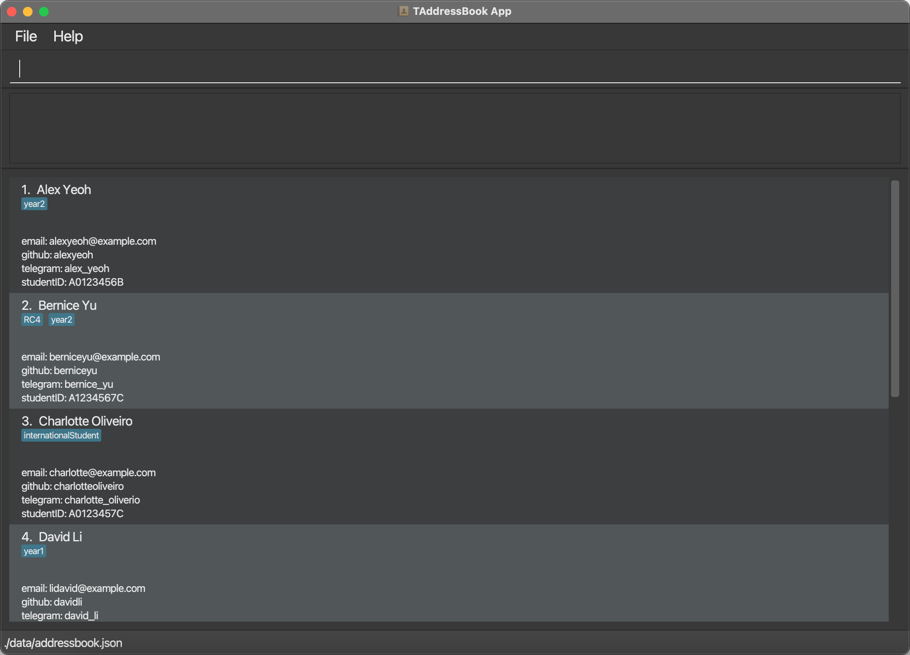
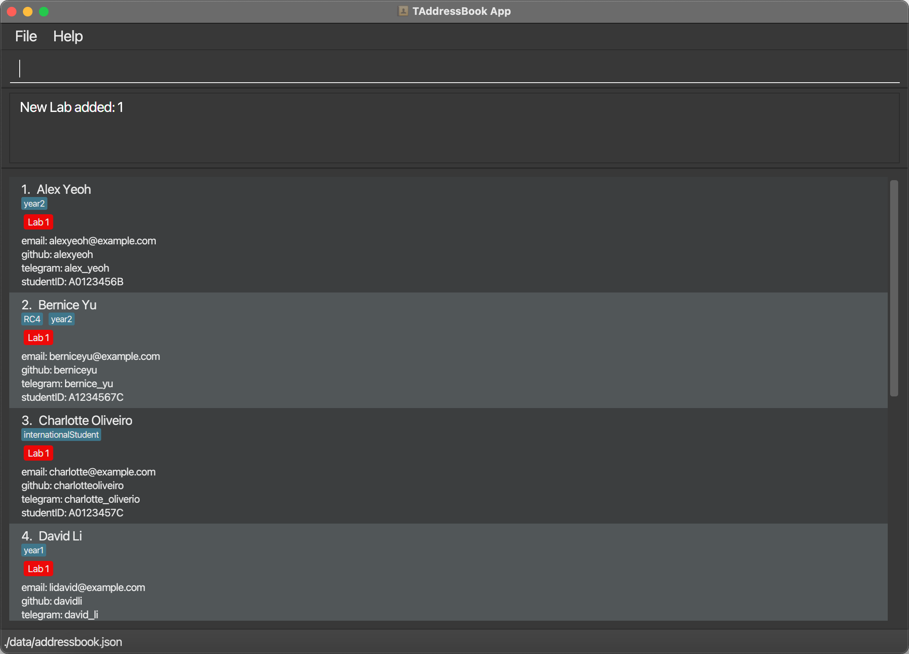

TAddressBook is a **desktop app made for CS2030S Lab Teaching Assistants (TAs) to keep track of students' lab assignments, optimized for use via a Command Line Interface** (CLI) while still having the benefits of a Graphical User Interface (GUI).

If you can type fast, TAddressBook can get your lab management tasks done faster than traditional GUI apps.

* Table of Contents
{:toc}

--------------------------------------------------------------------------------------------------------------------

## Quick start

1. Ensure you have Java `11` or above installed in your computer.

2. Download the latest `TAddressBook.jar` from [here](https://github.com/AY2122S2-CS2103-F10-1/tp/releases).

3. Copy the file to the folder you want to use as the _home folder_ for your TAddressBook.

4. Double-click the file to start the app. A GUI similar to the image below should appear in a few seconds. Note how the app contains some sample data. 
   

5. Type a command in the command box and press Enter to execute it. e.g. typing **`help`** and pressing `Enter` will open the help window. 
   Some example commands you can try:

   * **`list`** : List all students.

   * **`add`**`n/James Ho e/jamesho@email.com g/jamesH tl/jamesho i/A0123456T` : Adds a student named `James Ho` to the TAddressBook.

   * **`delete`**`3` : Deletes the 3rd student shown in the current list.

   * **`clear`** : Clears all students.

   * **`exit`** : Exits the app.

6. Refer to the [Features](#feature-list) below for details of each command.

--------------------------------------------------------------------------------------------------------------------
## Feature List
- [General](#system-related-features)
  - [View help page](#viewing-help--help)
  - [Exit TAddressBook](#exiting-the-program--exit)
  - [Save data](#saving-the-data)
  - [Edit data](#editing-the-data-file)

- [Manage students](#student-related-features)
    - [Add students](#adding-a-student--add)
    - [List students](#listing-all-students--list)
    - [Edit students](#editing-a-student--edit)
    - [Find students](#locating-students-by-name--find)
    - [Delete students](#deleting-a-student--delete)
    - [Clear students](#clearing-all-entries--clear)
    - [Filter students based on status of lab tags](#filter-by-status-of-individual-labs--filter)
    - [View student details](#view-student-details--view)

- [Manage labs](#lab-related-features)
    - [Add labs](#adding-a-lab--labadd)
    - [Submit labs](#submitting-a-lab--labsub)
    - [Grade labs](#grading-a-lab--labgrad)
    - [Edit labs](#editing-individual-labs--labedit)
    - [Remove labs](#removing-a-lab-labrm)

### Things to note

**:information_source: Notes about the command format:** 

* Words in `UPPER_CASE` are the parameters to be supplied by the user. 
  e.g. in `add n/NAME`, `NAME` is a parameter which can be used as `add n/John Doe`.

* Items in square brackets are optional. 
  e.g. `n/NAME [t/TAG]` can be used as `n/John Doe t/year2` or as `n/John Doe`.

* Parentheses mean that at least one of the items in parentheses must be supplied. 
  e.g. `(s/STATUS) (m/MARK)` can be used as `s/u`, `m/10` or `s/g m/10`.

* Items with `…` after them can be used multiple times including zero times. 
  e.g. `[t/TAG]…` can be used as ` ` (i.e. 0 times), `t/12A`, `t/12A t/year2` etc.

* Parameters can be in any order. 
  e.g. if the command specifies `n/NAME g/GITHUB`, `g/GITHUB n/NAME` is also acceptable.

* If a parameter is expected only once in the command but is specified multiple times, only the last occurrence of the parameter will be taken. 
  e.g. if you specify `i/A0000000J i/A1234567D`, only `i/A1234567D` will be taken.

* Extraneous parameters for commands that do not take in parameters (such as `help`, `list`, `exit` and `clear`) will be ignored. 
  e.g. if the command specifies `help 123`, it will be interpreted as `help`.

### System-related features

#### Viewing help : `help`
Shows a message explaining how to access the help page. 

Format: `help`

#### Exiting the program : `exit`
Exits the program.

Format: `exit`

#### Saving the data
TAddressBook data are saved in the hard disk automatically after any command that changes the data. There is no need to save manually.

#### Editing the data file
TAddressBook data are saved as a JSON file `[JAR file location]/data/addressbook.json`. Advanced users are welcome to edit that data file.

:exclamation: **Caution:**
We recommend that users be **extra careful** when editing data of the `MasterLabList` as well as any `labNumber` of individual `Student`'s `Lab`s. 
If your changes to the JSON data file makes its format invalid, TAddressBook will discard all data and start with an empty data file at the next run.

If the data loaded is different from the data JSON, refer to [FAQ Q2](#faq).

### Student-related features

#### Adding a student : `add`
Adds a student to the TAddressBook with the provided attributes.

Format: `add n/NAME e/EMAIL g/GITHUB tl/TELEGRAM_HANDLE i/STUDENT_ID [t/TAG]...`

:bulb: **Tip:**
A student can have any number of tags (including 0). 
Tags must be a single word consisting of alphanumeric characters only.

Examples:
* `add n/James Ho e/jamesho@email.com g/jamesH tl/jamesho i/A0123456T`
* `add n/John Doe g/johnD e/johndoe@email.com tl/johndoe i/A0111111B t/year2`

#### Listing all students : `list`
Shows a list of all students in the TAddressBook.

Format: `list`

#### Editing a student : `edit`
Edits an existing student in the TAddressBook.

Format: `edit INDEX (n/NAME) (e/EMAIL) (g/GITHUB) (tl/TELEGRAM_HANDLE) (i/STUDENT_ID) (t/TAG)...`

* Edits the student at the specified `INDEX`. `INDEX` refers to the index number shown in the displayed student list. `INDEX` **must be a positive integer** 1, 2, 3, …
* Existing values will be updated to the input values.
* When editing tags, the existing tags of the student will be removed i.e. adding of tags is not cumulative.
* You can remove all the student’s tags by typing `t/` without specifying any tags after it.

Examples:
* `edit 1 g/johnedit e/johndoe@example.com` edits the GitHub username and email address of the 1st student to `johnedit` and `johndoe@example.com` respectively.
* `edit 2 n/Betsy Crower t/` edits the name of the 2nd student to `Betsy Crower` and clears all existing tags.

#### Locating students by name : `find`
Finds students whose names contain any of the given keywords. At least one keyword must be specified.

Format: `find KEYWORD [MORE_KEYWORDS]`

* The search is case-insensitive e.g. `hans` will match `Hans`.
* The order of the keywords does not matter. e.g. `Hans Bo` will match `Bo Hans`.
* Only the name is searched.
* Only full words will be matched e.g. `Han` will not match `Hans`.
* Students matching at least one keyword will be returned (i.e. `OR` search),
  e.g. `Hans Bo` will return `Hans Gruber`, `Bo Yang`.

Examples:
* `find John` returns `john` and `John Doe`
* `find alex david` returns `Alex Yeoh`, `David Li` 

#### Deleting a student : `delete`
Deletes the specified student from the TAddressBook.

Format: `delete INDEX`

* Deletes the student at the specified `INDEX`.
* `INDEX` refers to the index number shown in the displayed student list.
* `INDEX` **must be a positive integer** 1, 2, 3, …

Examples:
* `list` followed by `delete 2` deletes the 2nd student in the TAddressBook.
* `find Betsy` followed by `delete 1` deletes the 1st student in the results of the `find` command.

#### Clearing all entries : `clear`
Clears all entries from the TAddressBook, including all students and all labs.

Format: `clear`

#### Filter (by status of individual labs) : `filter`
Filters students based on the `LabStatus` of a specific lab.

Format: `filter l/LAB_NUMBER s/LAB_STATUS`

* Multiple filters can be applied cumulatively by executing the filter command multiple times.
  Using the `list` command clears all filters that are currently applied.
* `LAB_NUMBER` must correspond to one of the labs currently in the TAddressBook.
* `LAB_STATUS` must correspond to one of the following:
  * `UNSUBMITTED` = `u`
  * `SUBMITTED` = `s`
  * `GRADED` = `g`

Example:
* `filter l/2 s/u` returns all students with a status of `UNSUBMITTED` for `Lab 2`.

#### View student details : `view`
View a student's details from the TAddressBook. This includes their personal information (i.e. email, GitHub username, etc.)
as well as the status and/or marks achieved for their labs. A sample result is shown below. 

Format: `view INDEX`

* `INDEX` refers to the index number shown in the displayed student list.
* `INDEX` **must be a positive integer** 1, 2, 3, …

### Lab-related features

#### Adding a lab : `labadd`
Adds a lab to every student. Shows up as a `LabLabel` on each student’s entry. By default, the `LabLabel` will be colored red for `UNSUBMITTED`.
The `LabLabel` is subsequently colored differently to represent different statuses:
* `UNSUBMITTED` = red
* `SUBMITTED` = yellow
* `GRADED` = green

Format: `labadd l/LAB_NUMBER`

* `LAB_NUMBER` must be an integer between 0 and 20 inclusive.
* Leading zeros will be ignored i.e. `l/00000012` will be treated as `l/12`

After adding a new lab e.g. `labadd l/1` you should see this 
(assuming you did not already have `Lab 1`):

#### Submitting a lab : `labsub`
Changes the status of the specified lab for the student with the specified `INDEX` from `UNSUBMITTED` to `SUBMITTED`.

Format: `labsub INDEX l/LAB_NUMBER`

* `INDEX` refers to the index number shown in the displayed student list. `INDEX` **must be a positive integer** 1, 2, 3, …
* `LAB_NUMBER` must correspond to one of the labs currently in the TAddressBook.

#### Grading a lab : `labgrad`
Changes the status of the specified lab for the student with the specified `INDEX` to `GRADED` and records down the marks given for the lab.

Format: `labgrad INDEX l/LAB_NUMBER m/LAB_MARK`

* The current status of the lab to be graded can be either `UNSUBMITTED` or `SUBMITTED`.
* `INDEX` refers to the index number shown in the displayed student list. `INDEX` **must be a positive integer** 1, 2, 3, …
* `LAB_NUMBER` must correspond to one of the labs currently in the TAddressBook.
* `LAB_MARK` should be an integer between 0 and 100 inclusive. Note that leading zeros will be ignored i.e. `m/00000012` will be treated as `m/12`

#### Editing individual labs : `labedit`
Edits the status or marks of the specified lab for the student with the specified `INDEX`.

:bulb: **Tip:**
`labedit` can achieve similar outcomes as `labsub` and `labgrad`, but using the latter commands would require less parameter inputs and thus be more convenient.
The main purpose of `labedit` is to allow for editing of wrongly provided information.

Format: `labedit INDEX l/LAB_NUMBER (s/LAB_STATUS) (m/LAB_MARK)`

* `INDEX` refers to the index number shown in the displayed student list. `INDEX` **must be a positive integer** 1, 2, 3, …
* `LAB_STATUS` must be one of `u`/`s`/`g` (`UNSUBMITTED`/`SUBMITTED`/`GRADED`).
* `LAB_MARK` should be an integer between 0 and 100 inclusive. Note that leading zeros will be ignored i.e. `m/00000012` will be treated as `m/12`
* Only valid combinations of `LAB_STATUS` and `LAB_MARK` will be accepted.
  * If `LAB_MARK` is provided, there is no need to provide `LAB_STATUS`. However, if provided, `LAB_STATUS` must be `g`.
  * If `LAB_STATUS` is `u` or `s`, `LAB_MARK` cannot be provided.

#### Removing a lab: `labrm`
Removes a specified lab from every student in the TAddressBook.

Format: `labrm l/LAB_NUMBER`

* `LAB_NUMBER` must correspond to one of the labs currently in the TAddressBook.

--------------------------------------------------------------------------------------------------------------------
## FAQ

**Q1**: How do I transfer my data to another Computer? 
**A**: Install the app in the other computer and overwrite the empty data file it creates with the file that contains the data of your previous TAddressBook home folder.

**Q2**: Why is the data loaded different from my data JSON? 
**A**: Please note the following defensive behavior related to the data JSON file:
1. All students will have their `LabList` aligned with the `MasterLabList` when the data file is loaded in. This means that any labs that a student is missing will be added in with the default `LabStatus` of `UNSUBMITTED`.
   Any labs that the student has that is not in the `MasterLabList` will be ignored.
2. If a student has a lab that has a missing or invalid `LabStatus`, the `LabStatus` is set to `UNSUBMITTED`, or `GRADED` if a valid `LabMark` is present.
3. If a student has a lab with a missing or invalid `LabMark` but has a `LabStatus` of `GRADED`,  it is loaded as an `UNSUBMITTED` lab with `Unknown` mark.

If the TAddressBook starts up with blank data, but the user expects there to be data, it means that there are formatting issues in the data JSON due to editing by the user.
In which case, if the user wants to modify the data JSON, the user should exit the app without using any commands that can modify data and restart the app after correcting the data JSON.

--------------------------------------------------------------------------------------------------------------------

## Command summary

| Action         | Format, Examples                                                                                                                                        |
|----------------|---------------------------------------------------------------------------------------------------------------------------------------------------------|
| **Help**       | `help`                                                                                                                                                  |
| **Exit**       | `exit`                                                                                                                                                  |
| **Add**        | `add n/NAME e/EMAIL g/GITHUB tl/TELEGRAM_HANDLE i/STUDENT_ID [t/TAG]...`   e.g. `add n/James Ho e/jamesho@email.com g/jamesH tl/jamesho i/A0123456T` |
| **List**       | `list`                                                                                                                                                  |
| **Edit**       | `edit INDEX (n/NAME) (e/EMAIL) (g/GITHUB) (tl/TELEGRAM_HANDLE) (i/STUDENT_ID) (t/TAG)...`  e.g. `edit 2 n/James Lee g/jamesHo`                       |
| **Find**       | `find KEYWORD [MORE_KEYWORDS]`  e.g. `find James Jake`                                                                                               |
| **Delete**     | `delete INDEX`  e.g. `delete 3`                                                                                                                      |
| **Clear**      | `clear`                                                                                                                                                 |
| **Filter**     | `filter l/LAB_NUMBER s/LAB_STATUS`  e.g. `filter l/1 s/u`                                                                                            |
| **View**       | `view INDEX`                                                                                                                                            |
| **Add lab**    | `labadd l/LAB_NUMBER`                                                                                                                                   |
| **Submit lab** | `labsub INDEX l/LAB_NUMBER`                                                                                                                             |
| **Grade lab**  | `labgrad INDEX l/LAB_NUMBER m/LAB_MARK`                                                                                                                 |
| **Edit lab**   | `labedit INDEX l/LAB_NUMBER (s/LAB_STATUS) (m/LAB_MARK)`                                                                                                |
| **Remove lab** | `labrm l/LAB_NUMBER`                                                                                                                                    |
