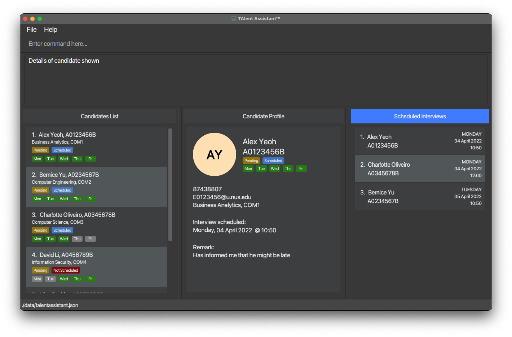

TAlent Assistant™ is a **desktop, lightweight and centralized management system** catered to professors for managing
the interview scheduling process of candidates applying to be undergraduate/graduate Teaching Assistants (TA). 
Professors will be able to access the candidates’ application data easily and review their general availability for 
scheduling interviews during office hours.
TAlent Assistant™ is **optimized for use via a Command Line Interface (CLI)** while still having the benefits of a 
Graphical User Interface (GUI). 
If you can type fast, this application will be able to help you manage all things under the hood of the TA initiative 
faster than traditional GUI applications.

* Table of Contents
{:toc}

--------------------------------------------------------------------------------------------------------------------

## Quick start

1. Ensure you have Java `11` or above installed in your Computer.

1. Download the latest `TAlentAssistant.jar` from [here](https://github.com/AY2122S2-CS2103-F11-2/tp/releases).

1. Copy the file to the folder you want to use as the _home folder_ for your TAlent Assistant™.

1. Double-click the file to start the app. The GUI similar to the below should appear in a few seconds. Note how the app contains some sample data. 
   

1. Type the command in the command box and press `Enter` to execute it. e.g. typing **`help`** and pressing `Enter` will open the help window. 
   Some example commands you can try:

    * **`list`** : Lists all candidates.

    * **`add id/A0123456B n/John Doe p/87654321 e/E0123456@u.nus.edu c/Computer Science yr/2 avail/1,2,3`** Adds a new candidate into the system.
   
    * **`edit 1 c/Computer Science yr/3 avail/1 ...`** Edits the first candidate in the system.

    * **`delete 1`** : Deletes the first candidate in the system.

    * **`find k/Alex f/name`** : Searches for all candidate with name containing “alex" (case-insensitive).

    * **`sort s/name`** : Sorts all candidates by name in ascending alphabetical order (i.e. A-Z).
    
    * **`view today`** : Filters all interviews to display only interviews scheduled today (if any).
   
    * **`schedule add candidate/1 at/05-05-2022 10:00`** : Schedules the first candidate for an interview at 5 May 2022 10AM.
   
    * **`schedule edit 1 at/06-06-2022 15:00`** : Reschedules the first interview in the interview schedule to 6 June 2022 3PM. Note that the index in the interview schedule is different from the candidate list.

    * **`schedule delete 1`** : Deletes the first interview in the interview schedule. Note that the index in the interview schedule is different from the candidate list.
   
    * **`help`** : List all commands in the system.
   
    * **`exit`** : Closes and exits the system.

1. Refer to the [Features](#features) below for details of all commands.

--------------------------------------------------------------------------------------------------------------------

## Navigating the Display

**:information_source: Notes about GUI display layout:** 

* **Candidates List** : Bottom leftmost panel displays the list of candidates in the system, alongside some key information.

* **Candidate Profile** : Bottom middle panel brings up a focused view of the candidate's profile when the related command is entered.

* **Scheduled Interviews** : Bottom rightmost panel displays the list of scheduled interviews.

Commands that affect the display of information within each of these panels is described below.

## Features

* [Viewing Help](#viewing-help)
* [Managing candidates](#managing-candidates)
* [Scheduling Interviews](#scheduling-interviews)
* [Miscellaneous commands](#miscellaneous-commands)
* [Processing data](#processing-data)

**:information_source: Notes about the command format:** 

* Words in `UPPER_CASE` are the parameters to be supplied by the user. 
  e.g. in `add n/NAME`, `NAME` is a parameter which can be used as `add n/John Doe`.

* Parameters can be in any order. 
  e.g. if the command specifies `n/NAME p/PHONE_NUMBER`, `p/PHONE_NUMBER n/NAME` is also acceptable.

* If a parameter is expected only once in the command but you specified it multiple times, only the last occurrence of the parameter will be taken. 
  e.g. if you specify `p/82341234 p/86785678`, only `p/86785678` will be taken.

* Extraneous parameters for commands that do not take in parameters (such as `help`, `list`, `exit` and `clear`) will be ignored. 
  e.g. if the command specifies `help 123`, it will be interpreted as `help`.

* The following table lists some common abbreviations used in `ATTRIBUTE_FIELD`s.

| `ATTRIBUTE_FIELD` | Refers to           |
|-------------------|---------------------|
| `is`              | interview status    |
| `as`              | application status  |
| `yr`              | seniority           |
| `avail`           | availability        |

## Viewing help

### Viewing help window: `help`

Lists the application commands that are available in the system.

Format: `help`

## Managing Candidates

### Adding a candidate: `add`

Adds a candidate into the system.

Format: `add id/STUDENTID n/NAME p/PHONE e/EMAIL c/COURSE yr/SENIORITY avail/AVAILABILITY`

* `STUDENTID` is sensitive and it will be validated.
* `NAME` should only contain alphabets, `A-Z` or `a-z`.
* `PHONE` should only be a local number. i.e. Starting number of Singapore's common numbers - 6, 8, 9
* `EMAIL` should only be in this format. i.e. `EXXXXXXX@u.nus.edu`
* `COURSE` should only be Computing courses. e.g. Business Analytics, Computer Engineering, Computer Science, Information Security, Information Systems
* `SENIORITY` is a number range from 1 to 4.
* `AVAILABILITY` is an input to represent the available days. e.g. `1,2,3` corresponds to available on `Monday`, `Tuesday`, `Wednesday`

Examples:
* `add id/A0123456B n/John Doe p/87654321 e/E0123456@u.nus.edu c/Computer Science yr/2 avail/1,2,3` adds a new candidate with Student ID, **A0123456B**, named John Doe.

### Editing a candidate: `edit`

Edits a candidate in the system.

Format: `edit INDEX c/COURSE yr/YEAR [ATTRIBUTE_FIELD/VALUE]...`

**:information_source: Notes about the edit format:** 

`ATTRIBUTE_FIELD` can take on the following values `id`, `name`, `phone`, `course`, `yr`, `as`, `avail`

* `as` is short for `ApplicationStatus`.

* Edits the candidate at the specified `INDEX`. The index refers to the index number shown in the displayed candidate list. The index **must be a positive integer** 1, 2, 3, …​
* At least one of the optional fields must be provided.
* Existing values will be updated to the input values.

Examples:
* `edit 1 n/Jane Doe yr/3 avail/1` Edits the name, year and availability of the 1st candidate to be Jane Doe, Year 3, Monday only respectively.
* `edit 2 c/Business Analytics` Edits the course of the 2nd candidate to be `Business Analytics`.

### Listing all candidates : `list`

Displays all candidates found in the system.

Format: `list`

### Finding candidates by keyword(s) search: `find`

Finds and lists candidates whose attribute field(s) contain(s) any of the given keyword(s).

Format: `find k/KEYWORD [k/MORE_KEYWORDS]... f/ATTRIBUTE_FIELD`

**:information_source: Notes about the find format:** 

`ATTRIBUTE_FIELD` can take on the following values 
`as`, `course`, `email`, `is`, `name`, `phone`, `yr`, `id`, `all`, `avail`

Note: 
`yr` may match any case variation of `COM1`, `COM2`, `COM3` or `COM4`
`avail` may match any case variation of days in the format of `MON`, `TUE`, `WED`, `THUR` or `FRI`

* The keyword search is case-insensitive. e.g `hans` will match `Hans`
* The attribute field is case-insensitive. e.g. `NAME` is equivalent to `name`
* The search will return a list of all candidates containing any of the specified keyword(s) in the specified attribute field.
* For `f/all`, the search will find keywords across all attribute fields of the candidate records.
* Only full keywords will be matched
  e.g. `k/jane doe f/name` will not match candidates with name `jane koe` or just `jane`
* Candidates matching at least one full keyword (in the specified attribute field) will be returned i.e. OR search,
  e.g. `k/Jane k/Doe f/name` will return candidates with name e.g. `Jane Koe`, `John Doe`
* If multiple `ATTRIBUTE_FIELD`s are provided, only the last field will be used.

Examples:
* `find k/Jane f/name` returns candidates with name e.g. `jane` and `jane doe`
* `find k/Computer Science f/course` returns candidates with the course field i.e. `computer science`
* `find k/Jane k/Tan f/name` returns candidates with name e.g. `Jane`, `tan` and `John Tan`

### Sorting candidates by attribute field: `sort`

Returns a list of candidates sorted by the specified attribute field in ascending order (A-Z, 0-9).

Format: `sort s/ATTRIBUTE_FIELD`

**:information_source: Notes about the edit format:** 

`ATTRIBUTE_FIELD` can take on the following values
`as`, `course`, `email`, `is`, `name`, `phone`, `yr`, `id`

* The attribute field is case-insensitive. e.g. `NAME` is equivalent to `name`
* The search will return a list of all candidates sorted in ascending order
  (i.e. A-Z, 0-9) with regard to the specified attribute field.

Examples:
Let's reference a default sample list of unique candidates with attribute fields stated as (`name`, `id`).
1. (`Ben`, `A5588565L`)
2. (`Alice`, `A2344567B`)
3. (`Charlie`, `A0188565L`)

`sort s/name` returns candidates sorted by name in the following order:
1. (`Alice`, `A2344567B`)
2. (`Ben`, `A5588565L`)
3. (`Charlie`, `A0188565L`)

`sort s/id` returns candidates sorted by name in the following order:
1. (`Charlie`, `A0188565L`)
2. (`Alice`, `A2344567B`)
3. (`Ben`, `A5588565L`)

### Viewing scheduled interviews `view`

Returns the list of scheduled interviews within the specified time period.

Format: `view TIME_PERIOD`

**:information_source: Notes about the edit format:** 

`TIME_PERIOD` can take on the following values `all`, `today`, `week`, `month`

* The attribute field is case-insensitive. e.g. `ALL` is equivalent to `all`
* Scheduled interviews are automatically sorted from earliest to latest

Examples:

| Example command | Expected Behaviour                                                               |
|-----------------|----------------------------------------------------------------------------------|
| `view all`      | returns all scheduled interviews still in system whether in the past or upcoming |
| `view today`    | returns all scheduled interviews on the same date as the current time            |
| `view week`     | returns all upcoming scheduled interviews within the next 7 days                 |
| `view month`    | returns all upcoming scheduled interviews within the next month                  |

### Deleting a candidate : `delete`

Deletes the specified candidate from the system.

Format: `delete INDEX`

* Deletes the candidate at specified `INDEX`.
* The index refers to the index number shown in the displayed candidate list
* The index must be a positive integer 1, 2, 3, …​

Examples:
* `list` followed by delete 2 deletes the 2nd candidate in the candidate list.
* `find k/bernice k/alex f/name` followed by delete 1 deletes the 1st candidate in the results of the find command.

### Bringing a Candidate's Information to the Center Panel : `focus` [Work-In-Progress]

View more details about the Candidate in the middle panel.

Format: `focus INDEX`

* Additional details of the Candidate will be displayed on the center panel in the application.
* To switch to another Candidate's information, user will just need to type the new command
* and the new index of the candidate.

## Scheduling interviews

### Scheduling a candidate for interview: `schedule add`

Schedules the specified candidate for an interview.

Format: `schedule add candidate/INDEX at/DATE_TIME`

* Schedules the candidate at the specified `INDEX` for an interview on given `DATE_TIME`.
* The candidate index refers to the index number shown in the displayed candidate list.
* The candidate index must be a positive integer 1, 2, 3, …​
* `DATE_TIME` must be specified in the format `dd-MM-yyyy HH:mm`.
* `DATE_TIME` must not be earlier than the present date and time.

Examples:
* `list` followed by `schedule add candidate/2 at/05-05-2022 10:00` schedules the second candidate in the candidate list
  for an interview on 5 May 2022 10AM.

### Rescheduling an interview: `schedule edit`

Reschedules the specified interview to a new date and time.

Format: `schedule edit SCHEDULE_INDEX at/DATE_TIME`

* Reschedules the interview at the specified `SCHEDULE_INDEX` to the given new `DATE_TIME`.
* The schedule index refers to the index number shown in the displayed interview schedule.
* The schedule index must be a positive integer 1, 2, 3, …​
* `DATE_TIME` must be specified in the format `dd-MM-yyyy HH:mm`.
* `DATE_TIME` must not be earlier than the present date and time.

Examples:
* `view` followed by `schedule edit 2 at/06-06-2022 15:00` reschedules the second interview in the interview schedule
  to 6 June 2022 3PM.

### Deleting an interview: `schedule delete`

Deletes the specified interview.

Format: `schedule delete SCHEDULE_INDEX`

* Deletes the interview at the specified `SCHEDULE_INDEX`.
* The schedule index refers to the index number shown in the displayed interview schedule.
* The schedule index must be a positive integer 1, 2, 3, …​

Examples:
* `view` followed by `schedule delete 2` deletes the second interview in the interview schedule.

## Miscellaneous commands

### Clearing all entries : `clear`

Clears all entries (candidates and interviews) from the system.

Format: `clear`

### Exiting the program : `exit`

Exits the program.

Format: `exit`

## Processing data
### Saving the data

TAlent Assistant™ data are saved in the hard disk automatically after any command that changes the data. There is no need to save manually.

### Editing the data file

TAlent Assistant™ data are saved as a JSON file `[JAR file location]/data/talentassistant.json`. Advanced users are welcome to update data directly by editing that data file.

:exclamation: **Caution:**
If your changes to the data file makes its format invalid, TAlent Assistant™ will discard all data and start with an empty data file at the next run.

--------------------------------------------------------------------------------------------------------------------

## FAQ

**Q**: How do I transfer my data to another Computer? 
**A**: Install the app in the other computer and overwrite the empty data file it creates with the file that contains the data of your previous TAlent Assistant™ home folder.

--------------------------------------------------------------------------------------------------------------------

## Command summary

Commands in this section have been organised based on the expected scope of behaviour.

### Candidates List
| Action     | Format, Examples                                                                                                                                                                       |
|------------|----------------------------------------------------------------------------------------------------------------------------------------------------------------------------------------|
| **Add**    | `add id/STUDENTID n/NAME p/PHONE c/COURSE yr/SENIORITY avail/AVAILABILITY`  e.g., `add id/A0123456B n/John Doe p/87654321 e/E0123456@u.nus.edu c/Computer Science yr/2 avail/1,2,3` |
| **Delete** | `delete INDEX`  e.g., `delete 3`                                                                                                                                                    |
| **Edit**   | `edit INDEX [n/NAME] [p/PHONE_NUMBER] [yr/YEAR]…​`  e.g.,`edit 2 n/James Lee p/98765432 yr/4`                                                                                       |
| **Find**   | `find k/KEYWORD [k/MORE_KEYWORDS]... f/ATTRIBUTE_FIELD`  e.g., `find k/Jane k/Doe f/name`                                                                                           |
| **Sort**   | `sort s/ATTRIBUTE_FIELD`  e.g., `sort s/name`                                                                                                                                       |

### Candidate Profile
| Action    | Format, Examples |
|-----------|------------------|
| **Focus** | [[PLACEHOLDER]]  |

### Scheduling Interviews
| Action                        | Format, Examples                                                                                       |
|-------------------------------|--------------------------------------------------------------------------------------------------------|
| **Schedule interview**        | `schedule add candidate/INDEX /at DATE_TIME`   e.g., `schedule add candidate/2 at/05-05-2022 10:00` |
| **Reschedule interview**      | `schedule edit SCHEDULE_INDEX at/DATE_TIME`   e.g., `schedule edit 1 at/06-06-2022 15:00`           |
| **Delete interview**          | `schedule delete SCHEDULE_INDEX`   e.g., `schedule delete 1`                                        |
| **View scheduled interviews** | `view TIME PERIOD`   e.g., `view all`, `view today`                                                 |

### Miscellaneous commands / Help
| Action    | Format, Examples |
|-----------|------------------|
| **Clear** | `clear`          |
| **Exit**  | `exit`           |
| **Help**  | `help`           |
