**Ultimate DivocTracker _(UDT)_** is a desktop app for managing COVID-19 contacts in school administration,
optimized for use via interacting with the application through easy-to-use commands on a user-centric interface.
Ultimate Divoc Tracker can get your contact-tracing tasks done faster than traditional GUI apps.

School administrators _(like teachers)_ in charge of managing COVID-19 can use UDT to easily track COVID-19 cases amongst the student population with ease and concentrate on what matters most,
the education of the students.

Through this user guide, you will learn how to use UDT effectively and efficiently, to manage COVID-19 cases in your schools.
Features below are accompanied by instructions, figures and examples to help you understand how to use them.
A glossary is included at the end to clarify any technical or vague terms used.

# Content Page

- [Quick start](#quick-start)
- [About UDT](#about-udt)
- [Features](#features)
  - [Add a student](#add-a-student-add): `add`
  - [List all students](#list-all-students-list): `list`
  - [Find student by name](#find-student-by-name-find): `find`
  - [Find student by status](#find-student-by-status-findstatus):  `findstatus`
  - [Find student by class](#find-student-by-class-findclasscode): `findclasscode`
  - [Find student by activity](#find-student-by-activity-findactivity): `findactivity`
  - [Edit student’s personal details](#edit-student-details-edit): `edit`
  - [Delete a student](#delete-a-student-delete): `delete`
  - [Right-Click Help Menu](#right-click-help-menu)
    - [Undo/Redo](#undoredo)
    - [Cut/Copy/Paste](#cutcopypaste)
    - [Delete](#delete)
    - [Select All](#select-all)
  - [Viewing help window](#viewing-the-help-window-help): `help`
  - [Clearing the data](#clearing-the-data-clear): `clear`
  - [Exit the application](#exit-the-application-exit): `exit`
- [Saving the data](#saving-the-data)
- [Editing the data file](#editing-the-data-file)
- [Frequently Asked Questions](#faq)
- [Command Summary](#command-summary)
- [Glossary](#glossary)

----------------
# Quick start
1. Ensure you have **Java 11** or above installed on your Computer.
    - You can download **Java 11** from [this link](https://www.oracle.com/java/technologies/downloads/#java11).
    - To check which version of Java you have installed:
      1. Type "Command Prompt" into the search bar next to your Start menu, and click on it when it appears in the search results. 
      2. Type "java -version" into the Command Prompt, then press Enter on your keyboard.
2. Download the latest **udt.jar** from [our GitHub repository](https://github.com/AY2122S2-CS2103T-T12-1/tp/releases).
3. Copy the file to the folder you want to use as the home folder for your Ultimate Divoc Tracker application.
4. Double-click the file to start the app. The GUI similar to the one below should appear in a few seconds. Note how the app contains some sample data.
    - Alternatively, running the file via command line can also start the app. (In the event double-click does not work)
      1. Navigate to the folder containing the **udt.jar** file.
      2. Type "cmd" into the navigation bar in Windows Explorer, and press Enter to launch Command Prompt in that folder location.
      3. Type "java -jar udt.jar" to launch UDT from the Command Prompt.
5. Refer to the Features below for details of each command.

> :information_source: **Installation notes:**  
> - Application save data will be stored in the same folder containing the **udt.jar** application.  
> - Currently officially supported for **Windows**, **Mac** and **Linux** platforms.

## About UDT
Before we get into the details of what UDT can do, let's first bring you through what the application will look like.

|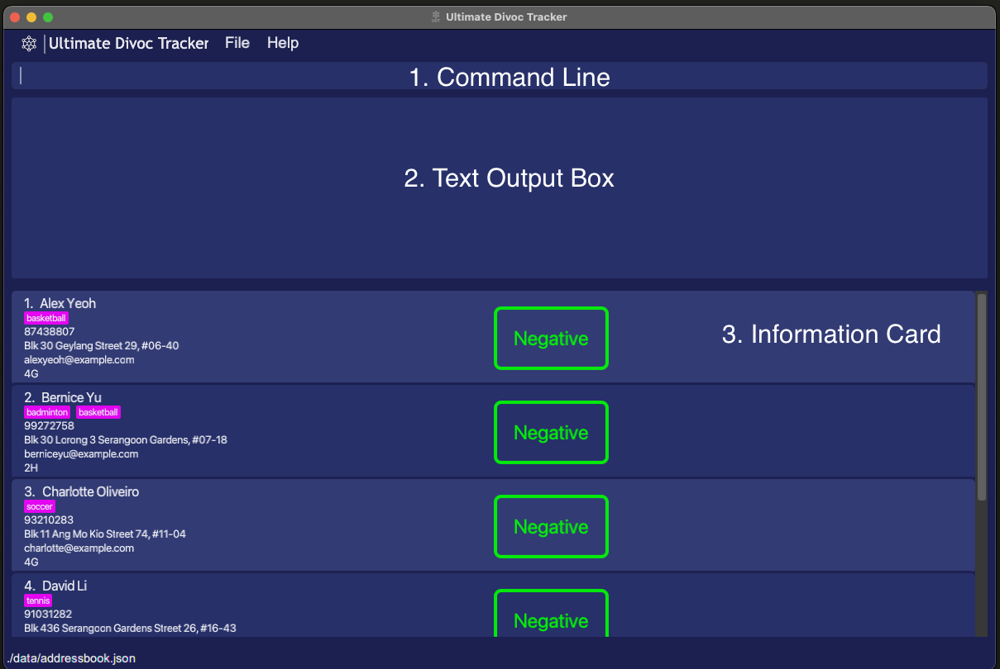|
|:--:|
|*Figure 1 - GUI*|

As seen in Figure 1 above, the application contains 3 main segments.

Firstly, the Command Line (area to input commands) is at the top of the application and can be easily seen by the blinking cursor/insertion point.

Secondly, the box beneath the Command Line is where the application will produce any text outputs or errors if the command provided requires so.

Lastly, each information card contains the following details of the student and are presented in order:
1. Name
2. Activity/Activities
3. Phone Number
4. Address
5. Email Address
6. Class
7. COVID-19 Status

|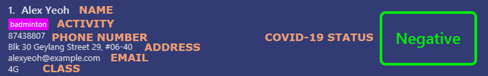|
|:--:|
|*Figure 2 - Information Card*|

With UDT, you can update and track COVID-19 Cases in your school, keep track of Close-Contacts, to perform timely updates to parents and Next-of-Kin.
Filter through the endless list of students with a simple command to extract details on the cases by class, or by activities (CCAs etc.).

### Graphical User Interface
Graphical User Interface (GUI) has a **locked aspect ratio** to prevent the GUI elements from producing any unintended cosmetic problems
- This also applies to maximising of application to full screen

----------------
# Features
Below are a set of commands that can be used in the **_UDT_**. Their formats and examples are provided along with each feature.

> :information_source: **Formatting notes:**
> - Words in `UPPER_CASE` are the user inputs to be supplied.
> - Items in square brackets `[]` are optional.

## Add a student: `add`
Adds a student to the tracking list
- Format: `add n/NAME p/PHONE_NUMBER e/EMAIL a/ADDRESS​ cc/CLASS s/STATUS [act/ACTIVITY] [act/MORE ACTIVITIES]`
  - `NAME` takes in alphabetical characters and have a character limit of 50
  - `ADDRESS` takes in any characters and have a character limit of 70
  - `ACTIVITY` takes in alphanumeric text and have a character limit of 50
  - `CLASS` takes in a number and alphabet pair
    - Eg. `4A`
  - `EMAIL` follows the standard email formatting
    - Accepts input such as alphanumeric inputs, "-", "_", and "+"
    - Eg. `johntan@example.com`
  - `PHONE_NUMBER` takes a sequence of numbers
    - Requires at least 3 numbers up to a maximum of 15 numbers
  - `STATUS` takes either of these texts `Positive`, `Negative`, `Close-Contact`
    - `STATUS` is case-sensitive and should strictly follow the texts stated above
- Examples:
  - `add n/John Doe p/98765432 e/johnd@example.com a/John Street, Block 123 #01-01 cc/5A s/Negative`
  - `add n/Candice N Utz p/98765432 e/candicenuts@example.com a/123, Sunrise Road, #01-25 s/Negative cc/4A act/Basketball act/Dance`

|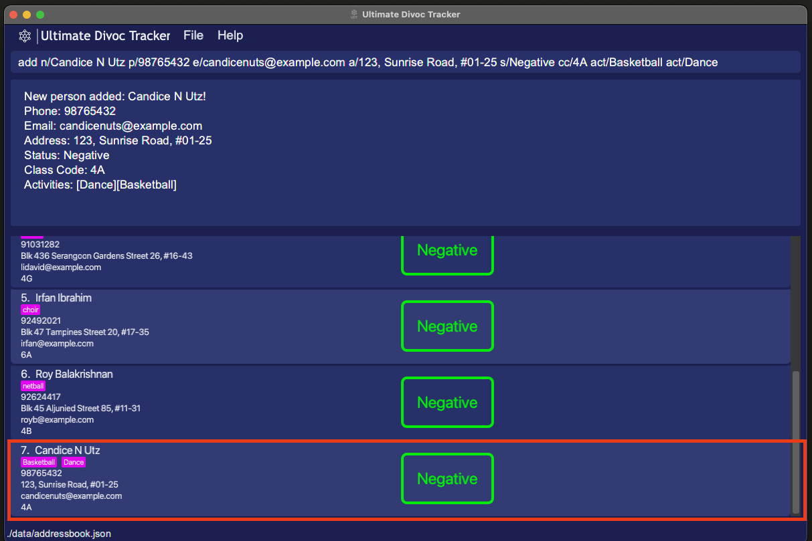|
|:--:|
|*Figure 3 - `add` Command*|

> :bulb: **Tips:**
> - Multiple activity tags can be added to a single student by using multiple `act/` prefixes
> - Eg. `act/choir act/dance`
> - A student can also have no activity tags
> - User inputs can be in any order

> :information_source: **Note:** Capitalization of text will be reflected in the User Interface

## List all students: `list`
Shows a list of all students in the application.
- Format: `list`
  - Any user input after `list` is ignored
  - `list 12345 john` is the same as `list`

> :bulb: **Tip:** For a filtered list, use the __*find*__ commands

|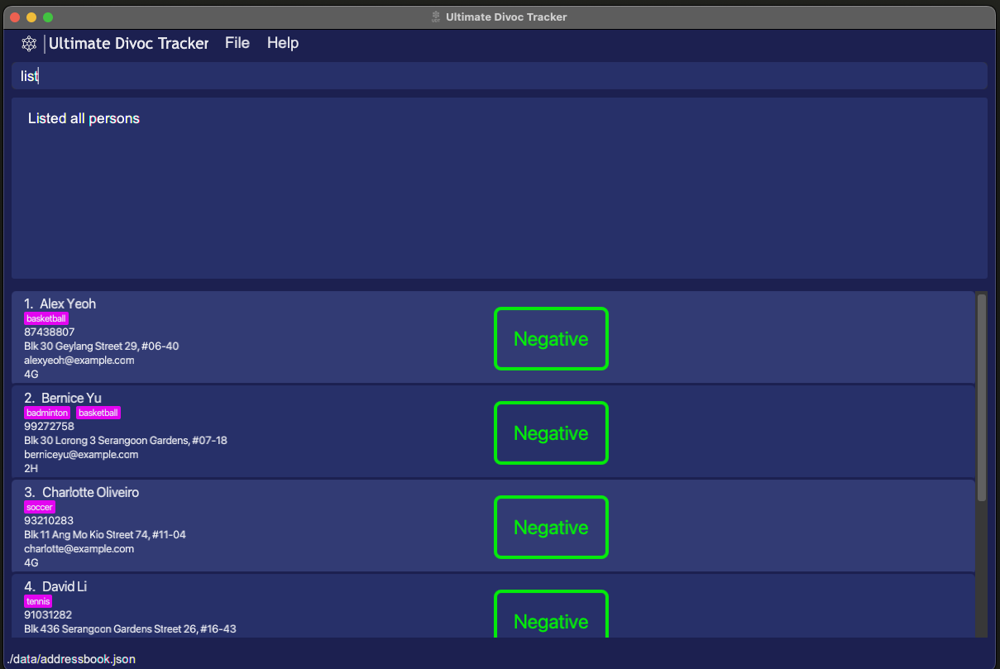|
|:--:|
|*Figure 4 - `list` Command*|

## Find student by name: `find`
Find an existing student in the application by their name
- Format: `find NAME`
  - Returns a list of students with the specified `NAME`
    - If no one with the specified `NAME` is found, an empty list will be shown
  - `NAME` is case-insensitive
  - Order of words in `NAME` is irrelevant
    - `find yeoh alex` can find student _"Alex Yeoh"_
  - Searching for name returns a list of names contains the provided name
    - `find john` can find students _"John Tan"_ and _"John Lee"_
- Example:
  - `find bernice` will find student _"Bernice Yu"_

> :bulb: **Tip:** find multiple students at the same time by typing their names in the same command
> - Eg. `find alex bernice` will find students _"Alex Yeoh"_ and _"Bernice Yu"_

|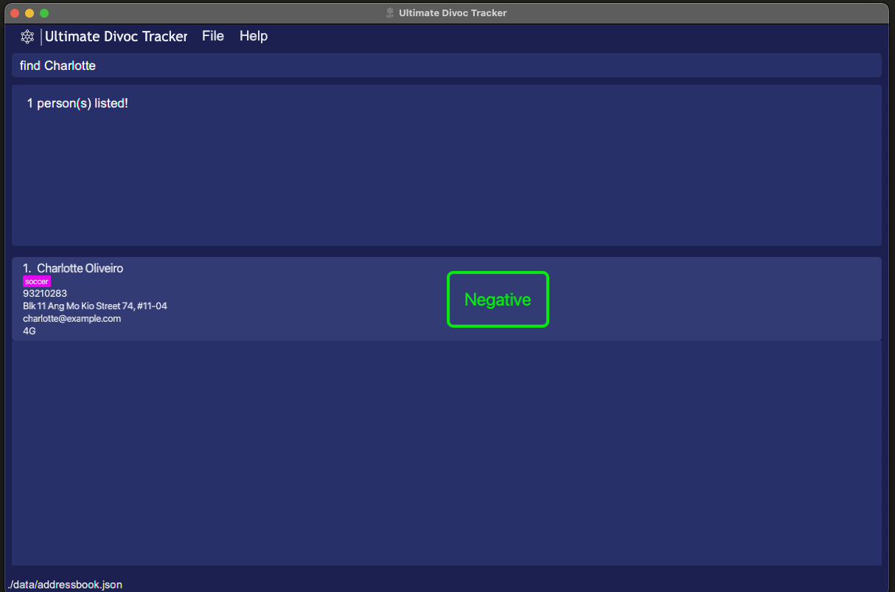|
|:--:|
|*Figure 5 - `find` Command*|

## Find student by status: `findstatus`
Find an existing student in the application by their Covid-19 Status
- Format: `findstatus STATUS`
  - Returns a list of students with the specified `STATUS`
  - `STATUS` is either `positive`, `negative` or `close-contact`
  - `STATUS` is case-insensitive
- Examples:
  - `findstatus positive` finds all students that are labelled COVID positive
  - `findstatus negative` finds all students that are labelled COVID negative

||
|:--:|
|*Figure 6 - `findstatus` Command*|

## Find student by class: `findclasscode`
Finds an existing student in the application by their class
- Format: `findclasscode CLASS`
  - Returns a list of students with the specified `CLASS`
  - `CLASS` is case-insensitive
- Example:
  - `findclasscode 4A` finds all students in the class 4A

|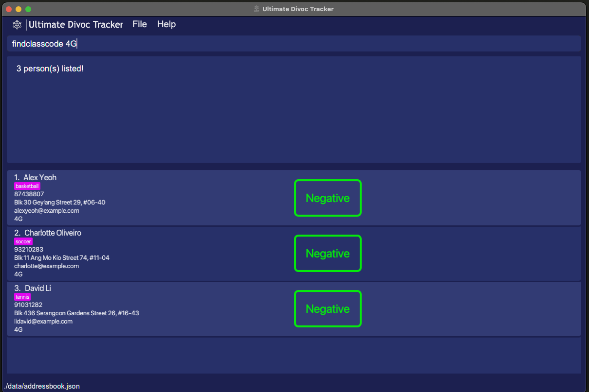|
|:--:|
|*Figure 7 - `findclasscode` Command*|

## Find student by activity: `findactivity`
Finds an existing student in the application by the activities they are participating in
- Format: `findactivity ACTIVITIY [MORE ACTIVITIES]`
  - Returns a list of students with the specified `ACTIVITY`
    - Matches based on students that have specified `ACTIVITY` in their list of `ACTIVITIES`
  - If more than 1 activity is specified, command returns a list of student that participated in **ANY** of the activities specified
  - `ACTIVITY` is case-insensitive
- Example:
  - `findactivity badminton` finds all students that have the activity _"Badminton"_
  - `findactivity badminton choir` finds all students that have the activity _"Badminton"_, _"choir"_ or **both**

|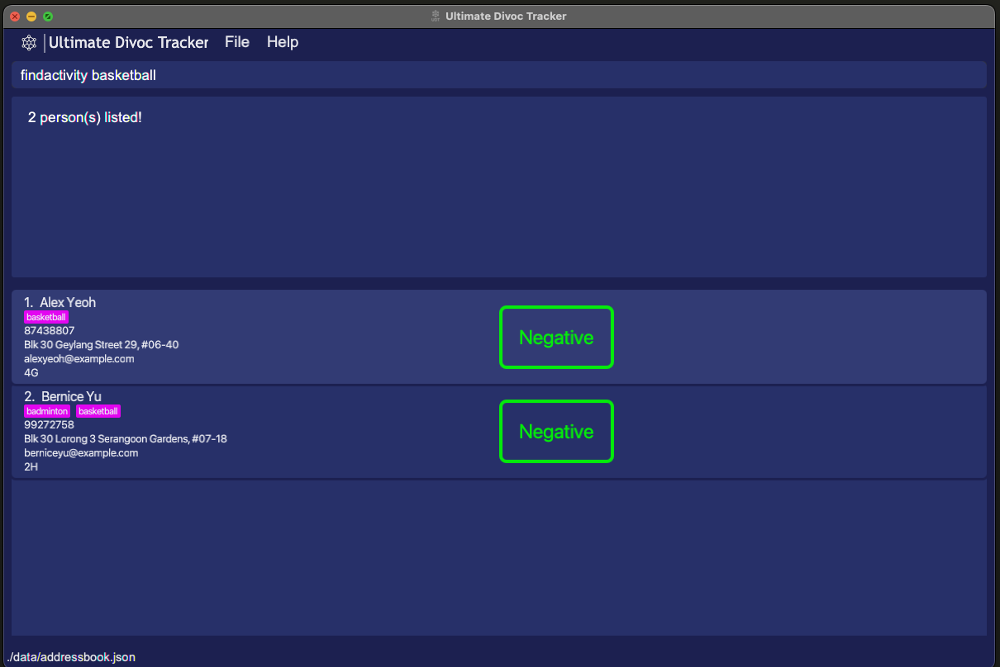|
|:--:|
|*Figure 8 - `findactivity` Command*|

## Edit student details: `edit`
Edits an existing student's details in the list Index provided and the parts that you want to edit
- Format: `edit INDEX [n/NAME] [p/PHONE_NUMBER] [e/EMAIL] [a/ADDRESS] [cc/CLASS] [s/STATUS] [act/ACTIVITY] [act/MORE ACTIVITIES]`
  - Edits the student at the specified `INDEX`
  - `INDEX` denotes the list index of the student in the displayed list
  - `INDEX` must be a _positive integer (1, 2, 3...)_
  - Only listed fields will be changed
- Examples:
  - `edit 1 s/Positive` edits 1st student to be _COVID-19 Positive_
  - `edit 5 p/98641865 e/maryjane@yahoo.com` edits 5th student to a new phone number and email address

> :bulb: **Tips:**
> - Filter the student list via __*find*__ commands to make finding the index easier
> - Omitting parts of the student details from the command will leave them unedited
> - To clear a student's activities use `edit INDEX act/`

> :information_source: **Notes:**
> - Capitalization of text will be reflected in the User Interface
> - Editing `Activity` of a student will **replace** all activities with the newly added ones
> - Eg. `edit 1 act/tennis` will replace the `Activity` of the 1st student in the list with _"tennis"_

|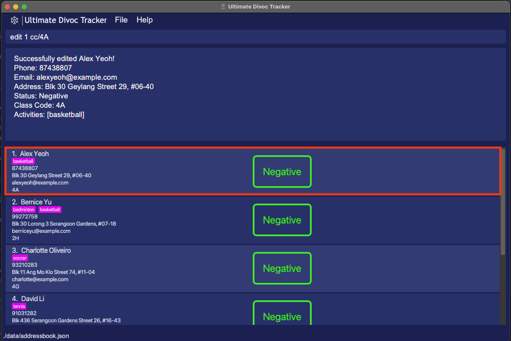|
|:--:|
|*Figure 9 - `edit` Command*|

## Delete a student: `delete`
Deletes the specified person from the application.
- Format: `delete INDEX`
  - Deletes the student at the specified `INDEX`
  - `INDEX` denotes the list index of the student in the displayed list
  - `INDEX` must be a _positive integer (1, 2, 3...)_
- Examples:
  - `list` followed by `delete 2` deletes the 2nd person in the student list
  - `find Betsy` followed by `delete 1` deletes the 1st student in the results of the `find` command

> :bulb: **Tip:** filter the student list via __*find*__ commands to make finding the index easier

|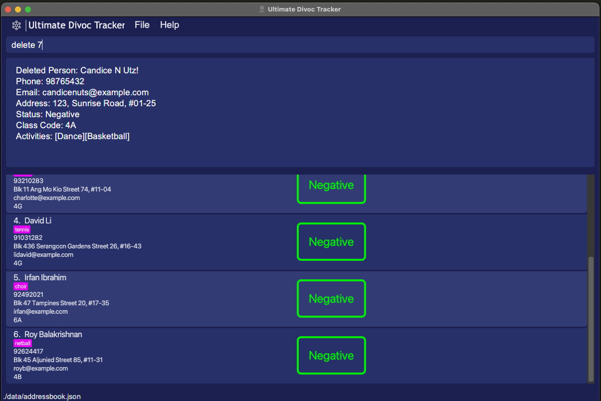|
|:--:|
|*Figure 10 - `delete` Command*|

### Automation of `Status`
`Status` denotes the COVID status of an individual, and can take either `Positive`, `Negative` or `Close-contact` states.
- UDT will **automatically** label individuals as `Close-contact` from `Negative` if they are in the same class or activity as another person who is labelled `Positive`
- UDT will also **automatically** label individuals as `Negative` from `Close-contact` if they are not close-contacts to any individuals labelled `Positive` anymore.

> :information_source: **Note:**  UDT tracks COVID statuses of those listed in the tracker only, and does not account for external cases.

#### Limitations of automation
- UDT may not automatically update students' `Status` if complex edits are executed. e.g. Changing a COVID-19 **Positive** student's `ClassCode` or
  `Activity` will not effectively update their previous **Close-Contact** list. Instead, they would remain **Close-Contact** until someone else in the class
  changes their status from **Positive** to **Negative**. A remedy for this is to re-enter all student entries or use the **import function** that will be released
  in the *next iteration (v1.5)*.
- If student A recovers from COVID-19 (`Status` is changed from `Positive` to `Negative`), A's status will be `Negative` even though there are still `Positive` cases
  related to A. However, if a student related to A by `ClassCode` or `Activity` becomes COVID-19 positive after A recovers, A's status will be listed as `Close-Contact`

## Right-Click Help Menu

|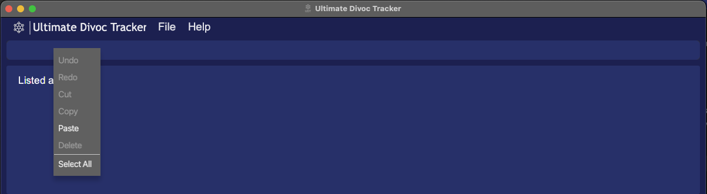|
|:--:|
|*Figure 11 - Right-Click Help Menu*|

The following few features can be achieved through right-clicking the Command Line.
Some features have keyboard shortcuts as well, so do read on to find out more.

### Undo/Redo:
Undo or redo what you have been typing in the Command Line **BEFORE** it has been executed/entered,
allowing you to make any edits as required.
Refer to **_Figure 11_** above to see the menu.

Using a Mouse:
- Right-click on the Command Line to open the menu containing the `undo` and `redo` buttons
- Click on the respective buttons to undo/redo what you have typed

**OR**

Using a Keyboard:
- `ctrl+z` to undo
- `ctrl+y` to redo

> :information_source: **Note:**  Undo and redo can only be used on commands that have yet to be executed/entered (before hitting enter).

### Cut/Copy/Paste:
`Cut` any text that has been highlighted.

`Copy` any text that has been highlighted.

`Paste` any text that is currently stored in your clipboard.

> :bulb: **Tips:** Keyboard Shortcuts
> - `ctrl+x` to cut
> - `ctrl+c` to copy
> - `ctrl+v` to paste

### Delete:
Removes any text that has been highlighted.

> :bulb: **Tips:** Use the `Backspace` key or `del` key on your keyboard to perform the same command

### Select All:
Highlights all the text that is currently in the Command Box

> :bulb: **Tips:** Use this to highlight everything so that you can follow up with a `cut`, `copy` or `delete` command.

## Viewing the help window: `help`
Displays a list of commands to use and a link to our user guide. A `Copy URL` button is provided to copy the link.
- Format: `help`
  - Any user input after `help` is ignored
  - `help 12345 john` is the same as `help`

|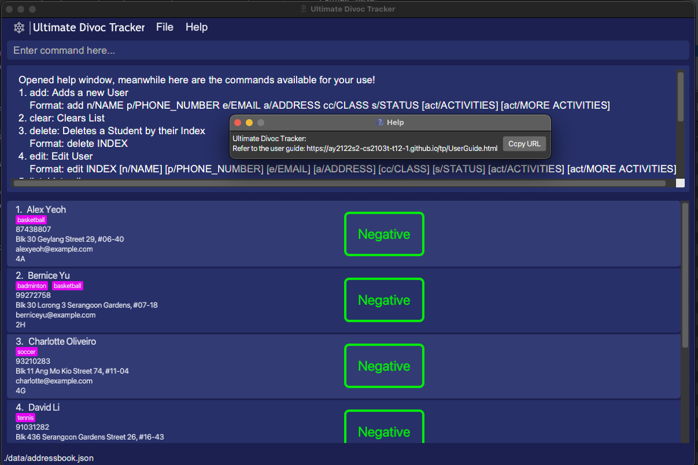|
|:--:|
|*Figure 12 - `help` Command*|

## Clearing the data: `clear`
Clears and deletes all the data within the application
- Format: `clear`
  - Any user input after `clear` is ignored
    - `clear 12345 john` is the same as `clear`

> :warning: **Warning:** This deletes all data for the application irreversibly. Ensure you save a copy of the data if you intend to restore it at a later date.

## Exit the application: `exit`
Exits the program.
Format: `exit`

> :bulb: **Tip:** You can also close the application directly

## Saving the data
UDT data is saved in the hard disk automatically after any command that changes the data. There is no need to save manually.
- Data is saved to the same location as the application executable

## Editing the data file
UDT data are saved as a JSON file `[JAR file location]/data/addressbook.json`.
- Data is saved to the same location as the application executable

> :bulb: **Tip:** Advanced users are welcome to update data directly by editing that data file

> :warning: **Warning:** Editing the data file erroneously may result in the entire data file becoming unreadable by UDT

----------------
# FAQ

Q: How do I transfer my data to another Computer?
A: Install the app in the other computer and overwrite the empty data file it creates with the file that contains the data of your previous _**UDT**_.

Q: I edited my data file directly and now the application does not work properly!
A: Delete the data folder to allow _**UDT**_ to create a new data file. Your previous data has unfortunately been lost to time.

Q: Manual insertion of students takes time, is there a faster way to do it?
A: We are working on a feature to allow importing of **.csv** files into _**UDT**_!

Q: What if I key in the wrong command?
A: An error message colored in red will appear stating that you have typed an unknown command.

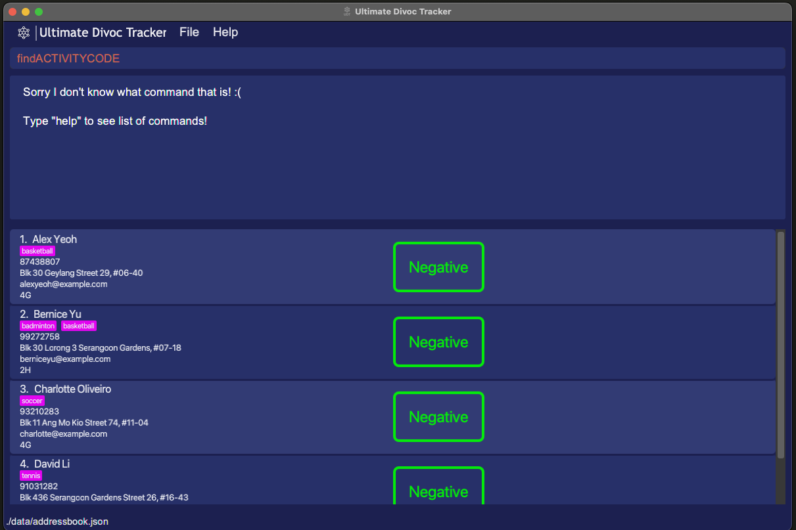

----------------
## Command Summary

| Action       | Format           | Example        |
|:------------:|:----------------:|:--------------:|
| [Add a student](#add-a-student-add)                                | `add n/NAME p/PHONE_NUMBER e/EMAIL a/ADDRESS cc/CLASS s/STATUS [act/ACTIVITIES] [act/MORE ACTIVITIES]`                    | `add n/John Doe p/98765432 e/johnd@example.com a/John Street, Block 123, #01-01 cc/5A s/Negative act/badminton` |
| [List all students](#list-all-students-list)                       | `list`                                                                                                                    | `list`                                                                                                          |
| [Find student by name](#find-student-by-name-find)                 | `find NAME [MORE_NAME]`                                                                                                   | `find James Jake`                                                                                               |
| [Find student by status](#find-student-by-status-findstatus)       | `findstatus STATUS`                                                                                                       | `findstatus positive`                                                                                           |
| [Find student by class](#find-student-by-class-findclasscode)      | `findclasscode CLASS`                                                                                                     | `findclasscode 4A`                                                                                              |
| [Find student by activity](#find-student-by-activity-findactivity) | `findactivity ACTIVITY [MORE ACTIVITIES]`                                                                                 | `findactivity choir`                                                                                            |
| [Edit student details](#edit-student-details-edit)                 | `edit INDEX [n/NAME] [p/PHONE_NUMBER] [e/EMAIL] [a/ADDRESS] [cc/CLASS] [s/STATUS] [act/ACTIVITIES] [act/MORE ACTIVITIES]` | `edit 2 n/James Lee e/jameslee@example.com`                                                                     |
| [Delete a student](#delete-a-student-delete)                       | `delete INDEX`                                                                                                            | `delete 3`                                                                                                      |
| [Clear](Clear)                                                     | `clear`                                                                                                                   | `clear`                                                                                                         |
| [Exit the application](#exit-the-application-exit)                 | `exit`                                                                                                                    | `exit`                                                                                                          |

----------------

## Glossary

| Term      | Meaning                                 |
|:---------:|:---------------------------------------:|
| Parameter | Input supplied after the command        |
| JSON      | A file type that UDT uses to store data |
| csv       | A common file type used to store data   |
