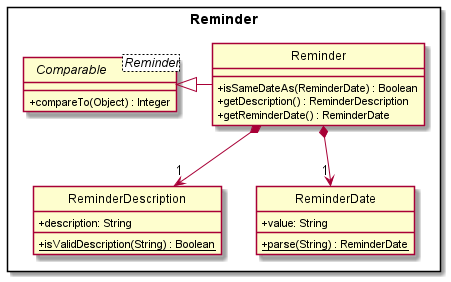

Main window

Reminder window

Tinner (Anagram of Intern) is a desktop app for managing internship applications for students, optimized for use via a Command Line Interface (CLI)
while still having the benefits of a Graphical User Interface (GUI).
If you can type fast, Tinner allows you to easily sort through and retrieve relevant information faster than traditional GUI apps.

Tinner aims to solve the hassle of managing internship applications though 3 aspects.
1. **Tracks** essential information such as statuses and deadlines at a glance. 
2. **Reminds** you of important deadlines so that you will not miss anything about your application. 
3. Allows you to **Review** the process and take down notes so that you can ace your next application.

* If you are interested in using Tinner, head over to the [_Quick Start_ section of the **User Guide**](UserGuide.html#quick-start).
* If you are interested about developing Tinner, the [**Developer Guide**](DeveloperGuide.html) is a good place to start.

**Acknowledgements**

* Libraries used: [JavaFX](https://openjfx.io/), [Jackson](https://github.com/FasterXML/jackson), [JUnit5](https://github.com/junit-team/junit5)
