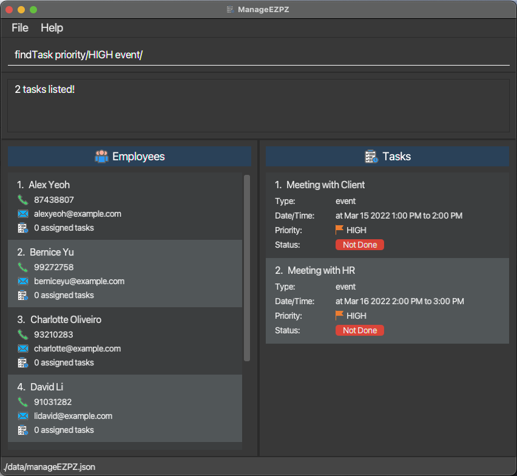
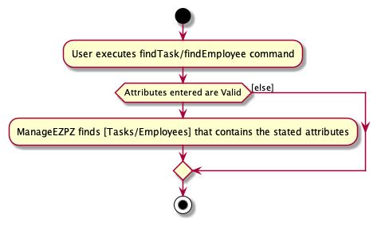

### Project: ManageEZPZ

ManageEZPZ is a desktop application that allows managers or supervisors to manage employees and assign tasks to them. The user interacts with it using a CLI, and it has a GUI created with JavaFX. It is written in Java.

Given below are my contributions to the project.

#### Enhancement implemented
`findEmployee` command:
* Change  from `find` command to `findEmployee` command to reflect and differentiate this find command to find all employees.
* Create a new predicate `PersonMultiplePredicate` to filter out employees based on multiple properties entered by user.
* Unit test for the new `findEmployee` command include:
  * `findEmployeeCommandParser` to check on different user inputs.
  * `findEmployeeCommand` to show different outcome on the `finteredPersonList` for different user inputs.
  * `PersonMultiplePredicate` to ensure that only employees that satisfy the options given to the users return true.

`listEmployee` command:
* Only change the command from `list` to `listEmployees` to reflect on listing down all the employees.
* Functionalities remain the same from AB3.

`findTask` command:
* To allow users to find tasks which was a new model added into our project.
* Allowed users to search tasks using multiple properties of a task.
* Created a new predicate `TaskMultiplePredicate` to filter out tasks based on multiple properties entered by users
* Added unit testing for:
  * `findTaskCommandParser` to check on different user inputs.
  * `findTaskCommand` to show different outcome on the `finteredTaskList` for different user inputs.
  * `TaskMultiplePredicate` to ensure that only tasks that satisfy the options given to the users return true.

`listTask` command:
* List down all the tasks in the filteredList.
* Unit test for `listTask` to use the following test cases:
  * When the current task list is already filtered.
  * When the user task list already shows all task in the task list.

#### Code contributed
[Repo sense link](https://nus-cs2103-ay2122s2.github.io/tp-dashboard/?search=denniszedead&breakdown=true&sort=groupTitle&sortWithin=title&since=2022-02-18&timeframe=commit&mergegroup=&groupSelect=groupByRepos&checkedFileTypes=docs~functional-code~test-code~other)

#### PR Reviewed
* [#72](https://github.com/AY2122S2-CS2103-F11-1/tp/pull/72), 
[#141](https://github.com/AY2122S2-CS2103-F11-1/tp/pull/141), 
[#142](https://github.com/AY2122S2-CS2103-F11-1/tp/pull/142), 
[#146](https://github.com/AY2122S2-CS2103-F11-1/tp/pull/146), 
[#170](https://github.com/AY2122S2-CS2103-F11-1/tp/pull/170), 
[#241](https://github.com/AY2122S2-CS2103-F11-1/tp/pull/241), 
[#242](https://github.com/AY2122S2-CS2103-F11-1/tp/pull/242), 
[#246](https://github.com/AY2122S2-CS2103-F11-1/tp/pull/246), 
[#247](https://github.com/AY2122S2-CS2103-F11-1/tp/pull/247)

#### Forum contribution
* [Asked on whether ternary operators improves code quality](https://github.com/nus-cs2103-AY2122S2/forum/issues/131)

#### Contributions to team based task
* Created a team shared document
* [Create our team PR into the module repo](https://github.com/nus-cs2103-AY2122S2/tp/pull/62)
* Submitted tp UG draft into LumiNUS.

#### Contribution to the user guide [#173](https://github.com/AY2122S2-CS2103-F11-1/tp/pull/173)

### Listing all Employees : `listEmployee`

Shows a list of all employees in ManageEZPZ.

Format: `listEmployee`

### Finding Employees by multiple options : `findEmployee`

Finds employee(s) based on multiple conditions provided.

Note:
* Parameters for finding employees can be entered together in any order.
* You must enter at least one parameter.
* Names are case-insensitive

Format: `findEmployee n/NAMES p/PHONE_NUMBER e/EMAIL`
* `findEmployee n/[LIST OF NAMES]` finds employees whose names contain any of the words in [LIST OF NAMES].
* `findEmployee p/PHONE_NUMBER` finds employees with the exact phone number.
* `findEmployee e/EMAIL` finds employees with the exact email.

Examples:
* `findEmployee n/Alex`
* `findEmployee p/87438807`
* `findEmployee e/alexyeoh@example.com`
* `findEmployee n/Bernice Yu p/99272758 e/berniceyu@example.com`

### Listing all Tasks : `listTask`

Shows a list of all tasks in ManageEZPZ.

Format: `listTask`

### Finding Tasks by multiple options : `findTask`

Finds task(s) based on multiple conditions provided.

Note:
* Parameters for finding tasks can be entered together in any order.
* You must enter at least one parameter from either Task Type or the valid options.
* Task Type is optional, however, when entered, only one task type is allowed.
* The first option must be valid.
* After the first valid option, any other invalid options that is not stated below will be ignored.

Task Type Available:
* `todo/`: Todos
* `deadline/`: Deadlines
* `event/`: Events

Options:
* `desc/`: Description of the tasks
* `date/`: Date of the task in YYYY-MM-DD (only for deadline and event)
* `priority/`: Priority of task, only `HIGH`, `MEDIUM`, `LOW` and `NONE`
* `assignees/`: The assignees that was assigned to the task (only one full name of assignee allowed)
* `isMarked/`: Whether the task is marked, only `true` or `false`

Format:
* `findTask todo/` finds all todos
* `findTask deadline/` finds all deadlines
* `findTask event/` find all events
* `findTask desc/[LIST OF WORDS]` finds all tasks which contain any of the words in [LIST OF WORDS].
* `findTask date/YYYY-MM-DD` finds all deadlines and events with the date
* `findTask priority/PRIORITY` find all tasks with the given PRIORITY [HIGH, MEDIUM, LOW, NONE]
* `findTask assignees/ASSIGNEE FULL NAME` finds all tasks assigned to the stated assignee (in full name)
* `findTask isMarked/true` finds all tasks that is already marked as done.
* `findTask isMarked/false` finds all tasks that is already marked as not done.

Example:
* `findTask desc/homework`
* `findTask date/2022-04-16`
* `findTask desc/work priority/HIGH`
* `findTask deadline/ desc/school date/2022-04-16 priority/HIGH assignees/Alex Yeo isMarked/true`
  * Finds the task with a description that contains all the following options:
    * Task type of deadline,
    * description which contains the word “school”,
    * date 2022-04-16,
    * priority high,
    * assigned to Alex Yeoh,
    * and is marked as done.

#### Contribution to the developers guide

### Finding tasks and employees features

#### All about this feature

The feature for finding task and employee uses the following two commands:
* `findTask`: Find tasks
* `findEmployee`: Finds employees

`findEmployee` improves on the `find` feature in AB3 where instead on finding persons (on in the case of our project
manageezpz, we now refer persons as employees) based only on their names, we can also find employees based their other
two properties, phone number and email.

`findTask` similarly searches tasks based on any of their attributes (as stated in the task implementation)
stated by the user.

#### Design of the find feature

The find feature utilizes mainly the following classes:
* Parser:
  * Check whether the attributes for either task and employees as entered by the user are valid as stated in the `Task`
    and `Person` (class to represent employee) respectively.
  * The first class when user enters `findTask`/`findEmployee`.
  * Parser will first check if at least one attribute is entered.
  * After which, it will check whether the attributes entered are valid as implemented in the `Task` and `Person` method.
  * If the user fails to enter any of the attributes, or enters an invalid attribute, the Parser class will collate all
    the mistakes the user has made as error messages, and it will be shown to the user.
  * Otherwise, the parser will create a predicate by indicating all attributes entered by the user and setting
    attributes not specified by the user as null (use optional parameter if the programming language used permits).
  * The parser class will then return a command class, using the predicate as the argument.
  * `FindTaskCommandParser` for findTask and `FindEmployeeCommandParser` for findEmployee
* Command:
  * Executes command by showing all tasks/employee based on the attributes specified by the user.
  * `FindTaskCommand` for findTask and `FindEmployeeCommand` for findEmployee
* Predicate:
  * The parser class creates this predicate which will be used to filter tasks/employees based on the attributes given.
  * If the attribute is set to null, it will default to true, otherwise, the predicate will check whether the
    task/employee has these attributes.
  * The results from the attributes (or true if not specified) are and together to produce the result from the predicate.
  * `TaskMultiplePredicate` for filtering task and `PersonMultiplePredicate` for filtering employees.

#### Implementation flow for the find task/employee feature
Given below is the implementation of the find task command when the user enters `findTask todo/`

1. The user input will be sent to `FindTaskCommandParser`
2. `FindTaskCommandParser` will note down that the task type to search.
3. Since the inputs that the user entered is valid, the parser will create a `TaskMultiplePredicate` task type `todo`
   while setting the rest of the attributes to `null`.
4. The attribute will be used as the argument to create the `FindTaskCommand`
5. When the `FindTaskCommand` executes, the predicate will be sent to the `ModelManager` to filter out tasks that
   satisfy the predicate.

*The expected result for `findTask todo/`*

*The UML Sequence diagram for `findTask todo/`*

#### Design Consideration
* Allow usage of multiple attributes as search term to filter out tasks/employee that has the specified attributes.
* Useful for finding tasks based on priority and whether it is marked or not.

#### UML Diagram for finding task/employee

### Finding employees

1. Find employees with the given predicate

2. Prerequisites: List all employees using the `listEmployee` command.

3. Test case: `findEmployee` 
   Expected: Error showing that at least an option is needed.

4. Valid test cases to try: `findEmployee n/Alice`, `findEmployee p/999`, `...` (So long as the task attribute are
   valid) 
   Expected: All employees with the specified attributes will be listed.

5. Other invalid test cases to try: `findEmployee someOtherPrefix/`, `findEmployee n/Jame$`, `...` (So long as the
   attribute are invalid) 
   Expected: Error showing which attributes are entered wrongly.
