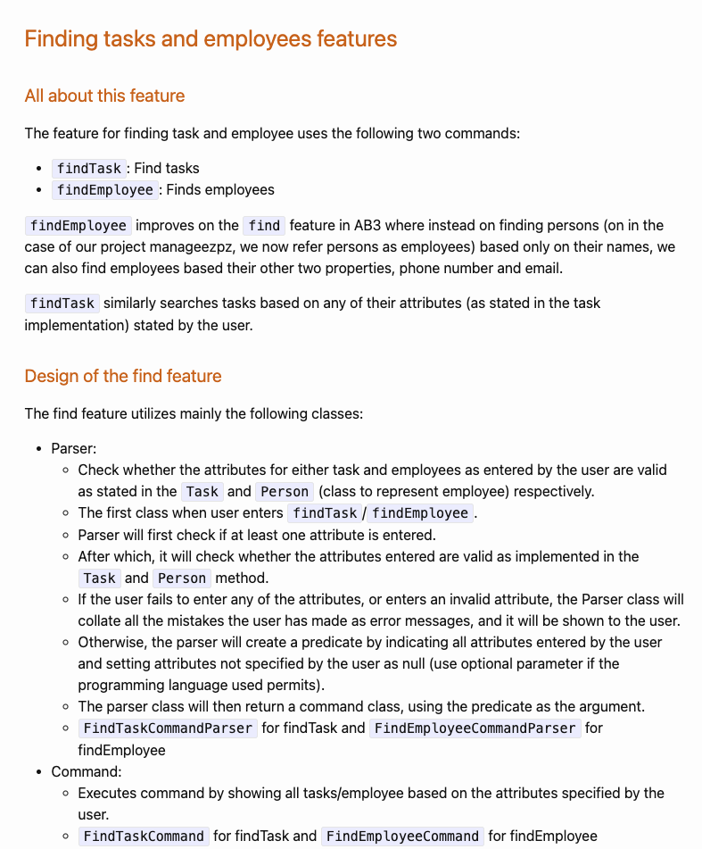
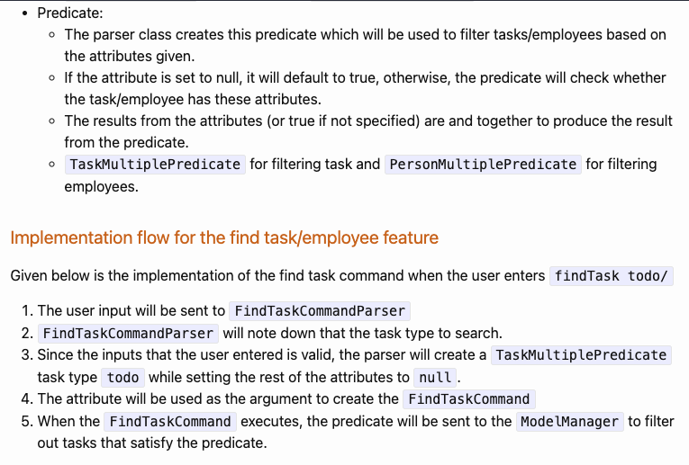
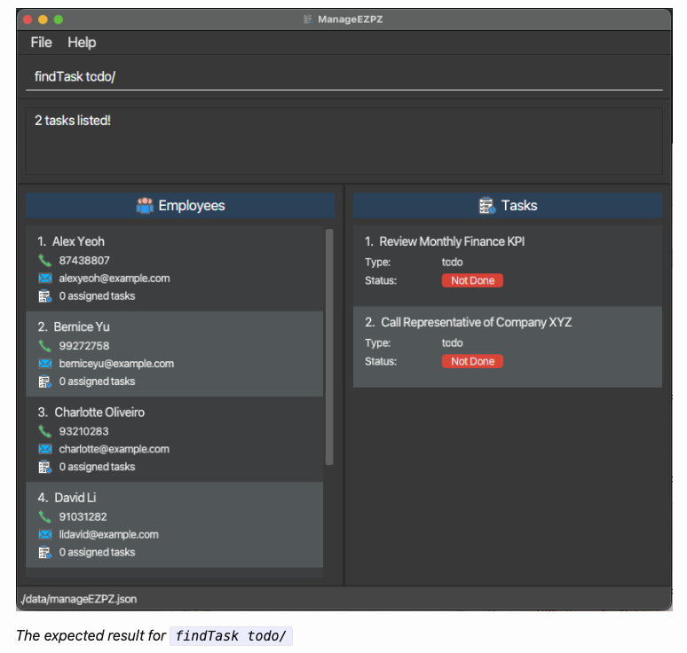
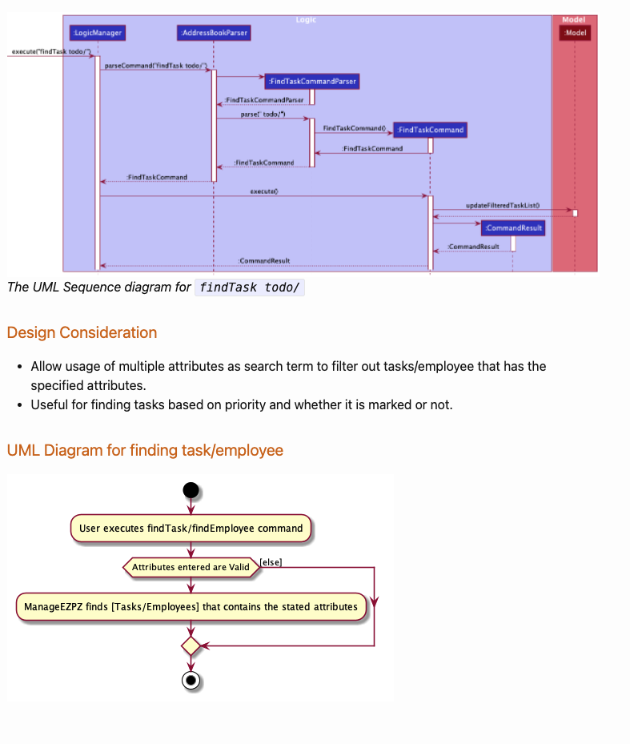
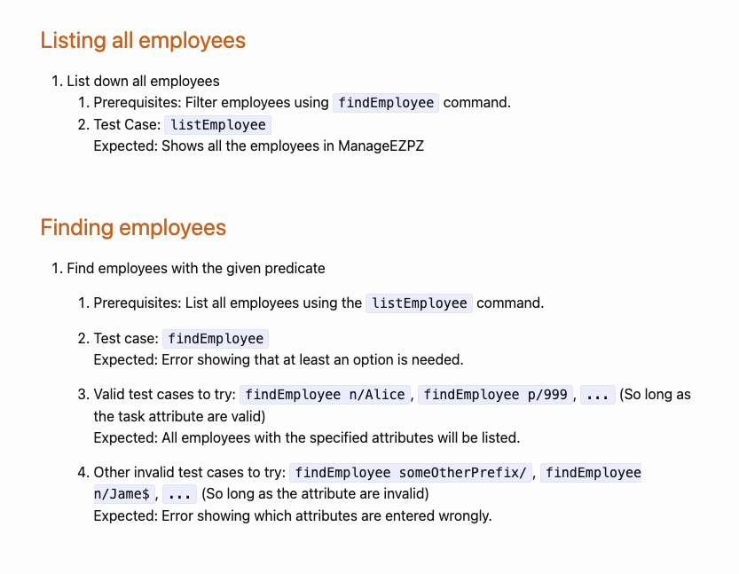

### Project: ManageEZPZ

ManageEZPZ is a desktop application that allows managers or supervisors to manage employees and assign tasks to them. The user interacts with it using a CLI, and it has a GUI created with JavaFX. It is written in Java.

Given below are my contributions to the project.

#### Enhancement implemented
`findEmployee` command:
* Change  from `find` command to `findEmployee` command to reflect and differentiate this find command to find all employees.
* Create a new predicate `PersonMultiplePredicate` to filter out employees based on multiple properties entered by user.
* Unit test for the new `findEmployee` command include:
  * `findEmployeeCommandParser` to check on different user inputs.
  * `findEmployeeCommand` to show different outcome on the `finteredPersonList` for different user inputs.
  * `PersonMultiplePredicate` to ensure that only employees that satisfy the options given to the users return true.

`listEmployee` command:
* Only change the command from `list` to `listEmployees` to reflect on listing down all the employees.
* Functionalities remain the same from AB3.

`findTask` command:
* To allow users to find tasks which was a new model added into our project.
* Allowed users to search tasks using multiple properties of a task.
* Created a new predicate `TaskMultiplePredicate` to filter out tasks based on multiple properties entered by users
* Added unit testing for:
  * `findTaskCommandParser` to check on different user inputs.
  * `findTaskCommand` to show different outcome on the `finteredTaskList` for different user inputs.
  * `TaskMultiplePredicate` to ensure that only tasks that satisfy the options given to the users return true.

`listTask` command:
* List down all the tasks in the filteredList.
* Unit test for `listTask` to use the following test cases:
  * When the current task list is already filtered.
  * When the user task list already shows all task in the task list.

#### Code contributed
[Repo sense link](https://nus-cs2103-ay2122s2.github.io/tp-dashboard/?search=denniszedead&breakdown=true&sort=groupTitle&sortWithin=title&since=2022-02-18&timeframe=commit&mergegroup=&groupSelect=groupByRepos&checkedFileTypes=docs~functional-code~test-code~other)

#### PR Reviewed
* [#72](https://github.com/AY2122S2-CS2103-F11-1/tp/pull/72), 
[#141](https://github.com/AY2122S2-CS2103-F11-1/tp/pull/141), 
[#142](https://github.com/AY2122S2-CS2103-F11-1/tp/pull/142), 
[#146](https://github.com/AY2122S2-CS2103-F11-1/tp/pull/146), 
[#170](https://github.com/AY2122S2-CS2103-F11-1/tp/pull/170), 
[#241](https://github.com/AY2122S2-CS2103-F11-1/tp/pull/241), 
[#242](https://github.com/AY2122S2-CS2103-F11-1/tp/pull/242), 
[#246](https://github.com/AY2122S2-CS2103-F11-1/tp/pull/246), 
[#247](https://github.com/AY2122S2-CS2103-F11-1/tp/pull/247)

#### Forum contribution
* [Asked on whether ternary operators improves code quality](https://github.com/nus-cs2103-AY2122S2/forum/issues/131)

#### Contributions to team based task
* Created a team shared document
* [Create our team PR into the module repo](https://github.com/nus-cs2103-AY2122S2/tp/pull/62)
* Submitted tp UG draft into LumiNUS.

#### Contribution to the user guide [#173](https://github.com/AY2122S2-CS2103-F11-1/tp/pull/173)

#### Contribution to the developers guide [#132](https://github.com/AY2122S2-CS2103-F11-1/tp/pull/132) [#289](https://github.com/AY2122S2-CS2103-F11-1/tp/pull/289) [#300](https://github.com/AY2122S2-CS2103-F11-1/tp/pull/300) [#317](https://github.com/AY2122S2-CS2103-F11-1/tp/pull/317)

