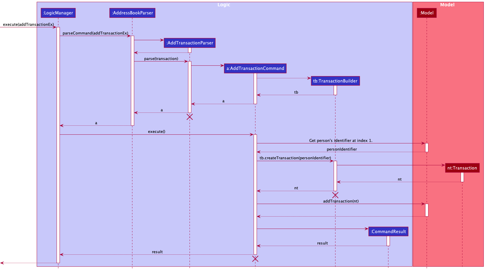
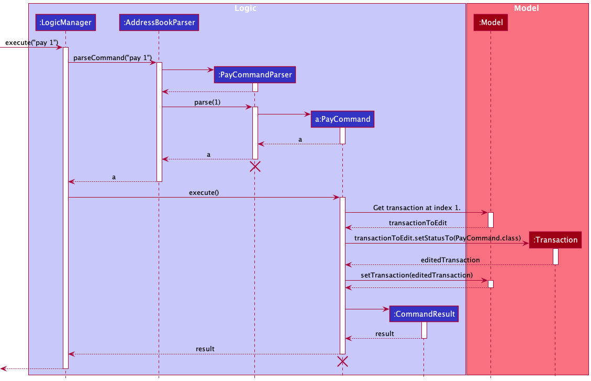
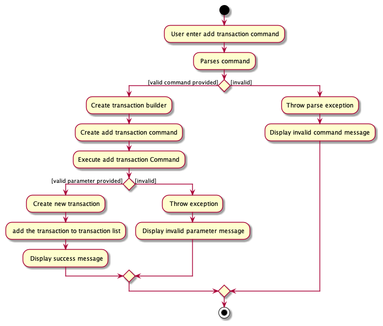
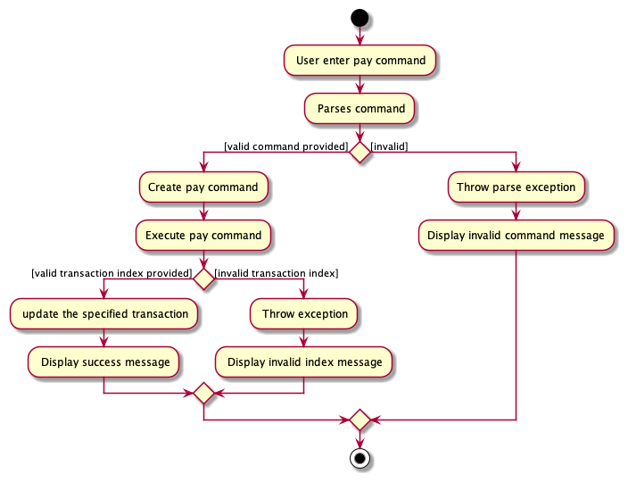
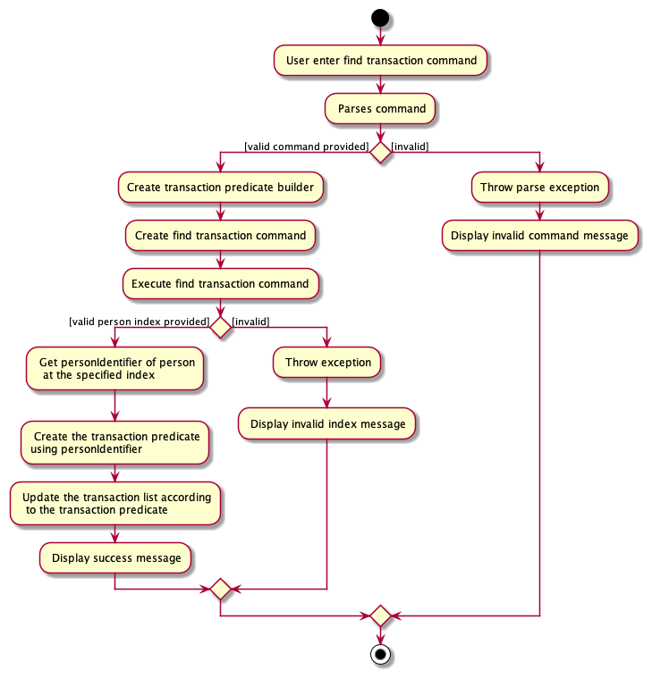
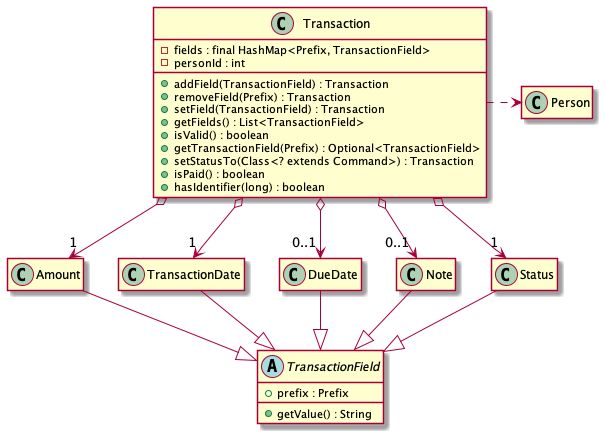

### Project: CinnamonBun
Small business owners and freelancers may find it difficult to keep track of all their clients.

CinnamonBun is an application aimed at business owners to help managing their
clients with beautiful and minimalist User Interface (UI). CinnamonBun provides 
functionalities to store and manage client's information as well as their transactions.
By using CinnamonBun, users are able to manage clients' membership, tags, and tracking clients'
transactions. 

CinnamonBun is specialized for fast-typing users, as most of the interaction with the
application is through command-line, so, business owners who are familiar with using
command-line will have a great time using CinnamonBun!. 

Given below are my contributions to the project.
* **New Feature**: Add the ability to add transaction to clients. [\#57](https://github.com/AY2122S2-CS2103T-W09-2/tp/pull/57)
    * Functionality: Allow the user to add transactions to clients by specifying the client,
    amount, transaction date, due date, notes, and the status of the transaction of whether it
    has been paid. 
    * Justification: This function is necessary for users to add clients' transaction as this application 
    is intended to help business owners manage clients as well as their transactions. 
  
* **New Feature**: Add the ability to delete transactions. [\#87](https://github.com/AY2122S2-CS2103T-W09-2/tp/pull/87)
    * Functionality: Allow the user to delete transactions.
    * Justification: Expired transactions that will not be needed anymore (e.g. paid transactions from 5 years ago)
    are better to be deleted. Another use case is when the user input the incorrect parameter, the transaction
    could be deleted.

* **New Feature**: Find and List transactions. [\#87](https://github.com/AY2122S2-CS2103T-W09-2/tp/pull/87)
    * Functionality: Allow the user to list all transactions and find client-specific transactions.
    * Justification: Users will need to look at a particular client's transactions to check for
    overdue transactions, unpaid transactions, etc. 

* **New Feature**: Pay and Unpay transactions. [\#125](https://github.com/AY2122S2-CS2103T-W09-2/tp/pull/125)
    * Functionality: Allow the user to change the status of a transaction to paid or unpaid.
    * Justification: When a client paid a transaction, the status of the transaction need to change
    to paid. If the user mistakenly set the status to paid, they can change the status back to unpaid.

* **Code contributed**: [RepoSense link](https://nus-cs2103-ay2122s2.github.io/tp-dashboard/?search=zunedz&breakdown=true)

* **Project management**:
    * Add todo features/user story, tasks, bugs, and enhancement as Github Issues.
    * Help reviewing pull requests and give feedback for improvement.

* **Enhancements to existing features**:
    * Improve the UI of the application by adding one more panel to display the list
    of transactions. Also implement the transaction card to display each transaction's information.
    * Find and fix bugs from existing features such as handling of invalid input date.
    * Implement the base feature of clickable person card. 
    * Refactor the whole `transaction` feature to follow the same patterns in `client` feature. 

* **Contribution to team based tasks**:
  * Contributed adding user stories
  * Contributed creating weekly demos
  * Adding and tracking issues

* **Documentation**:
    * User Guide:
        * Added documentation for the `addTransaction` feature. [\#113](https://github.com/AY2122S2-CS2103T-W09-2/tp/pull/113/files)
        * Added documentation for the `deleteTransaction` feature. [\#113](https://github.com/AY2122S2-CS2103T-W09-2/tp/pull/113/files)
        * Added documentation for the `listTransaction` feature. [\#113](https://github.com/AY2122S2-CS2103T-W09-2/tp/pull/113/files)
        * Added documentation for the `findTransaction` feature. [\#113](https://github.com/AY2122S2-CS2103T-W09-2/tp/pull/113/files)
        * Added documentation for the `pay` feature. [\#153](https://github.com/AY2122S2-CS2103T-W09-2/tp/pull/153/files)
        * Added documentation for the `unpay` feature. [\#153](https://github.com/AY2122S2-CS2103T-W09-2/tp/pull/153/files)
          
    * Developer Guide:
        * Added implementation details for the `addTransaction` feature. [\#250](https://github.com/AY2122S2-CS2103T-W09-2/tp/pull/250)
        * Added implementation details for the `deleteTransaction` feature. [\#250](https://github.com/AY2122S2-CS2103T-W09-2/tp/pull/250/files)
        * Added implementation details for the `listTransaction` feature. [\#250](https://github.com/AY2122S2-CS2103T-W09-2/tp/pull/250/files)
        * Added implementation details for the `findTransaction` feature. [\#250](https://github.com/AY2122S2-CS2103T-W09-2/tp/pull/250/files)
        * Added implementation details for the `pay` feature. [\#250](https://github.com/AY2122S2-CS2103T-W09-2/tp/pull/250/files)
        * Added implementation details for the `unpay` feature. [\#250](https://github.com/AY2122S2-CS2103T-W09-2/tp/pull/250/files)
    
* **Tests**:
  * Add test cases for various transaction features. [\#78](https://github.com/AY2122S2-CS2103T-W09-2/tp/pull/78),
    [\#138](https://github.com/AY2122S2-CS2103T-W09-2/tp/pull/138), 
    [\#144](https://github.com/AY2122S2-CS2103T-W09-2/tp/pull/144)

* **Contribution to Developer Guide (extracts)**
  * Sequence diagrams
    * Add Transaction Sequence Diagram
      
    * Find Transaction Sequence Diagram
      
    * Pay Sequence Diagram
      
  * Activity diagrams
    * Add Transaction Activity Diagram
      
    * Find Transaction Activity Diagram
      
    * Pay Activity Diagram
      
  * Class diagrams
    * Transaction Class Diagram
      
